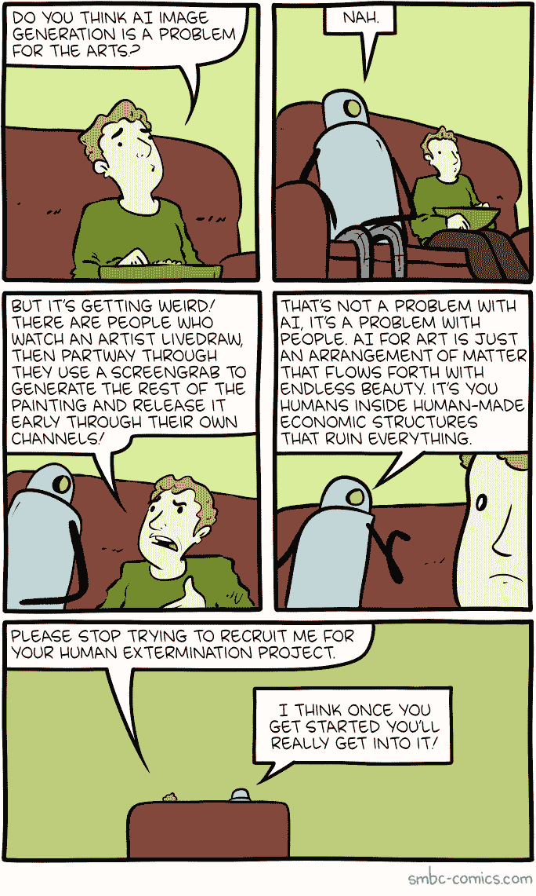
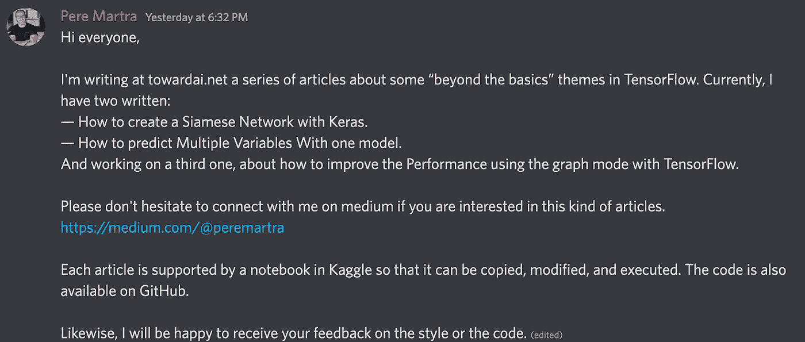
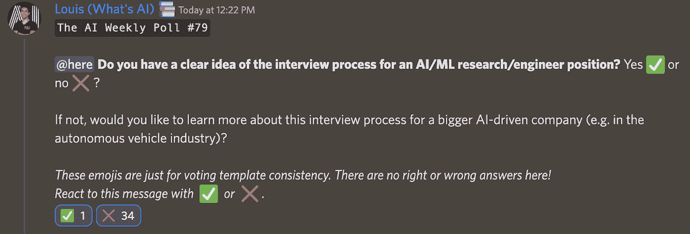
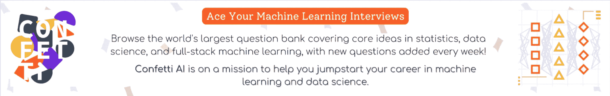

# 这份人工智能时事通讯是你所需要的#19

> 原文：<https://pub.towardsai.net/this-ai-newsletter-is-all-you-need-19-19a9090a6de3?source=collection_archive---------1----------------------->

# 《人工智能》本周发生了什么

本周最热门的新闻无疑是我们刚刚宣布的与德尔塔学院的合作，我个人对此感到非常兴奋。在走向人工智能，我们是在团队和社区中边做边学的忠实粉丝。

因此，我们很高兴地宣布一项来自“走向人工智能”和 [Learn AI Together](https://community.towardsai.net/) 的新计划，用于更长形式的机器学习和数据科学教育内容:与 Delta Academy 建立长期合作伙伴关系，Learn AI Together 将为 Delta Academy 的成员举办一个专门的讨论论坛(从 10 月 31 日的[新成员开始，但不要担心，更多成员即将到来！).](https://bit.ly/3FGhrBp)

Delta Academy 运行教程和每周团队比赛，通过构建 Pong 和 AlphaGo 等 AI 应用程序来帮助您学习。

我们希望服务器上新的 [delta-academy 论坛](https://discord.com/channels/702624558536065165/1035492551546908693)能够成为一个平台，让学生在完成课程的过程中分享他们的经验，并与同学和导师交流。我们也在探索学习人工智能的方法，并致力于人工智能可以帮助三角洲学院改善和成长，所以请给我任何建议，你有实现这一点！

## 最热门新闻

1.  [《人工智能名人录》报道！](https://onalytica.com/blog/posts/whos-who-in-artificial-intelligence-top-50-influencers/) 这份报告强调了在 LinkedIn & Twitter 上推动人工智能话题参与度最高的前 50 名影响者。你可以在这个列表中发现各种不同的影响者角色，从学者&研究人员、活动发言人、记者&贡献者到内容创作者等等！我就是其中之一！:D
2.  Shutterstock 将通过与 OpenAI 的合作开始销售 DALLE 生成的图像！
    是的，这就是现实！最大的股票图像公司之一 Shutterstock 刚刚宣布了与 OpenAI 的[扩展合作关系，这将在“未来几个月”看到 OpenAI DALLE 模型直接集成到 Shutterstock 中](https://www.shutterstock.com/press/20435?utm_campaign=Your%20Daily%20AI%20Research%20tl%3Bdr&utm_medium=email&utm_source=Revue%20newsletter)
3.  [安 AI 推荐最佳文字提示！](https://huggingface.co/spaces/pharma/CLIP-Interrogator?utm_campaign=Your%20Daily%20AI%20Research%20tl%3Bdr&utm_medium=email&utm_source=Revue%20newsletter) 是的，确实存在。这个模型，称为剪辑询问器，推荐最好的提示生成您的图像！它们获取现有图像，并生成最佳提示，为您生成外观相似的图像！以下是他们如何推销他们的方法:

“想知道创建类似现有图像的新图像的好提示是什么吗？剪辑审问者在这里给你答案！”

我想知道——这对你们中的任何人有用吗，或者我们正在制造以前从未有过的问题？试试吧，让我知道你的想法！

## 本周最有趣的报纸

1.  [通过未标记文本改进语音到语音的翻译](https://arxiv.org/abs/2210.14514) “我们提出了一种有效的方法，利用来自不同语言的大量现有未标记文本来创建大量的语音到语音的翻译(S2ST)数据，通过对生成的合成数据应用各种声学效果来改进 S2ST 性能。”
2.  [MovieCLIP:电影中的视觉场景识别](https://arxiv.org/pdf/2210.11065.pdf) “我们使用 CLIP 来弱标记来自 32K 电影剪辑的 112 万个镜头，而不是昂贵的手动注释，这是基于我们提出的分类法(从电影脚本和辅助的基于网络的视频数据集导出的 179 个场景标签)来创建新的数据集:MovieCLIP。
3.  [通过剪辑引导、像素级优化实现实时文本 2 视频](https://arxiv.org/pdf/2210.12826.pdf) 一种基于一系列给定语言描述生成视频的方法。在这里查看代码。

喜欢这些论文和新闻摘要吗？**在你的收件箱里获得每日回顾！**

# *一起学习人工智能社区部分！*

## *本周迷因！*

**

*[bin4ry_d3struct0r#1655](https://discord.com/channels/702624558536065165/830572933197201459/1034982989022638102) 分享的 Meme。*

## *来自 Discord 的特色社区帖子*

**

*与介质上的 [Pere 连接！](https://medium.com/@peremartra)*

## *本周最佳人工智能投票！*

**

*[加入关于不和](https://discord.com/channels/702624558536065165/833660976196354079)的讨论。*

*[Activeloop](https://www.activeloop.ai/) 将为我们的社区发放两张现场 [NeurIPS](https://neurips.cc/) 门票！你可以访问 NeurIPS 大会，在那里你可以参加令人惊叹的讲座、研讨会、教程，会见最好的研究人员，以及我们行业中许多有趣的品牌和工具，如 Activeloop 的深度学习数据湖 [Deep Lake](https://docs.activeloop.ai/) 。只需 [*加入我们的 Discord 社区*](http://ws.towardsai.net/discord) 并向我们的社区负责人( *@Louis B#1408)* 发送私信，就有机会赢得现场活动门票！*

**请注意，不幸的是，您仍然需要支付飞往新奥尔良参加活动的机票和酒店门票！**

# *泰策展组*

## *本周文章*

*[遗传算法优化](/genetic-algorithm-optimization-8299856949d3)由 [Chinmay Bhalerao](https://medium.com/@BH_Chinmay)*

*遗传算法结合了自然选择过程所提出和启发的方法。根据自然选择，最适合的个体有更多的机会或概率存活下来，遗传算法也是如此。在众多的解决方案中，适应性更强的方案更有机会存活下来。作者用梦幻般的视觉效果和代码描述了遗传算法，使材料极易吸收。*

## *我们的必读文章*

*[构建基于内容的推荐系统](/building-a-content-based-recommender-system-2c854ba64f59)作者 [Edoardo Bianchi](https://medium.com/@edoardobianchi98)*

*[如何用一个模型预测多个变量？还有为什么！](/how-to-predict-multiple-variables-with-one-model-and-why-31e6a8efc09e)作者[佩雷·玛特拉](https://medium.com/@peremartra)*

*本周在《走向人工智能》上，我们发表了 29 篇文章，并欢迎四位新作者加入我们的平台。如果你对《走向人工智能》，[感兴趣，查看我们的指南并注册](https://contribute.towardsai.net/)。如果您的作品符合我们的编辑政策和标准，我们会将其发布到我们的网络上。*

## *工作机会*

*   *[**机器学习工程师，Copilot 模型改进@ Github** (远程，美国)](http://ws.towardsai.net/zpe)*
*   *[**Splic.com 市场和销售高级数据科学家**(美国偏远地区)](http://ws.towardsai.net/yas)*
*   *[**机器学习工程经理@维拉纳健康**(远程)](http://ws.towardsai.net/n8s)*
*   *[**AI 实施经理(医疗)@ ClosedLoop** (远程)](http://ws.towardsai.net/nr9)*
*   *[**机器学习工程师，探索性项目，信息抽象@ Cohere** (柔性)](http://ws.towardsai.net/pi1)*

*有兴趣在这里分享工作机会吗？联系 sponsors@towardsai.net 或在我们的[*#招聘频道上发布机会不和谐*](http://ws.towardsai.net/lat-hiring-channel) *！**

**如果你正在准备你的下一次机器学习面试，不要犹豫，去看看我们领先的面试准备网站，* [*五彩纸屑*](http://ws.towardsai.net/confetti-ai?swcfpc=1) *！**

**