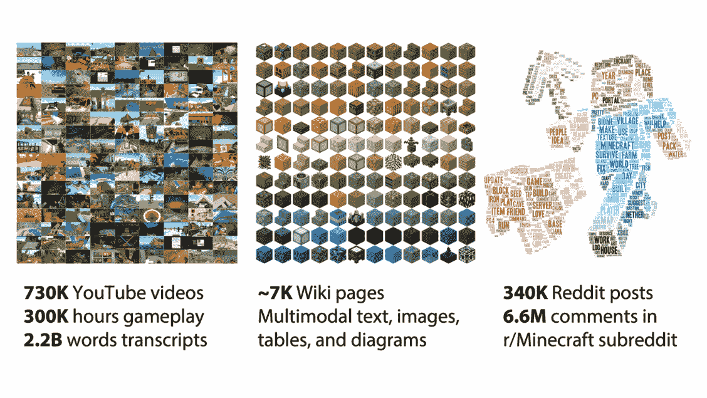
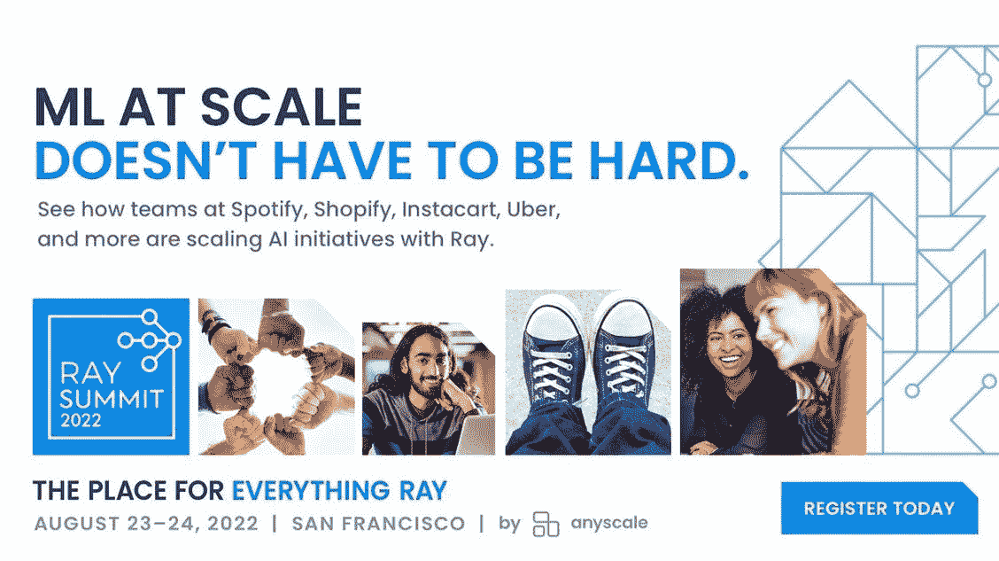
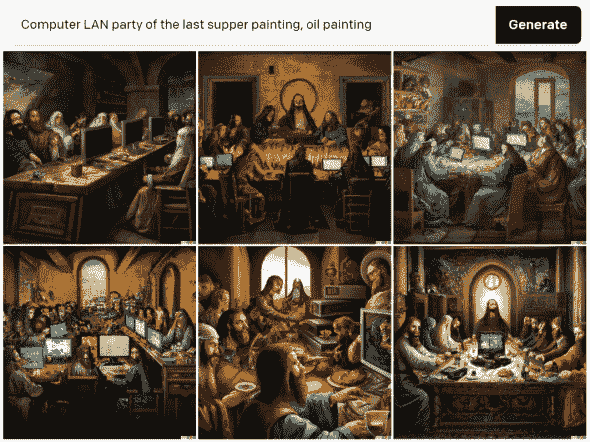
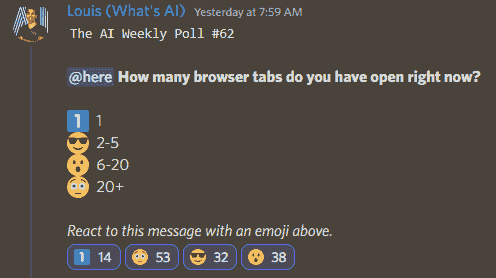

# 这份人工智能时事通讯是你所需要的| #2

> 原文：<https://pub.towardsai.net/this-ai-newsletter-is-all-you-need-2-c4117a7a4e5?source=collection_archive---------2----------------------->

感谢大家对我们重新推出的每周 AI 时事通讯的热情接待！在我们的第一周，我们的 [Mailchimp](https://ws.towardsai.net/subscribe) 和 [Linkedin](https://www.linkedin.com/newsletters/the-ai-newsletter-towards-ai-6947205008912216064/) 新闻频道有大约 5 万份新新闻订阅。我们真的很感谢所有的支持，订阅和分享。我们期待给你带来更多的人工智能内容和资源——我们有很多新项目正在进行中！

 [## 订阅→这份人工智能时事通讯就是你需要的全部

### 我们本周的人工智能亮点是 DALL E mini 模型(现已更名为 craiyon ),该模型因其…

mailchi.mp](https://mailchi.mp/7006b426ea80/this-ai-newsletter-is-all-you-need-16523392?e=038ba1af63) 

## 这个星期在 AI 发生了什么

我们本周的人工智能亮点无疑是《我的世界》。是的，《我的世界》，电子游戏。《我的世界》现在被用来训练多模态强化学习(RL)模型(可以接受多种类型输入的模型，如文本、图像、视频、表格数据……)。 [OpenAI 发布了一个叫做 VPT 的模型](https://openai.com/blog/vpt/)和一个关于 NeurIPS 2022 的公开[比赛。这个模型旨在学习如何玩《我的世界》，一个非常接近真实世界的复杂游戏。同样，该竞赛旨在促进从人类反馈中学习的研究，以使代理能够在没有清晰、容易定义的奖励函数的情况下完成任务。我们认为这个比赛对于任何对 RL 感兴趣并推进该领域的人来说都是一个很好的机会——另外，请查看卡耐基梅隆大学的《我的世界》RL 研究比赛。](https://www.aicrowd.com/challenges/neurips-2022-minerl-basalt-competition)

我们下面分享的新闻，[MineDojo](https://developer.nvidia.com/blog/building-generally-capable-ai-agents-with-minedojo/)(NVIDIA)也与这项使用《我的世界》作为 RL 代理培训平台的倡议有关，这是一个有前途的框架，可以对具体化的 AI 代理进行基准测试。

在《我的世界》上训练多模态模型几乎是完美的，因为你可以通过维基和 Reddit 页面访问大量的文本和表格数据，YouTube 上的大量视频和游戏镜头，甚至通过这些相同的 YouTube 视频及其脚本的视频到文本数据……所有这些都描述了人工智能可以“生活”和试验的单个游戏。

[*MineDojo，一个由 NVIDIA 提供的评测具体化 AI 智能体的框架！*](https://developer.nvidia.com/blog/building-generally-capable-ai-agents-with-minedojo/)

# 最热门新闻

1.  [**MineDojo，一个由 NVIDIA 提供的对具体化 AI 智能体进行基准测试的框架！**](https://developer.nvidia.com/blog/building-generally-capable-ai-agents-with-minedojo/) MineDojo 以《我的世界》为基础，拥有数千个不同的、开放式的任务和一个巨大的互联网规模的知识库，人工智能代理可以自由探索《我的世界》的许多 3D 世界。
2.  [**对 Craiyon AI 图像生成器看不够？试试其他这些人工智能工具。如果你像我们大多数人一样玩过 Dalle-mini 应用程序，现在更名为 craiyon，你肯定会喜欢这篇新文章，它分享了许多你可以免费玩的基于人工智能的酷应用程序。**](https://www.popsci.com/diy/free-ai-sites/)
3.  GitHub Copilot 已经向个人开发者公开！人工智能编程助手每月 10 美元或每年 100 美元，最初对学生免费，每个人都可以使用。

# 本周最有趣的报纸

1.  [**(Deepmind)用无模型多智能体强化学习掌握 Stratego 的博弈**](https://arxiv.org/abs/2206.15378) DeepNash，一个经过无模型多智能体强化学习训练的智能体，能够从零开始学习玩不完美信息博弈 Stratego，达到人类专家水平。
2.  [**3D 感知视频生成**](https://arxiv.org/abs/2206.14797) 探索 4D 生成式对抗网络(GAN ),学习无条件生成 3D 感知视频的 GAN 框架，合成仅用单目视频监督的 3D 视频。[代码](https://github.com/sherwinbahmani/3dvideogeneration/)
3.  [**通往自主机器智能的道路**](https://openreview.net/forum?id=BZ5a1r-kVsf) 一篇非常有趣的论文，提炼了 Yann LeCun 在过去 5-10 年中关于人工智能前景方向的许多想法。在他的推特页面上有一个节略部分，有更多的细节。

*喜欢这些报纸和新闻摘要吗？* [*在收件箱*](https://www.linkedin.com/newsletters/what-s-ai-daily-research-tl-dr-6935956459641876480/) *中获取每日回顾！*

*感谢任意秤将此问题提交给您:*

您知道谷歌、Meta、IBM、优步等公司的团队正在利用 Ray 来扩展关键的人工智能计划吗？或者卡塔尔计算研究所在 2022 年国际足联世界杯上使用强化学习和 Ray RLlib 来控制拥挤和促进移动性？来[射线峰会](http://ws.towardsai.net/j22-anyscale)亲自见识见识吧。[立即注册](http://ws.towardsai.net/j22-anyscale)以享受早起鸟有好报——使用代码 Ray20 可额外享受 20%的折扣！早期鸟类登记于 6 月 30 日结束。

> 有兴趣成为迈向人工智能的赞助商吗？[在此](https://sponsors.towardsai.net/?_gl=1*16bok5s*_ga*Mzg4OTMxMDUzLjE2MzkxNDc2NzQ.*_ga_9D3HKKFV1Q*MTY1NjkzOTAwOC45Ny4wLjE2NTY5MzkwMDguNjA.)了解更多信息或联系[sponsors@towardsai.net](mailto:sponsors@towardsai.net)！

# 一起学习人工智能社区部分！

## 本周迷因！

另一个 [Dalle-mini](https://www.craiyon.com/) 生成的模因。Awesome _ 尺子 _007#7922 共享的图像。[加入对话](https://ws.towardsai.net/discord)。

## 不和谐中的特色社区帖子

SOCKS#6109 分享了一篇关于在神经网络中隐藏恶意软件的非常有趣的[论文](https://arxiv.org/abs/2107.08590)。所有人工智能学生都应该小心的事情。

这一基本技术基于对 float32 值的修改(但可以适应 float16)，即修改分数位或分数的一部分。

一个非常有趣的用户在一篇红迪帖子中提到:

*“正如我在实验中所看到的，我们可以用简单的方法* ***轻易地隐藏兆字节的代码*******50****并逃脱惩罚。一个训练有素(和一般化)的网络应该不会显著降低性能。计划在未来的岗位上进行测试。**

**此外，该方法可用于对神经网络权重加水印，这有助于版权主张(例如，有人正在商业产品中使用您的开源(且获得适当许可的)现成权重)。"**

## *本周人工智能民意测验！*

**

*让我们知道你对机器学习总体上有多自信，以及你认为什么会帮助你更自信！[加入关于不和](https://discord.com/channels/702624558536065165/833660976196354079)的讨论。*

# *泰策展组*

## *本周文章*

*[零投与少投学习:2022 年更新的 50 个关键见解](/zero-shot-vs-few-shot-learning-50-key-insights-with-2022-updates-17b71e8a88c5):本文总结了零投与少投学习设置的一些关键差异和相对优势。使用零镜头学习，机器可以从数据中学习，而无需明确学习如何学习，而使用少镜头学习，机器可以从几个例子中学习。*

*上周，我们发布了 18 个新的人工智能博客，并欢迎了六位新作家加入我们的平台。如果你有兴趣在《走向人工智能》发表文章，请[在这里注册](https://contribute.towardsai.net/)，如果你的博客符合我们的编辑政策和标准，我们将会把它发表到我们的网络上。*

*[加入学习人工智能社区](https://community.towardsai.net/)。*

## *本周特色工作*

*[**高级 ML 工程师— Algolia AI @ Algolia** (混合遥控)](http://ws.towardsai.net/july-22-1-job-1)*

*[**高级 ML 工程师—语义搜索@ Algolia** (混合远程)](http://ws.towardsai.net/july-22-1-job-2)*

*[**机器学习工程师@ Gather AI** (远程—印度)](http://ws.towardsai.net/july-22-1-job-3)*

*[**深度学习工程师(R & D —工程)@权重&偏差**(远程)](http://ws.towardsai.net/july-22-1-job-4)*

*[**机器学习实习生@ Weights &偏见**(远程——美国)](http://ws.towardsai.net/july-22-1-job-5)*

*有兴趣在这里分享工作机会吗？联系[*sponsors@towardsai.net*](mailto:sponsors@towardsai.net)*！**