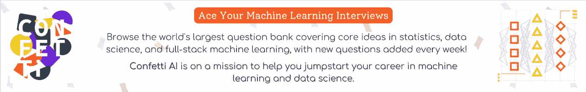

# 这份人工智能时事通讯是你所需要的#20

> 原文：<https://pub.towardsai.net/this-ai-newsletter-is-all-you-need-20-821ab4b9b804?source=collection_archive---------0----------------------->

# 《人工智能》本周发生了什么

埃迪菲、达尔和稳定扩散。这是，再一次，这周在人工智能上发生的事情。稳定扩散并不是什么新鲜事，但它会一直持续下去吗？会有开源的竞争对手，甚至有专利价值的竞争对手吗？正如我们下面所讨论的，eDiffi 是 NVIDIA 的一个新的专有竞争对手。他们认为这样可以达到更好的效果，更逼真，让用户有更多的控制权。然而，它不是开源的。基于同样的想法，OpenAI 刚刚向公众开放了测试版。这意味着任何人都可以付费使用它或他们的 API。

如果您无法访问这些模型的代码，您会对它们感兴趣吗？如果他们以相对便宜的价格建立了一个惊人的超级用户友好的工具会怎么样？不值得吗？个人认为可以。但我也认为它会减慢进度，我更希望看到代码和可用的检查点(至少)供其他研究人员实现和构建。我相信，下几个像 CVPR 这样的会议将会有大量基于扩散模型的论文，并在无需重新训练或快速微调的情况下对它们进行改进，这完全归功于稳定的扩散。不过，我很想听听你对此的看法，这也是本周民意调查的内容。下面看更多！

*提醒* [Activeloop](https://www.activeloop.ai/) 将赠送两张我们社区的 [NeurIPS](https://neurips.cc/) 门票(面对面&虚拟！抱歉上周的错误)！您可以访问 NeurIPS 会议，在那里您可以参加令人惊叹的讲座、研讨会、教程，会见最好的研究人员，以及我们行业中许多有趣的品牌和工具。只需 [*加入我们的 Discord 社区*](http://ws.towardsai.net/discord) 给我发私信( *@Louis B#1408)* 就有机会赢取现场活动门票！

## 最热门新闻

1.  你应该关注的每周简讯！
    我所指的简讯是 [AlphaSignal](https://alphasignal.ai/) 。如果你喜欢我的每日时事通讯，你会喜欢 Lior 每周总结的前 1%的论文，推文，GitHub repos 等等。他开发了一种算法，从研究社区中找出最有趣的论文、转发和推文，并手动筛选最后几篇以确保质量。我最近发现了它，它棒极了。你会喜欢它，它的质量简直是无与伦比！看看[他的简讯](https://alphasignal.ai/)让我知道你的想法！
2.  [直接数据访问—与您的数据交互的新方式](https://dagshub.com/docs/feature_guide/direct_data_access/) DagsHub 推出了直接数据访问—与您的数据交互的新的改进方式。为任何 ML 项目提供一个直观的界面来传输和上传数据。它不需要任何调整，并允许您保留基于开源工具的版本化和可共享数据集的所有优势。如果你想深入研究这些文件，你现在可以去[那里](https://dagshub.com/docs/feature_guide/direct_data_access/)。如果你觉得这有用，请告诉我！
3.  [FastDup |一个从大型图像集合中获取洞察的工具](https://github.com/visualdatabase/fastdup) FastDup 是一个从大型图像集合中获取洞察的工具。它可以发现异常、重复和接近重复的图像、相似性的聚类、学习图像之间的正常行为和时间交互。它可以用于更高质量数据集的智能子采样、离群点去除、要发送用于标记的新信息的新颖性检测。

## 本周最有趣的报纸

1.  [eDiffi:文本到图像扩散模型与专家降噪器的集合](https://arxiv.org/abs/2211.01324) eDiffi 是新一代的生成式人工智能内容创建工具，提供前所未有的文本到图像合成，具有即时风格转换和直观的文字绘画功能。在我们的文章中了解更多信息！
2.  [修补:具有跨通道指导的统一文本到图像扩散生成](https://arxiv.org/abs/2210.16031) 他们结合大规模 Transformer 语言模型在理解语言方面的能力和图像-文本匹配模型在捕捉跨通道语义和风格方面的能力，提出了一种统一简单和复杂场景图像生成的有效方法，有效地提高了图像生成的样本保真度和图像-文本对齐。
3.  [POP2PIANO:基于流行音乐音频的钢琴盖生成](https://arxiv.org/pdf/2211.00895.pdf) Pop2Piano，一个变压器网络，生成给定流行音乐波形的钢琴盖！生成任何流行音乐的钢琴封面！这里是[代码](https://sweetcocoa.github.io/pop2piano_samples/?utm_campaign=Your%20Daily%20AI%20Research%20tl%3Bdr&utm_medium=email&utm_source=Revue%20newsletter)。

喜欢这些论文和新闻摘要吗？**在你的收件箱里获得每日回顾！**

# *一起学习人工智能社区部分！*

## *本周迷因！*

**

*这是迈向皇家 AGI 的第一步(这也是我们梦寐以求的)。Meme 归功于[aggressive disco # 4516](https://discord.com/channels/702624558536065165/830572933197201459/1038128429184327821)。*

## *来自 Discord 的特色社区帖子*

*社区的一名成员， [tomi.in.ai#8822](https://discord.com/channels/702624558536065165/704089125552259163/1037044445427810375) ，制作了一个关于 2015 年论文的基础研究论文总结视频，该论文改变了很多东西:U-Net。*

*这是一种广泛用于图像分割任务的流行算法。*

*看他的视频[这里](https://youtu.be/a_2wDOUKRo0)为我们给他点个赞！*

**附:他的频道的想法是对大多数流行的计算机视觉算法进行高度概括。**

## *本周最佳人工智能投票！*

**

*[加入关于不和](https://discord.com/channels/702624558536065165/833660976196354079)的讨论。*

# *泰策展组*

## *本周文章*

*[5 种 ML 加速器](https://towardsai.net/p/l/5-types-of-ml-accelerators)作者[胡鲁辉](https://luhuihu.medium.com/)*

*近年来，深度学习模型的规模呈指数级增长。随着深度学习训练和服务的发展，它变得越来越具有挑战性。由于深度学习模型的增长，可扩展性和效率是训练和服务的两大挑战。深度学习系统是否墨守成规？不要！作者总结了五种主要类型的超大规模加速器或加速区。*

# *我们的必读文章*

*[Jupyter 扩展改进您的数据工作流程](https://towardsai.net/p/l/jupyter-extensions-to-improve-your-data-workflow)作者 [Cornellius Yudha Wijaya](https://cornelliusyudhawijaya.medium.com/)*

*如果你对《走向人工智能》感兴趣，请查阅我们的指南并注册。如果您的作品符合我们的编辑政策和标准，我们会将其发布到我们的网络上。*

## *劳伦对人工智能权利法案蓝图的伦理审视*

*我赶不上这场分析列车，但是人工智能权利法案的蓝图最近(在某种程度上)发布了！它详细介绍了一套旨在塑造如何部署人工智能的 5 个指南，我强烈推荐通读它。许多人认为这是朝着在更实际和更权威的背景下应用人工智能道德迈出的最大一步，特别是当我们看到自我监管的失败，比如最近[解雇 Twitter 整个道德人工智能团队](https://gizmodo.com/twitter-layoffs-elon-musk-ai-ethics-1849743051)。*

*当《大赦国际权利法案》宣布时，我真的很兴奋，因为我曾希望这套准则将成为更具强制性的立法的先驱，这些立法已经在[得到确认](https://www.weforum.org/agenda/2022/10/understanding-the-ai-bill-of-rights-protection/)。人工智能权利法案的蓝图也是一份声明，表明美国正在努力弥补我们人工智能伦理的不足，因为我们在这方面远远落后于其他地区，如欧盟。*

*然而，我们还没有破解密码。其他人指出，这套规则未能解决重要问题，包括克里斯托弗·丹西教授关于《人工智能权利法案》的对话中的这段[。我通常倡导更通用的方法，以便能够专注于更详细的应用，但 Dancy 的方法强调，由于没有解决具体的压迫途径——即系统性种族主义——蓝图未能充分解决这个问题，没有达到我们需要的水平，以便人工智能伦理的应用能够真正有效地对抗一些最严重的伤害和偏见。这是一个明显的例子，其中一个具体的地址是非常必要的。](https://theconversation.com/the-white-houses-ai-bill-of-rights-outlines-five-principles-to-make-artificial-intelligence-safer-more-transparent-and-less-discriminatory-192003)*

*这种情况可能会在未来的立法中得到纠正，我非常希望如此。尽管我很感激美国政府采取立场并规划行动来塑造人工智能的发展方向，但我不禁将它与其他需要明确解决的人工智能伦理问题相提并论，例如神经分歧用户被注意力培养算法所利用。不是每个问题都可以被命名，但大问题应该被命名，否则可能会导致普遍性被利用，超出其预期的保护范围。我将密切关注这些指导原则的结果以及立法如何对此作出回应！*

# *工作机会*

*[**数据科学家@ Alethea 集团**(远程，美国)](http://ws.towardsai.net/cih)*

*[**机器学习工程师，基础设施@ Earnin** (远程)](http://ws.towardsai.net/1n5)*

*[**AI 内容联谊@ Deepgram** (远程)](http://ws.towardsai.net/grs)*

*[**机器学习工程师，Copilot Model Improvements @ Github**(远程，美国)](http://ws.towardsai.net/zpe)*

*[**机器学习工程经理@维拉纳健康**(远程)](http://ws.towardsai.net/n8s)*

*[**AI 实施经理(医疗)@ ClosedLoop** (远程)](http://ws.towardsai.net/nr9)*

*有兴趣分享这里的工作机会吗？联系[*sponsors@towardsai.net*](mailto:sponsors@towardsai.net)*。**

**