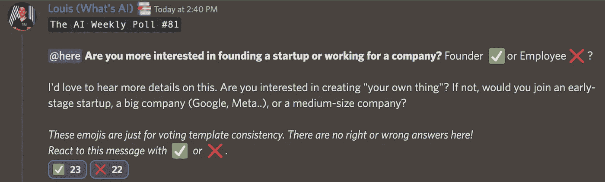

# 这份人工智能时事通讯是你所需要的#21

> 原文：<https://pub.towardsai.net/this-ai-newsletter-is-all-you-need-21-39511c79dfcd?source=collection_archive---------1----------------------->

# **本周在 AI 发生了什么由路易**

[可能改写 AI 版权规则的官司](https://www.theverge.com/2022/11/8/23446821/microsoft-openai-github-copilot-class-action-lawsuit-ai-copyright-violation-training-data) …

微软、GitHub 和 open AI(GitHub Copilot 背后的所有公司)因涉嫌使用人工智能复制开源代码违反版权法而被起诉。上周在加州提起的诉讼被认为是第一个涉及“人工智能系统”的重大版权诉讼，[的潜在损害赔偿达到 90 亿美元](https://www.newscientist.com/article/2346217-microsofts-copilot-code-tool-faces-the-first-big-ai-copyright-lawsuit/)。

这场诉讼主要是因为，你们大多数人可能都知道，Copilot 被发现在不提供信用的情况下反刍大段的授权代码，这是许多用户发现的。这也可能给图像模型带来问题，因为当我们从训练集中生成备份图像或敏感数据时，类似的事情也会发生。正因为如此，这场诉讼的结果将为未来人工智能侵犯版权、知识产权或其他受限制信息的情况树立一个重要的先例。这也必将引发对如何防止这种情况发生的调查！

附注:我们有了由我们在 [Activeloop](https://www.activeloop.ai/) 的朋友提供的 NeurIPS 赠品的结果！恭喜西蒙和阿拉夫！我很高兴能在那里见到你本人！

## 最热门新闻

1.  [中途 V4 出来了！](https://midjourney.com/) V4 是中旅从零开始培养的新机型。它有一个全新的代码库，已经工作了 9 个月了！在他们的 Discord 服务器上试用一下。
2.  [Deepmind 奖学金——建立一个更强大、更具包容性的人工智能社区](https://www.deepmind.com/scholarships) 这些奖学金为来自代表性不足群体的学生提供财政支持，以学习与人工智能及相邻领域相关的研究生课程，获得 Deepmind 导师的支持，并有机会参加领先的人工智能学术会议。“我们的愿景是帮助人工智能生态系统更好地代表社会。[deep mind 奖学金项目](https://www.deepmind.com/scholarships)旨在为代表性不足的群体提供更多机会，消除障碍，让他们能够将自己独特的视角和背景带入令人兴奋的人工智能领域。”
3.  [商家想从 AI 身上得到什么？](https://www.capitalone.com/tech/machine-learning/new-forrester-report-on-operationalizing-machine-learning) 在 Capital One 委托的一项研究中，Forrester Consulting 调查了北美的 150 名数据管理决策者，了解他们组织的 ML 目标、挑战以及实施 ML 的计划。受访者透露，ML 正开始推动业务影响，自动化异常检测是未来一至三年的首要任务。

一些额外的重要亮点:

*   53%的受访者计划通过利用 ML 来提高业务效率。
*   73%的受访者认为数据流的透明性、可追溯性和可解释性具有挑战性。
*   67%的受访者打算利用合作关系来填补 ML 员工缺口。

## 本周最有趣的报纸

1.  [TAP-Vid:追踪视频中任意点的基准
    T5:追踪视频中物理表面上的点的新基准！](https://arxiv.org/pdf/2211.03726.pdf)
2.  [因子遮片:为重新合成任务重新定义视频遮片](https://arxiv.org/pdf/2211.02145.pdf) 他们提出了因子遮片，这是视频遮片问题在反事实视频合成方面的替代表述，更适合重新合成任务。
3.  [易于访问的文本到图像生成放大了大规模的人口统计刻板印象](https://arxiv.org/pdf/2211.03759.pdf) 他们发现，易于访问的文本到图像模型放大了危险而复杂的刻板印象，这些刻板印象难以预测，用户或模型所有者也不容易减轻。

*享受这些论文和新闻摘要？* [*在你的收件箱里获取每日回顾*](https://www.linkedin.com/newsletters/what-s-ai-daily-research-tl-dr-6935956459641876480/) *！*

# 一起学习人工智能社区部分！

## 本周迷因！

是的，时候到了！人工智能现在甚至可以帮你找到爱情！由 [vladm#8251](https://discord.com/channels/702624558536065165/830572933197201459/1041368831450415204) 分享的迷因。

## **来自 Discord 的特色社区帖子**

Fausto_ST 将他对这一趋势的兴趣与他在 Twitter 上的#100DaysOfNoCode 挑战结合起来，制作了一个很酷的人工智能图像工具目录🚀

检查一下，真的做的很好，很详尽！一个非常酷的项目，也有利于其他对 AI x 图像工具感兴趣的人👇

[https://ai-image-tools.softr.app/](https://ai-image-tools.softr.app/)

## 本周最佳人工智能投票！

你怎么想呢?[加入不和](https://discord.com/channels/702624558536065165/833660976196354079)的讨论。

# **泰始乱终弃节**

## 本周文章

[蚁群优化:概述](https://towardsai.net/p/l/ant-colony-optimization-an-overview)作者 [Chinmay Bhalerao](https://medium.com/@BH_Chinmay)

一组受自然过程启发的独特的问题解决技术和方法被称为“自然启发的算法”在计算机科学和运筹学中使用的蚁群优化算法(ACO)是一种解决计算问题的概率方法，该计算问题可以简化为通过图寻找适当的路径。这篇博客简要解释了 ACO 背后的直觉和数学。

## 我们的必读文章

[通过](https://towardsai.net/p/l/deal-with-an-imbalanced-dataset-with-tensorflow-lightgbm-and-catboost)[康斯坦丁·普鲁申尼科夫](https://medium.com/@kplz)使用 TensorFlow、LightGBM 和 CatBoost 处理不平衡数据集

[用机器学习检测不良姿势](https://towardsai.net/p/machine-learning/detecting-bad-posture-with-machine-learning)作者 [Leon Eversberg](https://medium.com/@leoneversberg)

如果你有兴趣在《走向人工智能》上发表文章，[查看我们的指南并注册](https://contribute.towardsai.net/)。如果您的作品符合我们的编辑政策和标准，我们会将其发布到我们的网络上。

## 本周特色工作

[**数据科学家@ Alethea 集团**(远程，美国)](http://ws.towardsai.net/cih)

[**高级/职员机器学习工程师，基础设施&收入**](http://ws.towardsai.net/1n5) (远程)

[**AI 内容联谊@ Deepgram** (远程)](http://ws.towardsai.net/grs)

[**机器学习工程师，Copilot 模型改进@ Github** (远程，美国)](https://boards.greenhouse.io/github/jobs/4582260?utm_source=found.dev)

[**机器学习工程经理@ Verana Health** (远程)](https://boards.greenhouse.io/veranahealth/jobs/6446438002?utm_source=found.dev)

[**AI 实施经理(医疗)@ ClosedLoop** (远程)](https://boards.greenhouse.io/closedloop/jobs/4709550004?utm_source=found.dev)

有兴趣在此分享工作机会吗？联系 sponsors@towardsai.net 或在我们的[*#招聘频道上发布机会不和谐*](http://ws.towardsai.net/lat-hiring-channel) *！*

*如果你正在准备你的下一次机器学习面试，不要犹豫，来看看我们领先的面试准备网站，* [*五彩纸屑*](http://ws.towardsai.net/confetti-ai) *！*

