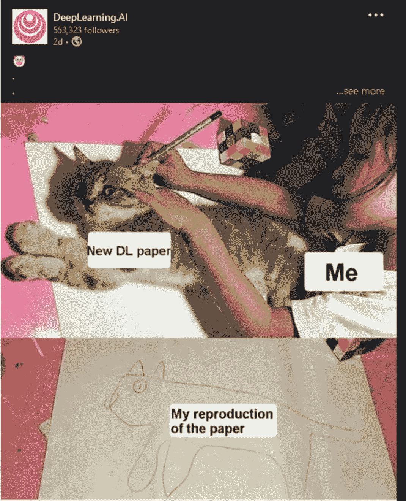

# 这份人工智能时事通讯是你所需要的#22

> 原文：<https://pub.towardsai.net/this-ai-newsletter-is-all-you-need-22-60929e317dc3?source=collection_archive---------2----------------------->

# **本周在 AI 发生了什么由路易**

一个词:[卡拉狄加](https://galactica.org/)。

在许多[用户报告了误导性或不正确的](https://www.technologyreview.com/2022/11/18/1063487/meta-large-language-model-ai-only-survived-three-days-gpt-3-science/)结果后，Meta 的最新大型语言模型 Galactica 被关闭，该模型可以存储、组合和推理科学知识。围绕这个模型有很多争议，主要是关于 Meta 对这个模型的信心和它值得怀疑的结果之间的差距。这个演示不像微软 2016 年的 Tay 事件那样灾难性，但它很快就找到了有趣的实验工具和错误信息的危险传播者之间的界限。卡拉狄加代表了大型语言模型的一大进步，但考虑到它是为科学用途设计的，严格程度还远远没有达到。

就我而言，我非常喜欢我的朋友 Lior 分享的一条推文，它很好地总结了我的想法。我想在这里引用:

围绕卡拉狄加的戏剧让我困惑。让我们记住，我们都在同一个团队里，努力让我们小小的领域取得进步。”

卡拉狄加完美吗？不是。但是 GPT3，StableDiffusion 和 Dall-E 也不是。正是通过将其发布到世界中，反馈循环开始了，这些见解帮助我们随着时间的推移构建更好的工具。

为了增加劳伦的伦理观点，我们不要忘记这可能会给世界留下什么影响，以及我们作为人工智能共同创造者处理这些影响的责任，无论这些影响是消极的还是积极的。这既不是第一个也不是最后一个偶然传播错误的语言模型，但理解并从这些错误中学习可以确保我们在人工智能方面的进步塑造我们想要的未来。

## **最热门新闻**

1.  [用人工智能实现个人和组织的价值:一份报告](https://sloanreview.mit.edu/projects/achieving-individual-and-organizational-value-with-ai/) 该报告有许多有趣的发现，并表明员工往往低估了他们在工作中使用人工智能技术的程度。一些关键的发现是，大多数个体员工个人从人工智能中获得价值，并将人工智能视为同事，而不是工作威胁。要求个人使用人工智能比建立对人工智能的信任更能鼓励人工智能的使用，而强制使用尽管看起来很压抑，但仍能带来个人价值。组织在个人获得价值的同时获得价值，而不是以牺牲个人价值为代价。
2.  设计应用 Canva 发布了自己的文本到图像生成器的测试版
    是的，又一个！我其实挺喜欢这个新闻的。我用 Canva 创建了我所有的 YouTube 缩略图，我真的很喜欢他们的产品。他们也有一个效果很好的背景去除工具和其他基于人工智能的工具。这个新的可能真的很强大，对人工智能相关的缩略图也很有用😎
3.  [更多裁员…](https://www.cnbc.com/2022/11/14/amazon-reportedly-plans-to-lay-off-about-10000-employees-starting-this-week.html) Twitter，Meta，现在亚马逊都计划裁员约 10000 人，这是公司历史上最大规模的裁员之一！对于那些正在找工作的人，请耐心等待，不要气馁——你会找到工作的！与此同时，我最好的建议是建议你的作品。搭建一个很酷的小 app，实现稳定扩散，加入一个或多个 Kaggle 比赛！试着享受你拥有的“空闲时间”，并利用它来增加你找到未来理想工作的机会:)

## 本周最有趣的报纸

1.  [Galactica:科学的大型语言模型](https://arxiv.org/abs/2211.09085) Galactica:可以存储、组合和推理科学知识的大型语言模型。
2.  [用于 3D 形状和纹理的形状引导生成的潜在 NeRF](https://arxiv.org/pdf/2211.07600.pdf) 一种基于潜在扩散模型的高效 NeRF 方法。
3.  [通过从扩散模型中学习文本嵌入的极端生成式图像压缩](https://arxiv.org/abs/2211.07793) “我们提出了一种生成式图像压缩方法，该方法展示了将图像保存为短文本嵌入的潜力，该短文本嵌入又可用于生成在感知上等同于原始图像的高保真图像。”

*享受这些论文和新闻摘要？* [*在你的收件箱里获得每日回顾*](https://www.linkedin.com/newsletters/what-s-ai-daily-research-tl-dr-6935956459641876480/) *！*

# 一起学习人工智能社区部分！

## 本周迷因！

这就是为什么代码应该总是开源和可复制的！由 [vladm#8251](https://discord.com/channels/702624558536065165/830572933197201459/1042715886475288647) 分享的 Meme。

## **来自不和谐的特色社区帖子**

JacobBum#7456 刚刚发表了“[分解:K-Means 聚类](https://towardsdatascience.com/breaking-it-down-k-means-clustering-e0ef0168688d)”。这是一篇很棒的文章，用 NumPy 和 scikit-learn 探索并可视化了 K-means 聚类的基础。如果你写文章并发表在你的博客或我们的[媒体](/submit-your-medium-story-to-towards-ai-a4fa7e8b141d)出版物上，在[我们的不和谐服务器](https://community.towardsai.net/)上分享它们，你也可能有机会成为这里的特色！

## 本周最佳人工智能投票！

加入关于不和的讨论。

# **泰始乱终弃节**

## 本周文章

[6 个小技巧在训练机器学习模型时节省我的时间&记忆](https://towardsai.net/p/l/6-tips-save-me-time-memory-when-training-machine-learning-models)作者[优素福·胡斯尼](https://youssefraafat57.medium.com/)

训练机器学习模型可能会耗费时间和内存，尤其是在您的数据很大的情况下。优化工作流以节省计算时间和内存消耗非常重要，尤其是在使用不同的超参数多次训练模型以找到模型的最佳超参数时。本文分享了在训练机器学习模型时减少计算时间和内存消耗的六个实用技巧。

## 我们的必读文章

[深入的 Azure 机器学习模型在云上训练、测试和部署具有 Web APIs 端点的管道](https://towardsai.net/p/cloud-computing/in-depth-azure-machine-learning-model-train-test-and-deploy-pipelines-on-cloud-with-endpoints-for-web-apis)由 [Amit Chauhan](https://amitprius.medium.com/)

[META's PEER:协作语言模型](https://towardsai.net/p/l/metas-peer-a-collaborative-language-model)作者[萨尔瓦托·莱埃利](https://salvatore-raieli.medium.com/)

如果你对《走向人工智能》感兴趣，请查阅我们的指南并注册。如果您的作品符合我们的编辑政策和标准，我们会将其发布到我们的网络上。

## 工作机会

[**资深数据科学家/ AI 开发者@ Uniphore** (西班牙，混合远程)](http://ws.towardsai.net/r50)

[**数据科学家@瑞士堡**(欧洲，远程)](http://ws.towardsai.net/pce)

[**首席数据工程师，数据平台@ Tubi** (远程)](http://ws.towardsai.net/ovy)

[**数据科学家@ Alethea 集团**(远程，美国)](http://ws.towardsai.net/cih)

[**机器学习工程师，基础设施@ Earnin** (远程)](http://ws.towardsai.net/1n5)

[**AI 内容联谊@ Deepgram** (远程)](http://ws.towardsai.net/grs)

有兴趣在这里分享工作机会吗？联系【sponsors@towardsai.net】**。**

**

**如果你正在准备你的下一次机器学习面试，不要犹豫，去看看我们领先的面试准备网站，* [*五彩纸屑*](http://ws.towardsai.net/confetti-ai) *！**