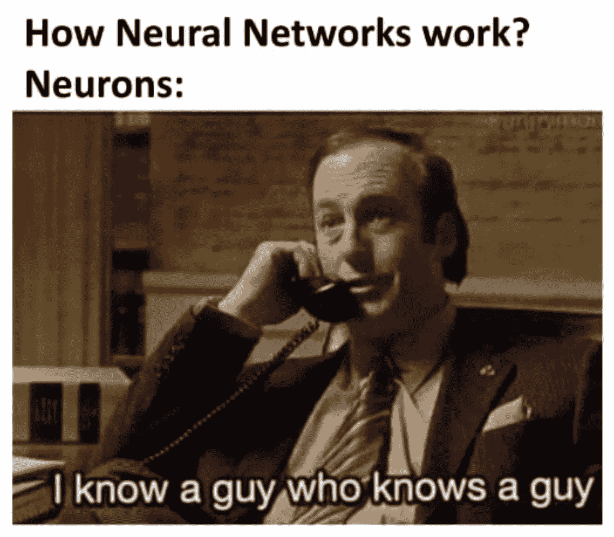
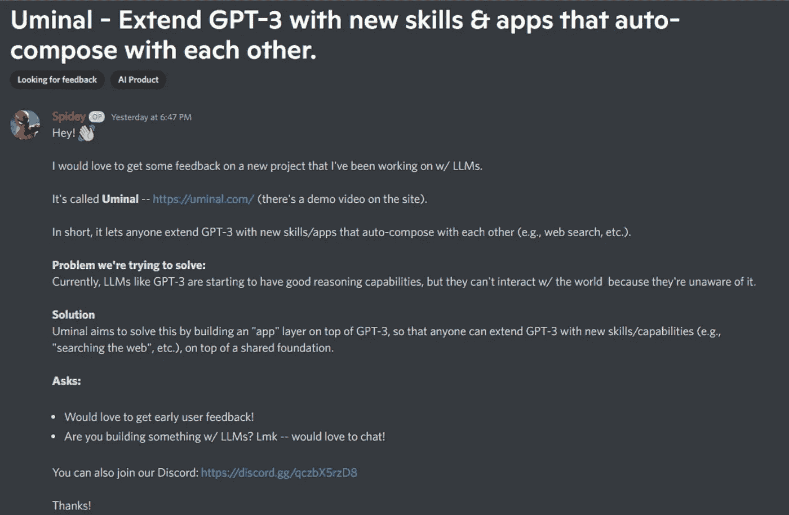
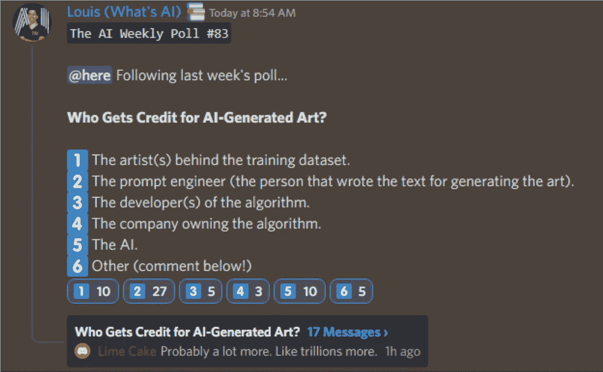

# 这份人工智能时事通讯是你所需要的#23

> 原文：<https://pub.towardsai.net/this-ai-newsletter-is-all-you-need-23-a30136cf14a4?source=collection_archive---------4----------------------->

# 《人工智能》本周发生了什么

[稳定扩散 2.0。](https://stability.ai/blog/stable-diffusion-v2-release)很明显！

在我们看来，稳定扩散 V1 是人工智能采用的一个重要里程碑，无论是在主流使用和认知方面，还是在开发者参与方面(在不到 2 个月的时间里达到 33k GitHub stars)。我们希望这一成功鼓励人工智能公司和初创公司广泛采用这种开源发布模式。我们期望这个模型也将导致更快的迭代和改进，随着 2.0 版本的快速发布，稳定的扩散正在实现这一点。

第二个版本提供了同样的服务，但效果更好，功能更多！它使用新的扩散模型来生成 512x512 像素和 768x768 像素的基本图像，您可以使用其超分辨率升级器将其升级到 2048x2048 甚至更高。他们还更新了修复模型，并引入了深度到图像模型，该模型使用文本和深度信息来生成新图像。看到稳定的扩散继续以如此快的速度发展是非常令人兴奋的，这是计算机视觉蓬勃发展的标志！

## 最热门新闻

1.  [西塞罗:一个与人谈判、说服和合作的人工智能代理](https://ai.facebook.com/blog/cicero-ai-negotiates-persuades-and-cooperates-with-people/) Meta AI 刚刚介绍了西塞罗——“第一个在外交上实现人类水平表现的人工智能，这是一个需要与多个玩家建立信任、谈判和合作的战略游戏。”他们还为它开源了代码！
2.  [谷歌推出新的搜索、购物和地图功能](https://searchengineland.com/google-launches-new-search-shopping-and-maps-features-389636) 谷歌已经宣布了许多很酷的新功能，包括谷歌搜索、谷歌镜头、购物和地图，几乎包括所有的应用程序。最令人兴奋的是对寻找食物的谷歌搜索的修改和对谷歌镜头翻译的改进。老实说，我从希伯来语到英语的经历非常糟糕！你甚至可以使用谷歌购物通过 AR 看到你想买的鞋子。这真的很酷。我很高兴能尝试这些！点击阅读更多关于[的变化。](https://searchengineland.com/google-launches-new-search-shopping-and-maps-features-389636)
3.  [“超级全球定位系统”技术精确定位你的位置，误差在几英寸之内](https://www.sciencealert.com/supergps-technology-accurately-pinpoints-your-position-within-inches) 研究人员提出了一种新的改进技术，称为“超级全球定位系统”,精确度在 10 厘米(或 3.9 英寸)之内，不依赖导航卫星系统。“我们意识到，通过一些前沿创新，电信网络可以转变为独立于 GPS 的非常精确的替代定位系统。”

## 三段 5 分钟的阅读/视频让你不断学习

1.  [观察深度神经网络中的信息传播](https://substance.etsmtl.ca/en/observing-information-propagation-in-deep-neural-networks) 在“5 分钟阅读”的第一周，我想分享一篇短文，讲述我在高等技术学院攻读硕士学位期间所做的一些工作。我们分享了一个关于光和颜色的类比，以更好地解释深度神经网络:)
    更多内容即将在您附近的会议中发布！让我知道你的想法！
2.  [神经网络由韦尔奇实验室揭开神秘面纱](https://youtu.be/bxe2T-V8XRs?list=PLiaHhY2iBX9hdHaRr6b7XevZtgZRa1PoU) 这是一个很棒的 YouTube 系列短视频，解释了神经网络、前向传播梯度下降等等。这是一个关于神经网络惊人的介绍视频或复习！惊人的动画，超清晰，代码，数学，一切你需要的娱乐和学习不到 5 分钟的视频！
3.  [什么是机器学习？罗伯特·伊里翁多](https://medium.com/towards-artificial-intelligence/what-is-machine-learning-ml-b58162f97ec7) “在五分钟内了解什么是机器学习(ML)，它是如何工作的，以及它的重要性。”我们的时事通讯多方便啊！正如我的一个朋友兼“走向人工智能”的联合创始人罗伯托提到的那样，这篇文章是为任何想直接而准确地概述机器学习是什么、它如何工作及其重要性的好奇者准备的。

*享受这些论文和新闻摘要？* [*在你的收件箱里获取每日回顾*](https://www.linkedin.com/newsletters/what-s-ai-daily-research-tl-dr-6935956459641876480/) *！*

# 一起学习人工智能社区部分！

## 本周迷因！

这就是了😂。由 [Robino > Toi#0475](https://discord.com/channels/702624558536065165/830572933197201459/1045229377299943454) 分享的迷因。

## **来自 Discord 的特色社区帖子**

蜘蛛侠#2169 开发了一个应用程序，这样任何人都可以用新的技能/能力来扩展 GPT 3，他正在寻求反馈。点击这里[查看](https://www.uminal.com/)并支持社区中的一名成员！您可以在[的帖子](https://discord.com/channels/702624558536065165/1045485752483590159/1045485752483590159)中留下您的反馈。

[阅读关于不和](https://discord.com/channels/702624558536065165/1045485752483590159/1045485752483590159)的帖子。

## 本周最佳人工智能投票！

[加入关于不和的讨论。](https://discord.com/channels/702624558536065165/833660976196354079)

## **迈向 AI 的一周文章**

[快速设置神经网络超参数以获得最佳结果](https://towardsai.net/p/l/a-quick-setup-for-neural-networks-hyperparameters-for-best-results)作者 [Youssef Hosni](https://youssefraafat57.medium.com/)

找到最佳的超参数设置并自己测试不同的设置是不容易的，直到在神经网络中获得好的结果。总的来说，我们倾向于花费大量的时间来调整这些超参数设置并获得更好的模型。但是，最重要的是避免过度拟合。以下是如何在短时间内设置超参数以获得良好结果的快速指南。

## 其他必读文章

[Shashank Kumar](/evaluating-mode-collapse-in-gans-using-ndb-score-446f17791d16)[使用 NDB 评分](https://medium.com/@rm12)评估 GANs 中的模式崩溃

[如何比较两个数据集与熊猫简介](https://towardsai.net/p/l/how-to-compare-2-datasets-with-pandas-profiling)作者[法比亚娜·克莱门特](https://medium.com/@fabiana_clemente)

如果你对《走向人工智能》感兴趣，请查阅我们的指南并注册。如果您的作品符合我们的编辑政策和标准，我们会将其发布到我们的网络上。

## 劳伦对梅塔作品《西塞罗》的伦理解读

Meta 宣布了 CICERO ，这是第一个在流行的策略游戏 Diplomacy 中实现人类水平性能的 AI。使用 NLP，西塞罗与人类玩家谈判、说服和合作，以实现战略目标。这一进步对我们与人工智能互动的未来有着巨大的影响。即使是最好的对话机器人也会达到临界点，或者在得到提示(或没有提示)时吐出一句不连贯的话。[西塞罗并不完美](https://theconversation.com/an-ai-named-cicero-can-beat-humans-in-diplomacy-a-complex-alliance-building-game-heres-why-thats-a-big-deal-195208)，也受到这些缺陷的影响，但它更好的谈判、说服和合作技能给我们的人工智能交互增加了一层对话的复杂性，这是前所未有的。在有限的机器环境中，这甚至看起来像是推理。

真正让西塞罗独一无二(和令人关注)的是其人类行为预测能力和语言说服力的结合，这是突破性冲突解决方案或规模空前的直接操纵的秘诀。它的开源令人欣慰，因为它保持了一定程度的透明度，但西塞罗的应用环境将决定它在这个光谱中的位置。我希望看到 CICERO 的使用案例有一些适当的指导原则，因为 Meta 仅仅希望社区负责任地开展研究，而对其未来的使用不负任何责任。战略目标很容易变成邪恶的目标，但我也希望这项发明能带来好的结果。

## 工作机会

我们本周赞助的工作来自 NannyML，他们正在寻找数据科学作家实习生，与高级数据专业人员和创始团队密切合作:

[**数据科学作家实习生@ NannyML** (远程)](http://ws.towardsai.net/nml)

[**高级数据科学家/ AI 开发者@ Uniphore** (西班牙，混合远程)](http://ws.towardsai.net/r50)

[**首席数据工程师，数据平台@ Tubi** (远程)](http://ws.towardsai.net/ovy)

有兴趣在此分享工作机会吗？联系[*sponsors@towardsai.net*](mailto:sponsors@towardsai.net)。

*如果你正在准备你的下一次机器学习面试，不要犹豫，来看看我们领先的面试准备网站，* [*纸屑*](http://ws.towardsai.net/confetti-ai) *！*