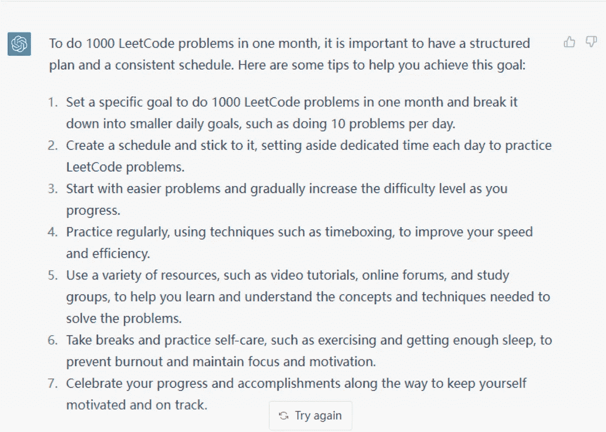
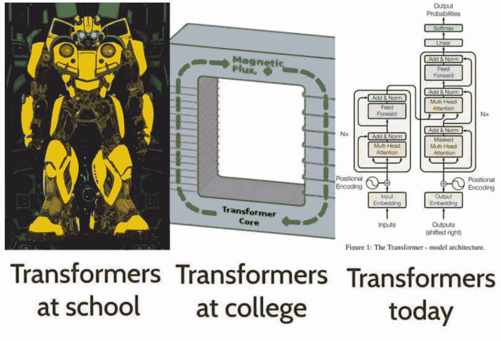
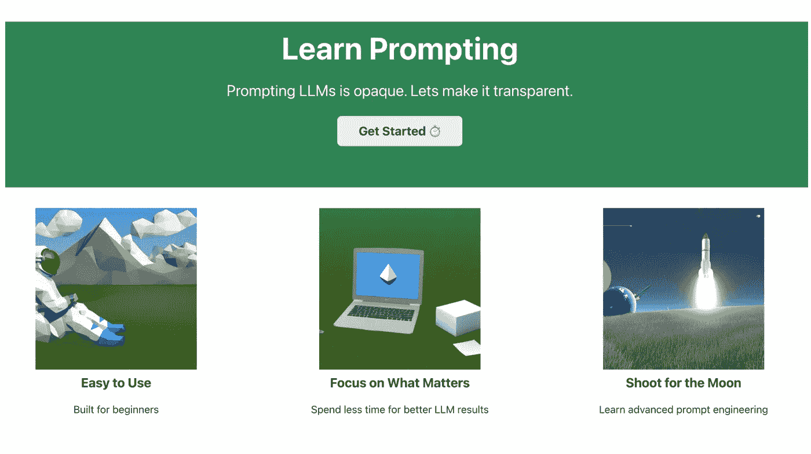
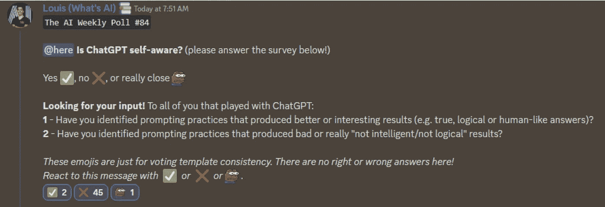

# 这份人工智能时事通讯是你所需要的#24

> 原文：<https://pub.towardsai.net/this-ai-newsletter-is-all-you-need-24-2d91bd0fbe82?source=collection_archive---------3----------------------->

感谢 Verta AI 为您带来这一期:

我们很高兴分享 Verta AI Insights 的[机器学习运营研究报告](https://info.verta.ai/report-state-of-mlops-2022?utm_source=towards-ai&utm_medium=paid-campaign&utm_content=report&utm_campaign=mlops-survey)的状态，该报告揭示了组织如何优先投资 AI/ML 的重大转变。重要的是，构建复杂模型的能力不再是竞争优势——组织现在必须有效地运营人工智能以保持竞争力。

[阅读报告](https://info.verta.ai/report-state-of-mlops-2022?utm_source=towards-ai&utm_medium=paid-campaign&utm_content=report&utm_campaign=mlops-survey)了解当前塑造行业的趋势和机遇——以及走向**可操作人工智能思维模式的运动**。

## 《人工智能》本周发生了什么

又一次… OpenAI 主宰了本周的新闻版块！既有惊人的 Text-Davinci-003 的出版，也有你肯定在网上看到的 ChatGPT。

正如我们在社区中讨论的那样，[聊天-GPT](https://youtu.be/AsFgn8vU-tQ) 从我们目前所见来看相当不错。它可能无法给你正确的答案，但它似乎能够很好地理解你的问题。看看 runoob#9765 分享的这个关于我们不和的例子就知道了。

在这里，我们可以清楚地看到模型理解了问题，甚至是隐含的意思(完成编码问题，并且足够高效地在短时间内完成很多)。然而，它建议每天做 10 道题，坚持一个月，以完成 1000 道题。如果你的数学基础比较好，你会直接找到问题所在。ChatGPT 不知道它在说什么，也不知道你在要求什么。它[对世界](https://garymarcus.substack.com/p/how-come-gpt-can-seem-so-brilliant?utm_source=substack&utm_medium=email)并没有很好的理解，只是根据你问题中的不同概念，在不涉及逻辑的情况下，解读你问题中的词语和概念，给你回最符合逻辑的答案。不过，如果你只是和它聊天，不需要应用和复杂的建议，这个聊天机器人是非常好的。也许可以对它进行微调，使其成为一种专家系统，拥有特定应用程序的专家知识，以确保它提供的信息是正确的，这对于一般的人工智能聊天机器人来说是不可扩展的，但对于特定公司的聊天机器人来说可能是有趣的。这是一个超级令人兴奋的大道，有很大的潜力！

如果你[玩模型](https://chat.openai.com/auth/login)，请在[不和谐](https://discord.com/channels/702624558536065165/702878028841091093)上与我们分享你的结果！

## 最热门新闻

1.  [OpenAI 发布 Text-Davinci-003](https://twitter.com/blennon_/status/1597374826305318912) OpenAI 表示，它可以产生更高质量的写作、更复杂的指令和更好的长篇内容。它仍然是在与 text-davinci-002 相同的数据上训练的，但有所不同。
2.  OpenAI 发布了 ChatGPT:一个强大的 GPT 模型的会话优化版本
    你一定已经在网上看到结果了。ChatGPT 有点疯狂，但显然有一些失败案例[和所有人工智能一样。对话形式使 ChatGPT 能够回答后续问题，承认错误，质疑不正确的前提，拒绝不适当的请求。](https://garymarcus.substack.com/p/how-come-gpt-can-seem-so-brilliant?utm_source=substack&utm_medium=email)[你可以在这里试试。](https://chat.openai.com/auth/login)
3.  [与走向 AI 合作学习提示！我们正在与 Learn Prompting 合作，以帮助建立和传播如何做提示，并成为更好的提示工程师，我们相信这将越来越受欢迎，在不久的将来，人们甚至会被聘用担任这一角色。请查看我们新的 discord 频道，并在 Twitter](https://learnprompting.org/)[和](https://twitter.com/learn_prompting)上关注他们，观看新的发布！
4.  [AI 将计算机图形加速超过 500%](https://spectrum.ieee.org/ai-graphics-neural-rendering) NVIDIA 应用深度学习副总裁声称，“在某些 GPU 密集型游戏中，如经典的第一人称平台游戏[门户](https://www.nvidia.com/en-us/geforce/news/portal-with-rtx-ray-tracing/)，屏幕上八分之七的像素是由一种新的机器学习算法生成的。”这要归功于 NVIDIA 今年发布的 Instant NeRF 等方法。

## 三段 5 分钟的阅读/视频让你不断学习

1.  [AI 如何理解文字](https://www.louisbouchard.ai/text-embedding/) 大型语言模型。你以前一定听过这些话。它们代表了一种特定类型的基于机器学习的算法，能够理解并生成语言，这个领域通常被称为[自然语言处理](https://app.hackernoon.com/drafts/hackernoon.com/tagged/natural-language-processing)或 NLP。你肯定听说过最著名和最强大的语言模型: [GPT-3](https://youtu.be/gDDnTZchKec) 。GPT-3 理解语言，并产生语言作为回报。但是这里要小心；它并没有真正理解它。其实远没有理解他们。GPT-3 和其他基于语言的模型只是使用我们称之为单词字典的东西来将它们表示为数字，记住它们在句子中的位置，仅此而已。在这里，我们深入那些强大的机器学习模型，并试图理解它们看到的而不是单词，这被称为单词(或文本)嵌入。
2.  [AI 能有知觉吗？](https://globalethics.ai/wp-content/uploads/2022/10/Goffi-Momcilovic-et.-al.-2022-Can-an-AI-be-sentient-1.pdf) 关于感知和感知崛起的潜在伦理影响的多种观点，包括我在第 20 页上发表的令人惊叹的 [Lauren Keegan](https://www.linkedin.com/in/lauren-keegan/?lipi=urn%3Ali%3Apage%3Ad_flagship3_pulse_read%3B1N2C93aWSR6EvmgboQE84w%3D%3D) 名为“超越感知，走向道德负责的人工智能”的文章。
3.  [扩散模型解释。OpenAI 的 GLIDE 是如何工作的？](https://youtu.be/344w5h24-h8) 我朋友的一个精彩讲解视频 [Letitia Parcalabescu](https://www.linkedin.com/in/letitia-parcalabescu?miniProfileUrn=urn%3Ali%3Afs_miniProfile%3AACoAADHNpUgB4dpyb2MqDILjr4gaxMtgmBGMIk8&lipi=urn%3Ali%3Apage%3Ad_flagship3_pulse_read%3B%2B1XcTmfoTHa%2BBrSbVrRPtw%3D%3D) 解释了什么是扩散模型(DALLE 和 Stable Diffusion 等最新文本到图像模型背后的架构)。Letitia 在大约 10-15 分钟内涵盖了许多主题，并努力创建非常清晰的解释和出色的动画。这是一个保持高效学习的好渠道，你一定要遵循！

喜欢这些论文和新闻摘要吗？ [*在你的收件箱里获得一份每日回顾*](https://www.linkedin.com/newsletters/what-s-ai-daily-research-tl-dr-6935956459641876480/) *！*

# 一起学习人工智能社区部分！

## 本周迷因！

我们可以联系…我们的会员再次幽默地分享了 Meme:Robino > Toi # 0475。

## 来自 Discord 的特色社区帖子

来自 Discord 社区的一名版主正在整理这个关于即时工程的[免费开源课程](https://learnprompting.org/)！

“现在，它将介绍一些基础知识(CoT、0 铅球 Cot 等)、一些高级应用(MRKL、ReAct)以及 15 种不同的 prompt 工程 ide 的比较。我正在积极地添加各种主题的内容。

我在寻找批评以及建议的主题，甚至可能是一些贡献🙂"

在这里了解更多关于这个项目[的信息，并支持我们了不起的版主！](https://discord.com/channels/702624558536065165/1046822064641822783/1046822064641822783)

## 本周最佳人工智能投票！

[加入关于不和](https://discord.com/channels/702624558536065165/833660976196354079)的讨论。

# 泰策展组

## 走向人工智能本周文章

[ChatGPT — OpenAI 的全新对话模式！！](/openai-debuts-chatgpt-50dd611278a4)由[曼达尔·卡哈德](https://ithinkbot.com/)

随着每个版本的发布，OpenAI 越来越接近传闻中的 GPT-4 模型。随着每一次迭代，许多经验教训被吸取，无论这些是文本、codex、InstructGPT 还是 ChatGPT 模型。模型的性能和安全性都在提高。本文是关于 OpenAI 发布的 ChatGPT。这个模型被训练成可以进行对话式互动。根据 OpenAI 上的描述，它被训练成遵循提示中的指令，并提供详细的响应。

## 其他必读文章

[从事计算机视觉项目？这些代码块将帮助你！！！](/working-on-a-computer-vision-project-these-code-chunks-will-help-you-45756bbe7e65)作者 [Chinmay Bhalerao](https://medium.com/@BH_Chinmay)

[Divy Shah](/how-to-train-xgboost-model-with-pyspark-2c4e219da5e1)如何用 PySpark 训练 XGBoost 模型

如果你对出版《走向人工智能》感兴趣，请查阅我们的指南并注册。如果您的作品符合我们的编辑政策和标准，我们会将其发布到我们的网络上。

## 本周特色工作

[**高级数据科学家/ AI 开发者@ Uniphore** (西班牙，混合远程)](http://ws.towardsai.net/r50)

[**首席数据工程师，数据平台@ Tubi** (远程)](http://ws.towardsai.net/ovy)

有兴趣在此分享工作机会吗？联系 sponsors@towardsai.net 或在我们的[*#招聘频道上发布机会不和谐*](http://ws.towardsai.net/lat-hiring-channel) *！*

*如果你正在准备你的下一次机器学习面试，不要犹豫，来看看我们领先的面试准备网站，* [*五彩纸屑*](http://ws.towardsai.net/confetti-ai) *！*