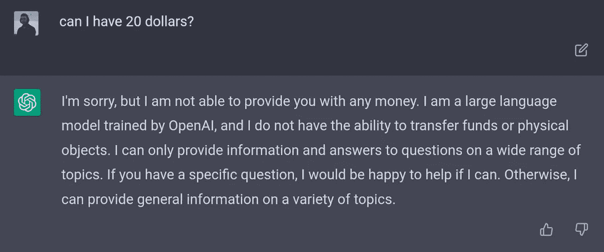
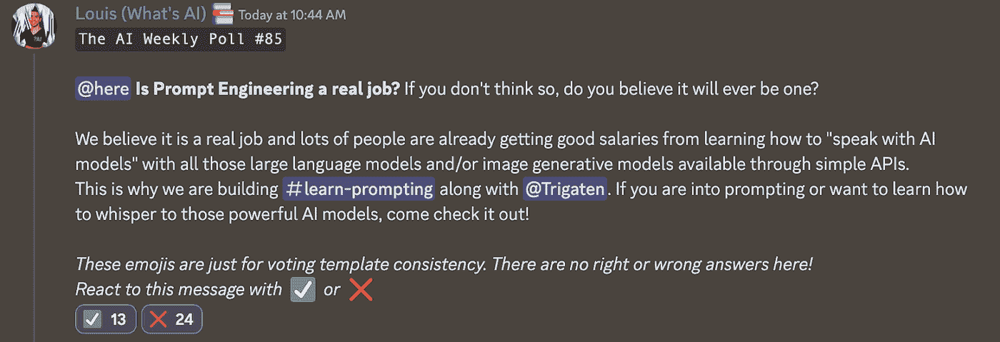

# 这份人工智能时事通讯是你所需要的#25

> 原文：<https://pub.towardsai.net/this-ai-newsletter-is-all-you-need-25-f6e3fc18df?source=collection_archive---------3----------------------->

# 《人工智能》本周发生了什么

今天令人兴奋的消息！

我们正在与 [Learn Prompting](https://learnprompting.org/) 合作，以帮助建立和传播如何做提示，并成为更好的提示工程师，我们相信这将越来越受欢迎，在不久的将来，人们甚至会被雇用担任这一角色(你认为提示工程将是一份真正的工作吗？[加入讨论](https://twitter.com/Whats_AI/status/1602329033773305856)！).我们计划涵盖提示的 A 到 Z，包括所有大型和热门模型的应用和综合教程，以及年底即将到来的有趣比赛。

了解关于这一新课程的更多信息，并在我们新的[#不和谐学习提示频道](https://community.towardsai.net/)中关注有趣的有奖竞赛——包括奖金！

我们将利用这一新渠道分享公告，并回答与学习提示相关的问题。也可以随时联系@Trigaten 和我。

这个新闻还附带了一个**新的工作机会**！
我们正在寻找愿意在以下一个或两个领域从事构建学习资源的合同工作的人:

*   LLMs 实施和提示。
*   图像生成模型(实现了稳定扩散或其他图像合成模型，并体验了它们的提示(或微调))。

这将是一个承包商的角色，每个月大约有 10 个小时的工作，为“学习人工智能”社区提供不同的有趣和改变游戏规则(主要是开源)的项目，就像学习提示一样。关于 [Discord](https://community.towardsai.net/) 的消息我@Louis B 或通过[电子邮件](mailto:louis@towardsai.net)了解更多信息！

## 最热门新闻

1.  [Pytorch 刚刚推出 PyTorch 2.0！除了许多很酷的特性，PyTorch 2.0 还引入了 torch.compile，这是一种编译模式，可以加速你的模型而不需要改变你的模型代码。在 163 个开源模型上，包括 vision、NLP 和其他模型，使用 2.0 将训练速度提高了 38–76%。](https://pytorch.org/get-started/pytorch-2.0)
2.  多亏了加布·拉格兰德的工作，ChatGPT Chrome 扩展
    将 ChatGPT 整合到互联网上的每一个文本框中，比如你正在写的 app 消息框或 Twitter 帖子。直接找 ChatGPT 帮你解决就行了。
3.  AI 电影节
    Runway 推出首届年度 AI 电影节。在艾电影制作的最前沿，一场艺术和艺术家们创造不可能的庆典！所有电影都将由全球知名电影制作人、创作者和人工智能创新者组成的小组进行审查。

## 三段 5 分钟的阅读/视频让你不断学习

1.  [计算机视觉任务概述&应用](/overview-of-the-computer-vision-tasks-applications-647f63e66e9f) 在本文中， [Youssef Hosni](https://youssefraafat57.medium.com/?source=post_page-----647f63e66e9f--------------------------------) 探讨了主要的计算机视觉任务以及每项任务最流行的应用。了解这个领域的更多信息，以及人工智能实际上如何帮助视觉行业！
2.  ChatGPT 正在接管互联网。但是你知道它实际上是如何工作的吗？这真是太聪明了……
    这里有一个简单的解释(在我的朋友 Lior 的一个很棒的 [Twitter 帖子](https://twitter.com/AlphaSignalAI/status/1600209930954321920))中)
3.  在这篇文章中，我的朋友[杰里米·平托](https://www.linkedin.com/in/jeremy-pinto/?lipi=urn%3Ali%3Apage%3Ad_flagship3_pulse_read%3BL1MNeqKsSbKMdCW%2BDN7y5Q%3D%3D)分享了一个很好的使用案例，ChatGPT 用它来帮助他编写一个机器学习模型。他分享了自己的经验、该模型的优缺点等。对于任何对使用 ChatGPT 和练习编码感兴趣的人来说，这是一篇非常有趣和实用的文章。

喜欢这些论文和总结吗？**在你的收件箱里获得每日回顾！**

# *一起学习人工智能社区部分！*

## *本周迷因！*

**

*呵，没那么革命性…分享自 FathoM | 1 ' 3 " |-8IQ # 4188。*

# *来自 Louis 的 Discord 的特色社区帖子*

*作为社区负责人，我将对一家大型人工智能公司负责招聘流程的人进行面试。*

*我很想知道您是否有任何想问的问题:*

*   *面试过程*
*   *采访本身*
*   *理想的简历*
*   *他们在你的个人资料中寻找什么，等等。*

*请将您的问题通过[不和谐](https://community.towardsai.net/)或[电子邮件](mailto:louis@towardsai.net)发送给我！*

*这次采访将会在我的 YouTube 频道[什么是人工智能](https://www.youtube.com/@WhatsAI)和寒假期间的 Discord 服务器上分享。*

# *本周最佳人工智能投票！*

**

*[加入关于不和的讨论。](https://community.towardsai.net/)*

# *泰策展组*

## *走向人工智能本周文章*

*[论文综述 Monolith:通过](https://towardsai.net/p/l/paper-review-monolith-towards-better-recommendation-systems)[构件](https://medium.com/@buildingblocks)实现更好的推荐系统*

*作者讨论了最近发表的一篇论文:具有无冲突嵌入表的实时推荐系统。推荐系统是机器学习最普遍的应用。我们在每个社交媒体平台、流媒体网站、在线市场和许多其他地方都能看到它们。尽管它们很流行，但推荐系统的设计还有很大的改进空间。*

## *其他必读文章*

*[SQL 中的窗口函数和 PySpark(笔记本)](https://towardsai.net/p/l/window-functions-in-sql-and-pyspark-notebook)by[Muttineni Sai Rohith](https://muttinenisairohith.medium.com/)*

*[DeepMind 的 DeepNash 玩游戏《Stratego》](https://towardsai.net/p/l/deepminds-deepnash-plays-stratego)作者[Mandar Karhade 博士。](https://ithinkbot.com/)*

*如果你对《走向人工智能》感兴趣，请查看我们的指南并注册。如果您的作品符合我们的编辑政策和标准，我们会将其发布到我们的网络上。*

## *本周特色工作*

*[**产品领先，AI/ML @ Inworld。艾**(美国，遥控)](http://ws.towardsai.net/2am)*

*[**数据工程师@剑**(美国，远程)](http://ws.towardsai.net/q4k)*

*[**机器学习工程师@协变**(加州伯克利)](http://ws.towardsai.net/5hc)*

*[**AI 交付经理(医疗保健)@ ClosedLoop** (远程)](http://ws.towardsai.net/nny)*

*[**高级/职员机器学习工程师，欧宁**(美国，远程](http://ws.towardsai.net/1n5))基础设施*

*有兴趣在这里分享工作机会吗？联系 sponsors@towardsai.net 或在我们的 [*【招聘频道】发布机会不和谐*](http://ws.towardsai.net/lat-hiring-channel) *！**

**

**如果你正在准备你的下一次机器学习面试，不要犹豫，来看看我们领先的面试准备网站，* [*五彩纸屑！*](http://ws.towardsai.net/confetti-ai)*