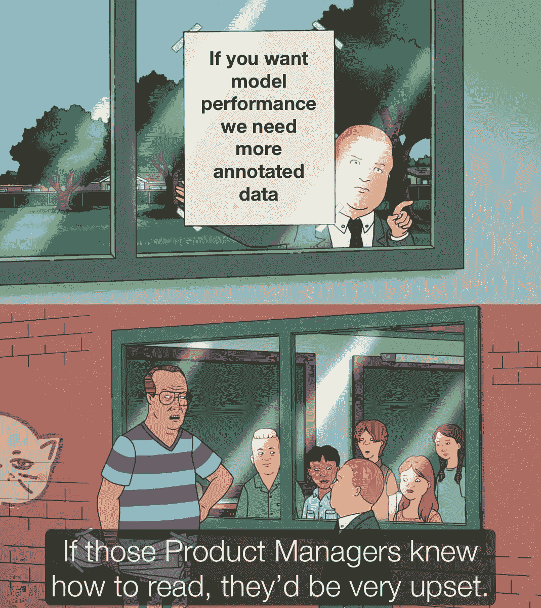
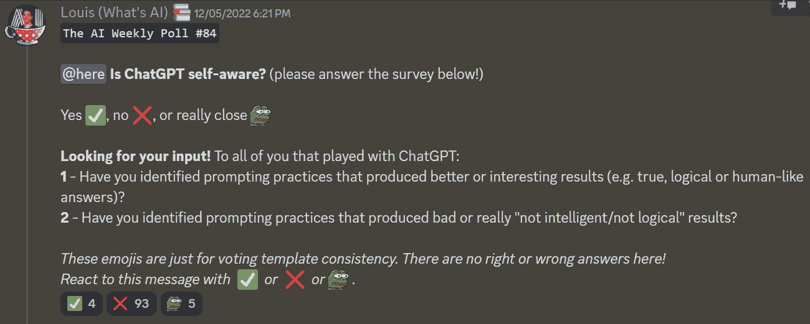
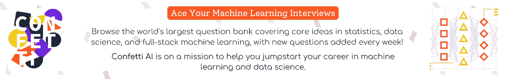

# 这份人工智能时事通讯是你所需要的#26

> 原文：<https://pub.towardsai.net/this-ai-newsletter-is-all-you-need-26-90d962eed6c8?source=collection_archive---------1----------------------->

# 这个星期在 AI 发生了什么

我们有兴趣在本周看到两个新的模型，我们认为它们可以增加 ML 在搜索、文档和数据处理方面的灵活性和能力。

OpenAI 发布了它的[新的和改进的嵌入模型](https://openai.com/blog/new-and-improved-embedding-model/)，它在大多数任务上都优于 Davinci，而价格却低了 99.8%。新模型取代了文本搜索、文本相似性和代码搜索的五个独立模型，同时将上下文长度增加了 4 倍，并减少了嵌入大小。该模型是自然语言处理和代码任务的更强大的工具，我们认为它有许多有趣的应用，包括语义搜索。

虽然不相关，我们也有兴趣看到微软发布其新的[通用文档处理(UDOP)模型](https://arxiv.org/abs/2212.02623)。它是用于文档理解和生成任务的基础文档人工智能模型，其中文本在结构上嵌入在文档中，以及其他信息，如符号、图形和样式。它在各个领域的九个文档人工智能任务上设置了最先进的水平，并在文档理解基准排行榜上排名第一。

我们认为这些模型都是构建人工智能应用工具集的潜在组成部分，在这些应用中，数据回忆和理解的准确性、相关性和可靠性非常重要。

## **走向人工智能与学霸竞赛协作**

我们还与我们的朋友 Sander 和开源课程 [Learn Prompting](https://learnprompting.org/) 合作组织了一场有趣的提示竞赛！我们将于本周在“一起学习人工智能”的“不和谐音”服务器上开始比赛(有一个有趣的现场直播！)并将在下周的新闻简报中公布。敬请关注——比赛(所有人都可以参加)将持续到 12 月 31 日！加入我们的 [Discord](https://community.towardsai.net/) 并参加我们的比赛，有机会赢得超酷的奖品！

## **向 AI 求职**

我们将继续寻找承包商加入到 AI(每月约 10 小时)中来，为我们的社区建立学习资源(大部分是开源的)。我们正在寻找以下一个或两个方面的经验:

*   LLMs 实施和提示。
*   图像生成模型(实现了稳定扩散或其他图像合成模型，并体验了它们的提示(或微调))。

在 [Discord](https://community.towardsai.net/) 上给我@Louis B 发消息，或者通过[电子邮件](mailto:louis@towardsai.net)获取更多信息！

# 最热门新闻

1.  [斯坦福 CRFM 的 PubMedGPT 2.7B](https://crfm.stanford.edu/2022/12/15/pubmedgpt.html)
    一个新的 27 亿参数语言模型，在生物医学摘要和论文上训练。GPT 风格的模型能够在一系列生物医学自然语言处理任务上表现出色，包括在 MedQA 生物医学问答任务上的最新表现。
2.  [人工智能在 2022 年的状态——五年回顾](https://www.mckinsey.com/capabilities/quantumblack/our-insights/the-state-of-ai-in-2022-and-a-half-decade-in-review)
    这份报告深入探讨了过去五年人工智能领域的情况，包括公司采用人工智能的统计数据、最受欢迎的人工智能用例、人工智能技术和开发的投资水平等…
3.  [DeepMind 的 AlphaCode 征服了编码，表现得和人类一样好](https://singularityhub.com/2022/12/13/deepminds-alphacode-conquers-coding-performing-as-well-as-humans/?)
    DeepMind 的人工智能系统在编码任务中展示了令人印象深刻的结果，在有 5000 名参与者的测试中表现得和人类一样好。这篇文章解释了这种人工智能的独特功能，以及它如何能够实现如此高的性能水平。编码的未来已经到来了吗？
4.  [Geoffrey Hinton 提出了反向传播的替代方案:前向-前向算法](https://twitter.com/martin_gorner/status/1599755684941557761)
    在一篇新论文中，Geoffrey Hinton 引入了前向-前向(FF)算法作为反向传播的替代方案。 [@martin_gorner](https://twitter.com/martin_gorner) 已经在一篇 [Twitter 帖子](https://twitter.com/martin_gorner/status/1599755684941557761?s=20&t=tw3pgMVhoh24uNHRsYquew)中总结了论文的要点。Hinton 认为，虽然人类大脑不太可能使用反向传播来学习，但 FF 是一种可能的替代方案，可以非常节能，非常适合自我监督学习。

# 三段 5 分钟的阅读/视频让你不断学习

1.  理解概率中的卷积:一个疯狂的科学视角
    这篇文章从概率的角度探讨了卷积的概念，包括如何使用它们，如何计算它们，以及它们的数学定义。它提供了清晰的示例和直观的地图来帮助简化学习过程。
2.  [Python 初学者的一些基本的图像预处理操作](https://towardsdatascience.com/some-basic-image-preprocessing-operations-for-beginners-in-python-7d297316853b)
    在本文中， [Rashida](https://rashida00.medium.com/) 讨论了 Python 中使用 OpenCV 的一些基本的图像预处理操作，包括平移、缩放、裁剪。如果您是图像处理的新手，并且希望了解这些用于图像分类、对象检测或光学字符识别等任务的基本技术，本文是一个很好的资源。
3.  [今年最发人深省的大脑发现](http://scientificamerican.com/article/this-years-most-thought-provoking-brain-discoveries/)
    本文重点介绍了 2022 年神经科学学会会议上的杰出大脑发现，为神经回路的最新突破提供了见解。对于任何希望了解神经科学领域最新发展的人来说，这是一本有趣的读物。

*想要更多？深入其中一个用* [*那个什么艾周刊*](https://www.louisbouchard.ai/newsletter/) *！*

# 一起学习人工智能社区部分！

## 本周迷因！

由 [friedliver#0614](https://discord.com/channels/702624558536065165/830572933197201459/1053001173600325742) 分享的 Meme

## 来自 Discord 的特色社区帖子

[altryne#7376](https://discord.com/channels/702624558536065165/702632051018301561/1051621693833101393) 为 [assemblyAI hackathon](https://assemblyai-hackathon.devpost.com/) 提交了一个有趣的项目。ChatGP-T1000 是一个人工智能变形机器人，它假设 identities 理解你的自然语言，并以 chatGPT 响应进行回复，以 deepfaked 音频和 lipsync 字符进行回复。点击[这里](https://devpost.com/software/chatgp-t-1000-the-shapeshifter-ai-assistant)查看并支持一名社区成员！您可以在的帖子[中留下您的反馈。](https://discord.com/channels/702624558536065165/702632051018301561/1051621693833101393)

## 本周最佳人工智能投票！

[加入关于不和](https://discord.com/channels/702624558536065165/833660976196354079)的讨论。

# 泰策展组

## 本周文章

[Python A-Z 中的网格搜索:寻找完美](https://towardsai.net/p/l/grid-search-in-python-a-z-searching-for-perfection)作者 [Gencay I.](https://medium.com/@geencay)

在机器学习的许多性能提升技术中，作者解释了网格搜索&随机搜索。在网格搜索中，该算法在预定义的超参数值网格上搜索机器学习模型的最佳超参数集。相反，随机搜索包括选择超参数的随机组合，并评估每个组合的模型性能。

## 我们的必读文章

[支持向量机](https://towardsai.net/p/l/support-vector-machines) by [数据科学遇上网络安全](https://medium.com/@datasciencemeetscybersecurity)

ChatGPT:它内部是如何工作的？帕特里克·迈耶

如果你对《走向人工智能》感兴趣，请查阅我们的指南并注册。如果您的作品符合我们的编辑政策和标准，我们会将其发布到我们的网络上。

## 工作机会

[**产品铅，AI/ML @ Inworld。AI** (美国，远程)](http://ws.towardsai.net/2am)

[**数据工程师@剑**(美国，远程)](http://ws.towardsai.net/q4k)

[**机器学习工程师@协变**(加州柏克莱)](http://ws.towardsai.net/5hc)

[**人工智能交付经理(医疗保健)@ ClosedLoop** (远程)](http://ws.towardsai.net/nny)

[**Earnin**(美国，远程](http://ws.towardsai.net/1n5))基础设施高级/职员机器学习工程师

有兴趣在此分享工作机会吗？联系[*sponsors@towardsai.net*](mailto:sponsors@towardsai.net)。

