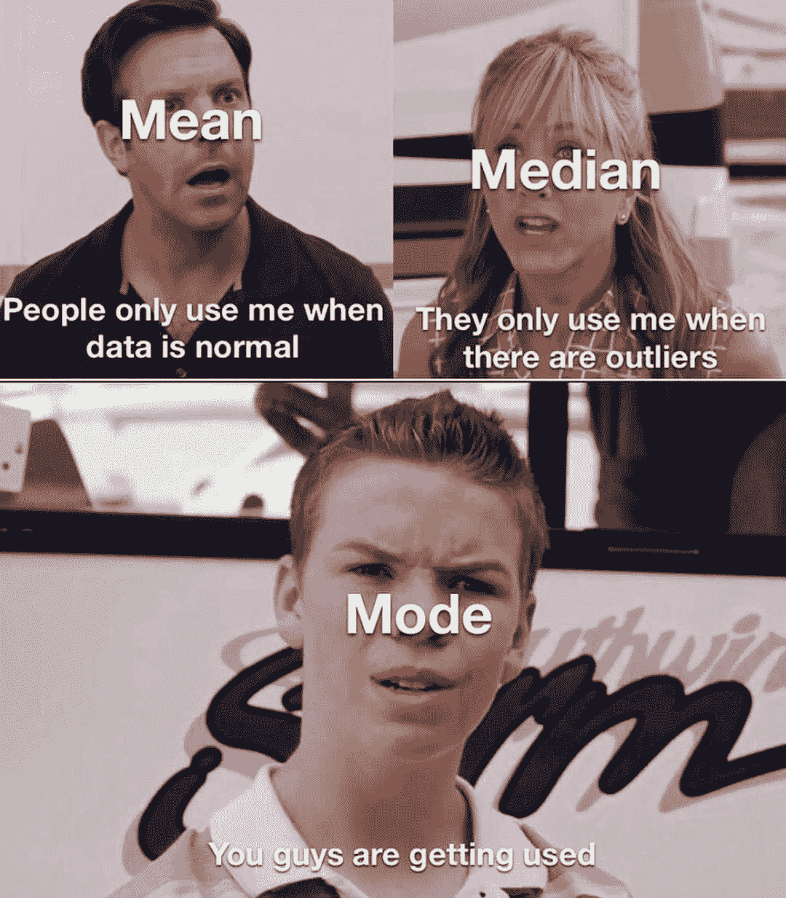
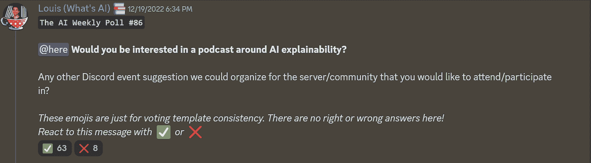
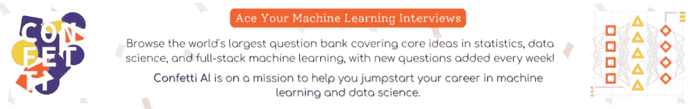

# 这份人工智能时事通讯是你所需要的#27

> 原文：<https://pub.towardsai.net/this-ai-newsletter-is-all-you-need-27-9933775461a5?source=collection_archive---------0----------------------->

# 《人工智能》本周发生了什么

我们希望你们过了一个精彩的圣诞节，否则，我们希望这是一个充满巨大挑战和成功的奇妙的一周，就像 2023 年一样！

我们对“走向人工智能”和“一起学习人工智能”社区的许多新公告感到兴奋，如播客、竞赛、更多帮助学习人工智能社区的资源、新的学习资源和我们正在为人工智能社区工作的大量其他开源令人兴奋的东西。我们将在这个时事通讯和不和谐上宣布一切。敬请期待！

如你所知，本周是一年中所有 2023 年预测和 2022 年总结的一周，我们在下面分享了我们社区负责人分享和解释他最喜欢的 2022 年论文的文章中最酷的一些，并为每篇论文都提供了专门的文章。

我们希望你享受这一年的最后一次迭代，并向人工智能团队希望你有一个惊人的一周和一年，我们希望与你分享不和谐。

很快与你交谈！

路易斯（号外乐团成员）

## 最热门新闻

1.  2022 年:充满惊人人工智能论文的一年——综述🚀
    《走向人工智能》为我们整理了一份人工智能领域最新突破的深度列表，以及今年重点关注的人工智能关键方面。该列表包括 ChatGPT、Galactica、DALL-E 2 和 Stable Diffusion 等开发，并提供了清晰的视频解释、更详细文章的链接和代码的访问(如果适用)。
2.  [OpenAI 发布生成 3D 模型的 AI Point-E](https://techcrunch.com/2022/12/20/openai-releases-point-e-an-ai-that-generates-3d-models/?guccounter=1)open AI 拥有开源的 Point-E，这是一个从文本提示生成 3D 对象的机器学习系统。Point-E 创建点云，点云是表示三维形状的数据点集。这些点云可以用来制造真实世界的物体。这是人工智能领域的一项重大突破，很可能对行业产生重大影响。
3.  [预测 2023 年 GPT-4 的一个线程](https://twitter.com/ramaswmysridhar/status/1605603043046674435?s=12&t=627yjrqi1exqBQijI3pHeQ)
    Open AI 的 GPT4 将是 2023 年第一个大的 AI 事情之一。在这篇 Twitter 帖子中， [@RamaswmySridhar](https://twitter.com/RamaswmySridhar?s=20&t=fekaF2qc9l80UH8zkbzOIw) 分享了他对 GPT-4 未来的预测，包括最大的模型尺寸、预训练模型、面向用户的变化等等。

## 三段 5 分钟的阅读/视频让你不断学习

1.  如何识别人工智能生成的文本
    互联网上充斥着越来越多由人工智能编写的文本。这篇文章提供了对当前检测工具的见解，并探索了训练人眼识别人工智能句子迹象的新方法。
2.  [什么建筑“X 的副驾驶”真正需要](https://lspace.swyx.io/p/what-building-copilot-for-x-really)
    副驾驶是许多生产化人工智能潜在模型的开始。本指南强调了估计推理规模、确定实时基础设施、优化提示和整合模型输出的重要性& UX。
3.  ChatBot 提示
    chat GPT 提示数据集是一个很有价值的资源，它包括各种动作字符串的提示，例如旅行指南和翻译。对于那些希望在生产环境中使用 ChatGPT 的人来说，这是一个有用的工具。

喜欢这些论文和新闻摘要吗？**【在你的收件箱里获得每日回顾！**

# *一起学习人工智能社区部分！*

## *本周迷因！*

**

*由 [friedliver#0614](https://discord.com/channels/702624558536065165/830572933197201459/1054246266814611587) 分享的 Meme*

## *来自 Discord 的特色社区帖子*

*roycoding#2504 出版了一本新书《Zef 深度学习指南》，提供了 ML 和 DL 的概念性概述。除了基础知识，这本书还讨论了变压器和稳定扩散背后的技术概念。点击这里[查看](https://zefsguides.com/)并支持一名社区成员。在这里的帖子[中留下您的问题和反馈。](https://discord.com/channels/702624558536065165/702632051018301561/1049916312622747689)*

## *本周最佳人工智能投票！*

**

*[加入关于不和的讨论](https://discord.com/channels/702624558536065165/833660976196354079)。*

# *泰策展组*

## *本周文章*

*[人工智能领导者的 10 项必备技能](https://towardsai.net/p/l/10-essential-skills-for-ai-leaders)作者[医学博士 Mandar Karhade](https://ithinkbot.com/)*

*随着数据科学和人工智能(AI)领域的不断发展和演变，领导者必须考虑他们是否有能力有效地应对这一复杂而快速变化的局面。作者提供了一些关键的考虑因素，以确定你的领导力是否适合数据科学和人工智能。*

## *我们的必读文章*

*[用 TensorFlow 和 CTC 网络进行文本识别](https://towardsai.net/p/l/text-recognition-with-tensorflow-and-ctc-network)由[罗卡斯·柳伯斯基斯](https://rokasl.medium.com/)*

*[论文综述:通过](/paper-review-summarization-using-reinforcement-learning-from-human-feedback-e000a66404ff)[构建模块](https://medium.com/@buildingblocks)使用来自人类反馈的强化学习进行总结*

*如果你有兴趣在《走向人工智能》上发表文章，[查看我们的指南并注册](https://contribute.towardsai.net/)。如果您的作品符合我们的编辑政策和标准，我们会将其发布到我们的网络上。*

## *工作机会*

*[**机器学习工程师@协变**(加州伯克利)](http://ws.towardsai.net/5hc)*

*[**AI 分娩经理(医疗)@ ClosedLoop** (远程)](http://ws.towardsai.net/nny)*

*[**Earnin**(美国，远程](http://ws.towardsai.net/1n5))基础设施高级/职员机器学习工程师*

*有兴趣在这里分享工作机会吗？联系[*sponsors@towardsai.net*](mailto:sponsors@towardsai.net)*。**

**如果你正在准备你的下一次机器学习面试，不要犹豫，去看看我们领先的面试准备网站，* [*五彩纸屑*](http://ws.towardsai.net/confetti-ai) *！**

**