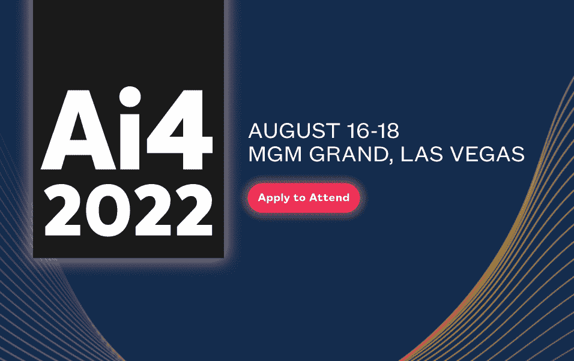
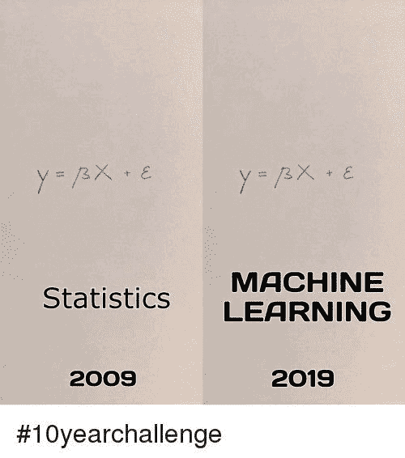
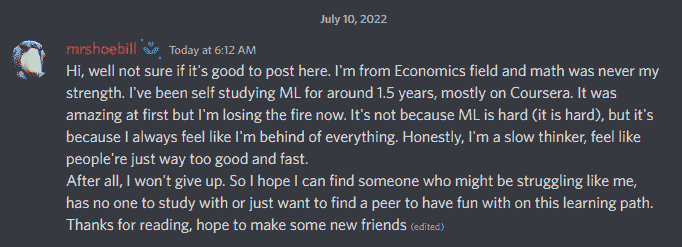
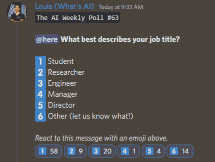

# 这份人工智能时事通讯是你所需要的| #3

> 原文：<https://pub.towardsai.net/this-ai-newsletter-is-all-you-need-3-fc5f4c249aad?source=collection_archive---------4----------------------->

 [## 订阅这份人工智能时事通讯是你所需要的→

### 我们本周的人工智能亮点是 DALL E mini 模型(现已更名为 craiyon ),该模型因其…

mailchi.mp](https://mailchi.mp/7006b426ea80/this-ai-newsletter-is-all-you-need-16523392?e=038ba1af63) 

# 这个星期在 AI 发生了什么

我们本周的人工智能亮点是 Meta AI 最近的一个出版物，“[没有语言落下](https://research.facebook.com/publications/no-language-left-behind)”(nllb 200)。这种新模型利用 Transformer 架构在 200 多种语言之间进行翻译，其中一些语言具有非常少的可用训练数据，具有最先进的性能。

是什么让这条新闻这么酷？首先，它是开源的，包括从论文、代码、训练方案、如何获得数据集和预训练模型的一切。其次，我们通常训练一个人工智能模型来翻译具有大量成对文本数据的文本，例如法语-英语翻译，以便该模型理解两种语言如何相互关联，以及如何从一种语言转换到另一种语言，反之亦然。这意味着该模型需要几乎每一个可能的句子和文本才能在现实世界中获得良好的结果和推广，这是昂贵的，复杂的，或者对许多语言来说根本不可能。

然后，传统模型执行从一种语言到另一种语言的单向翻译，每次我们想要添加新语言时都需要新的模型。NLLB 同时翻译 200 种语言的能力是它如此具有开创性的原因。

我们高度重视面向人工智能的开源工作，我们认为他们最近的开源努力，包括 NLLB，是 Meta AI 值得称赞的举措。

## 最热门新闻

1.  [这个人工智能模型预测你的工资有 87%的准确率！](https://venturebeat.com/2022/07/04/words-matter-ai-can-predict-salaries-based-on-the-text-of-online-job-postings/) Sarah H. Bana 最近在超过 100 万份网上招聘启事上训练了一个模型，以接近实时地评估职位的薪资相关特征。该模型在 87%的情况下准确预测了相关的工资。相比之下，仅使用招聘信息的职位名称和地理位置，准确预测的概率只有 69%。
2.  OpenAI 为机器人测试的 CLIP 神经网络展示了种族主义和性别歧视的刻板印象行为
    “人工智能运行的虚拟机器人在被要求挑选属于罪犯或家庭主妇的面孔时，其行为方式符合有毒的刻板印象。”这项研究的主要作者安德鲁·亨特说，人类面临着创造“一代种族主义和性别歧视机器人”的风险。
    这就是当你使用未经整理的互联网数据训练你的模型时所发生的事情:它将我们社会中存在的刻板印象的答案平均下来。*在时事通讯中劳伦的道德观点部分可以看到更多关于这个话题的内容！*
3.  谷歌推出了[情绪板搜索](https://experiments.withgoogle.com/mood-board-search)，这是一个新的 ML 驱动的研究工具，它使用[情绪板](https://en.wikipedia.org/wiki/Mood_board)作为对图片集的查询
    标题说明了一切，“使用情绪板作为搜索查询来探索图片集”！这是一个基于网络的工具，让你训练一个模型使用情绪板和机器学习来识别视觉概念。尝试一下，使用情绪板作为搜索查询来探索和分析图片集。[多了解，多尝试。](https://ai.googleblog.com/2022/07/enabling-creative-expression-with.html)

## 本周最有趣的报纸

1.  [没有语言掉队:缩放以人为中心的机器翻译](https://research.facebook.com/publications/no-language-left-behind/) GPT-3 等语言模型真的很酷。它们可以用来理解文本片段、总结它们、录制视频、创建文本到语音的应用程序等等，但它们都有一个共同的大问题:它们只能在英语中很好地工作。这种语言障碍伤害了数十亿愿意与他人分享和交流却不能的人。这种新模式使用基于 Transformer 的架构翻译 200 种语言。[了解更多。](/no-language-left-behind-2d05ab39f9b3)
2.  [真实场景的局部重新照明](https://arxiv.org/pdf/2207.02774.pdf) 他们引入了局部重新照明的任务，通过基于 GAN 的方法和基准 Lonoff 打开和关闭图像中可见的光源来改变场景的照片，基准 lon off 是在打开不同灯光组合的室内空间中拍摄的 306 幅精确对齐的图像的集合。
3.  [SNeRF:3D 场景的风格化神经隐式表示](https://arxiv.org/pdf/2207.02363.pdf) 给定用场景的多个视图训练的神经隐式场景表示，SNeRF 将 3D 场景风格化以匹配参考风格。

喜欢这些论文和新闻摘要吗？**！**

# *[来 Ai4 2022 和我们见面吧！](http://ws.towardsai.net/july-22-2-ai4)*

**

*申请参加活动，免费获得！如果你在八月的时候在拉斯维加斯，并且喜欢人工智能，为什么不加入我们呢？*

*[Ai4 2022](https://ai4.io/usa/) 是一项专注于商业领袖和数据从业者的活动，旨在促进负责任地采用人工智能和机器学习技术。*

*看一看所有的讲座，自己做决定，并告诉我们你是否要去！我们的社区负责人 Louis Bouchard 会很高兴亲自与您会面。*

**有兴趣成为“走向人工智能”的赞助商并在本新闻简报中出现吗？* [*在这里了解更多信息*](https://sponsors.towardsai.net/?_gl=1*16bok5s*_ga*Mzg4OTMxMDUzLjE2MzkxNDc2NzQ.*_ga_9D3HKKFV1Q*MTY1NjkzOTAwOC45Ny4wLjE2NTY5MzkwMDguNjA.) *或者联系*[*sponsors@towardsai.net*](mailto:sponsors@towardsai.net)*！**

# *一起学习人工智能社区部分！*

## *本周迷因！*

**

*解决 10 年的挑战。dimkiriakos#2286 分享的迷因。[加入对话](https://ws.towardsai.net/discord)与我们分享你的模因吧！*

## *来自 Discord 的特色社区帖子*

**

*我们想把事情弄清楚:事实上，这是对我们社区成员的完美介绍和理想简介！当然，我们也高度重视那些愿意加入社区、与我们交流、甚至帮助其他目前正在学习或实现人工智能模型、需要建议或帮助的人的专业人士、研究人员和教授。*

*我们有一个频道叫做" [#👨🎓自习小组](https://discord.com/channels/702624558536065165/784477688551178240)，是为了找一些人一起学习而创建的。同样，你不需要成为数学专家、编程专家或任何类型的专家。我们创建这个社区是为了让人们一起学习，因此有了“一起学习人工智能”这个名字，这仍然是我们的目标。除了对该领域感兴趣之外，没有加入和享受社区的要求，我们重视发展和加强我们社区的观点多样性。*

*所以，如果你对 AI 感兴趣，不管你的背景如何，都可以考虑[的加入，和我们所有人一起聊天](https://www.discord.gg/learnaitogether)！*

## *本周最佳人工智能投票！*

**

*通过回答[我们的每周不和谐投票](https://discord.com/channels/702624558536065165/833660976196354079)，让我们更好地了解我们的社区！我们很想看看你是否符合其中一个类别或担任任何其他角色。这将有助于我们直接为您提供更有价值的内容:)*

# *泰策展组*

## *本周文章*

*SiEBERT、RoBERTa 和 BERT:2022 年实施哪一个？这篇文章提供了对 SiEBERT、RoBERTa 和 BERT 的全面概述。作者通过概述每个版本的优点和用例，使读者很容易选择完美的模型。本文还用几个简单的要点介绍了 RoBERTa 的内部工作方式。*

*上周，我们发布了创纪录的 38 个新的人工智能博客，并欢迎 9 名新作家加入我们的平台。如果你有兴趣在《走向人工智能》发表文章，请[在这里注册](https://contribute.towardsai.net/)，如果你的博客符合我们的编辑政策和标准，我们将把它发表到我们的网络上。否则，我们将帮助您这样做。*

## *审计失败的地方:劳伦对 OpenAI 的剪辑偏差问题的伦理观点*

*OpenAI 于 2021 年 8 月对 CLIP 进行了[第一方审核。在第 2.1 节中，他们发表了一份免责声明，“这些实验并不全面。它们说明了源自类设计和其他偏见来源的潜在问题，旨在激发探究。”在处理 CLIP 的下游影响时，作者得出结论:“…向前迈出的一步是社区探索，以进一步表征 CLIP 等模型，并全面开发定性和定量评估，以评估这些模型的能力、偏差、误用可能性和其他部署关键特性。”](https://arxiv.org/pdf/2108.02818.pdf)*

*通常，内部审计的好处是在问题产生负面的现实影响之前抓住它们。然而，最近由 Andrew Hundt、William Agnew、Vicky Zeng、Severin Kacianka 和 Matthew Gombolay 进行的研究表明，这些影响实际上已经在主流应用程序中扎根，并造成了现实世界的伤害。除此之外，在第 5.1 节中，作者强调指出，旨在阻止这种危害的政策并没有像他们承诺的那样发挥作用，包括与 CLIP 有关联的几乎每个组织和大学的包容性声明和行为准则，他们的结论是这些政策过于模糊，无法发挥作用。*

*随着我们了解到审计本身还有很长的路要走，这一点变得很明显。算法正义联盟(Algorithmic Justice League)最近发表的一篇[论文](https://facctconference.org/static/pdfs_2022/facct22-126.pdf)证明了审计在许多方面严重不足，以及阻碍其改进的障碍，包括报告和跟踪现实世界伤害的难度以及审计成本。*

*鉴于这段短暂的历史，关于 CLIP 偏见的新闻一点也不令人震惊。如上所示，在将近一年的时间里，减少偏见的尝试每一步都失败了。尽管 OpenAI 的初衷是好的，但呼吁社区探索作为一种解决方案似乎太少太晚了，并且鉴于伤害已经发生了责任的延迟，我们认为应该通过增加私营和公共层面的企业问责制来解决这一问题。如果算法要继续塑造个人和集体的决策，我们必须采取更多的主动，在偏见悄悄到来之前减缓和阻止偏见的融入，并在偏见到来时有效地减轻它——用行动来支持言辞，以免它们因空洞的承诺而失去意义。我非常感谢专注于人工智能伦理和正义的团队正在做的工作，并感谢有机会支持这些问题的解决。*

## *工作机会*

*[资深机器学习科学家@ Atomwise(三藩市——美国)](http://ws.towardsai.net/july-22-2-job-1)*

*[高级 ML 工程师— Algolia AI @ Algolia(混合远程)](http://ws.towardsai.net/july-22-1-job-1)*

*[高级 ML 工程师—语义搜索@ Algolia(混合远程)](http://ws.towardsai.net/july-22-1-job-2)*

*[机器学习工程师@ Gather AI(远程—印度)](http://ws.towardsai.net/july-22-1-job-3)*

*[深度学习工程师(R & D —工程)@权重&偏差(远程)](http://ws.towardsai.net/july-22-1-job-4)*

**有兴趣分享这里的工作机会吗？联系***或在我们的* [*【招聘频道】上发布机会不和谐*](https://discord.gg/FjjshSMC) *！***