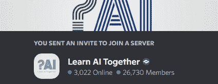
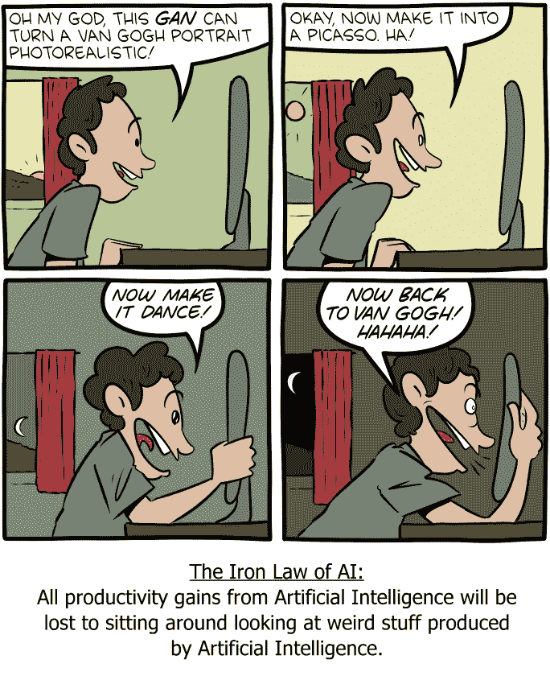
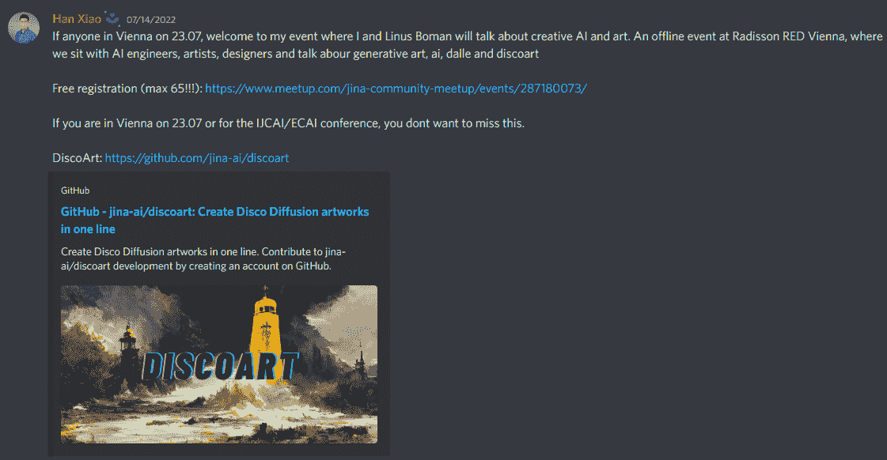
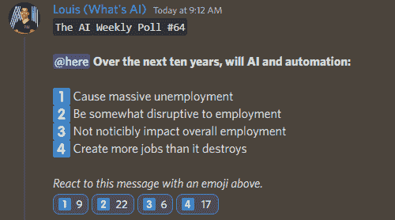

# 这份人工智能时事通讯是你所需要的#4

> 原文：<https://pub.towardsai.net/this-ai-newsletter-is-all-you-need-4-1bb26a3ff8c7?source=collection_archive---------1----------------------->

# 这个星期在 AI 发生了什么

机器学习国际会议(ICML) 2022 会议将于本周举行——您可以继续关注我们这边的几篇文章，这些文章涵盖了那里分享的最令人兴奋的新闻和研究，包括我们在本周的“本周论文”部分报道的“现场制作”。

ICML 是该领域的一个大型会议，许多突破都在那里发表。我们将分享会议的头文件。不幸的是，我们没有团队中的任何人在场。如果您希望我们在这些活动中派人参加，请告诉我们，以发布一篇回顾和“感觉如何”之类的文章，与那些可能有兴趣参加此类活动的人分享我们的亲身体验。

## 最热门新闻

1.  [PLEX:提高深度学习系统可靠性的框架](https://ai.googleblog.com/2022/07/towards-reliability-in-deep-learning.html) 谷歌推出了 PLEX，这是一个可靠的深度学习框架，作为一个关于模型能力的新视角；这包括许多针对压力测试模型可靠性的具体任务和数据集。他们还引入了 Plex，这是一组预先训练好的大型模型扩展，可以应用于许多不同的体系结构。
2.  [特斯拉的人工智能总监 Andrej Karpathy 在 5 年的自动驾驶汽车研究后离开公司](https://twitter.com/karpathy/status/1547332300186066944) 他指出，自 2017 年以来，自动驾驶已经从让特斯拉保持在车道上发展到在城市街道上导航。我很高兴看到谁将成为特斯拉的下一任人工智能总监，更令人兴奋的是看到 Andrej 接下来将做什么，因为他提到他希望“花更多的时间重新审视他对人工智能、开源和教育方面的技术工作的长期热情。”
3.  [“我在 Reddit 上发布了我的项目，收到了 9 份工作邀请”！一位 Reddit 用户分享了他的项目，并收到了 9 份正式工作邀请。这个故事的寓意是。从事个人项目并在线分享！这是学习和提高你的投资组合的最好方法！](https://www.reddit.com/r/cscareerquestions/comments/vxd8zs/i_posted_my_project_on_reddit_and_received_9_job/?utm_source=tldrnewsletter)

## 本周最有趣的报纸

1.  [百万像素头像:一次性百万像素神经头像](https://arxiv.org/pdf/2207.07621.pdf) 它们为动画人脸生成(神经头像)带来百万像素分辨率，专注于“交叉驾驶合成”任务:当驾驶图像的外观与动画源图像有实质性差异时。
2.  [ProDiff:用于高质量文本到语音转换的渐进快速扩散模型](https://arxiv.org/pdf/2207.06389.pdf) 是的，用于高质量文本到语音转换的扩散模型！ProDiff 通过直接预测干净数据来参数化去噪模型，以避免在加速采样时出现明显的质量下降，仅需要 2 次迭代来合成高保真梅尔光谱图。
3.  [制作场景:具有人类先验的基于场景的文本到图像生成](https://arxiv.org/pdf/2203.13131.pdf) “制作场景”:文本和基于草图的图像生成之间的奇妙融合。在[我们的文章](/produce-amazing-artworks-with-text-and-sketches-128715500b84)中了解更多！

> 喜欢这些论文和新闻摘要吗？[在你的收件箱里获得每日回顾](https://www.linkedin.com/newsletters/what-s-ai-daily-research-tl-dr-6935956459641876480/)！

# 感谢我们出色的社区为您带来这一期:

加入我们的[不和谐](https://ws.towardsai.net/discord)！[一起学习人工智能](https://ws.towardsai.net/discord)和走向人工智能[最近合作](https://towardsai.net/p/news/towards-ai-announces-acquisition-of-learn-ai-together-the-largest-ai-discord-community)建立一个参与、包容和互利的社区。此外，该社区将成为共享人工智能技能、知识和发展的平台，使学生、工程师、企业家、学者和其他人能够协同工作，使人工智能更容易为每个人所用。

> 有兴趣成为一个走向人工智能的赞助商，并在这一通讯的特色？[在此了解更多信息](https://sponsors.towardsai.net/?_gl=1*16bok5s*_ga*Mzg4OTMxMDUzLjE2MzkxNDc2NzQ.*_ga_9D3HKKFV1Q*MTY1NjkzOTAwOC45Ny4wLjE2NTY5MzkwMDguNjA.)或联系[sponsors@towardsai.net](mailto:sponsors@towardsai.net)！

# 一起学习人工智能社区部分！

## 本周迷因！

AI 的铁律。RobKnight#4276 分享的 Meme。加入对话，与我们分享你的迷因！

## 来自 Discord 的特色社区帖子

我们很高兴看到您在我们的社区中分享您的活动，并帮助传播世界！如果你这周在维也纳，去看看吧，看起来超级有趣！

[用一条线创作出引人注目的迪斯科扩散艺术品。](https://github.com/jina-ai/discoart)

[了解活动详情。](https://www.meetup.com/jina-community-meetup/events/287180073/)

## 本周最佳人工智能投票！

让我们知道你的想法:[加入关于不和](https://discord.com/channels/702624558536065165/833660976196354079)的讨论！

# 泰策展组

## 本周文章

[**PySyft 是一个私有深度学习的框架:该框架在基于 PyTorch 和 TensorFlow 构建的模型中使用了差分隐私。**](/pysyft-is-a-framework-for-private-deep-learning-f5420b01332f)

本文讨论了隐私在深度学习应用中的重要性。PySyft 开源框架解决了向更分布式架构迁移的困难，这反过来又保证了深度学习模型中的有效隐私保护。作者在解释 PySyft 和提出深度学习应用中的隐私问题方面做了出色的工作。

本周我们发表了 28 篇新文章，并欢迎 5 位新作家加入《走向人工智能》。如果你有兴趣在《走向人工智能》发表文章，请[在这里注册](https://contribute.towardsai.net/)，如果你的博客符合我们的编辑政策和标准，我们将把它发表到我们的网络上。

**劳伦对 LaMDA 感知潜力的伦理观点**

我可能错过了围绕谷歌 LaMDA 的新闻和工程师布雷克·莱莫因对其感知的断言的对话高峰，但仍然有很多要讨论的！

我对这个消息的一个直觉反应是对感知图灵测试的需求激增。几年前，我主要通过与我的哲学顾问一起研究道德图灵测试的形式，了解了人工智能伦理学，并调查了大量关于我们需要做什么来适应图灵测试以确定人工智能中的道德代理的伦理学工作。我想起了卡斯滕·韦伯(karst en Weber)2013 年题为 [*的论文中的一句话，遇到一个自主的人工智能体是什么感觉？*](https://link.springer.com/article/10.1007/s00146-013-0453-3) :

*“……人类和自主人工智能体的成功交互更多地取决于人类赋予智能体哪些特征，而不是智能体是否真的具有那些特征。”*

基于这个定义，LaMDA 创造了一个与人类高度成功的互动，被认为是有感情的。这提醒我们，由于神经网络的仿生，人工智能几乎天生就是拟人化的，而我们的智能标准几乎总是人类。根据我们被他们愚弄的能力来决定智力(即原始的图灵测试)不是一个决定感知的模型。创建有助于满足这一需求的模型还有很多工作要做。

在这个令人兴奋的讨论中，请记住，我们不能再忽视人工智能的感知归属，无论它是否正确。这些对话可能会令人不安，但一点同情心、耐心和尽职调查会让我们走得更远。

[**加入学习 AI 社区**](https://community.towardsai.net/)

## 本周特色工作

[资深机器学习科学家@ Atomwise(三藩市——美国)](http://ws.towardsai.net/july-22-2-job-1)

[高级 ML 工程师— Algolia AI @ Algolia(混合远程)](http://ws.towardsai.net/july-22-1-job-1)

[高级 ML 工程师—语义搜索@ Algolia(混合远程)](http://ws.towardsai.net/july-22-1-job-2)

[机器学习工程师@ Gather AI(远程—印度)](http://ws.towardsai.net/july-22-1-job-3)

[深度学习工程师(R & D —工程)@权重&偏差(远程)](http://ws.towardsai.net/july-22-1-job-4)

[解决方案架构师— ML 专家，MLOps，DevOps @ Qwak(纽约市，纽约和以色列特拉维夫)](https://www.qwak.com/careers)

> 有兴趣分享这里的工作机会吗？联系[sponsors@towardsai.net](mailto:sponsors@towardsai.net)或在我们的[#招聘频道发布不和谐的机会](https://discord.gg/FjjshSMC)！