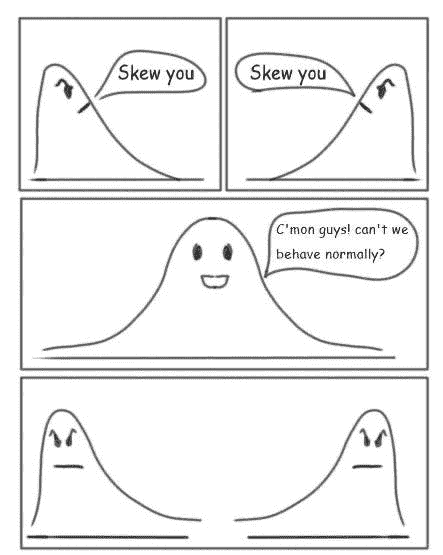

# 这份人工智能时事通讯是你所需要的#5

> 原文：<https://pub.towardsai.net/this-ai-newsletter-is-all-you-need-5-331ec192cc12?source=collection_archive---------1----------------------->

 [## 订阅↓ |这份人工智能简讯是你需要的全部| #1

### 我们本周的人工智能亮点是 DALL E mini 模型(现已更名为 craiyon ),该模型因其…

mailchi.mp](https://mailchi.mp/1a9d5211d8df/this-ai-newsletter-is-all-you-need-16528584) 

# 这个星期在 AI 发生了什么

大新闻:DALL-E 2 现在处于测试阶段！OpenAI 刚刚宣布向 100 万人发布 DALL-E 2，比 pre-beta 模型多十倍。他们成功地降低了让任何人将他们的图像生成模型作为产品使用的风险。你不能再给几代人发垃圾邮件来免费获取有趣的迷因了——和测试版之前一样多的免费迷因现在要花将近 300 美元。

在过去的一周里，我们有一些非常棒的出版物，如《女娲》、《BigColor》和《Mega Portraits 》,它们都以奇妙的方法和结果推进了图像生成领域——还有 ICML 2022 活动，它发布了值得一读的[优秀论文](https://icml.cc/virtual/2022/awards_detail)。

最后但同样重要的是，听听[本期播客](https://theartistsofdatascience.fireside.fm/)，由我们的[社区](https://ws.towardsai.net/discord)成员之一主持！

## 最热门新闻

1.  OpenAI 正在向 100 万人出售 DALL-E，如果你幸运的话，你是 DALL-E 2 自 4 月份推出以来 10 万人中的一员。本周，OpenAI 将该模型开放到他们将人工智能转化为付费服务的 10 倍。为迷因而滥发图片的时代已经过去了——你现在需要为此付出代价。
2.  [world strat 数据集](https://paperswithcode.com/paper/open-high-resolution-satellite-imagery-the) 这是一个开放的高分辨率卫星影像数据集，收集了近 10，000 平方公里的独特位置。还提供了一个附带的开源 Python 包来重建和扩展数据集，并应用到超分辨率。
3.  [PLEX:提高深度学习系统可靠性的框架](https://ai.googleblog.com/2022/07/towards-reliability-in-deep-learning.html) 谷歌推出了 PLEX，这是一个可靠的深度学习框架，作为对模型能力的新视角；这包括许多针对压力测试模型可靠性的具体任务和数据集。他们还引入了 Plex，这是一组预先训练好的大型模型扩展，可以应用于许多不同的体系结构。

## 本周最有趣的报纸

1.  [女娲-Infinity:用于无限视觉合成的自回归超自回归生成](https://arxiv.org/pdf/2207.09814.pdf) 女娲-Infinity:用于无限视觉合成的生成模型，即，任何分辨率的高清晰度、图像合成或从图像的“无限”视频生成。
    [代号](https://github.com/microsoft/NUWA)
2.  [BigColor:使用自然图像的生成颜色先验的彩色化](https://arxiv.org/pdf/2207.09685.pdf) BigColor:一种新的彩色化方法，通过在给定图像的空间结构的情况下，在聚焦于颜色合成之前学习生成颜色，为具有复杂结构的各种野外图像提供生动的彩色化。
3.  [百万像素头像:一次性百万像素神经头像](https://arxiv.org/pdf/2207.07621.pdf) 它们为动画人脸生成(神经头像)带来百万像素分辨率，专注于“交叉驾驶合成”任务:当驾驶图像的外观与动画源图像有实质性差异时。

*享受这些论文和新闻摘要？* [*在你的收件箱里获取每日回顾*](https://www.linkedin.com/newsletters/what-s-ai-daily-research-tl-dr-6935956459641876480/) *！*

# 寻找实践经验和一个很酷的项目？

为什么不加入[聚合智力的天气预报 ML 工作组](http://ws.towardsai.net/july-22-3-ai)！从 7 月 30 日开始！

我们在 aggregate intellect 的朋友将为您提供对两种最先进的天气预报模型背后的理论的深入理解:NVIDIA 的 FourCastNet 和 DeepMind 的 NowCasting，并了解如何使用 NVIDIA Modulus 平台将基于物理学的知识纳入 ML 预测模型。这是一个非常酷的项目，我们相信它会让你们很多人受益。

**为什么加入？**

*   你会沉浸在那个社区中，和一些很酷的新朋友一起出去。
*   学习并获得预测的实践经验
*   为将被许多人看到/使用的存储库做出贡献
*   可能会发表一篇关于该主题的文章

[了解更多信息并免费注册](http://ws.towardsai.net/july-22-3-ai)

# 一起学习人工智能社区部分！

## 本周迷因！

偏斜和正态分布。由我们的一位出色的主持人 Ian Yu 分享的迷因。加入对话，和我们分享你的迷因吧！

## 来自 Discord 的特色社区帖子

我们的[社区](https://ws.towardsai.net/discord)成员之一有一个播客:“数据科学的艺术家”。

正如播客的主持人 Harpreet Sahota 所说，“这个播客的目的很明确:让你成为一名全面的数据科学家。把你从野心家变成实践者，再变成领导者。一位数据科学家，他的思维超越了数据的技术层面，了解您在我们的现代世界中发挥的作用。”

如果听起来有趣，你可以在这里听他的播客。

## 本周最佳人工智能投票！

你怎么想呢?[加入关于不和的讨论](https://discord.com/channels/702624558536065165/833660976196354079)。

# 泰策展组

## 本周文章

[模型可解释性——SHAP vs .莱姆 vs .置换特征重要性](/model-explainability-shap-vs-lime-vs-permutation-feature-importance-98484efba066):理解我们的机器学习模型至关重要，而许多工程师却做不到这一点。对复杂模型的更多了解使我们能够理解模型如何以及为什么做出选择，以及哪些特征对得出结论至关重要。本文涵盖了如何使用事后、局部和模型中立的策略来理解模型。有像 Shapley 加法解释，局部可解释的模型不可知的解释，和置换特征重要性的主题的广泛报道。

本周在《走向人工智能》上，我们发表了 29 篇新文章，并欢迎四位新作家加入我们的平台。如果你有兴趣在《走向人工智能》上为我们写作，请在这里注册，如果你的博客符合我们的编辑政策和标准，我们将在我们的网络上发布。

## **劳伦对 PLEX 的伦理观点**

不确定性似乎是我们不断试图通过技术来减少的东西，人工智能尤其如此。这种消除众所周知的令人不舒服的灰色区域的想法对许多模型来说都是令人向往的，因为期望和提高准确性是我们取得如此进步和卸下一些决策责任的方式。但并不是所有的事情都可以轻易归类，你很难在没有不确定性的情况下度过一生。现在，谷歌人工智能的 PLEX 框架反映出可靠性不仅仅是高精度。通过提供对不确定性的选择，它提供了一种额外的真实感和对存在的有时不可改变的方面的联系。

近年来的科技文献对人工智能的信任和可信度进行了假设(如珍妮特·m·温提出的这种[结构)。这些是从 21 世纪初的计算框架中的信任改编而来的，大多数结论是可靠性是建立信任的一个重要方面。这可能有助于解释为了获得更高的信任而向可靠性的技术转移。](https://cacm.acm.org/magazines/2021/10/255716-trustworthy-ai/fulltext)

在这些特定于人工智能可信度的假设中，一些人认为道德是信任的一个组成部分。我倾向于支持这样的观点，信任是道德的一部分，主流应用程序中的可信任度将建立在自身之上，以包含更大更难的概念，如道德责任。

## 本周特色工作

[**资深机器学习科学家@ Atomwise** (三藩市——美国)](http://ws.towardsai.net/july-22-2-job-1)

[**高级 ML 工程师— Algolia AI @ Algolia** (混合动力遥控)](http://ws.towardsai.net/july-22-1-job-1)

[**高级 ML 工程师—语义搜索@ Algolia** (混合远程)](http://ws.towardsai.net/july-22-1-job-2)

[**机器学习工程师@ Gather AI** (远程—印度)](http://ws.towardsai.net/july-22-1-job-3)

[**深度学习工程师(R & D —工程)@权重&偏差**(远程)](http://ws.towardsai.net/july-22-1-job-4)

[**高级计算机视觉工程师@ Neurolabs** (伦敦&远程)](http://ws.towardsai.net/july-22-3-job-1)

[**首席机器学习工程师| AI Product @ Jasper.ai** (远程)](http://ws.towardsai.net/july-22-3-job-2)

[**机器学习工程师@跑道**(远程)](http://ws.towardsai.net/july-22-3-job-3)

有兴趣在这里分享工作机会吗？联系**或在我们的* [*【不和谐招聘频道】*](https://discord.gg/FjjshSMC) *上发布机会！**