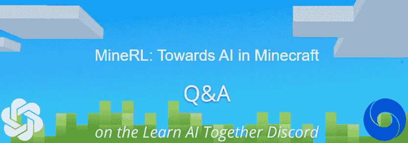
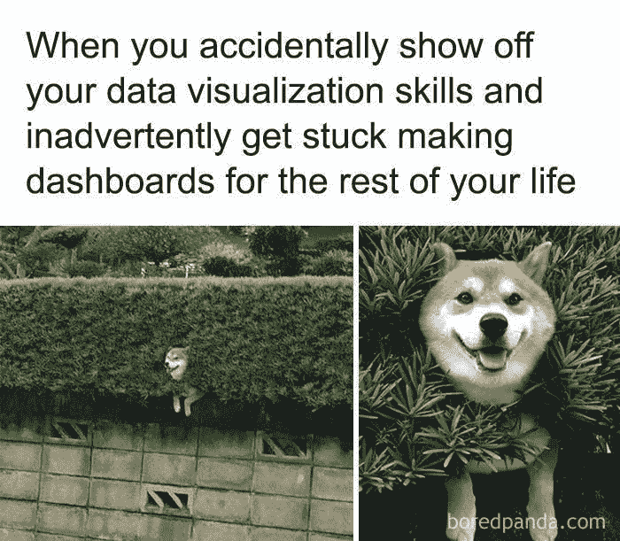
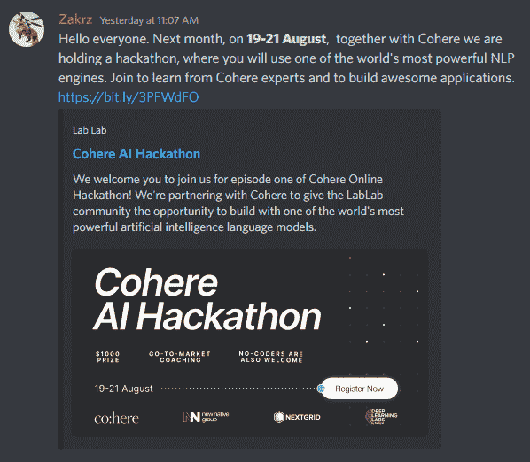

# 这是你所需要的人工智能时事通讯#6

> 原文：<https://pub.towardsai.net/this-ai-newsletter-is-all-you-need-6-bd849b7545d7?source=collection_archive---------2----------------------->

我们很高兴地宣布，我们将与我们[几周前分享的](https://towardsai.net/p/newsletter/this-ai-newsletter-is-all-you-need-2) [MineRL 竞赛](https://minerl.io/)合作，并在服务器上与参与 MineRL 竞赛的组织者之一/deep mind 研究人员/Open AI VPG 论文团队一起主持 a [Q & A。](https://discord.com/channels/702624558536065165/1003686803401867294)

我们创建了[不和谐频道](https://discord.com/channels/702624558536065165/1003686803401867294)供你向在 DeepMind/OpenAI 工作的人提出任何问题，我们将在下一次播客和/或采访中选择最有趣的问题。因此，如果你对 OpenAI 或 DeepMind 感兴趣，但不太了解在那里工作甚至被雇用是什么感觉，[加入对话，提出你的问题](https://discord.com/channels/702624558536065165/1003686803401867294)！

# 这个星期在 AI 发生了什么

本周有大量令人兴奋的消息——但最突出的是 DeepMind 的新博客文章，他们宣布他们的 AlphaFold 2 模型预测了几乎所有科学已知蛋白质的结构。是的，你没看错。DeepMind 将其蛋白质数据库扩大了 200 多倍，预测结构超过 2 亿个，其他科学家将使用这些结构来更好地了解特定蛋白质、它们的功能和工作方式，加速全球科学研究和发现，从而实现进一步突破。

这对于科学界来说是一件大事，因为“超过 50 万名研究人员访问了 AlphaFold，并将其用于加速从塑料污染到抗生素耐药性等重要现实问题的进展”，现在该模型的第二个版本将这一知识库扩大了 200 倍。

## 最热门新闻

1.  [DeepMind 预测了几乎所有科学已知的已编目蛋白质的结构](https://www.deepmind.com/blog/alphafold-reveals-the-structure-of-the-protein-universe) DeepMind 预测了几乎所有科学已知的已编目蛋白质的结构。它将 AlphaFold 数据库扩展 200 倍以上——从近 100 万个结构扩展到超过 2 亿个结构。
2.  [DeepSpeed Compression:一个用于极端压缩和零成本量化的可组合库](https://github.com/microsoft/DeepSpeed) 微软研究院开源 DeepSpeed Compression，一个用于深度学习模型中压缩和系统优化的框架，[了解更多信息请点击](https://www.microsoft.com/en-us/research/blog/deepspeed-compression-a-composable-library-for-extreme-compression-and-zero-cost-quantization)。
3.  [在移动端构建 AI 模型？这可能是给你的！](https://pytorch.org/blog/introducing-the-playtorch-app) PyTorch 开源了 [PlayTorch 应用](https://pytorch.org/blog/introducing-the-playtorch-app)来简化移动 AI 体验的开发。

## 本周最有趣的报纸

1.  [将可视化乐高手册转换为机器可执行计划](https://arxiv.org/pdf/2207.12572.pdf) 一种新颖的基于学习的框架，即手动到可执行计划网络(MEPNet)，它从一系列手动图像中重建组装步骤，采用乐高手册并创建可执行的机器可执行计划来构建目标形状(见上图)。
2.  [音频驱动的神经手势视频运动图重现](https://arxiv.org/abs/2207.11524) 一种重现高质量视频的方法，其手势与来自视频&音频源的目标语音音频相匹配，通过新颖的视频运动图对剪辑之间的有效过渡进行编码，从参考视频中拆分和重新组装剪辑。
3.  [全景场景图生成](https://arxiv.org/pdf/2207.11247.pdf) 他们“引入了全景场景图生成(PSG)，这是一个新的问题任务，需要模型基于全景分割而不是刚性边界框来生成更全面的场景图表示(见上图)，”他们说这导致了几个阻碍该领域进展的问题。
    他们创建了一个高质量的 PSG 数据集，包含来自 COCO 和 Visual Genome 的 49k 个注释良好的重叠图像，供社区跟踪其进展。[查看代码](https://github.com/Jingkang50/OpenPSG)

喜欢这些论文和新闻摘要吗？ [*在你的收件箱里获取每日回顾*](https://www.linkedin.com/newsletters/what-s-ai-daily-research-tl-dr-6935956459641876480/) *！*

# 一起学习人工智能社区部分！

## 本周迷因！

再一次，一个迷因分享了我们的一个神奇的主持人，伊恩余。[加入对话](https://ws.towardsai.net/discord)并与我们分享你的迷因！

## 来自 Discord 的特色社区帖子

另一项活动是由社区成员组织的！[由@Zakrz#2739](https://discord.com/channels/702624558536065165/730837457997660240/1001868549016526868) 分享，Cohere AI Hackathon 有研讨会、主题演讲和指导会议，旨在建立世界上最强大的人工智能语言模型之一。

[参加 8 月 19 日至 8 月 21 日的活动。](https://lablab.ai/event/cohere-ai-hackathon-generate?utm_medium=28&utm_source=Discord&utm_campaign=COHERE1&utm_term=Hackathon)

## 本周最佳人工智能投票！

你怎么想呢?[加入关于不和](https://discord.com/channels/702624558536065165/833660976196354079)的讨论。

# 泰策展组

## 本周文章

[**数据科学精要—多重共线性**](/data-science-essentials-multicollinearity-5ab8a0629a65) **:** 本文对多重共线性进行解释。多重共线性可能看起来不像是最重要的主题，但对于机器学习从业者来说，这是一个重要的普遍概念。由于两个或多个独立变量之间的高度相关性，ML 模型找到对预测具有统计显著性的独立变量的能力被削弱。作者对多重共线性的类型、多重共线性的原因以及多重共线性的检测和管理提供了最直观的解释。

本周我们发表了 24 篇新文章，并欢迎了六位新作家加入我们的平台。如果你有兴趣在《走向人工智能》为我们写作，请在这里注册，如果你的博客符合我们的编辑政策和标准，我们将把它发布到我们的网络上。[https://contribute.towardsai.net/](https://contribute.towardsai.net/)

## **劳伦对 deep mind alpha fold 2 资料片的伦理观点**

多么令人难以置信的进步！AlphaFold 2 已经对几乎所有已知蛋白质的结构进行了分类。这个新发布的数据集对任何人开放，并将很快通过谷歌云公共数据集完全批量下载。

这是令人难以置信的令人兴奋的，其伦理含义是广泛而多样的。当然，在减少我们今天和未来面临的一些最大痛苦原因方面，存在着经证实的效果和巨大潜力，例如了解和治疗独特的遗传疾病，解决生态系统健康和生物多样性丧失问题，以及改善粮食供应。虽然这既值得庆祝，也值得乐观，但也存在滥用的可能性，应予以考虑和缓解，例如利用数据库制造有针对性的生物武器。DeepMind 将不得不决定这种缓解看起来是什么样的，但迄今为止，他们的合作伙伴关系和各自的进步都显示出了积极成果的趋势。

我想强调一下 DeepMind 在发布会上的博文结论中的一段话:

“正如数学是物理学的完美描述语言一样，我们相信人工智能可能会成为应对生物学动态复杂性的正确技术。AlphaFold 是这方面的第一个重要证据，也是未来更多证据的标志。”

这个类比强调了这些预测并不是对生命秘密的完美翻译，而是一个非常有用的工具。它不仅提供了清晰度，而且为欣赏和改善信息所基于的生活提供了巨大的机会。这种技术肯定会带来希望！

## 工作机会

[**资深数据科学家@ Storytel** (远在欧洲)](http://ws.towardsai.net/august-22-1-job-1)

**机器学习运营工程师** [**@ Storytel** (远在欧洲)](http://ws.towardsai.net/august-22-1-job-2)

**高级数据工程师** [**@ Storytel** (远在欧洲)](http://ws.towardsai.net/august-22-1-job-3)

[**高级计算机视觉工程师@ Neurolabs** (伦敦&远程)](http://ws.towardsai.net/july-22-3-job-1)

[**首席机器学习工程师| AI Product @ Jasper.ai** (远程)](http://ws.towardsai.net/july-22-3-job-2)

[**机器学习工程师@跑道**(远程)](http://ws.towardsai.net/july-22-3-job-3)

有兴趣分享这里的工作机会吗？联系**或者在我们的*[*#招聘频道上发布机会不和谐*](https://discord.gg/FjjshSMC) *！**