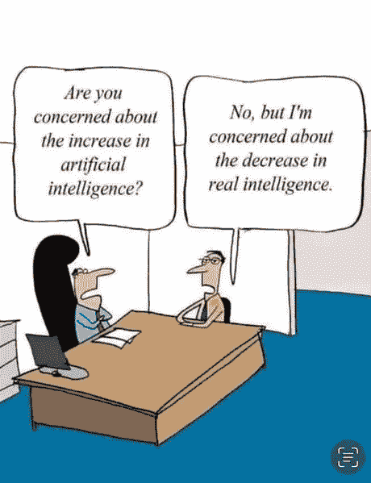
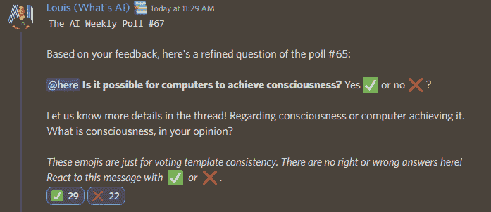

# 这份人工智能时事通讯是你所需要的#7

> 原文：<https://pub.towardsai.net/this-ai-newsletter-is-all-you-need-7-af749790e33b?source=collection_archive---------1----------------------->

 [## 订阅↓这份 AI 时事通讯就是你需要的全部| #1

### 我们本周的人工智能亮点是 DALL E mini 模型(现已更名为 craiyon ),该模型因其…

mailchi.mp](https://mailchi.mp/8353bab846e6/this-ai-newsletter-is-all-you-need-16532072) 

# 这个星期在 AI 发生了什么

本周的时事通讯迭代都是关于人工智能如何被用来帮助社会的。如你所知，人工智能有很多很多可能的用例，而且每天都有更多的用例被发现。幸运的是，许多用例有助于推进医学或气候科学等重要领域的研究，从而提高我们的生活质量。上周，DeepMind 宣布，他们预测了几乎所有科学已知的编目蛋白质的结构。这是什么意思？研究人员已经可以尝试新的机会并使用 AlphaFold (DeepMind 的模型和数据库)推进他们在重要问题上的工作，包括可持续性、粮食不安全和被忽视的疾病。这种对高影响的关注变得越来越普遍，因为一种称为 ProtGPT2 的新模型现在能够设计出能够稳定折叠的新蛋白质。这一领域的研究不再是只有大的、资金雄厚的组织才能进入的了！这种蛋白质折叠的进展主要得益于蛋白质和语言的相似性。正如他们提到的，“自然语言和蛋白质在结构上其实是相似的。氨基酸以多种组合方式排列自己，形成在生物体内具有特定功能的结构——类似于单词以不同组合方式组成句子，表达某些事实。”

那么这个故事的寓意是什么呢？不要想太多你的研究领域，继续关注 NLP 模型，因为它可以推广到其他重要领域！；)

别忘了，如果你对[mineral 竞赛](https://minerl.io/)或 OpenAI/DeepMind 感兴趣，但不太了解在那里工作是什么样子，[加入我们的对话，在我们的 discord 频道提出你的问题](https://discord.com/channels/702624558536065165/1003686803401867294)！

## 最热门新闻

1.  [DeepMind 预测了几乎所有科学已知的已编目蛋白质的结构](https://www.deepmind.com/blog/alphafold-reveals-the-structure-of-the-protein-universe?utm_campaign=Your%20Daily%20AI%20Research%20tl%3Bdr&utm_medium=email&utm_source=Revue%20newsletter) DeepMind 预测了几乎所有科学已知的已编目蛋白质的结构。它将 AlphaFold 数据库扩展 200 倍以上——从近 100 万个结构扩展到超过 2 亿个结构。
2.  [人工智能使设计新型蛋白质成为可能](https://phys.org/news/2022-08-proteins-natural-language-artificial-intelligence.html?utm_campaign=Your%20Daily%20AI%20Research%20tl%3Bdr&utm_medium=email&utm_source=Revue%20newsletter) 人工智能(AI)为设计量身定制的蛋白质创造了新的可能性，以解决从医学到生态等各种问题。ProtGPT2 模型设计了能够稳定折叠的新蛋白质，并可以在更大的分子背景下接管定义的功能。
3.  [多亏了他们，Louis 的视频在 PetaPixel 和一些其他新闻网站上出现了！
    在最大的图片新闻网站 PetaPixal 上进行专题报道。阅读更多关于朝的人工智能。](https://petapixel.com/2022/07/28/gfpgan-is-a-new-free-ai-tool-that-can-fix-most-old-photos-instantly/?utm_campaign=Your%20Daily%20AI%20Research%20tl%3Bdr&utm_medium=email&utm_source=Revue%20newsletter)

## 本周最有趣的报纸

1.  [生成艺术内容的快速文本驱动方法](https://arxiv.org/pdf/2208.01748.pdf?utm_campaign=Your%20Daily%20AI%20Research%20tl%3Bdr&utm_medium=email&utm_source=Revue%20newsletter) 是的，另一个图像生成模型！如上图所示，图像(a)可以根据用户的要求用文本提示、样式图像(b)和、或样式参数的组合进行风格化。
2.  [原始图像突发的高动态范围和超分辨率](https://arxiv.org/pdf/2207.14671.pdf?utm_campaign=Your%20Daily%20AI%20Research%20tl%3Bdr&utm_medium=email&utm_source=Revue%20newsletter) 本文介绍了第一种从具有曝光包围的手持相机(手机)捕获的原始摄影突发重建高分辨率、高动态范围彩色图像的方法。
3.  [从单个 GAN 图像生成具有可控表情的 3D 卡通人脸](https://arxiv.org/pdf/2207.14425.pdf) 从 2D 人脸图像到使用单个 GAN 生成的人脸图像且没有 3D 注释的 3D 卡通风格的化身。

*享受这些论文和新闻摘要？* [*在你的收件箱里获得每日回顾*](https://www.linkedin.com/newsletters/what-s-ai-daily-research-tl-dr-6935956459641876480/) *！*

# 一起学习人工智能社区部分！

## 本周迷因！

0wnlife#8511 分享的迷因。[加入对话](https://ws.towardsai.net/discord)并与我们分享你的迷因！

## 来自 Discord 的特色社区帖子

该社区的一名成员孙铁麟开设了一个 YouTube 频道，在那里他用短片解释与人工智能相关的话题。如果你喜欢快速的信息密集型视频，看看他的频道，支持这个社区的一个成员，给他竖起大拇指并订阅！

看看他解释[60 秒](https://youtu.be/qa-l2G-qrYo)ResNets 的视频，让他知道你对他的视频的看法。当你开始一个 YouTube 频道、博客或类似的冒险时，很难得到反馈，如果你们中的一些人点击他的视频并给出诚实的反馈，我们将不胜感激。:)

## 本周最佳人工智能投票！

[加入关于不和的讨论](https://discord.com/channels/702624558536065165/833660976196354079)。

# 泰策展组

## 本周文章

[**如何验证线性回归的假设**](/how-to-verify-the-assumptions-of-linear-regression-54ba4d17c231) **:** 线性回归是 ML 入门最基本的途径，也是经常被低估的。每篇文章都讨论了如何处理线性回归，以及通过坚持一些基本的线性回归假设来克服过度拟合而不是防止过度拟合的方法。本文讨论了鲜为人知和被低估的线性回归假设，如何检查它们，以及坚持它们的几种方法。

如果你有兴趣在《走向人工智能》为我们写作，请在这里注册，如果你的博客符合我们的编辑政策和标准，我们将把它发布到我们的网络上。[https://contribute.towardsai.net/](https://contribute.towardsai.net/)

## **劳伦将协作作为创新工具的道德观点**

为了配合这一期关于用人工智能改善社会的重点，我想稍微偏离一下思路，以强调协作如何为突破性的跨学科工作提供基础。社会的许多进步都是复杂问题和新解决方案合作的结果，例如，独特的遗传条件和用人工智能工具开发的靶向药物。在人工智能背景下，人工智能伦理是这一点的先驱:人工智能提出的复杂问题，如人工智能造成的死亡的道德责任或个人信息应该如何使用和处理，都得到了一种新的伦理解决方案，以提供巨大的社会效益。

这种优势为更多的合作和进步奠定了基础，而我们的合作能力以及思维和工作方式的多样化使这一切成为可能。人工智能伦理有助于确保人工智能的发展惠及每个人。最好的方法是继续扩展我们对其他学科的理解，这样我们就可以通过团队合作来解决问题，因为没有人知道所有的事情。所以不要害怕走出你的舒适区——这是我们取得巨大进步的方式！

## 工作机会

[**高级计算机视觉工程师@ Neurolabs** (伦敦&远程)](http://ws.towardsai.net/july-22-3-job-1)

[首席机器学习工程师| AI Product @ Jasper.ai (远程)](http://ws.towardsai.net/july-22-3-job-2)

[**机器学习工程师@ Runway** (远程)](http://ws.towardsai.net/july-22-3-job-3)

[**高级 ML 工程师— Algolia AI @ Algolia** (混合遥控)](http://ws.towardsai.net/july-22-1-job-1)

[**高级 ML 工程师—语义搜索@ Algolia** (混合远程)](http://ws.towardsai.net/july-22-1-job-2)

有兴趣在这里分享工作机会吗？联系【sponsors@towardsai.net】**或在我们的*[*#招聘频道上发布机会不和谐*](https://discord.gg/FjjshSMC) *！**