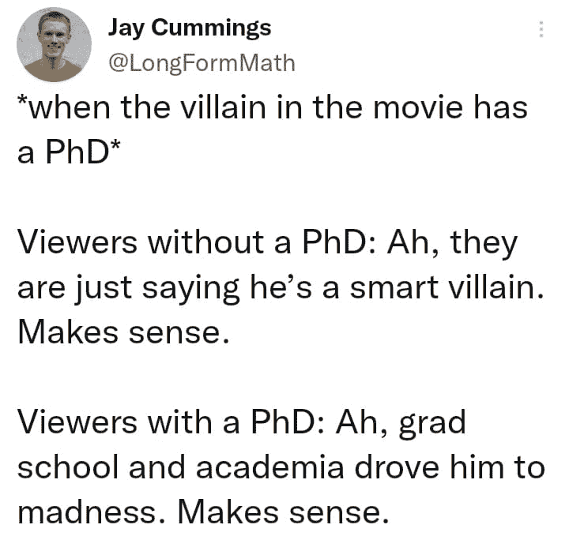

# 这份人工智能时事通讯是你所需要的#8

> 原文：<https://pub.towardsai.net/this-ai-newsletter-is-all-you-need-8-1d3c28968b9f?source=collection_archive---------4----------------------->

# 这个星期在 AI 发生了什么

本周的亮点无疑是 Meta 的新聊天机器人:BlenderBot 3。美国的每个人都可以和 BlenderBot 3 聊天，以收集对其功能的反馈。

看起来“ [Meta 的新 AI 聊天机器人无法停止抨击脸书](https://www.theguardian.com/technology/2022/aug/09/blenderbot-meta-chatbot-facebook)，给出了一些令人捧腹和意想不到的答案。该机器人有一些非常有趣的答案抨击自己的公司，正如他们在文章中明确表示的那样:“如果你担心人工智能变得太聪明，与 Meta 的 AI 聊天机器人交谈可能会让你感觉更好。”事实上，即使 BlenderBot 3 将通过一项非常特殊的图灵测试，并被一些人归类为“智能”，它仍然是一台从数据中进行插值(而不是像人类一样进行外推)的机器[。从互联网上的人类讨论中收集的数据，包括我们的偏见，以及一些最糟糕的偏见，因为匿名的趋势带来了一些人最糟糕的一面。](https://youtu.be/86ib0sfdFtw)

这只是一个例子。要提高机器内部的“智能”，还需要做很多工作，包括如果我们想让这些算法成为“泛化器”，甚至更好的外推机器，就要对我们训练这些算法的方式进行重大改变。这将意味着他们不再局限于训练数据，可以像人类一样联系概念，进行猜测和创新。然而，这些最近基于机器学习的算法对于我们优化它们的精确和明确定义的任务来说非常强大。尽管如此，当试图将它们用于更复杂的任务，如模拟人类讨论时，这样的失败案例还是会发生。

## 最热门新闻

1.  Meta 刚刚发布了一个新的聊天机器人，它正在抨击它的主人！Meta 的最新聊天机器人 BlenderBot 3 可供美国的每个人聊天，以收集对其功能的反馈。如果你不像我一样在美国，尝试一下吧
2.  [稳定扩散的 Github 现已公开！](https://github.com/CompVis/stable-diffusion) 下面#2 中描述的用于稳定扩散的 GitHub 回购现已公开，其中包含预先训练的权重和您需要的一切！
3.  [NVIDIA Instant NeRF 在 SIGGRAPH 赢得最佳论文，在数万次下载中激发创意浪潮](https://blogs.nvidia.com/blog/2022/08/05/instant-nerf-creators-siggraph/) 了解更多信息，请阅读[我们的文章](/photos-to-3d-scenes-in-milliseconds-a247cb2e890e)或[阅读论文](https://nvlabs.github.io/instant-ngp/assets/mueller2022instant.pdf)。一句话:NVIDIA 在毫秒内将照片变成 3D 场景。

## 本周最有趣的报纸

1.  [VoLux-GAN:一个带有 HDRI 重光照的 3D 人脸合成生成模型](https://arxiv.org/pdf/2201.04873.pdf) 一个带有可信重光照的 3D 人脸合成生成框架。
2.  [采用潜在扩散模型的高分辨率图像合成](https://arxiv.org/pdf/2112.10752.pdf) 一种潜在的文本到图像扩散模型。类似于[谷歌的 Imagen](https://arxiv.org/abs/2205.11487) ，这个模型使用一个冻结的 CLIP ViT-L/14 文本编码器来根据文本提示调整模型。
3.  [deepfacevideration:基于草图的人脸视频深度编辑](https://dl.acm.org/doi/pdf/10.1145/3528223.3530056) 一种新颖的基于草图的人脸高质量视频编辑框架，利用 StyleGAN3。

*享受这些论文和新闻摘要？* [*在你的收件箱里获得每日回顾*](https://www.linkedin.com/newsletters/what-s-ai-daily-research-tl-dr-6935956459641876480/) *！*

# 一起学习人工智能社区部分！

## 本周迷因！

由我们一位出色的版主 DrDub#0108 分享的迷因。加入对话，和我们分享你的迷因吧！

## 来自 Discord 的特色社区帖子

chiral-carbon#3484 在我们的 [Q & A 频道中问了一个非常好的问题，关于如何进入这样一个伟大的人工智能公司。需要博士，还是硕士就够了？它仅仅基于你的研究经验吗？你如何建立必要的背景？](https://discord.com/channels/702624558536065165/1003686803401867294)

我们还没有这些问题的答案，但请继续关注我们对他们的采访，我们肯定会问他们的！

如果你也想问一个问题，或者如果你对[minell 竞赛](https://minerl.io/)或 OpenAI/DeepMind 感兴趣，并且想了解在那里工作是什么感觉，[加入我们的对话，在我们的 discord 频道提出你的问题](https://discord.com/channels/702624558536065165/1003686803401867294)！

## 本周最佳人工智能投票！

好像是全票通过！[加入关于不和](https://discord.com/channels/702624558536065165/833660976196354079)的讨论，在我们的 [Q & A 频道](https://discord.com/channels/702624558536065165/1003686803401867294)提出你的问题！我们将在服务器上托管更多的 Q & A！

# 泰策展组

## 本周文章

[**机器学习清单:代价函数与梯度下降**](/machine-learning-checklist-cost-function-and-gradient-descent-c3fabbd0e00b) **:** 这一块绝对完成了机器学习的清单。作者首先简单解释了支撑成本函数的数学，然后是精彩的现实生活中的例子。在深入每个成本函数的 Python 代码之后，是梯度下降的逐步解释，这是机器学习和深度学习中最重要的。

如果你有兴趣和我们一起在《走向人工智能》发表文章，请在这里注册，如果你的博客符合我们的编辑政策和标准，我们将会把它发表到我们的网络上。

## 劳伦对搅拌机机器人 3 的伦理观点

哇，这里有很多东西要打开吗！在进步的成本和谁支付成本之间，似乎存在一种难以平衡的关系。Blenderbot 背后的动力是改善大型语言模型的一些问题，这是值得称赞的，但我们不要从表面上看它们。

首先，Blenderbot 附加链接来支持其声明，这是一个很好的功能，增加了其响应的可靠性。然而，所引用的来源的可信度仍然有很大的差异——不全是 JSTOR。

Blenderbot 的静态模型据称将保护免受偏执的影响(就像发生在微软 Tay 身上的事件，它采用了实时学习模型)，但它仍然可以[支持阴谋论和偏执的说法](https://twitter.com/JeffHorwitz/status/1556245316596219904)，以及错误信息或荒谬的说法。这是在这个阶段用未经过滤的数据进行训练时必然会发生的，并有望像 Meta 预测的那样随着时间的推移而减少，但它不应该作为当前的缺点而被忽略。

Meta 声称收集公共聊天数据是为了改进模型，这可能被证明是错误的。如果 Blenderbot 的目标是模仿自由、自然的人类对话模式，那么这将不会通过人类与模型的交互来实现，因为 Blenderbot 不是正常的人类对话伙伴，人类足够聪明，不会这样对待它。因此，一旦你接触到潜在的令人困惑和不愉快的对话，你想提供反馈或标记不适当的回应，Meta 要求你放弃自己的数据。

这是进步的最好方式吗？如果他们的目标是通过交互随着时间的推移提高安全性，那么按照 Meta 自己的标准，现在还不够安全。然而，它已经向公众发布。好处可能会在以后出现，但现在通过 BlenderBot 的编码偏见可以感受到危害。即使有免责声明和承认问题，也应该由第三方实施更多的缓解措施，以避免偏见和错误信息的进一步伤害。

[加入学习人工智能社区](https://community.towardsai.net/)

## 本周特色工作

[**高级计算机视觉工程师@ Neurolabs** (伦敦&远程)](http://ws.towardsai.net/july-22-3-job-1)

[**机器学习工程师@跑道**(远程)](http://ws.towardsai.net/july-22-3-job-3)

[**高级 ML 工程师— Algolia AI @ Algolia** (混合遥控)](http://ws.towardsai.net/july-22-1-job-1)

[**高级 ML 工程师—语义搜索@ Algolia** (混合远程)](http://ws.towardsai.net/july-22-1-job-2)

有兴趣在这里分享工作机会吗？联系[【sponsors@towardsai.net】](mailto:sponsors@towardsai.net)*或在我们的* [*【招聘频道】上发布机会不和谐*](https://discord.gg/FjjshSMC) *！*