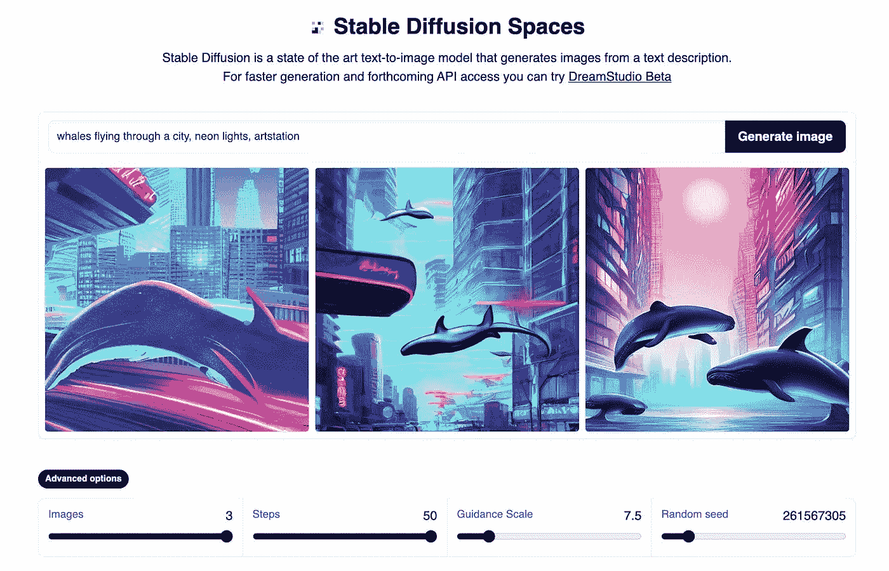
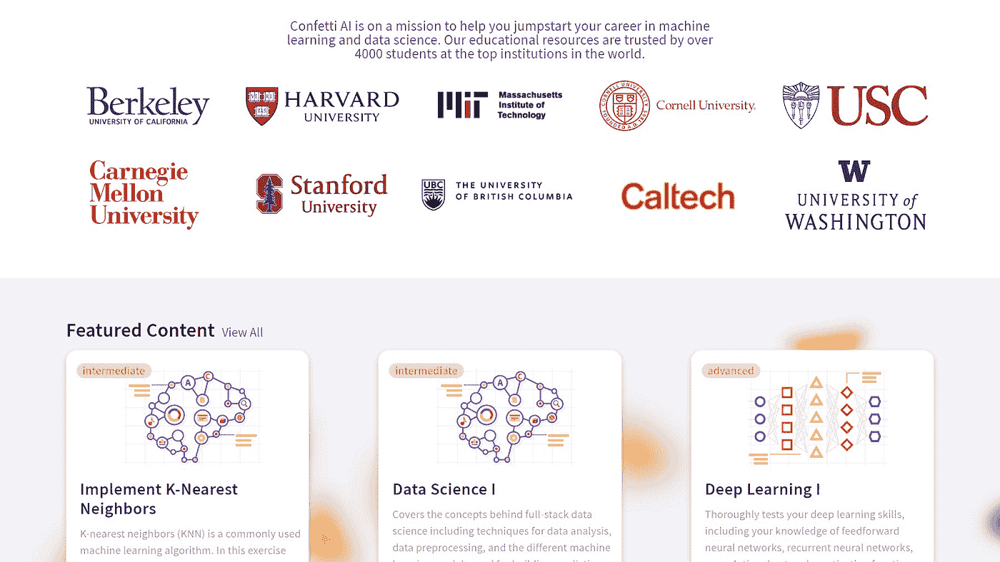
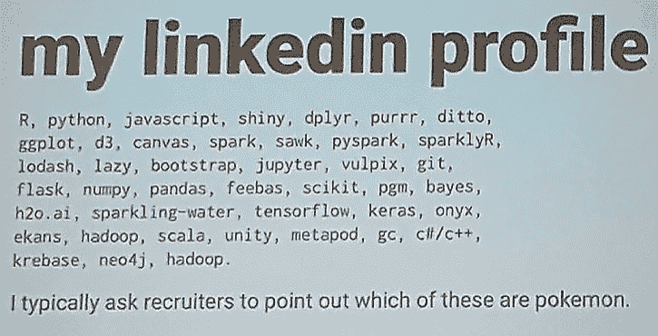

# 这份人工智能时事通讯是你所需要的#9

> 原文：<https://pub.towardsai.net/this-ai-newsletter-is-all-you-need-9-f16ff8692aff?source=collection_archive---------2----------------------->

# 这个星期在 AI 发生了什么

用[稳定扩散生成的图像](https://huggingface.co/spaces/stabilityai/stable-diffusion)

本周，我们的注意力从 Dalle 转向了一个新的开源模型，叫做[稳定扩散](https://github.com/CompVis/stable-diffusion)。稳定扩散来自伦敦和洛斯阿尔托斯初创公司 Stability AI 的研究人员，以及 RunwayML、LMU 慕尼黑、EleutherAI 和 LAION。大事:人工智能模型和代码将作为开源发布。是的，它是开源的，这意味着你可以访问[的代码](https://github.com/CompVis/stable-diffusion)，而 DALLE 是闭源的。

稳定扩散在架构选择方面与 DALLE 2 非常相似，尽管由于它们使用了潜在扩散，所以要轻得多。潜在扩散是一种使用扩散过程的强大方法，它包括获取噪声和生成图像，但它是在潜在空间中使用编码器和解码器从潜在空间到图像空间进行的。这使得任何人都可以实现他们的代码，因为它可以在单个 GPU 上运行，而且它还允许更快的推理时间，这意味着你不必再像 DALLE 或 Craiyon 那样等待两分钟才能获得有趣的结果！这也是社区实现强大的最先进的文本到图像模型并试验代码的重要一步，创造了许多机会来推进扩散模型和图像模型的研究。我们非常兴奋地关注着这个消息，以及与[稳定扩散](https://github.com/CompVis/stable-diffusion)一起完成的工作！如果你实现了他们的代码，请让我们知道并在我们的 [discord 服务器](https://community.towardsai.net/)上分享你的创造！

还可以马上玩[稳定扩散 API](https://huggingface.co/spaces/stabilityai/stable-diffusion) ！

## 最热门新闻

1.  [来自斯坦福的工程师开发了一种在其内存中进行人工智能处理的芯片(提高计算效率)](https://news.stanford.edu/2022/08/18/new-chip-ramps-ai-computing-efficiency?utm_campaign=Your%20Daily%20AI%20Research%20tl%3Bdr&utm_medium=email&utm_source=Revue%20newsletter) “一种新型的电阻式随机存取存储器(RRAM)芯片，它在内存本身中进行人工智能处理，从而消除了计算和存储单元之间的分离。他们的“内存计算”(CIM)芯片名为 NeuRRAM，大约只有指尖大小，在有限的电池电量下比目前的芯片做更多的工作。
2.  [稳定扩散:一个开源的图像生成器 AI 模型！](https://www.pcgamer.com/ai-image-generator-stability-ai-stable-diffusion/?utm_campaign=Your%20Daily%20AI%20Research%20tl%3Bdr&utm_medium=email&utm_source=Revue%20newsletter) 稳定扩散来自伦敦和洛斯阿尔托斯的初创公司 Stability AI 的研究人员，以及 RunwayML、LMU 慕尼黑、EleutherAI 和 LAION。大事件:人工智能模型和代码已经作为开源发布。[在这里玩吧。](https://huggingface.co/spaces/stabilityai/stable-diffusion)
3.  [抖音推出了“人工智能绿屏”，他们的文本到图像生成器](https://www.digitaltrends.com/social-media/you-can-sort-of-generate-art-like-dall-e-with-tiktoks-latest-filter/?utm_campaign=Your%20Daily%20AI%20Research%20tl%3Bdr&utm_medium=email&utm_source=Revue%20newsletter) 结果还不是 Dalle 2 或 Midjourney 的结果，但这很酷，他们肯定会参加这场比赛。现在，AI greenscreen 生成抽象的“斑点”和漩涡图像，专注于创建漂亮的背景，而不是照片级的图像。

## 本周最有趣的报纸

1.  [Paint2Pix:基于交互式绘画的渐进图像合成和编辑](https://arxiv.org/pdf/2208.08092.pdf?utm_campaign=Your%20Daily%20AI%20Research%20tl%3Bdr&utm_medium=email&utm_source=Revue%20newsletter) 一种新颖的方法，通过学习从不完整的人类绘画的流形到它们的现实渲染的映射，从基本的笔画输入中预测(并适应)“用户想要画什么”。获取[代码](https://github.com/1jsingh/paint2pix?utm_campaign=Your%20Daily%20AI%20Research%20tl%3Bdr&utm_medium=email&utm_source=Revue%20newsletter)！
2.  [UPST-NeRF:用于 3D 场景的神经辐射场的通用照片真实感风格传递](https://arxiv.org/pdf/2208.07059.pdf?utm_campaign=Your%20Daily%20AI%20Research%20tl%3Bdr&utm_medium=email&utm_source=Revue%20newsletter) 一种新颖的 3D 场景照片真实感风格传递框架，用于将照片真实感风格从输入图像传递到 3D 场景，将 2D 风格传递方法与体素表示相结合。
3.  [Transframer:使用生成模型的任意帧预测【deep mind paper】](https://arxiv.org/abs/2203.09494?utm_campaign=Your%20Daily%20AI%20Research%20tl%3Bdr&utm_medium=email&utm_source=Revue%20newsletter) trans framer:基于概率帧预测的图像建模和视觉任务的通用框架，结合了 U-Net 和 Transformer 组件。

喜欢这些论文和新闻摘要吗？**】在你的收件箱里获得每日回顾！**

# *公告*

**

*在走向人工智能公司，我们要宣布一个激动人心的消息— [**我们已经收购了纸屑人工智能**](https://towardsai.net/p/news/towards-ai-announces-acquisition-of-confetti-ai-a-leading-platform-for-ai-interview-preparation) 。 [**五彩纸屑 AI**](http://ws.towardsai.net/confetti-ai) 由 [**米哈伊尔埃里克**](https://www.mihaileric.com/) 和 [**亨利赵**](https://www.linkedin.com/in/henryezhao/) 于 2020 年创立，目前已发展到 6000 名活跃用户，拥有超过 350 个问题的内容库。Confetti AI 建立在人工智能十年的经验和与该领域专家数百小时的讨论基础上。它旨在管理领先的机器学习和数据科学面试问题库，重点关注概念理解和实际应用。 [**了解更多新闻**](https://towardsai.net/p/news/towards-ai-announces-acquisition-of-confetti-ai-a-leading-platform-for-ai-interview-preparation) 。*

# *一起学习人工智能社区部分！嘿*

## *本周迷因！*

**

*评估招聘人员实际技术知识的好方法😂。当然，不要这样做，这只是一个迷因！我们的一位非常幽默的主持人，DrDub#0108，再次分享了迷因。[加入对话](https://ws.towardsai.net/discord)并与我们分享你的模因！*

## *来自 Discord 的特色社区帖子*

**

*厉害！我们的一个版主刚刚推出了一个超级酷的产品！*

*"[我的产品](https://epub-highlighter.com/test)book->IG post generator 正在慢慢走向上市."DrDub#0108
DrDub 的产品完全是利用人工智能从一本书生成 Instagram 帖子。作者可以免费使用它来自动生成并在 Instagram 上分享他们的书籍的报价和有趣的想法。多酷啊！*

*在 Instagram 页面上观看一些结果，如果你也想成为时事通讯的主角，不要忘记与社区[分享你自己的项目或产品！](https://ws.towardsai.net/discord)*

## *本周最佳人工智能投票！*

**

# *泰策展组*

## *本周文章*

*[**哪个 NLP 任务没有受益于预先训练的语言模型？**](/which-nlp-task-does-not-benefit-from-pre-trained-language-models-90430ed1207e)*

*有如此巨大的影响力的预训练通用语言模型的历史，我们认为这是理所当然的。尽管如此，它们仍然是大多数 NLP 应用程序绝对需要的基础。然而，我们想要强调的文章的作者声称，在一些情况下，预先训练的通用模型是无效的，并通过出色的分析来支持他的说法。*

*如果你有兴趣和我们一起在《走向人工智能》发表文章，请在这里注册，如果你的博客符合我们的编辑政策和标准，我们将把它发表到我们的网络上。*

## *劳伦对斯坦福神经图的伦理审视*

*斯坦福在 NeuRRAM 上的进展是一个不可思议的壮举！如果你还没有阅读这篇文章，我强烈建议你阅读整篇文章。尽管内存计算技术并不新鲜，但它在模拟之外的应用却很新鲜。结合双倍的能效和在 MNIST 和 CIFAR-10 等人工智能基准测试中的良好性能，NeuRRAM 芯片具有不可思议的潜力。*

*根据它的规格，我可以预见它的主要用途之一将是生物医学植入。计算能力、尺寸和效率始终是开发植入物的摩擦点，因此这些改进可以很容易地给植入物带来直接好处，而不会损害设备的性能。除了工程学上的难题之外，这种进步还会带来自身的一系列生物伦理难题，比如确保信息安全和患者自主权。斯坦福大学一直是医疗设备创新和伦理的领导者，这使得它有能力引领下一波人工智能植入物。*

*NeuRRAM 开发带来的另一个巨大好处是降低功耗和硬件需求对环境的影响。大规模计算所需的功率和技术废物的毒性/难以处理，使我们心爱的机器成为严重的环境负担，无论是对人类生活还是对我们与地球共享的生命而言。NeuRRAM 作为实体产品的成功表明，这些进步对于创新是可能的，也是必要的。我的希望是，这将开启一个关注少花钱多办事的趋势。*

*我想强调的是， [H.-S Philip Wong](https://web.stanford.edu/~hspwong/) 在文章中提到，NeuRRAM 的创新是通过一个拥有不同专业知识和背景的国际团队实现的，这充分体现了合作的价值。我太激动了，想看看 NeuRRAM 还会带我们去哪里！*

## *工作机会*

*[**研究科学家——机器学习@ DeepMind** (英国伦敦)](http://ws.towardsai.net/august-4-job-1)*

*[**高级数据科学家@ EvolutionIQ** (远程)](http://ws.towardsai.net/august-4-job-2)*

*[**高级 ML 工程师— Algolia AI @ Algolia** (混合遥控)](http://ws.towardsai.net/july-22-1-job-1)*

*[**高级 ML 工程师—语义搜索@ Algolia** (混合远程)](http://ws.towardsai.net/july-22-1-job-2)*

**有兴趣分享这里的工作机会吗？联系 sponsors@towardsai.net 或在我们的*[*#招聘频道上发布机会不和谐*](http://ws.towardsai.net/lat-hiring-channel) *！**

**如果你正在准备你的下一次机器学习面试，不要犹豫，来看看我们领先的面试准备网站，* [*五彩纸屑*](http://ws.towardsai.net/confetti-ai) *！**