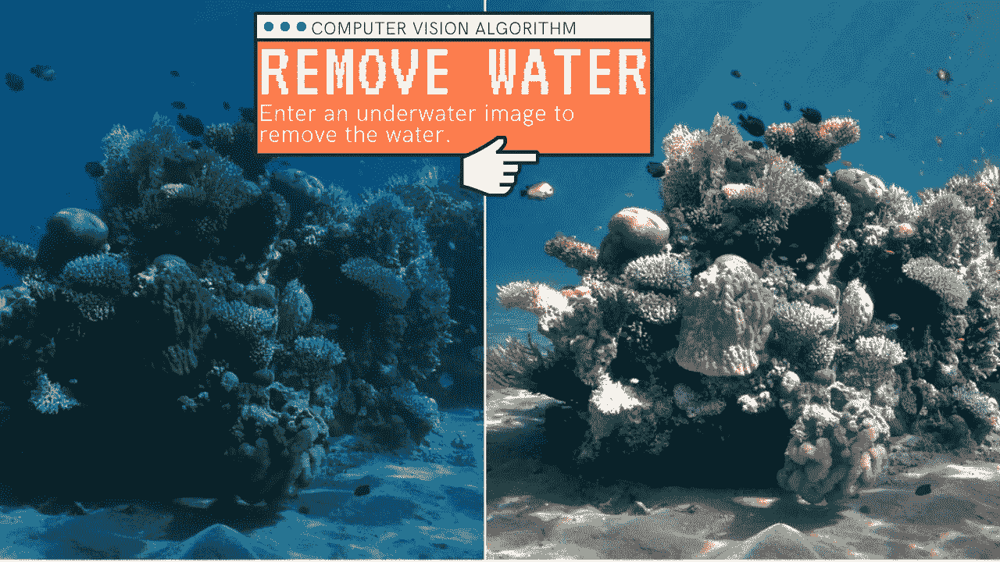
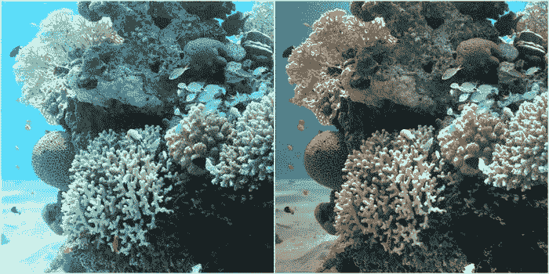
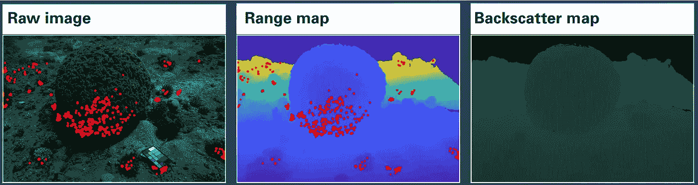
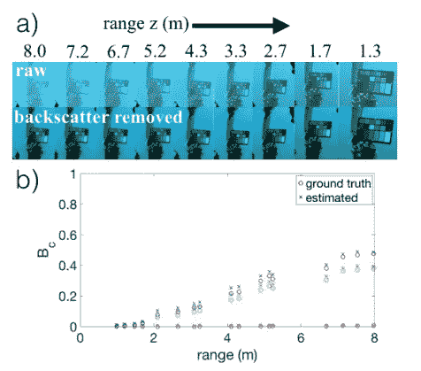
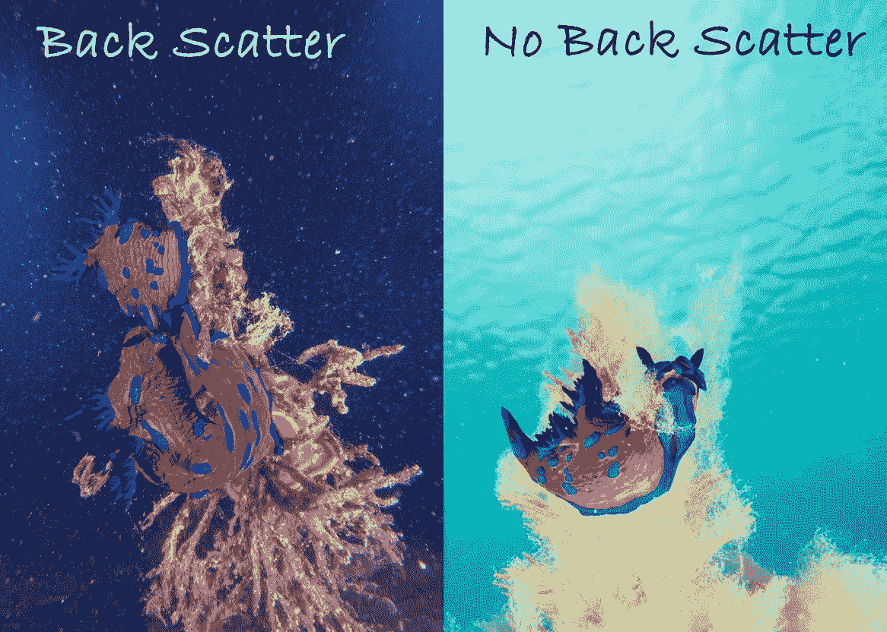
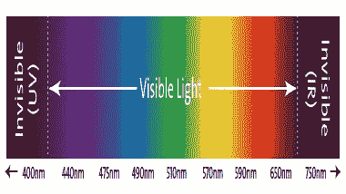

# 这个人工智能从水下图像中移除水！

> 原文：<https://pub.towardsai.net/this-ai-removes-the-water-from-underwater-images-d277281bcd0f?source=collection_archive---------3----------------------->

## [计算机视觉](https://towardsai.net/p/category/computer-vision)

## 你有没有想过没有水的海洋会是什么样子？研究人员最近通过使用计算机视觉算法实现了这一点！

图片来自作者

你有没有想过没有水的海洋会是什么样子？去掉水下照片的蓝绿色，仍然保持珊瑚礁的真实颜色？
嗯，使用计算机视觉和机器学习算法，海法大学的研究人员能够做到这一点！
让我们看看这是如何工作的。

## 技术说明

水下摄影是一项具有挑战性的任务。它需要昂贵的照相机、灯光、各种设备和许多技能。即便如此，在你拍摄的任何照片或视频中，物体或动物仍然会被水染成蓝绿色。幸运的是，对于所有的水下爱好者来说，海法大学的研究人员能够通过使用计算机视觉和机器学习算法来消除这些图片和视频中的水。

图片来自[报社](https://openaccess.thecvf.com/content_CVPR_2019/papers/Akkaynak_Sea-Thru_A_Method_for_Removing_Water_From_Underwater_Images_CVPR_2019_paper.pdf)

他们称他们的新算法为:海上穿越。它采用相同的蓝绿色色调从水下拍摄图像，使其看起来像是通过空气而不是水拍摄的！它不仅仅是从水中去除了这个滤色器。它还可以消除光线在水下传播时造成的视觉失真，从而准确校正图像的颜色和物理外观。

让我们为所有想知道这种算法如何工作的机器学习爱好者深入一点。如我所说，它接受水下图像作为输入。但你甚至不再需要一套昂贵的灯了，因为它可以在自然光下拍摄原始图像，甚至是视频。通常情况下，这是一个大问题，完全由这个算法解决。远离光源的物体不会被相机清晰地捕捉到。如果指定了距离，它们现在看起来就像靠近镜头的物体一样清晰。

图片来自[纸张](https://openaccess.thecvf.com/content_CVPR_2019/papers/Akkaynak_Sea-Thru_A_Method_for_Removing_Water_From_Underwater_Images_CVPR_2019_paper.pdf)

事实上，它需要原始的 RGB-D 图像，其中 D 代表相机和我们想要获得清晰视图的对象之间的距离或深度图。该深度图随后与原始图像一起使用，通过计算每个光波长的衰减来揭示图像的原始颜色。

图片来自[论文](https://openaccess.thecvf.com/content_CVPR_2019/papers/Akkaynak_Sea-Thru_A_Method_for_Removing_Water_From_Underwater_Images_CVPR_2019_paper.pdf)

他们通过在场景中不同距离放置已知大小的物体，分析反向散射效应，并使用已知场景的信息重建它们来实现这一点。然后，它使用在模型的训练阶段计算的空间变化光源的估计来获得水下距离相关的衰减系数。

但这只是使颜色与在海面拍摄的图像相匹配所需完成的一半工作。它还需要使用暗像素及其已知的距离信息来估计反向散射。

图片由[马特·特斯托尼](https://scubadiverlife.com/guide-keeping-best-underwater-images-deleting-rest/)拍摄

反向散射是光波在水中的粒子上反弹并进入相机的反射，考虑到水下环境使它们偏离了原来的方向。它照亮了这些水粒子，并且经常会阻碍物体。为了找到这个反向散射值并对其进行反演，他们首先将距离图划分为 10 个簇，覆盖了之前估计的 z 的所有可能值。然后，使用捕获的图像和已知的物体距离，他们找到完美的 z 相关性。接下来，他们可以对整个图像进行相同的处理，根据之前计算的信息估计反向散射。

还有一步需要解释，那就是他们如何找到 RGB 图像的宽带衰减和反向散射系数。管理反向散射值和关于场景的信息。

光谱响应|图片来自[斯特梅尔成像](https://www.stemmer-imaging.com/en/knowledge-base/spectral-response/)

这是一个复杂的计算，在本文中有详细的解释，但它主要是使用相机的光谱响应和光学水类型来完成的，这些是他们之前使用训练模型测量的。

最后，使用先前估计的 z 的已知范围图，他们可以改进这些系数以服从给定的 z 并改进最终结果。

这将对珊瑚生物学家和该领域的其他专家非常有益，因为这项工作的真正目的是获得真实的颜色，而不是使用 photoshop 找到的当前增强版本。

## 结果

现在我们已经看到了它是如何工作的，让我们来看看这项惊人技术的更多结果…

## 结论和参考文献

当然，这只是最近这篇论文的一个简单概述。我强烈推荐阅读下面链接的文章以获取更多信息。

> **论文，**[https://open access . The CVF . com/content _ CVPR _ 2019/papers/Akkaynak _ Sea-Thru _ A _ Method _ for _ Removing _ Water _ From _ Underwater _ Images _ CVPR _ 2019 _ paper . pdf](https://openaccess.thecvf.com/content_CVPR_2019/papers/Akkaynak_Sea-Thru_A_Method_for_Removing_Water_From_Underwater_Images_CVPR_2019_paper.pdf)
> **Matlab 项目，**[https://blogs . mathworks . com/headlines/2020/01/20/computer-vision-algorithm-removes-The-Water-From-unders _ Eid = PSM _ bl&source = 15308](https://blogs.mathworks.com/headlines/2020/01/20/computer-vision-algorithm-removes-the-water-from-underwater-images/?s_eid=psm_bl&source=15308)

如果你喜欢我的工作并想支持我，如果你在 [**中**](https://medium.com/@whats_ai) 关注我，我将不胜感激。