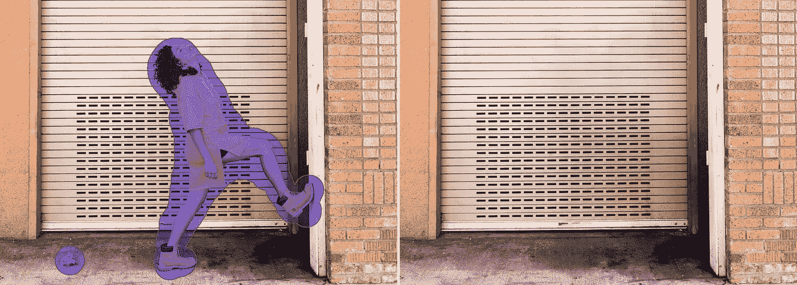
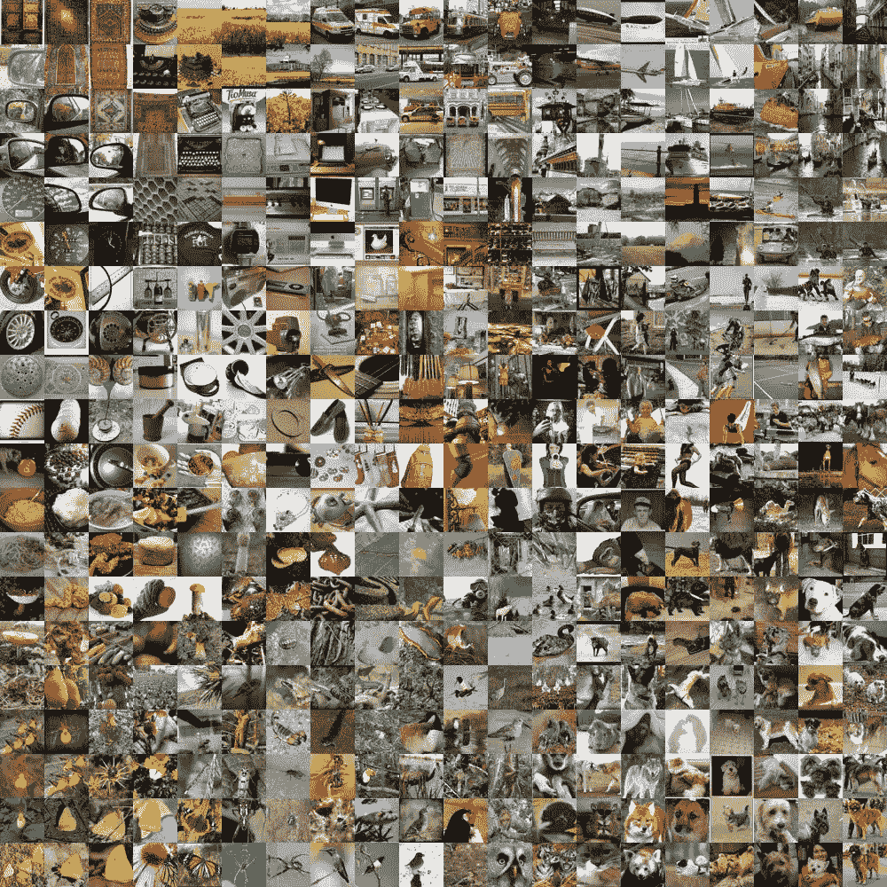
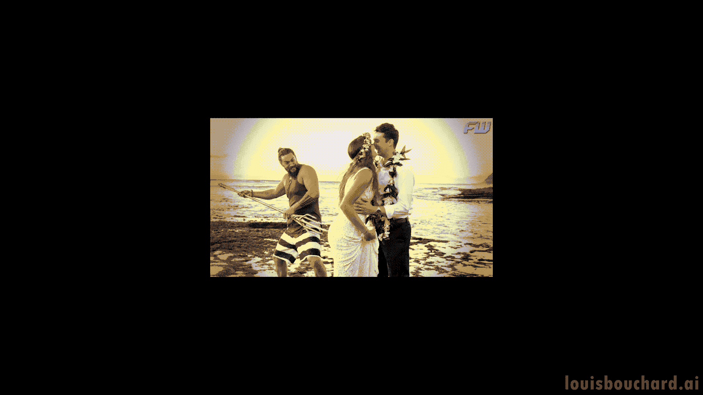
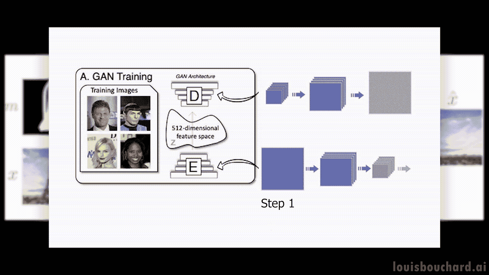
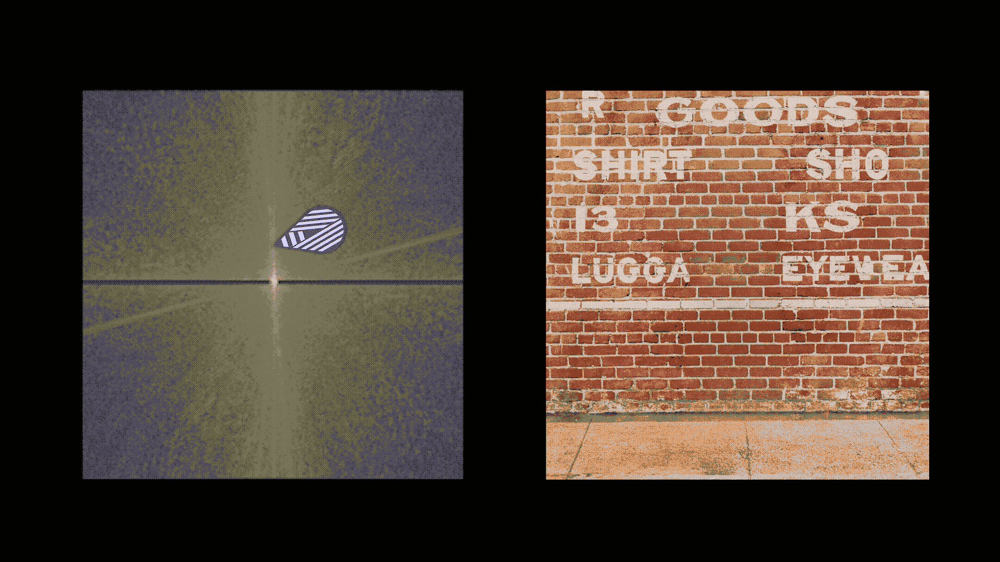
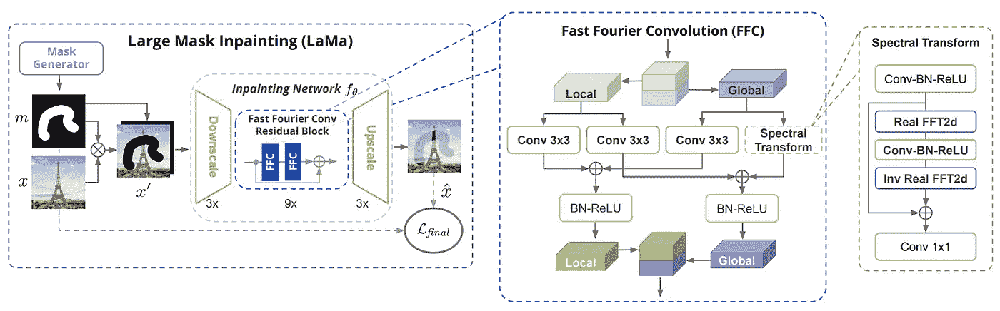
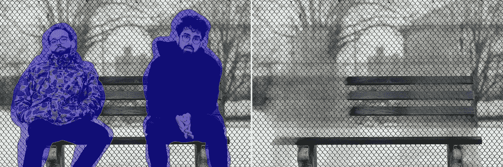
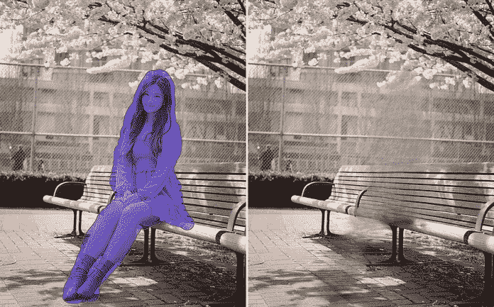

# 这个人工智能从你的图像中移除不想要的物体！

> 原文：<https://pub.towardsai.net/this-ai-removes-unwanted-objects-from-your-images-29b2905df08e?source=collection_archive---------0----------------------->

## [技术](https://towardsai.net/p/category/technology)

## 了解这种算法如何理解图像，并自动删除不需要的对象或人，并保存您未来的 Instagram 帖子！

> 原载于 [louisbouchard.ai](https://www.louisbouchard.ai/lama/) ，前两天在[我的博客](https://www.louisbouchard.ai/lama/)上看到的！

## 观看视频

你肯定经历过这种情况:你和你的朋友拍了一张很棒的照片，有人在你身后拍照，毁了你未来的 Instagram 帖子。那已经不是问题了。无论是一个人还是一个垃圾桶，你在自拍前忘记拿走，都破坏了你的照片。这个人工智能会自动删除图像中不需要的物体或人，并保存你的帖子。这就像一个专业的 photoshop 设计师在你的口袋里，并与一个简单的点击！

图像修复示例。用[喇嘛](https://github.com/saic-mdal/lama)制成。

许多人工智能研究人员已经处理了很长时间的任务，即删除图像的一部分，并用应该出现在后面的内容替换它。这叫做图像修复，非常具有挑战性。正如我们将看到的，我想给你看的这篇论文实现了令人难以置信的结果，并且可以轻松地以高清方式实现，不像你以前可能听说过的方法。你一定想看到文章的结尾。你不会相信一个算法在一瞬间产生的东西看起来有多么伟大和现实！

为了从图像中移除对象，机器需要理解该对象后面应该出现什么。要做到这一点，需要像人类一样对世界有一个三维的理解，但它没有。它只能访问图像中的几个像素，这就是为什么它如此复杂，而对我们来说它看起来很简单，可以简单地想象深度，并猜测应该有墙的其余部分，这里是窗户等。

来自 Imagenet 数据集的样本。

我们基本上需要教会机器世界通常是什么样子。因此，我们将使用大量真实世界图像的例子，这样它就可以对我们的世界在二维图片世界中的样子有一个想法，这不是一个完美的方法，但确实有效。

低清晰度图像与高清晰度图像。图片由作者提供。

然后，另一个问题是使用太多像素的真实世界图像的计算成本。为了解决这个问题，目前大多数方法都是处理低质量的图像，因此我们的计算机可以管理图像的缩小版本，并在最后放大修复的部分以替换原始图像，使最终结果看起来比它可能的更差。或者至少它们看起来不够好，不会被分享到 Instagram 上，也不会得到你应得的所有喜欢。你不能直接给它输入高质量的图像，因为这需要太多时间来处理和训练。还是可以？

## 模型

喇嘛建筑。图片来自[论文](https://github.com/saic-mdal/lama)。

嗯，这些是研究人员在本文中攻击的主要问题，这里是如何…三星研究公司的罗曼·苏沃罗夫等人介绍了一个名为 LaMa 的新网络，它非常特别。正如你所看到的，在图像修复中，你通常会发送初始图像以及你想从中删除的内容。这被称为遮罩，将覆盖图像，正如你在这里看到的，网络将无法再访问这些信息，因为它需要填充像素。

然后，它必须理解图像，并尝试填充它认为最适合的像素。因此，在这种情况下，他们像其他网络一样开始缩小图像，但不用担心，他们的技术将允许他们保持与高分辨率图像相同的质量。这是因为在这里，在图像的处理过程中，他们使用了一些与平常稍有不同的东西。

卷积神经网络(CNN)，图片作者。

通常，我们可以在中间看到不同的网络，主要是卷积神经网络。由于卷积的工作原理，这种网络经常用于图像，我在其他文章中解释过，比如[这个](https://www.louisbouchard.ai/how-ai-understand-images/)，如果你对它的工作原理感兴趣的话。

使用卷积神经网络(CNN)的两步图像编码和解码。图片由作者提供。

简而言之，网络会分两步工作:
首先，它会对图像进行压缩，尽量只保存相关信息。
网络将最终保存图像的大部分一般信息，如颜色、整体风格或出现的一般物体，但不是精确的细节。然后，它将尝试使用相同的原理但反向来重建图像。我们使用一些技巧，如跳过连接，将信息从网络的前几层保存下来，并沿着第二步传递，以便它可以将信息定向到正确的对象。简而言之，它很容易知道有一座有蓝天和树木的塔，称为全球信息，但它需要这些跳跃连接来知道屏幕中间的埃菲尔铁塔，这里和那里有云，树木有这些颜色，等等。所有细粒度的细节，我们称之为本地信息。

在用许多例子进行了长时间的训练之后，我们期望我们的网络重建图像，或者至少是非常相似的图像，该图像包含相同种类的物体，并且如果与初始图像不相同，也是非常相似的。

但是请记住，在这种情况下，我们正在处理需要升级的低质量图像，这将损害结果的质量。这里的特殊性在于，它不是像常规卷积网络那样使用卷积并跳过连接来保持局部知识，而是使用我们所说的快速傅立叶卷积或 FFC。这意味着网络将在空间和频率域中工作，并且不需要回到早期层来理解图像的上下文。每一层将在空间域中使用卷积来处理局部特征，并在频率域中使用傅立叶卷积来分析全局特征。频域有点特殊，如果你感兴趣，我在下面的参考资料中链接了一个很棒的[视频](https://youtu.be/spUNpyF58BY)来介绍它。它基本上会将你的图像转换成所有可能的频率，只是声波，并告诉你图像包含了多少频率。因此，这个新创建的图像的每个“像素”将代表覆盖整个空间图像的频率以及它存在的程度，而不是颜色。这里的频率只是不同尺度下的重复模式。

傅立叶图像示例中的一个“像素”代表砖墙中的垂直线。图片由作者提供。

例如，这些频率像素中的一个可以被彼此相距特定距离的垂直线高度激活。在这种情况下，它可能与砖块的长度相同，因此如果图像中有砖墙，它将被高度激活。由此，你会明白可能有一堵砖墙，其大小与它被激活的程度成正比。你可以对所有被激活的相似图案的像素重复这一过程，给你图像整体方面的良好提示，但对物体本身或颜色没有任何提示。空间域将负责此事。

带有 FFC 细节的喇嘛建筑。图片来自[论文](https://github.com/saic-mdal/lama)。

因此，对这个新的傅立叶图像进行卷积可以让您在卷积过程的每一步处理整个图像，因此即使在早期层也可以更好地了解图像，而无需太多的计算成本，这是常规卷积无法实现的。然后，全局和局部结果都被保存并发送到下一层，下一层将重复这些步骤。你将最终得到你可以升级的最终图像。傅立叶域的使用使其可扩展到更大的图像，因为图像分辨率不影响傅立叶域，因为它使用整个图像的频率而不是颜色，
无论图像大小，它寻找的重复模式都是相同的。也就是说，即使用小图片训练这个网络，你也可以在之后输入更大的图片，并获得惊人的结果。

LaMa 制作的图像修复失败的例子。图片来自[报](https://github.com/saic-mdal/lama)。

正如您所看到的，结果并不完美，但却相当令人印象深刻，我很期待看到他们接下来会做些什么来改进它们！

当然，这只是这个新模型的一个简单概述，您可以在下面的描述中找到关于实现的更多细节。我希望你喜欢这篇文章，如果是的话，请花一点时间和一个可能会觉得这篇文章有趣的朋友分享一下！

感谢您的阅读。

如果你喜欢我的工作，并想与人工智能保持同步，你绝对应该关注我的其他社交媒体账户( [LinkedIn](https://www.linkedin.com/in/whats-ai/) 、 [Twitter](https://twitter.com/Whats_AI) )并订阅我的每周人工智能 [**简讯**](http://eepurl.com/huGLT5) ！

## 支持我:

*   支持我的最好方式是成为这个网站的会员，或者如果你喜欢视频格式，在 **YouTube** 上订阅我的频道。
*   跟着我上 [**中**](https://whats-ai.medium.com/)
*   想进入 AI 或者提升技能，[看这个](https://www.louisbouchard.ai/learnai/)！

## 参考

*   r .、Logacheva、e .、Mashikhin、a .、Remizova、a .、Ashukha、a .、Silvestrov、a .、Kong、n .、Goka、h .、Park、k .和 Lempitsky、v . 2022。基于傅里叶卷积的分辨率稳健的大掩模修复。IEEE/CVF 计算机视觉应用冬季会议论文集(第 2149-2159 页)。，[https://arxiv.org/pdf/2109.07161.pdf](https://arxiv.org/pdf/2109.07161.pdf)
*   代码:[https://github.com/saic-mdal/lama](https://github.com/saic-mdal/lama)
*   Colab 演示:[https://colab . research . Google . com/github/SAIC-mdal/LaMa/blob/master/colab/LaMa _ inpainting . ipynb](https://colab.research.google.com/github/saic-mdal/lama/blob/master/colab/LaMa_inpainting.ipynb)
*   产品使用喇嘛:[https://cleanup.pictures/](https://cleanup.pictures/)
*   傅立叶域由伟大的[@ 3 blue 1 brown](http://twitter.com/3Blue1Brown):[https://youtu.be/spUNpyF58BY](https://youtu.be/spUNpyF58BY)解释