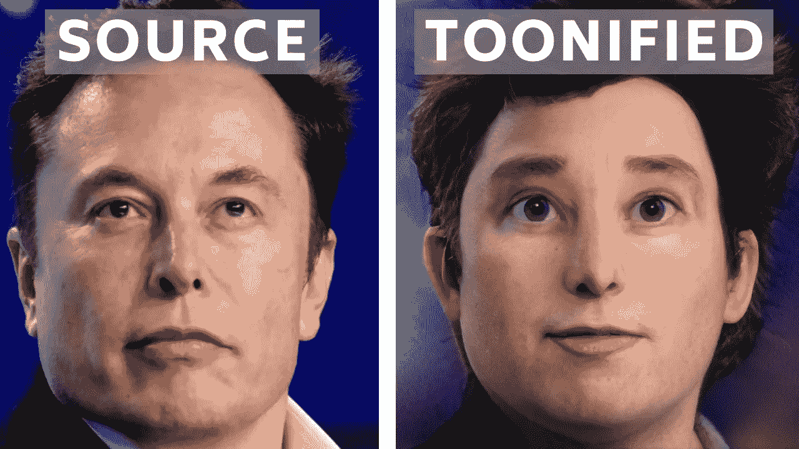
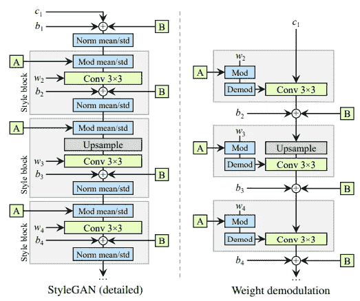
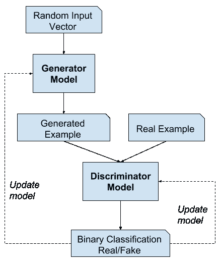
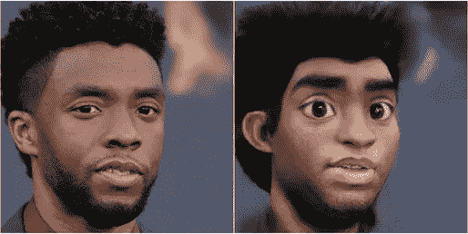
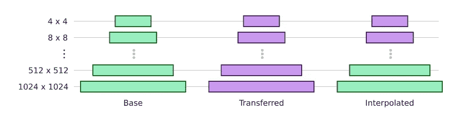
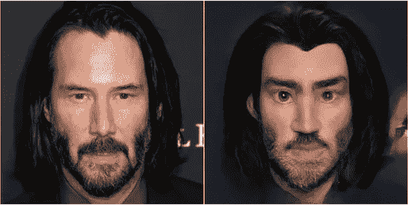

# 这种人工智能将人脸转换成迪士尼动画电影角色(卡通)

> 原文：<https://pub.towardsai.net/this-ai-transform-faces-into-disney-animated-movie-characters-toonify-5225f04da588?source=collection_archive---------0----------------------->

## [计算机视觉](https://towardsai.net/p/category/computer-vision)，[深度学习](https://towardsai.net/p/category/machine-learning/deep-learning)

## 这个人工智能可以将你的任何图片转换成迪士尼动画电影角色风格的精确表示！

> 最初发表于 [louisbouchard.ai](https://www.louisbouchard.ai/toonify/) ，前两天在[我的博客](https://www.louisbouchard.ai/tag/artificial-intelligence/)上看到的！

用[做成卡通](https://gumroad.com/a/391640179)

你甚至可以现在就自己使用它，只需使用[简单点击](https://gumroad.com/a/391640179)即可。但是在测试它之前，让我们快速看看它是如何工作的。

使用一个公开可用的预训练模型，称为 StyleGan2，他们能够创建[来统一](https://gumroad.com/a/391640179)。一个[网站](https://gumroad.com/a/391640179)将任何从个人资料中获取的图片转换成迪士尼/皮克斯/梦工厂的动画电影角色。

StyleGAN2 是 NVIDIA 研究团队制作的 GAN 架构模型。
它目前在生成式图像建模方面拥有最先进的成果。简而言之，他们使用了原始的 StyleGAN 架构，并对其进行了改进，以提高与样式相关的结果。

这个网络是一个融合了风格转移的生成性对抗网络。风格转移是一种技术，用于根据不同的风格改变整个图像的风格，正如你在这里看到的。

生成性对抗网络，我们称之为 GAN，是网络的基础架构。它基本上由两个主要部分组成。首先，我们称之为生成器网络，它学习人脸的高级属性，如人的姿势和身份，以控制图像合成过程。这是它学习输入图像“风格”的地方，比如“人类”风格，或者“迪斯尼卡通”风格。然后，为了训练这个生成器，我们需要 GAN 架构的第二部分，

这是一个鉴别器。简而言之，在训练期间，生成的图像和真实的图像都被提供给鉴别器，鉴别器试图从生成的图像中“鉴别”出真实的图像。基于这种比较的反馈，生成器网络可以迭代地提高假图像的质量，并欺骗鉴别器。

正如我所说的， [Toonify](https://gumroad.com/a/391640179) 使用了一个预训练的模型，这个模型已经在许多图像上进行了训练，产生了良好的结果。
然后，他们通过用 300 多张与迪士尼、皮克斯和梦工厂世界相关的动画电影角色图片再次训练他们的生成器来进行微调。

用[做成卡通图案](https://gumroad.com/a/391640179)

然后，合并两个不同 GAN 网络的特定部分，例如一个训练用于人脸，另一个训练用于动画电影角色，他们能够创建一个具有卡通人脸结构的混合体，但具有真实感渲染。这给任何人一个高质量的卡通风格的外观，不是任何卡通风格，而是一个它已经训练有素的一个，在这种情况下是迪士尼，皮克斯和梦工厂的电影角色。如果你有足够多的这种特定风格的图片，你可以对任何其他卡通风格做同样的步骤。

令人印象深刻的是他们通过合并两个网络所做的事情。

简而言之，他们明白头几层负责头部的姿势和脸部的形状，而这是由训练有素的人脸网络控制的。然后，他们看到后面的层更多的是关于控制像灯光和纹理这样的东西，这就是我们正在寻找的卡通形象。允许他们从一个全新的领域生成图像，并在高度控制的情况下做到这一点。

用[做成动画](https://gumroad.com/a/391640179)

这意味着他们可以保留人脸的特性，并生成具有特定风格的卡通版本，如迪士尼人物。而不是像大多数方法一样，生成具有随机属性的图像，这些随机属性并不真正遵循图像馈送的形状和“灵魂”。他们在论文中称之为“图层交换”技术，我在描述中链接了这个技术以及 [Toonify](https://gumroad.com/a/391640179) 网站，在那里你可以尝试绘制你自己或任何你想要的图片。

如果你想在你自己的图片或者任何你能想到的图片上尝试一下，你现在可以通过点击这里使用[来使](https://gumroad.com/a/391640179)动画化。

**在你自己测试之前，作者的一个快速提示:**
—为了产生好的结果，原始图像必须具有相当高的质量，例如人脸的每 512 个像素中有大约 512 个像素。
—侧面和低于 128 x 128 像素的面部不太可能被网络发现。

观看本视频中[动画](https://gumroad.com/a/391640179)的更多示例:

玩得开心，请在评论区分享你的结果，并附上你的图片链接，或者在 Twitter 上用 [@whats_ai](http://twitter.com/whats_ai) 给我加标签。我想看看他们！

如果你喜欢我的工作并想支持我，我会非常感谢你在我的社交媒体频道上关注我:

*   支持我的最好方式就是跟随我上 [**中级**](https://medium.com/@whats_ai) 。
*   订阅我的[YouTube 频道 。](https://www.youtube.com/channel/UCUzGQrN-lyyc0BWTYoJM_Sg)
*   在 [**LinkedIn**](https://www.linkedin.com/company/what-is-artificial-intelligence) 上关注我的项目
*   一起学习 AI，加入我们的 [**Discord 社区**](https://discord.gg/SVse4Sr) ，*分享你的项目、论文、最佳课程，寻找 Kaggle 队友，等等！*

**参考文献:**

[卡通](https://gumroad.com/a/391640179):[https://gumroad.com/a/391640179](https://gumroad.com/a/391640179)

*style gan 2:*https://github.com/NVlabs/stylegan2

*论文:*https://arxiv.org/pdf/2010.05334.pdf

*Google Colab for too nify:*[https://Colab . research . Google . com/drive/1 S2 pnmwf 6 hdhrj 1 fmwlw 1 JL-eQ2-_ tlk？USP = sharing # scroll to = tcwxgs 5d xata](https://colab.research.google.com/drive/1s2XPNMwf6HDhrJ1FMwlW1jl-eQ2-_tlk?usp=sharing#scrollTo=tcWXgS5DXata)