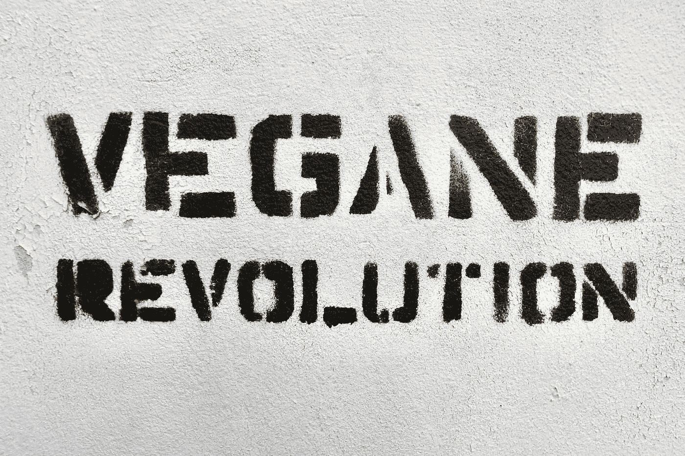

# 这篇文章是两极:人工智能在教育中的作用。

> 原文：<https://pub.towardsai.net/this-article-is-bipolar-role-of-ai-in-education-bc084e37eb3a?source=collection_archive---------2----------------------->

## 一篇要么是有远见的文章，要么是完全没有价值的文章。

取决于你是谁，你要么同意，要么最终把这篇文章当作垃圾扔掉。宏大的谈话和彻底的废话之间只有一线之隔。请在评论中告诉我你对这篇文章的直觉反应(请直言不讳——我需要你的回应来进行研究)。

人工智能(AI)已经开始彻底改变我们学习和与技术互动的方式，这种趋势只会在未来继续下去。随着人工智能变得更加先进，它有可能显著改变我们学习编程的方式。

人工智能将改变学习编程体验的最重要的方式之一是通过使用**个性化学习**。传统的教育方法通常涉及一刀切的教学方法，这可能会让学习速度不同或学习风格不同的学生感到沮丧。另一方面，AI 有能力适应个别学生的需求，并根据他们特定的学习风格提供定制的课程和练习。

人工智能将改变学习编程体验的另一种方式是通过使用交互式和沉浸式学习环境。在人工智能的帮助下，学生将能够**参与**虚拟现实(VR)和增强现实(AR)体验，这使他们能够以更具互动性和**沉浸式**的方式实践编程概念。例如，一个学生可能能够使用 VR "**进入"一个虚拟世界**，并通过构建和编程他们自己的虚拟机器人或机器来练习编码。这种动手学习比传统的学习方法更吸引人，也更有效，传统的学习方法通常依赖于讲座和阅读。

由 [Bekky Bekks](https://unsplash.com/@bekkybekks?utm_source=medium&utm_medium=referral) 在 [Unsplash](https://unsplash.com?utm_source=medium&utm_medium=referral) 上拍摄的照片

人工智能还将改变我们访问和消费教育内容的方式。在人工智能推荐系统的帮助下，学生将能够轻松地找到和访问最相关和最有用的教育资源。这些推荐系统可以分析学生的进步和兴趣，并推荐有助于他们更有效学习的资源。

除了我们学习编程方式的这些变化，AI 还将对我们在日常生活中使用编程的方式产生重大影响。随着人工智能变得越来越普遍，我们将看到人工智能工具和应用程序的使用越来越多，这些工具和应用程序可以自动化各种任务，让我们的**生活变得更容易**。例如，人工智能驱动的编程语言和框架将允许开发人员构建能够随着时间的推移学习和适应的智能系统，使他们更有效地解决复杂问题。

人工智能已经产生重大影响的一个领域是数据科学领域。在人工智能的帮助下，数据科学家能够更有效地分析和解释大量数据，并准确地**，使他们能够做出更明智的决策和预测。这种人工智能驱动的分析正在改变我们在许多领域解决问题的方式，并且随着人工智能变得更加先进，它可能会在未来继续这样做。**

## **结论:**

**将人工智能融入编程和教育领域，有可能极大地改变我们学习和与技术互动的方式。个性化学习、沉浸式环境以及人工智能工具和应用都将在这一转变中发挥作用，让人们更容易、更有效地学习编程和构建智能系统。随着人工智能的不断发展，它无疑将对我们学习和使用编程的方式产生更大的影响，成为这个快速发展领域的一部分是一个令人兴奋的时刻。**

**🔔🔔 ***看过这篇文章请评论。给它打个 0 到 10 分的分。0 是最糟糕的垃圾，10 是对你有意义的最好的内容。*🔔🔔****

**来支持我🔔 ***拍手*** | ***跟随|*** [***订阅***](https://ithinkbot.com/subscribe)***|***[【*成为会员****🔔***](https://ithinkbot.com/membership)**

***检查我的其他作品—***

*** [## 如何告诉你的老板，“你错了”

### 数据科学团队中的礼仪

ithinkbot.com](https://ithinkbot.com/how-to-tell-your-boss-you-are-wrong-20cf7e1c3187)  [## 人工智能中的领导力:你的领导力适合数据科学吗？

### 可能已经转变为数据科学领导的非技术人员领导通常不熟悉…

pub.towardsai.net](/leadership-in-ai-is-your-leadership-fit-for-datascience-d0e9296be2d6)  [## 谈判的艺术:西塞罗·艾

### 西塞罗·艾在外交的游戏中比人类更能谈判。就像深蓝代表国际象棋，五号代表…

pub.towardsai.net](/the-art-of-negotiation-cicero-ai-6e04354fe990)  [## 什么是 GPT-4(什么时候？)

### GPT-4 是一个自然语言处理模型，由 openAI 作为 GPT-3 的继承者开发

pub.towardsai.net](/what-is-gpt-4-and-when-9f5073f25a6d)***