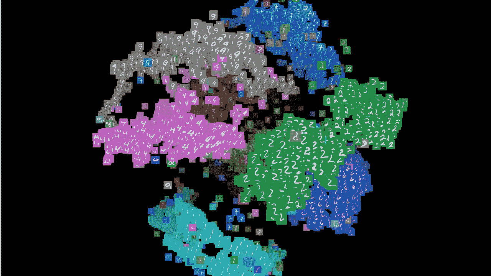
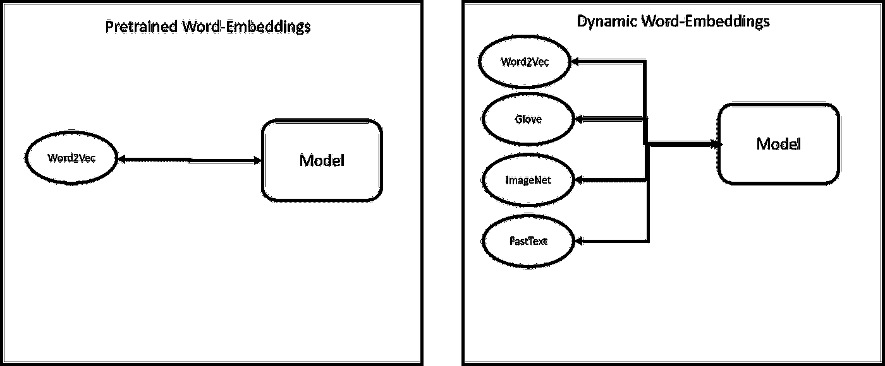
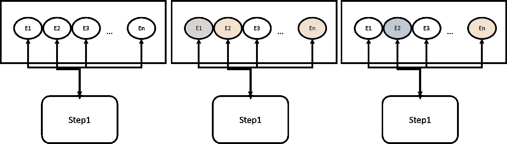
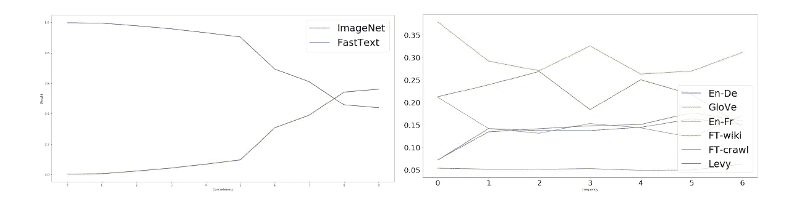

# 这种脸书架构允许 NLP 模型选择自己的架构

> 原文：<https://pub.towardsai.net/this-facebook-architecture-allows-nlp-models-to-choose-their-own-architecture-20eabbe276e6?source=collection_archive---------0----------------------->

## [人工智能](https://towardsai.net/p/category/artificial-intelligence)

## 元嵌入是脸书人工智能研究所使用的一种非常有趣的技术，用于改进 NLP 模型的架构。



图片来源:[https://towards data science . com/visualization-bias-in-data-using-embedding-projector-649 BC 65 e 7487](https://towardsdatascience.com/visualizing-bias-in-data-using-embedding-projector-649bc65e7487)

> 我最近创办了一份专注于人工智能的教育时事通讯，已经有超过 90，000 名订户。《序列》是一份无废话(意思是没有炒作，没有新闻等)的 ML 导向时事通讯，需要 5 分钟阅读。目标是让你与机器学习项目、研究论文和概念保持同步。请通过订阅以下内容来尝试一下:

[](https://thesequence.substack.com/) [## 序列

### 订阅人工智能世界中最相关的项目和研究论文。受到 85，000 多人的信任…

thesequence.substack.com](https://thesequence.substack.com/) 

单词嵌入是自然语言处理(NLP)领域中最成熟的技术之一。从概念上讲，单词嵌入是将句子中的短语或单词映射到向量和数字的语言建模方法。任何 NLP 应用程序的第一步都是确定将要使用什么类型的单词嵌入算法。通常，NLP 模型求助于预先训练的单词嵌入算法，如 Word2Vec、Glove 或 FastText。虽然这种方法相对简单，但是它也导致了非常低的效率，因为随着 NLP 模型的发展，几乎不可能确定什么单词嵌入会执行得更好。如果 NLP 模型本身能够为给定的上下文选择最佳的单词嵌入会怎么样？[在 2018 年的一篇论文](https://arxiv.org/abs/1804.07983)中，来自脸书人工智能研究实验室(FAIR)的研究人员提出了一种方法，允许 NLP 模型动态选择一种在给定环境下表现最佳的单词嵌入算法。

动态元嵌入是一种将不同的单词嵌入模型组合在集成模型中的技术，并允许 NLP 算法基于它们的性能来选择使用什么嵌入。脸书的技术，本质上，基于集合的特定行为，将嵌入算法的选择从设计时间延迟到运行时间。



# 预训练单词嵌入的挑战

动态元嵌入背后的原理相当简单:在给定的环境下，不同的单词嵌入算法表现不同，那么为什么不将它们结合起来，让网络决定使用哪种嵌入呢？此外，动态元嵌入解决了更传统一代的预训练单词嵌入方法的一些实际挑战。

**覆盖率:**预训练的单词嵌入算法在遇到不在给定词汇表范围内的单词时会遇到困难。

**特定领域:**监督单词嵌入模型通常在单个领域上训练，当遇到来自其他领域的句子时表现不佳。

**评估:**在 NLP 模型中评估单词嵌入算法的性能几乎是不可能的。我们可以清楚地评估 NLP 模型的性能，但是很难将它与底层单词嵌入的行为联系起来。

**可解释性:**补充上一点，理解为什么一个特定的单词嵌入算法以特定的方式运行是非常困难的。给定一个特定的 NLP 任务，很难预测哪个单词嵌入算法会执行得更好。

# 动态元嵌入

动态元嵌入从给定的单词嵌入算法集合开始。给定由一组 tokes *{t1，t2，…tn}* 构成的特定句子，动态元嵌入模型将从不同的模型中产生一系列嵌入。随着时间的推移，NLP 算法将评估每个嵌入模型的性能，并相应地分配权重，从而获得更好的性能。



**图片来源:脸书**

GitHub 上提供了动态元嵌入的开源实现。基于 PyTorch，当前的实现使得将不同的单词嵌入合并到 NLP 模型中变得非常简单。下面的代码显示了如何使用由 FastText 和 Glove 嵌入组成的集成来训练 NLP 模型。

```
python train.py --task snli \
--datasets_root data/datasets --embeds_root data/embeddings --savedir checkpoints \
--embeds fasttext,glove --mixmode proj_sum --attnnet no_dep_softmax \
--nonlin relu --rnn_dim 128 --fc_dim 128 \
--optimizer adam --lr 0.0004 --lr_min 0.00008 --batch_sz 64 --emb_dropout 0.2 --clf_dropout 0.2
```

# 行动中的动态单词嵌入

脸书团队评估了不同 NLP 场景中的动态元嵌入，如情感分析、图像字幕检索、语言推理和其他几个场景。在每项任务中，使用动态元嵌入的模型能够胜过使用预训练单词嵌入的模型。

除了令人印象深刻的性能结果，动态元嵌入还隐藏了一些关于不同单词嵌入算法性能的有趣见解。下面的图表说明了在给定具体已知单词或低频单词的情况下，动态元嵌入的偏好。我们可以清楚地看到，ImageNet 单词嵌入模型对于连续单词是首选的，而 Glove 在使用低频单词的上下文中是首选的。



选择单词嵌入算法的任务通常是高度主观的，并且基于领域知识。脸书在动态元嵌入方面的工作表明，单词嵌入模型的选择最好留给神经网络本身。动态元嵌入允许 NLP 模型为不同的任务选择不同的词嵌入，从而导致更有效和可预测的性能。此外，动态元嵌入产生了更多可解释的 NLP 模型，更有效的语言分析，并且，值得注意的是，突出了在给定的特定上下文中哪些单词嵌入模型表现得更好。关于动态元嵌入的工作相对来说是新生的，但是它确实显示了极大的希望来改进当前一代的 NLP 模型。