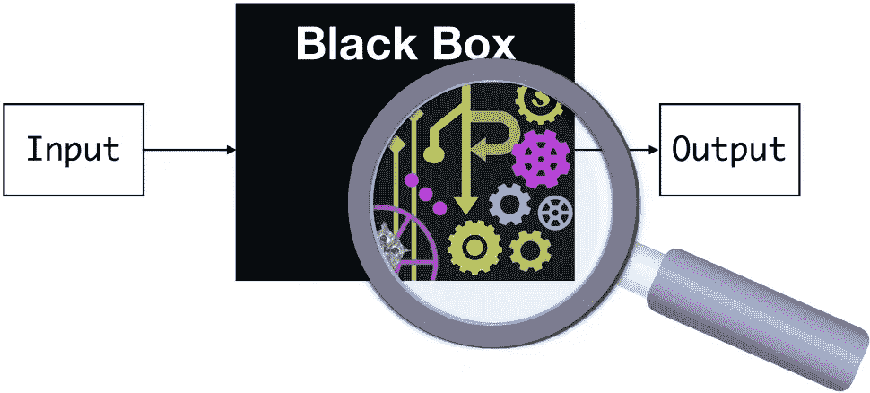
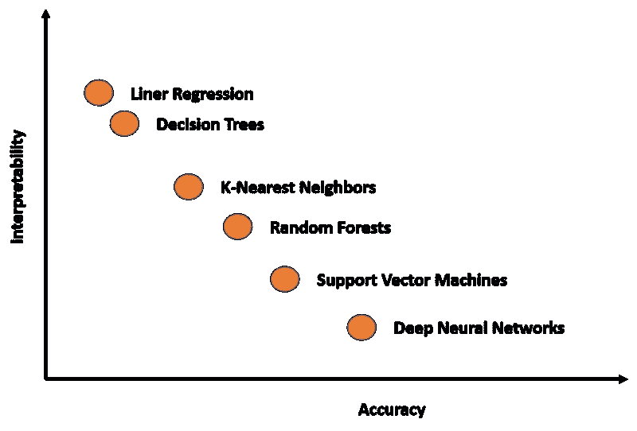
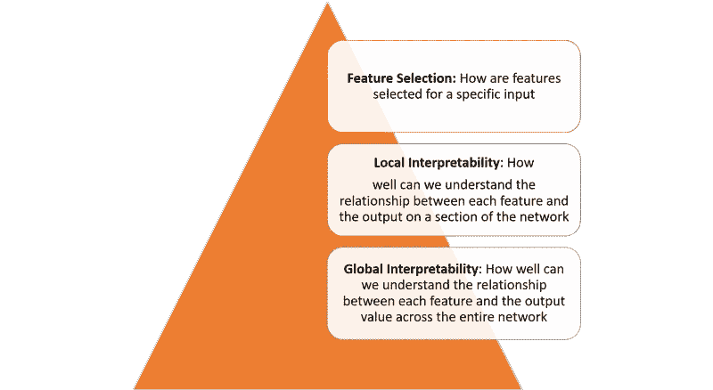
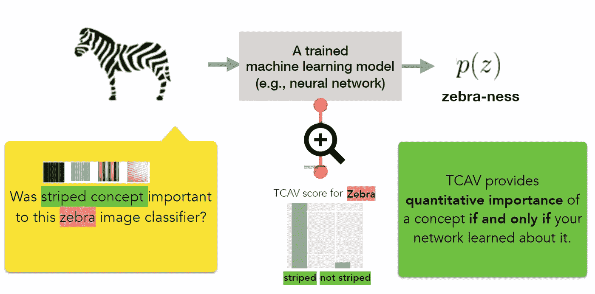
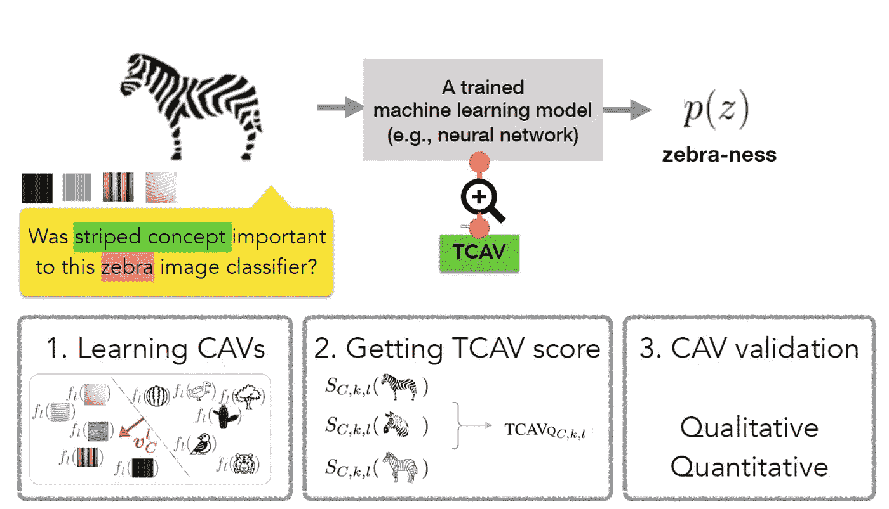
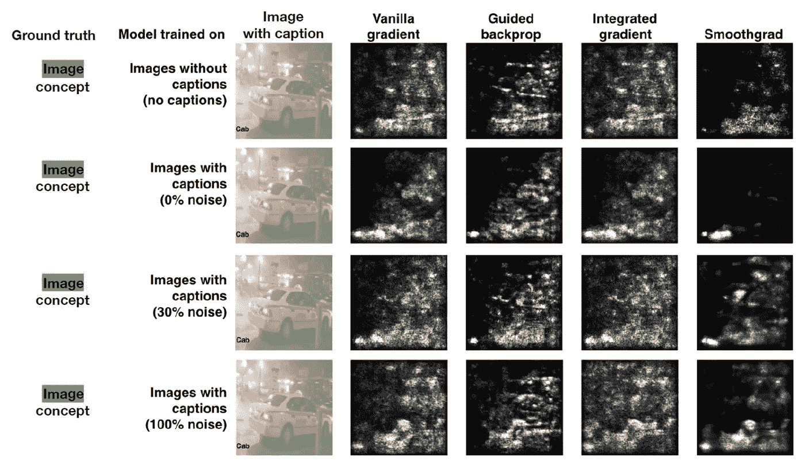
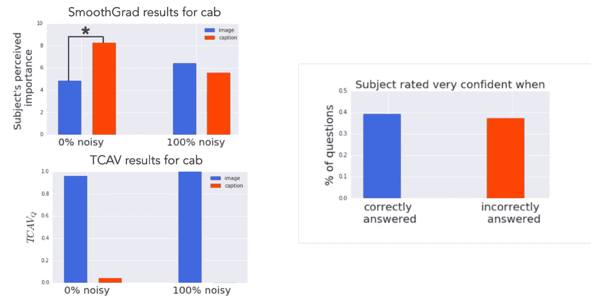

# 这项谷歌大脑技术简化了 ML 的可解释性

> 原文：<https://pub.towardsai.net/this-google-brain-technique-streamlines-ml-interpretability-1ff616284730?source=collection_archive---------1----------------------->

## [机器学习](https://towardsai.net/p/category/machine-learning)

## 概念激活向量是理解 ML 模型行为的一个有趣的想法。

来源:https://blog.ml.cmu.edu/tag/interpretability/

> 我最近创办了一份专注于人工智能的教育时事通讯，已经有超过 10 万名订户。《序列》是一份无废话(意思是没有炒作，没有新闻等)的 ML 导向时事通讯，需要 5 分钟阅读。目标是让你与机器学习项目、研究论文和概念保持同步。请通过订阅以下内容来尝试一下:

 [## 序列|子堆栈

### 订阅人工智能世界中最相关的项目和研究论文。受到 110，000+的信任…

thesequence.substack.com](https://thesequence.substack.com/) 

可解释性仍然是现代深度学习应用的最大挑战之一。计算模型和深度学习研究的最新进展使得能够创建高度复杂的模型，这些模型可以包括数千个隐藏层和数千万个神经元。虽然创建令人难以置信的高级深度神经网络模型相对简单，但它对这些模型如何创建和使用知识的理解仍然是一个挑战。几年前，来自谷歌大脑团队[的研究人员发表了一篇论文，提出了一种称为概念激活向量](https://arxiv.org/pdf/1711.11279.pdf) (CAVs)的新方法，从一个新的角度研究深度学习模型的可解释性。

# 可解释性与准确性

为了理解 CAV 技术，理解深度学习模型中可解释性挑战的本质是很重要的。在当前这一代深度学习技术中，模型的准确性和我们解释其知识的能力之间存在永久的摩擦。可解释性和准确性之间的摩擦是能够完成复杂的知识任务和理解这些任务是如何完成的之间的摩擦。知识与控制、绩效与责任、效率与简单……选择你最喜欢的困境，它们都可以通过平衡准确性和可解释性来解释。

你关心获得最好的结果，还是关心理解那些结果是如何产生的？这是数据科学家在每个深度学习场景中都需要回答的问题。许多深度学习技术本质上是复杂的，尽管它们在许多情况下结果非常准确，但它们可能变得难以置信地难以解释。如果我们可以在一张关联准确性和可解释性的图表中绘制一些最知名的深度学习模型，我们将得到如下内容:

深度学习模型中的可解释性不是一个单一的概念，可以在多个层面上看到:

实现上图中定义的每一层的可解释性需要几个基本的构建块。在最近的一篇论文中，来自谷歌的研究人员概述了他们认为的可解释性的一些基础构件。

Google 将可解释性的原则总结如下:

**—了解隐藏层的作用:**深度学习模型中的大部分知识都是在隐藏层中形成的。在宏观水平上理解不同隐藏层的功能对于能够解释深度学习模型是至关重要的。

**—理解节点是如何激活的:**可解释性的关键不是理解网络中单个神经元的功能，而是理解在同一空间位置一起放电的相互连接的神经元群。将一个网络分割成相互连接的神经元群将提供一个更简单的抽象层次来理解它的功能。

**—理解概念是如何形成的:**理解深度神经网络如何形成单个概念，然后这些概念可以被组合成最终输出，这是可解释性的另一个关键组成部分。

这些原则是谷歌新 CAV 技术背后的理论基础。

# 概念激活向量

按照上一节讨论的想法，可解释性的自然方法应该是根据深度学习模型考虑的输入特征来描述深度学习模型的预测。一个典型的例子是逻辑回归分类器，其中系数权重通常被解释为每个特征的重要性。然而，大多数深度学习模型对像素值等特征进行操作，这些特征并不对应于人类容易理解的高级概念。此外，模型的内部值(例如，神经激活)可能看起来不可理解。虽然诸如显著图的技术在测量特定像素区域的重要性方面是有效的，但是它们不能与更高级别的概念相关联。

CAV 背后的核心思想是测量模型输出中概念的相关性。一个概念的 CAV 仅仅是一个在该概念的一组例子的值(例如，激活)方向上的向量。在他们的论文中，谷歌研究团队概述了一种新的线性可解释性方法，称为 CAV 测试(TCAV)，使用方向导数来量化模型预测对 CAV 学习的底层高级概念的敏感性。从概念上讲，TCAV 有四个目标:

**—可访问性:**几乎不需要用户的 ML 专业知识。

**—定制:**适应任何概念(如性别)，不限于训练时考虑的概念。

**—插件就绪:**无需对 ML 模型进行任何重新训练或修改即可工作。

**—全局量化**:可以用一个量化指标解释整个类别或一组实例，而不仅仅是解释单个数据输入。

图片来源:谷歌研究

为了实现上述目标，TCAV 方法分为三个基本步骤:

1)定义模型的相关概念。

2)理解预测对那些概念的敏感性。

3)外推每个概念对每个模型预测类的相对重要性的全局定量解释。

图片来源:谷歌研究

TCAV 方法的第一步是定义一个感兴趣的概念(CAV)。TCAV 简单地通过选择一组代表这个概念的例子或者找到一个带有这个概念标签的独立数据集来实现这个目标。CAV 是通过训练一个线性分类器来区分由一个概念的例子和任何层中的例子产生的激活来学习的。

第二步是生成 TCAV 分数，该分数量化了预测对特定概念的敏感度。TCAV 通过使用方向导数来实现这一点，方向导数在神经激活层测量最大似然预测对概念方向输入变化的灵敏度。

最后一步试图评估学习到的 CAV 的全球相关性，以避免依赖不相关的 CAV。毕竟，TCAV 技术的一个缺陷是学习一个无意义的 CAV 的可能性。毕竟，使用随机选择的一组图像仍然会产生 CAV。基于这种随机概念的测试不太可能有意义。为了应对这一挑战，TCAV 引入了一种统计显著性测试，根据随机的训练次数(通常为 500 次)来评估 CAV。这个想法是，一个有意义的概念应该导致 TCAV 分数在训练中表现一致。

# TCAV 在行动

谷歌大脑团队进行了几次实验，以评估与其他可解释性方法相比，TCAV 的效率。在最引人注目的测试之一中，该团队使用了一个显著图，试图预测一个标题或图像的相关性，以理解出租车的概念。显著图的输出如下所示:

图片来源:谷歌研究

使用这些图像作为测试数据集，谷歌大脑团队在亚马逊 Mechanical Turk 上用 50 个人进行了实验。每个工人做一系列的六个任务(3 个对象类 x 2s aliency 贴图类型)，都是为了一个模型。任务顺序是随机的。在每项任务中，工作人员首先看到四幅图像及其对应的显著性遮罩。然后，他们评估图像对模型的重要性(10 分制)，标题对模型的重要性(10 分制)，以及他们对自己答案的自信程度(5 分制)。总体而言，turkers 对 60 幅独特的图像进行了评级(120 幅独特的显著性图)。

实验的基本事实是图像概念比标题概念更相关。然而，当查看显著性图时，人类认为字幕概念更重要(0%噪声的模型)，或者看不出差异(100%噪声的模型)。相比之下，TCAV 的结果正确地表明，意象概念更为重要。

图片来源:谷歌研究

TCAV 是近几年来研究神经网络可解释性的最具创新性的方法之一。初始技术的代码在 GitHub 上[可用，我们应该会看到主流深度学习框架采用其中的一些想法。](https://github.com/tensorflow/tcav)