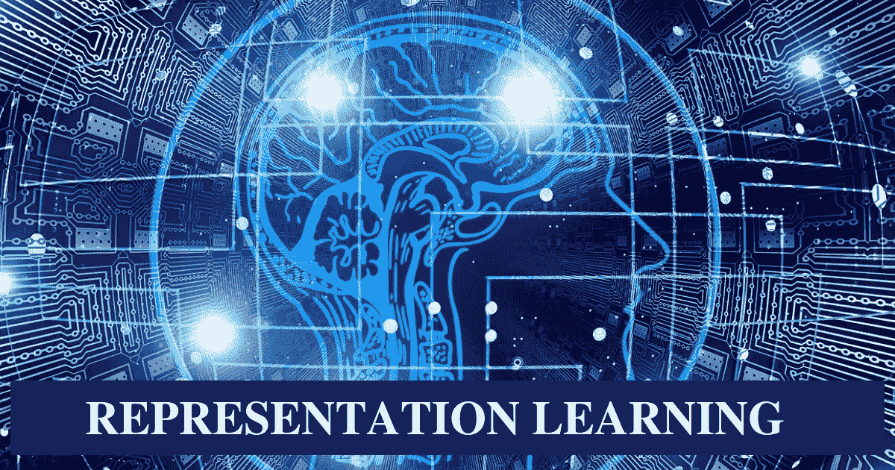
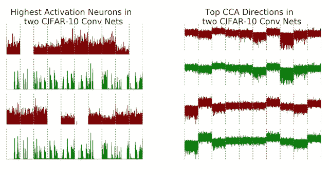
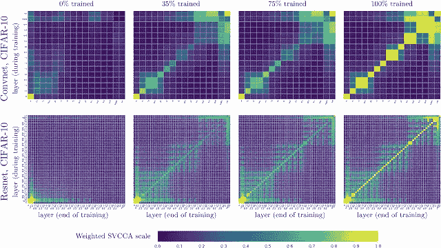
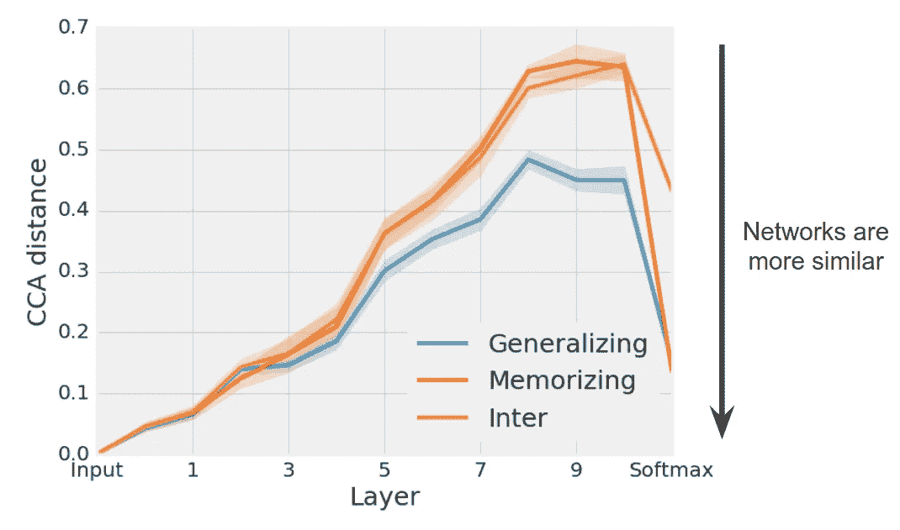
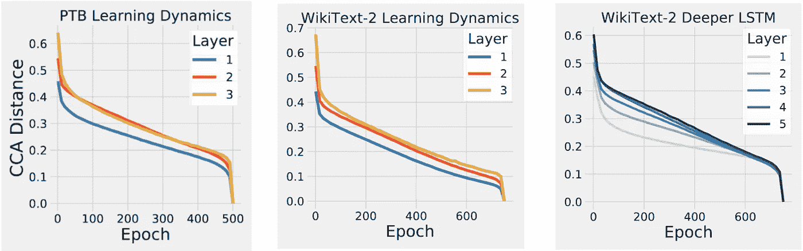

# 这个谷歌模型通过比较来学习

> 原文：<https://pub.towardsai.net/this-google-model-learns-by-comparing-ee28da6aa60d?source=collection_archive---------0----------------------->

## [深度学习](https://towardsai.net/p/category/machine-learning/deep-learning)

## 奇异向量典型相关分析是一种掌握两个数据集之间表示相似性的技术。

来源:[https://www . digitalvidya . com/blog/representation-learning-101-get-ready-set-go/](https://www.digitalvidya.com/blog/representation-learning-101-get-ready-set-go/)

> 我最近创办了一份专注于人工智能的教育时事通讯，已经有超过 90，000 名订户。《序列》是一份无废话(意思是没有炒作，没有新闻等)的 ML 导向时事通讯，需要 5 分钟阅读。目标是让你与机器学习项目、研究论文和概念保持同步。请通过订阅以下内容来尝试一下:

 [## 序列

### 订阅人工智能世界中最相关的项目和研究论文。受到 85，000 多人的信任…

thesequence.substack.com](https://thesequence.substack.com/) 

解释和理解深度神经网络的行为仍然是深度学习生态系统中的主要挑战之一。作为人类，我们经常试图通过与我们熟悉的其他知识领域进行比较来理解新的主题。从这个角度来看，比较不同的神经网络似乎是提高其可解释性的一种自然手段。然而，深度学习模型的比较远不是一件容易的事情。给定两个深度神经网络，我们如何确定它们有多相似，并将其与它们的性能相关联？来自 Google Brain 的一组人工智能(AI)研究人员一直在这个领域做一些开创性的工作，开发了表征相似性的概念，以量化不同深度神经网络之间的相似性。

# SVCCA 与表征相似性

我们能否定量比较两种不同深度学习模型学习到的表征？代表性相似性的概念试图使用统计模型来计算不同深度神经网络之间的相似性。在一篇论文“ [SVCCA:深度学习动力学和可解释性的奇异向量典型相关分析](https://arxiv.org/abs/1706.05806)”中，谷歌引入了一种简单且可扩展的统计方法，用于评估深度神经网络之间的相似性。SVCCA 是一种统计技术，用于关联由基础过程产生的两组观察值。它识别两组多维变量之间的“最佳”(最大化相关性)线性关系(在相互正交和范数约束下)。

在深度学习模型的情况下，SVCCA 通过评估隐藏层中的神经元激活来测量两个深度神经网络之间的接近度。使用这种技术，谷歌的研究人员专注于两个主要场景:

a)评估由两个不同的神经网络学习的表示之间的相似性。

b)评估由同一深度神经网络中的隐藏层学习的表示之间的相似性。

作为一种技术，SVCCA 接受两组神经元，并输出它们都学习的对齐的特征图。该方法还考虑了表面差异，如神经元排序的排列(对比较不同的网络至关重要)，并可以在其他更直接的比较失败的情况下检测相似性。例如，让我们使用 [CIFAR-10](https://www.cs.toronto.edu/~kriz/cifar.html) 数据集训练两个卷积神经网络(绿色和红色)。左边的图像显示了使用传统技术的比较，该技术测量网络中最高水平的神经激活。如您所见，这两个网络没有明显的相似之处，对吗？没那么快……应用 SVCCA 后我们可以清楚地看到，两个网络学习到的表征确实相当相似(右图)。

**图片来源:谷歌**

Google 还应用 SVCCA 来评估同一网络中不同隐藏层学习到的表示之间的相似性。例如，下图显示了一个矩阵，用于评估不同训练阶段中隐藏层之间的相似性。矩阵中的每个[i，j]单元测量层 I 和 j 之间的相似性。该实验表明，更接近输入的深层神经网络中的层比更高层收敛得更快。这被称为自下而上收敛，是使用 SVCCA 获得的最重要的发现之一。

**图片来源:谷歌**

Github 提供了 SVCCA 技术[的基本实现。](https://github.com/google/svcca)

# 记忆和概括网络

在 SVCCA 论文发表后，谷歌大脑团队将他们的工作扩展到更复杂的 CNN 架构以及递归神经网络(RNNs)。这项工作在最近的一篇研究论文中得到了强调，该论文题为“关于具有典型相关性的神经网络中的表征相似性的见解”。在 CNN 的案例中，谷歌团队专注于两个主要架构:

*   *一般化网络*:CNN 通过未修改的、精确的标签对数据进行训练，并学习推广到新数据的解决方案。
*   *记忆网络*:在带有随机标签的数据集上训练的 CNN，使得它们必须记忆训练数据，并且根据定义不能概括。

在将 SVCCA 应用于每种 CNN 的多个实例后，实验表明，*不同的*一般化网络组始终比记忆网络组收敛到更相似的表示(特别是在后面的层中)。在这两种情况下，每组概括和记忆网络的 CCA 距离都显著减小，因为每个单独组中的网络都做出了类似的预测。

**图片来源:谷歌**

# SVCCA 和 RNNs

[在他们最近的研究](https://arxiv.org/abs/1806.05759)中，谷歌还应用了 SVCCA 来研究递归神经网络(RNNs)中的相似性。rnn 的架构与 CNN 有一些相同的复杂性，但 rnn 提出了额外的挑战，即它们的表示在序列的过程中会发生变化。

将 SVCCA 应用于 rnn 的主要目的是确定后者是否表现出与 CNN 相同的自下而上的收敛模式。为了测试这一点，谷歌大脑团队测量了训练过程中 RNN 每一层的表示与其在训练结束时的最终表示之间的 CCA 距离。结果表明，就像 CNN 一样，RNNs 也以自下而上的方式收敛。

**图片来源:谷歌**

比较和类比是人类认知中的重要元素。像 SVCCA 这样的技术已经使用相似性来揭示 CNN 和 rnn 的重要和未知的特征。正如生活中的一切一样，比较可能成为帮助我们理解深度学习网络行为的重要机制。