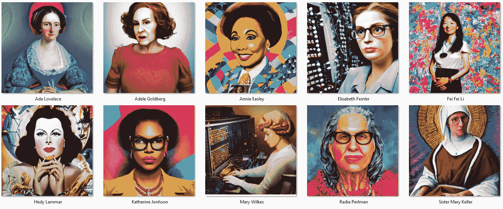
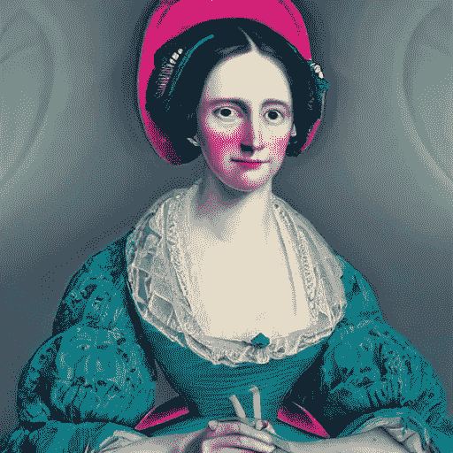
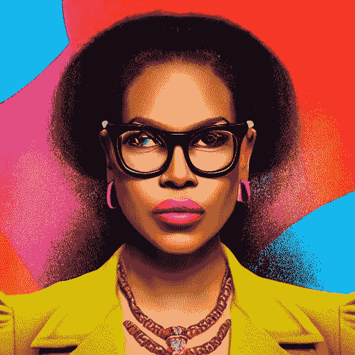
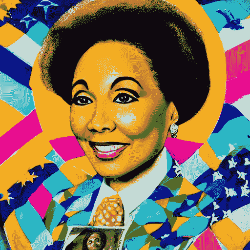
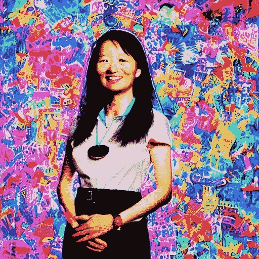

# 这就是人工智能如何重新想象改变了科技世界的 10 位女性。

> 原文：<https://pub.towardsai.net/this-is-how-ai-reimagined-10-women-who-changed-the-world-of-technology-2dd776753986?source=collection_archive---------2----------------------->

来源:[我的稳定扩散创作](https://www.instagram.com/mystablediffusioncreations/)

## 使用人工智能创建独特的肖像，以庆祝这些技术先驱在我们的世界中的伟大工作。

我们都知道，男性一直主导着科技行业，只有 25%的女性拥有工作。

这种性别差距的根本原因可能取决于几个因素，例如，直到 20 世纪 70 年代，女性才有权不受歧视地上学，甚至无权被 STEM(科学、技术、工程和数学)领域接受。即便如此，女性仍然做得很好，推动并改变了科技世界，尽管存在所有问题，但她们总是能够改变世界。

我过去写过这个话题(例如，你可以在这里阅读**和 [**这里**](https://medium.com/illumination/building-bridges-between-diversity-and-inclusion-and-enterprise-data-c9af05f1ace1?sk=703dc53ffe9e7edc44f0a03776fcc70f) )。今天，这是献给所有强大的，创新的，技术妈妈，游戏规则改变者，推动者和先锋女性，她们在幕后工作，使我们今天的技术驱动的世界成为可能。**

**这些天来，我一直在研究人工智能(如果没有技术行业成千上万名伟大女性的工作，这项技术就不会存在)如何被用来创建或重新解释基于文本输入的图像(你可以在这里**阅读它)，我正在制作一系列艺术项目，使用人工智能重新想象技术历史上 10 位最重要的女性的肖像。****

****因为我想创作创新和现代的女性肖像，并且可以使用任何我想要的风格，安妮·莱博维茨似乎是显而易见的选择。然而，我也想让它们变得多彩和时尚，所以我选择了大卫·拉切贝尔的风格。****

****大卫·拉切贝尔是美国摄影师、音乐视频导演和电影导演，如果你不知道的话。他最出名的是他的时尚和摄影作品，这些作品经常参考艺术史，有时也传达社会信息。所以，我认为他的风格非常适合这个项目。****

****我不会谈论这个基于稳定扩散的创意项目的历史(互联网上到处都是解释这个令人惊叹的 AI 模型的文章……)，但我会简单谈谈我用来制作图片的提示。****

****所有的照片都是用同样的计划制作的:****

****“对<*姓名的高度详细和逼真的描述以及关于此人* >的一些独特和简短的信息，采用大卫·拉切贝尔的风格，漂亮、对比鲜明、色彩鲜明、充满活力、8k”****

****这种设置将确保创建一些非常现实和充满细节的肖像，以大卫·拉切贝尔的风格完成美丽，高对比度和明亮的色彩，并在 8k 格式。****

****说到这里，让我们来探索人工智能是如何重新想象改变了科技世界的 10 位女性的:****

********

****阿达·洛芙莱斯——来源:[我的稳定扩散创作](https://www.instagram.com/mystablediffusioncreations/)****

# ****阿达·洛芙莱斯****

****阿达·洛芙莱斯出生于 1815 年。她的母亲在家教她，并确保她学习科学和数学。因此，尽管 Ada 是一名英国作家，她被认为是第一个程序员，因为她写下了引擎的想法是如何从一个计算变成另一个计算的。****

****因此，她是科技领域最知名的女性之一，甚至有人称她为“计算机时代的先知”。阿达·洛芙莱斯日在 10 月份每隔一周的周二举行，以表彰女性在 STEM 领域的成就。****

********

****玛丽·凯勒修女——来源:[我的稳定扩散创作](https://www.instagram.com/mystablediffusioncreations/)****

# ****玛丽·凯勒修女****

****玛丽·凯勒是一位美国天主教修女，生于 1913 年。1958 年，她开始在达特茅斯学院全男性计算机中心工作。****

****她和另外两位科学家一起工作来创造基本的计算机语言。后来，她在克拉克学院创办并领导了一个计算机科学系。****

****她是计算机科学领域女性的坚定支持者，也是第一位获得计算机科学博士学位的女性。****

********

****海迪·拉马尔——来源:[我的稳定扩散创作](https://www.instagram.com/mystablediffusioncreations/)****

# ****海蒂·拉玛****

****海蒂出生于 1914 年。她是一个著名的女演员，但这并不是她能做的全部。海蒂致力于几项发明。但是，她什么都是独立学习的，没有受过正规的技术培训。****

****海蒂和乔治·安太尔一起工作，制造秘密通信系统，一种跳频装置，这是她最好的主意。这种装置在战争中主要用于发送无线电制导鱼雷偏离航线。****

****它是许多现代发明的基础，如 Wifi、GPS 和蓝牙。****

********

****凯瑟琳·约翰逊——来源:[我的稳定扩散创作](https://www.instagram.com/mystablediffusioncreations/)****

# ****凯瑟琳·约翰逊****

****凯瑟琳出生于 1918 年。她是西弗吉尼亚研究生院仅有的三名黑人学生之一。她在国家航空咨询委员会的全黑计算部门(NACA)工作。****

****即使凯瑟琳是一台“计算机”，她也努力加入为不同的 NASA 项目工作的团队。****

****她想出了美国国家航空航天局的宇宙飞船和宇航员如何绕地球飞行并在月球着陆，她使这两件重要的事情在历史上成为可能。****

********

****安妮·伊斯利——来源:[我的稳定扩散创作](https://www.instagram.com/mystablediffusioncreations/)****

# ****安妮·伊斯利****

****安妮·伊斯利出生于 1933 年，主修药学。然而，因为她擅长数学，她申请了国家航空咨询委员会(NACA)的工作。****

****伊斯利的第一份工作是作为“人类计算机”，为科学家们做数学运算。她是在 NACA 工作的四名黑人之一。后来，她学会了如何编码，成为了一名程序员。****

****她制造并使用了导致混合动力汽车电池产生的代码。****

********

****来源:[我的稳定扩散创作](https://www.instagram.com/mystablediffusioncreations/)****

# ****伊丽莎白·费恩勒****

****伊丽莎白·费恩勒生于 1931 年。她爱上了整理数据列表，并于 1972 年至 1989 年在国防部工作，担任 ARPANET、国防数据网络和网络信息中心的主任。****

****她的小组制造了第一个互联网“黄页”和“白页”服务器，以及第一个基于查询的网络主机名和地址(WHOIS)服务器。****

****此外，伊丽莎白因创建域名协议(DNS)而闻名。所以。coms，。网还有。我们日常使用的 gov 都是拜她所赐。****

********

****玛丽·艾伦·威尔克斯——来源:[我的稳定扩散创作](https://www.instagram.com/mystablediffusioncreations/)****

# ****玛丽·艾伦·威尔克斯****

****玛丽·威尔克斯出生于 1937 年。他曾经给计算机编程并设计它们的逻辑。****

****早年，玛丽在麻省理工学院林肯实验室工作，使用 IBM 709 和 IBM 704 等计算机。1961 年，威尔克斯被赋予制造 LINC 的工作，这是第一台交互式个人电脑。****

****她制作系统软件，并为操作系统编写代码，让你与它互动。****

****玛丽·艾伦·威尔克斯也是第一个在家里拥有电脑的人。****

********

****阿黛尔·戈德堡——来源:[我的稳定扩散创作](https://www.instagram.com/mystablediffusioncreations/)****

# ****阿黛尔·戈德堡****

****生于 1945 年的 Adele 在大学三年级和四年级之间的那个夏天开始在 IBM 工作，当时她利用午休时间自学了如何给单元记录机编程…****

****Adele 是设计 Smalltalk-80 编程语言的团队中唯一的女性，该语言用于在 20 世纪 70 年代在 Xero Palo Alto 研究中心(PARC)(WIMP)创建具有窗口、图标、菜单和指针的第一个当代图形用户界面(GUI)****

********

****Radia Perlman 博士——来源:[我的稳定扩散创作](https://www.instagram.com/mystablediffusioncreations/)****

# ****拉迪亚·帕尔曼博士****

****1951 年出生的 Radia 在麻省理工学院获得了计算机科学博士学位。****

****在 20 世纪 70 年代，她创造了 TORTIS，一种儿童友好的教育语言，后来又发明了生成树算法和协议，将以太网从单线载波侦听多路访问(CSMA)协议转变为能够处理巨大云的协议。****

****Radia 博士被誉为“互联网之母”,并开发了网桥操作的原则。****

********

****费李非博士——来源:[我的稳定扩散创作](https://www.instagram.com/mystablediffusioncreations/)****

# ****费·李非博士****

****李博士，1976 年出生，斯坦福大学以人为中心的人工智能研究所联席主任，曾任谷歌副总裁、谷歌云 AI/ML 首席科学家。****

****她是 ImageNet 的创始人，ImageNet 是一个包含超过 1500 万张照片的数据库，通过“训练”第一台计算机识别和理解照片中的内容，帮助了深度学习和人工智能的最新进展。****

****这位斯坦福大学的教授还共同创立了 AI4ALL，这是一家致力于增加人工智能多样性的非营利组织。****

# ****结论****

****我希望这篇文章能帮助你了解稳定扩散模型的可能性，更重要的是，帮助你了解并记住这些技术先驱所做的伟大工作。****

****这些女性做了一切事情，从编写代码到构建计算机，再到为我们今天使用的所有技术奠定基础，所以我们应该为她们所做的(以及仍在做的)事情向她们致敬。****

****我尽我所能鼓励我的女儿们努力工作，在科技领域树立一个好榜样。我希望你对你的女儿、姐妹、母亲和朋友也这样做。所以他们有机会让世界变得更美好。****

****这些图片和我用人工智能创作的所有其他创意项目都可以在我的 [**Instagram 账户**](https://www.instagram.com/mystablediffusioncreations/) 上找到——你可以在那里关注我:****

 ****[## Jair Ribeiro(@ mystablediffusioncreations)* insta gram 照片和视频

### 编辑描述

www.instagram.com](https://www.instagram.com/mystablediffusioncreations/)**** 

# ****你可能想读的其他文章。****

*   ****[**我们正在见证人工智能的下一次进化吗？**](/are-we-witnessing-the-next-evolution-of-artificial-intelligence-264f251ea06d)****
*   ****[**这 10 个算法可以改变你的生活——如果你和数据一起工作**](/these-10-algorithms-can-change-your-life-if-you-work-with-data-ff544657922d)****
*   ****[**快速浏览稳定扩散的开源架构。**](https://medium.com/codex/a-quick-look-under-the-hood-of-stable-diffusion-open-source-architecture-2f07fc1e729)****
*   ****[**5 种非常实用的方式人工智能可以帮助提高你公司的生产力**](/5-very-practical-ways-ai-can-help-to-improve-your-companys-productivity-f4d5dcd0b30c)****
*   ****[**这 9 篇研究论文正在改变我今年对人工智能的看法。**](https://medium.com/illumination/these-9-research-papers-are-changing-how-i-see-artificial-intelligence-this-year-cd8ba548f785)****

# ****链接、资源和参考资料****

*   ****2022 年 8 月 23 日国会记录-备注扩展。[https://www . congress . gov/117/crec/2022/08/23/168/138/CREC-2022-08-23-pt1-PGE 869 . pdf](https://www.congress.gov/117/crec/2022/08/23/168/138/CREC-2022-08-23-pt1-PgE869.pdf)****
*   ****Honey 和她的 RMTS 经历。[https://www . standupforkids . org/blog/article/honey-and-her-rmts-experience](https://www.standupforkids.org/blog/article/honey-and-her-rmts-experience)****
*   ****第一位获得麻省理工学院计算机科学博士学位的女性。[https://www . theatlantic . com/technology/archive/2014/03/第一位获得麻省理工学院计算机科学博士学位的女性/284127/](https://www.theatlantic.com/technology/archive/2014/03/the-first-woman-to-get-a-phd-in-computer-science-from-mit/284127/)****
*   ****关于技术的 10 个奇怪事实——TipTopTens.com。[http://www . tiptop tens . com/2018/05/10/10-odd-facts-technology/](http://www.tiptoptens.com/2018/05/10/10-odd-facts-technology/)****
*   ****1997 年 1 月:人民——朱迪·巴里的最后阵地——北海岸杂志。[https://www.northcoastjournal.com/jan97/1-97.people.html](https://www.northcoastjournal.com/jan97/1-97.people.html)****

# ****你愿意支持我吗？****

****为了获得无限的故事，你还可以考虑注册**成为中等会员，只需 5 美元。此外，如果您使用我的链接* [*注册*](https://medium.com/@jairribeiro/membership) *，我将收到一小笔佣金(无需您额外付费)。******

***** [## 通过我的推荐链接加入媒体- Jair Ribeiro

### 阅读我分享的每一个故事(以及媒体上成千上万的其他作者)。你的会员费直接支持其他…

medium.com](https://medium.com/@jairribeiro/membership)*****