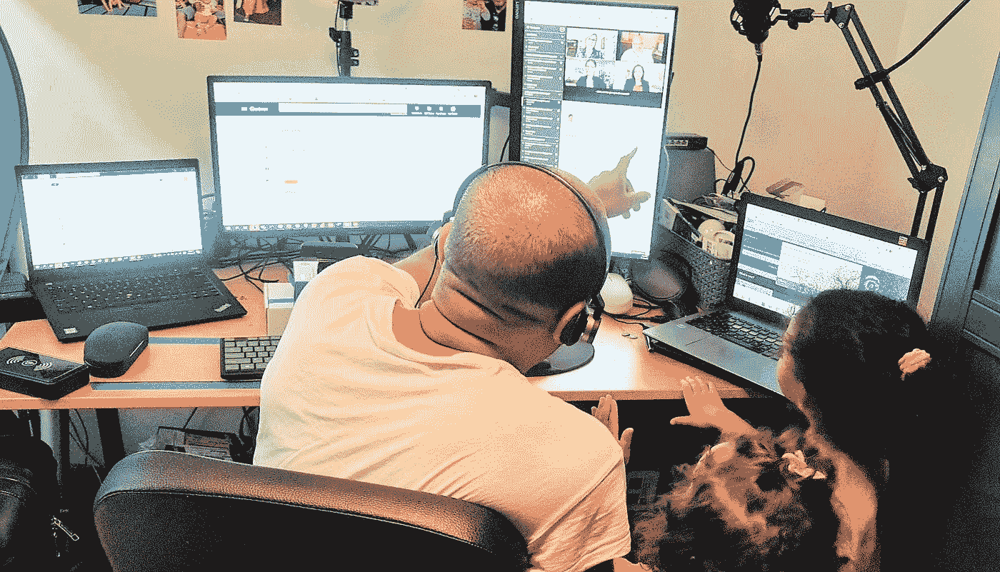

# 这是我在过去的 24 小时里如何使用人工智能的

> 原文：<https://pub.towardsai.net/this-is-how-i-used-artificial-intelligence-in-my-life-during-the-last-24-hours-c187f4c8c556?source=collection_archive---------0----------------------->

来源:作者照片——我一天中的典型时刻

## 在过去的 24 小时里，我记录了人工智能在我生活中的每一次使用和体验，这是我所学到的。

24 小时内我们能做什么？从日出到日落，我们的生活中发生了什么？全球 24 小时内会发生什么？

平均来说，在 24 小时内，我会经历 104000 次心跳，我会呼吸大约 23000 次，我会平均走大约 8000 步，在淋浴时，我会花大约 12 分钟。

我的身体会脱落并产生多达 50 万亿个新细胞，我通常会在浴室呆 20 分钟。(如果我带着智能手机，时间会稍微长一点……)

我的头发会增加 0.35 毫米，同时我也会掉 40 到 100 根头发，平均来说，我会说大约 48000 个单词。

我们大多数人很难意识到仅仅 24 小时内发生了多少事情。有时我们完全意识不到我们一天中经历了多少，这让我觉得是欣赏生活中每一天的最好理由。

作为一名人工智能专家，我通常以非常实用的方式来可视化事物，随着人工智能的使用不仅在我的职业生活中增加，它也越来越多地渗透到我的个人生活中。

然而，人工智能在我们的日常活动中经常被忽视，即使我可以自信地肯定，即使没有意识到，我们已经在使用这项技术。从现在开始，你会发现这是千真万确的。

在这篇文章中，我将记录我在日常生活中看到和经历的证明人工智能存在的一切(不包括我的专业活动……当然，这是基于人工智能的),以帮助解释为什么这种智能正在改变我们的世界(向更好的方向)。

# 00:00–01:00—睡眠时间…

# 01:00–02:00—睡眠时间…

# 02:00–03:00—睡眠时间…

# 03:00–04:00—睡眠时间…

# 04:00–05:00—睡眠时间…

# 05:00–06:00—睡眠时间…

# 06:00–07:00—用我的脸解锁我的智能手机

我的闹钟每天早上 06:44 响起，我一醒来就伸手拿智能手机。

当使用 face ID 或其他生物识别技术时，我的智能手机使用人工智能来启用生物识别解锁功能。

当我的智能手机拍照时，三万个不可见的红外点照亮了我的脸。为了评估试图解锁手机的人是否是我，它然后采用机器学习算法来比较我的面部扫描和它保存的关于我的信息。

# 07:00–08:00—查看我的电子邮件

这并不奇怪，我早上做的第二件事是检查我的电子邮件…难怪有很多人工智能参与其中。

今天，大多数可用的电子邮件系统，包括 Gmail 和 Outlook，都采用人工智能来发现潜在的垃圾邮件，并阻止它们堵塞你的收件箱或以任何方式潜在地伤害你，例如通过传播病毒或欺骗你。

# 08:00–09:00—与人工智能社交

人工智能的应用使定制能力成为可能，这是社交网络如此引人注目的原因之一。

我经常在一天的早些时候检查我的社交网络，如 LinkedIn、脸书、Instagram 和 Twitter，我知道人工智能正在后台工作，为我提供更坚定的友谊建议，并显示最相关的广告，同时它持续监控我在浏览时所做的一切。

# 09:00–10:00—在谷歌上搜索

我的大部分时间都是从谷歌开始的，我经常搜索我将在工作或写作中使用的想法、新闻或概念，所以我可以说，人工智能如何在我的日常生活中使用的最好例子之一来自谷歌，它已经在很长一段时间内在几乎所有的商品和服务中使用这项技术。

谷歌的人工智能也存在于我的电子邮件中，在谷歌镜头(我经常使用)中进行图像识别，在谷歌地图中，甚至在与健康、正念和其他相关的其他行业的大 G 制作的软件中。

# 10:00–11:00—未检测到特定的人工智能活动。

今天这个时候…除了我为工作所做的以外，我没有发现任何与人工智能直接相关的活动。！

# 11:00–12:00—未检测到特定的人工智能活动。

我刚刚喝了很长时间的咖啡…而且没有人工智能参与…据我所知…

# 12:00–13:00—你好，Alexa 午餐吃什么？

我经常问一个虚拟助理我午餐应该吃什么…老实说…我不认为我是唯一一个…

虚拟助理利用人工智能来帮助我组织日常生活的许多方面。它们无处不在，在我的生活中，在我的智能手机上，或者在我家各处的设备上。那么，为什么不呢？

由于语音识别技术的进步，有时我可以与我的数字助理进行完整的对话，而且该系统基本上没有错误。

语音助手中人工智能最好的例子是 Siri、Alexa 和 Google Assistant(我在不同的情况下都使用它们)。他们听我的语音请求，使用我手机的语音识别和自然语言处理功能进行处理，然后以语音或文本的形式提供答案。

这些智能数字助理是我数字生活中的好伙伴，因为它们的作用变得越来越重要。他们协助我完成各种任务，例如:

*   网上购物
*   管理我的物联网设备
*   设置我的提醒和闹钟
*   出租车、航班和火车的预订
*   播放我最喜欢的播放列表等。

令人惊讶的是，人工智能助手可以理解我说的话，从任何背景噪音中分辨出我的声音，并在我向他们发出命令时理解我需要什么。

最令人惊讶的是，他们每天都变得越来越聪明。很神奇，是吧？

# 13:00–14:00—网上购物

我的空气净化器昨天给我发了一个通知，我应该更换过滤器…所以今天，我让 Alexa 给我买了它…在我结束购物之前，Alexa 问我是否想添加一个新的加湿芯…就这样。

电商越来越多的使用人工智能。商店主要关注物流，同时关注成本和时间。

基于人工智能的产品推荐系统对在线零售的成功至关重要，因为它们有助于提升购物体验。

AI 可以通过分析所有用户导航，在智能和定制的店面中显示最中肯的产品。此外，它甚至允许对每个用户的启动窗口进行更快和更有效的个性化，因为除了被个性化之外，窗口是自主的，需要更少的人工劳动。

今天，当我决定在亚马逊上购买一些东西时，这总是一种人工智能驱动的体验，因为它会在我的 feed 上为我的购物车中可能喜欢的商品提供建议，亚马逊的人工智能算法知道我想要什么，并向我推荐它…

亚马逊的预期运输算法允许它在我“点击购买”之前将东西发送给我，这表明了它对其预测分析和算法的信心。

# 14:00–15:00—使用人工智能路线应用程序

人工智能已经越来越多地用于各种类型的应用程序中，但我总是强调谷歌地图和 Waze 等路线应用程序是提升我日常生活的最令人惊叹的方式之一。

今天在接女儿放学的时候，我有机会欣赏这些应用程序如何使用人工智能来交叉来自许多地方的数据，以找到最佳路线，优化时间和避免交通问题。

# 15:00–16:00—使用人工智能进行投资

人工智能也极大地帮助了金融业。比如我经常依靠各种 AI 工具和软件来理财，甚至投资。

此外，技术和人工智能的发展使得甚至股票交易投资活动成为可能。我使用智能机器人来监控特定的金融市场动向，因为我不可能这样做。

我不是马克·库班，但我尽我所能使用人工智能来分析我的小投资选项和投资组合业绩跟踪，在某些情况下，我依赖人工智能来做出一些我可能缺乏远见或金融专业知识的调整……我必须说，它对我来说非常有效……

# 16:00–17:00—物联网、我的家和人工智能

我最近购买了一个人工智能牙刷，它“学习”我的刷牙习惯，适应它们，并提出改进建议。

在我家里，我还有一台由人工智能驱动的智能真空吸尘器(它使用计算机视觉、优化和导航来清理我们的家)，我们还有一台连接互联网的三星冰箱，它有一些有趣的人工智能功能，比如根据冰箱里的东西列出你需要的东西，并建议搭配晚餐的葡萄酒等...…

此外，我有一个智能空气滤清器谁可以感觉到空气质量，并作出决定，以改善它..这就是人工智能与物联网设备合作的最佳方式！

物联网(IoT)和人工智能(AI)一起创造了大量的可能性来制造更智能的家用小工具，这些小工具几乎不需要任何辅助。

虽然物联网关注设备如何与互联网通信，但人工智能使这些设备能够从数据中获取知识。

我家里的物联网设备使用大量传感器收集的数据的全部潜力都被人工智能释放了。

基本上，这些物联网设备能够更有效地适应人类的刺激和需求，这要归功于通过多次迭代从这些数据中获得的知识。

# 17:00-18:00—该写我的文章了

托马斯·曼恩建议作家每天至少花三个小时在他们的项目上。不幸的是，我不能每天写这么长时间，所以我决定限制自己每天写一个小时。

我发现写作是一种打破单调的奇妙方法，但它也需要巨大的投入和热情。此外，写作现在需要人工智能。

我在写作时使用了几个人工智能驱动的应用程序，因为我认为它们大大提高了我的写作效率。

例如，我使用了一个名为 Jasper 的应用程序，这可能是人工智能增强写作最实用的工具。

它利用人工智能所有奇妙的复杂性，生成关于我选择的任何主题的材料段落。贾斯帕可以提供很大的帮助，尽管很难理解一个为我写作的工具，帮助我成为一个更好的作家。

例如，当我写作遇到障碍时，一个叫做 Jasper 的工具介入并帮助我写一点，为我继续和发展它所写的思想和我的想法扫清道路。换句话说，当我有一个书写块时，这是一个非常好的工具。

QuillBot 是我每天使用的一个非常棒的程序；它为我解释任何文本。对我来说，很难把我的想法变成完整的短语；在这方面，QuillBot 可能非常有用。当与 Grammarly 一起使用时，它甚至更令人惊奇。

语法是一种工具，它提高了我的写作质量，并提供了我无法再没有的优势。它不仅解决了我在任何大小的文本中的语法问题，而且还通过解决我每天不怎么使用的词汇中可能出现的拼写错误，增强了我的信心。

此外，它还能识别我作品中重复的术语，并给我提供同义词，这样我就不会听起来单调乏味了。此外，它建议我重新措辞那些难以阅读或可能无法尽可能清晰理解的陈述。

我非常感激我可以使用 AI 来提高我的日常写作。写作是我一天中很大的一部分，对我来说不仅仅是一种爱好。这也许是我分享我的想法和观点的最可靠和最恰当的方式。

# 18:00–19:00—未检测到特定的人工智能活动。

我刚刚和家人共度了一段美好时光，准备晚餐，并让我的女儿们准备睡觉。不涉及 AI！

# 19:00–20:00—未检测到特定的人工智能活动。

简单的晚餐，淋浴，准备去健身房…还没有人工智能参与进来！

# 20:00–21:00—这是健身时间—没有人工智能，就没有收获

通常我一周去三四次健身房，所以如果我在那里使用人工智能应该不会让任何人感到惊讶。

我注意到，近年来，当我在健身房和我的教练在一起时，健身应用程序作为一种教育和激励手段的使用显著增加。

例如，我使用为我提供基本活动跟踪的 **FitnessAI** 应用程序，来确定我的优势和不足，并专注于在这些方面进行改进。

然后，在我的教练和人工智能建议的帮助下，我可以确定哪些练习和例行公事最适合我的个人需求，以及如何保持安全的逐步指导。

我从这款应用的算法中获得了个性化的训练计划，因为它拥有来自超过 600 万次锻炼的健身信息。

# 21:00–22:00—我现在应该看什么电影？

在一天结束的时候和网飞一起放松……就是这样！

当我看完一部电影，我喜欢从网飞那里得到一些好电影的推荐。这是人工智能在发挥作用，宝贝！！事实上，网飞的建议影响了我们 80%的看法。

流媒体服务的人工智能根据一段时间以来收集的数据，向我提供越来越好的推荐。这就是为什么我总是评价我看的电影、电视剧、纪录片。

通过人工智能推荐系统，你可能会发现你以前不知道的兴趣。它们在脸书和 Spotify 上仍然很受欢迎，在那里它们会根据你的收听习惯播放歌曲。

# 22:00–23:00——使用人工智能监控我的睡眠

通常我每天晚上 10 点左右睡觉，即使睡着了，我也用人工智能。我每天晚上都把智能手机放在枕头旁边，记录我喘息的次数，并在第二天早上分析我的打鼾分数。我使用 SnoreLab 应用程序来跟踪我睡觉时的呼吸，并利用人工智能来寻找打鼾和睡眠障碍的原因、影响因素和治疗方法。

该应用程序使用音频分析和深度学习技术来更好地理解睡眠呼吸障碍。

应用程序中的机器学习系统使用尖端的人工智能来识别睡眠障碍，它可以识别我的鼾声，同时无视其他卧室噪音，因为它是在卧室环境中运行的。这真是太棒了。

而且，我还有另一个智能设备整晚监视着我…我的三星智能手表。

我的智能手表使用内置的加速度计(运动传感器)和三星健康应用程序的专有人工智能算法来检测我的身体何时处于休息状态并且不再四处移动。

为了获得精确的睡眠数据，Samsung Health 使用了我的手表的传感器，包括心率和 SpO2。使用智能手机上的麦克风还可以监控我的鼾声。(有第二种意见总是好的，对吧？)

由我的智能手表和三星健康应用程序创建的生态系统使用尖端的传感器技术来记录我的生理反应，并使用 AI/ML 算法和数据分析来检测和发送特定健康状况的警报，经常帮助我改变行为，以改善我的健康和日常生活。

# 23:00–24:00—睡眠时间…

让我们来处理它吧…

# 结论

嗯，正如你所看到的，人工智能在我的日常生活中比以往任何时候都更加普遍，对吗？

老实说，如果没有人工智能的帮助，我的大多数日常活动对我来说都很难完成。

人工智能通常依赖于我们在日常生活中经常忽视的系统。智能手机就是一个例子，它根据从用户行为中学到的东西来提供个性化建议和相关搜索结果的显示。这是使人工智能成为可能的各种方法的结果。

对我来说，这些是人工智能如何出现在日常生活中的一些例子。

但是人工智能已经出现在你们的日常生活中，不仅仅是我的生活。它是目前正在发生的计算机科学重大技术变革的主要组成部分，帮助人们和公司做出更明智的决策，并将自动化和分析融入我们使用的日常应用和设备。

你有任何人工智能如何被应用于提高你的日常生活的例子吗？

# 你可能想读的其他文章。

*   今年，这 9 篇研究论文正在改变我对人工智能的看法。
*   [我们正在见证人工智能的下一次进化吗？](/are-we-witnessing-the-next-evolution-of-artificial-intelligence-264f251ea06d)
*   [你学习人工智能、机器学习和数据科学最印象深刻的 Youtube 频道](https://medium.com/p/486c1b41b92a)。
*   [这些是最好的 Youtube 频道，你可以在那里免费学习 PowerBI 和数据分析](https://medium.com/p/8f8eb434b48d)。
*   [人工智能能否成为数学家发现的新助推器？](https://medium.com/tech-cult-heartbeat/can-artificial-intelligence-be-a-new-booster-for-mathematicians-discoveries-7369a8c43a36)
*   [麻省理工学院的微型硕士项目](https://medium.com/p/ed090ed55288)是什么？
*   使用人工智能革新招聘的 5 家公司。
*   [你必读的 5 本关于 AI 的惊艳书籍](https://medium.com/p/4db9646e0807)。
*   [供你免费学习 AI 和机器学习的最好的 MIT 在线资源](https://medium.com/p/d3ba1e50f436)。

# 你愿意支持我吗？

*为了获得无限的故事，你也可以考虑* [*注册*](https://medium.com/@jairribeiro/membership) *成为中等会员，只需 5 美元。此外，如果您* [*使用我的链接注册*](https://medium.com/@jairribeiro/membership) *，我会收到一小笔佣金(无需您额外付费)。*

 [## 通过我的推荐链接加入媒体- Jair Ribeiro

### 阅读我分享的每一个故事(以及媒体上成千上万的其他作者)。你的会员费直接支持其他…

medium.com](https://medium.com/@jairribeiro/membership)