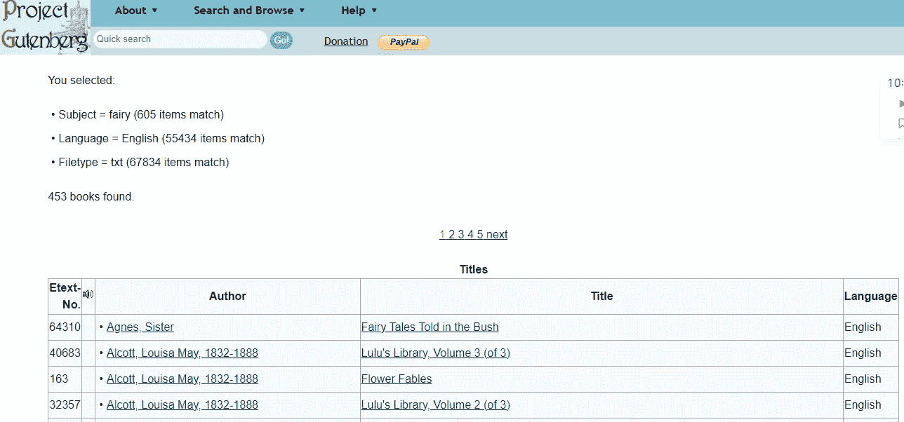
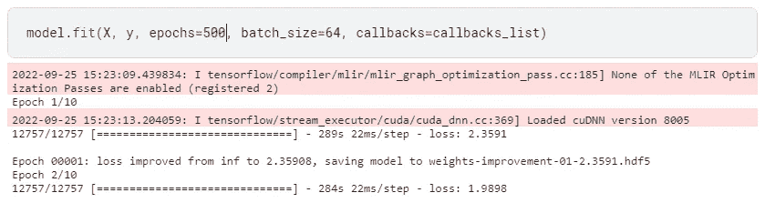

# 这就是我如何利用人工智能创造独一无二的童话故事

> 原文：<https://pub.towardsai.net/this-is-how-i-utilize-ai-to-create-one-of-a-kind-fairytales-d84bde347b5?source=collection_archive---------1----------------------->


## 探索使用递归神经网络生成文本的新方法。

一个年轻的女孩曾经喜欢阅读童话。每天晚上睡觉前，她都会和妈妈一起读。然而，随着年龄的增长，她意识到这些故事并不总是有意义的。他们非常容易预测，性格也没有太大变化。

“我们可以做得更好，”她心想。因此，她与她的人工智能专家父亲交谈，他们合作开始撰写她的童话，这将是新的，比她读过的任何东西都更令人激动。

于是，在人工智能的辅助下，他们开始开发自己的童话故事！

正如我上面提到的，故事已经大致开始了，自从我开始利用人工智能编写我们的童话以来，我的女儿们现在每天晚上都有无限的新故事可以讲。

人工智能生成的童话是我们对自己讲述的故事进行新思考的结果，而不仅仅是讲述它们的新方法。

我的人工智能生成的童话是以经典儿童故事的风格创作的。总的来说，它们提供了一个有着快乐结局的简单故事。

它们由文本的逐字符生成模型生成，该模型使用 Python 中的 LSTM 递归神经网络和 Keras。

LTSM 模型调查字符之间的关系和序列中字符的条件概率，允许您构建全新的和唯一的字符序列。一旦经过训练，该模型可以产生新的字符序列。

我用书中的文本训练我的模型，这些文本包括讲故事的例子。

然后，模型应用这些信息来创建新的任务。

除了用它们来帮助我的女孩们晚上睡觉，我还在纯人工智能博客上发布了一些最棒的故事，这些故事总是与我的人工智能生成的仙女配对。

我计划很快为家长提供购买印刷版或下载电子书的选择，供他们的孩子在平板电脑和智能手机上阅读。

## 向经典学习

正如我之前所说的，我的人工智能模型是用教科书上的童话例子创建的。因为古登堡计划是下载不再受版权保护的免费书籍的最佳地点之一，所以我这么做了。

我利用古腾堡计划中的数百个童话故事创建了一个策划数据集，其中包括刘易斯·卡罗尔和格林兄弟的作品。

当我开发这个模型的基本版本时，我创建了一个包含超过 1，000，000 个字符的数据集，当转换为小写时，神经网络学习的词典中有 56 个不同的字符——比字母表的 26 个字符多得多，对吗？

在为我的神经网络定义训练数据时，我可以自由选择如何在训练期间分解文本并将其暴露给网络。

所以我决定将数据集中的文本分成 100 个字符或任意长度的子序列。我可以把数据分成句子，填充较短的序列，截断较长的序列。我会在未来的版本中包括这一点。

每个网络训练模式由一个字符(X)后跟一个字符输出(y)的 100 次步进组成。当设计这些序列时，我在整本书上移动一个虚拟窗口，一次一个字符，允许每个字符从之前的 100 个字符中学习(当然，除了前 100 个字符)。

当然，因为神经网络处理的是数字而不是字符，所以当我将这本书分成这些序列时，我使用之前创建的查找表将字符转换为整数。

到目前为止，运行我的代码表明，当我将数据集划分为供网络学习的训练数据时，我收到了不到 1，000，000 个训练模式。这是有意义的，因为除了前 100 个字符，我只有一个训练模式可以预测剩余的每个字符。

一旦我准备好使用 Keras，我就必须转换我的训练数据。

首先，我必须将输入序列列表转换成 LSTM 网络期望的[样本、时间步长、特征]格式。

接下来，我必须将整数重新调整到 0 到 1 的范围内，以使 LSTM 网络更容易学习这些模式，该网络默认使用 sigmoid 激活函数。

最后，我使用一键编码来转换输出模式(单个字符到整数)。这就是为什么我可以设置网络来预测词汇表中 56 个可能字符中每个字符的概率(一种更简单的表示)，而不是推动它准确地预测下一个字符。

每个 y 值都被转换成一个稀疏向量，长度为 56，一列 1 表示模式所代表的字母(整数)。

## 创造 LTSM 模式。

现在必须定义 LSTM 模型，所以我定义了一个有 256 个内存单元的隐藏 LSTM 层。还有，我设置退学的概率是 20。

输出图层是一个密集图层，它使用 softmax 激活函数为每 56 个字符生成一个概率预测，范围从 0 到 1。

```
**# define my LSTM model**
model = Sequential()
model.add(LSTM(256, input_shape=(X.shape[1], X.shape[2]), return_sequences=True))
model.add(Dropout(0.2))
model.add(LSTM(256))
model.add(Dropout(0.2))
model.add(Dense(y.shape[1], activation=’softmax’))
model.compile(loss=’categorical_crossentropy’, optimizer=’adam’)
```

作为具有 56 个类的单字符分类问题，该任务被表征为使用 ADAM 优化算法来优化日志损失(交叉熵)以提高速度。

您可能已经注意到，我没有定义测试数据集。相反，我正在对完整的训练数据集进行建模，以计算出序列中每个字符的可能性。

我对训练数据集的最佳精度(分类精度)模型不感兴趣。

这是一个正确预测训练数据集中每个字符的模型。相反，我对概化最小化所选损失函数的数据集很感兴趣。

我在努力平衡泛化和过拟合，但是在记忆方面有所欠缺。

该网络需要很长时间来训练(在特斯拉 P100-PCIe-16GB 上每个时期大约 4 分钟)。

由于延迟和优化的需要，我采用了模型检查点来记录所有的网络权重，以便在 epoch 之后的丢失有所改善时归档。

然后，我使用最佳权重(最低损失)实例化了我的童话式生成模型。



我用这个模型的增强版得到了最好的结果，它使用了我从古腾堡项目下载的所有 453 本书，这些书都是英文的，有纯文本。

这个增强版本允许我在超过 500 次交互(epoch)后拥有可信的童话，这意味着大约 43 小时的 GPU 训练，在 epoch 479 时实现了 0.2219 的损失。



## 用我的 LTSM 模型创造一个童话

使用训练有素的 LSTM 网络创建一个寓言极其简单。

首先，我加载了数据，并以与之前相同的方式定义了网络，只是网络权重是从一个检查点文件中加载的，并且网络不需要训练。

为了理解这些预测，我需要开发一个反向映射，允许我将独特的字符转换成整数。

如果你想试试，这里有完整的代码:

```
**# LSTM Network to Generate Fairytales**import numpy as npfrom tensorflow.keras.models import Sequentialfrom tensorflow.keras.layers import Densefrom tensorflow.keras.layers import Dropoutfrom tensorflow.keras.layers import LSTMfrom tensorflow.keras.callbacks import ModelCheckpointfrom tensorflow.keras.utils import to_categorical**# load ascii text and covert to lowercase**filename = “wonderland.txt”raw_text = open(filename, ‘r’, encoding=’utf-8').read()raw_text = raw_text.lower()**# create mapping of unique chars to integers**chars = sorted(list(set(raw_text)))char_to_int = dict((c, i) for i, c in enumerate(chars))**# summarize the loaded data**n_chars = len(raw_text)n_vocab = len(chars)print(“Total Characters: “, n_chars)print(“Total Vocab: “, n_vocab)**# prepare the dataset of input to output pairs encoded as integers**seq_length = 100dataX = []dataY = []for i in range(0, n_chars — seq_length, 1):seq_in = raw_text[i:i + seq_length]seq_out = raw_text[i + seq_length]dataX.append([char_to_int[char] for char in seq_in])dataY.append(char_to_int[seq_out])n_patterns = len(dataX)print(“Total Patterns: “, n_patterns)**# reshape X to be [samples, time steps, features]**X = np.reshape(dataX, (n_patterns, seq_length, 1))**# normalize**X = X / float(n_vocab)**# one hot encode the output variable**y = to_categorical(dataY)**# define the LSTM model**model = Sequential()model.add(LSTM(256, input_shape=(X.shape[1], X.shape[2]), return_sequences=True))model.add(Dropout(0.2))model.add(LSTM(256))model.add(Dropout(0.2))model.add(Dense(y.shape[1], activation=’softmax’))model.compile(loss=’categorical_crossentropy’, optimizer=’adam’)**# define the checkpoint**filepath = “weights-improvement-{epoch:02d}-{loss:.4f}-bigger.hdf5”checkpoint = ModelCheckpoint(filepath, monitor=’loss’, verbose=1, save_best_only=True, mode=’min’)callbacks_list = [checkpoint]**# fit the model**model.fit(X, y, epochs=650, batch_size=64, callbacks=callbacks_list)
```

在建立模型并获得检查点之后，我准备进行文本预测。

为了使用 Keras LSTM 模型进行预测，我从一个种子序列作为输入开始，生成下一个字符，然后更新种子序列，在末尾添加生成的字符，并删除初始字符。

每当我需要预测新字符(例如，长度为 1，000 个字符的序列)时，就使用这种方法。

我可以使用一个随机的输入模式作为我的种子序列，然后完全按照生成的样子发布结果字符。

```
**# pick a random seed**start = np.random.randint(0, len(dataX)-1)pattern = dataX[start]print(“Seed:”)print(“\””, ‘’.join([int_to_char[value] for value in pattern]), “\””)**# generate characters**for i in range(1000):x = np.reshape(pattern, (1, len(pattern), 1))x = x / float(n_vocab)prediction = model.predict(x, verbose=0)index = np.argmax(prediction)result = int_to_char[index]seq_in = [int_to_char[value] for value in pattern]sys.stdout.write(result)pattern.append(index)pattern = pattern[1:len(pattern)]print(“\nThe End.”)
```

## 结果

我对我从这个模型的增强版本中获得的结果非常满意，它帮助我在任何我想要的时候获得一个新的鼓舞人心的童话。

我正致力于这个模型的疯狂优化版本，为我的博客写故事…你可以在下面看到一些结果:

*   温柔的耶泽贝塔·梭罗
*   [小精灵 tinker Ellis](https://merelyaiart.shop/2022/09/21/tinkerellis-the-elf/?v=9b7d173b068d)
*   [斯特拉·奥里比尔，仙女和妖精](https://merelyaiart.shop/2022/09/22/stella-oriebir-the-fairy-goblin/?v=9b7d173b068d)

当然，仍然需要一些语法修正和角色名字和地点的丰富多彩的添加，但我正在努力使童话制作完全自动化。

我可以使用绝对强大且随时可用的 GPT-2 模型，但我想自己试验并学习做一个相对较好的模型…对于某些任务，我显然更喜欢使用随时可用的模型…但对于特定的任务，如帮助我的女儿做甜蜜和鼓舞人心的梦，我更喜欢对正在发生的事情有一些控制…

## 结论

如果我们告诉自己的故事创造了我们的现实，如果我们用人工智能对故事有了新的思考方式，它就有可能塑造现实。

通过这个模型，我正在尝试使用递归神经网络生成文本的新方法。

如果你有兴趣深入了解，下面我会分享更多关于这个主题的资源和教程。

我还推荐从最受欢迎的教程开始，作者是 Andrej Karpathy，题目是“[递归神经网络的不合理有效性](https://karpathy.github.io/2015/05/21/rnn-effectiveness/)”

# 你可能想读的其他文章。

*   [**快速浏览稳定扩散开源架构的引擎盖下。**](https://medium.com/codex/a-quick-look-under-the-hood-of-stable-diffusion-open-source-architecture-2f07fc1e729)
*   [**我们正在见证人工智能的下一次进化吗？**](/are-we-witnessing-the-next-evolution-of-artificial-intelligence-264f251ea06d)
*   [**这 10 种算法可以改变你的生活——如果你与数据打交道**](/these-10-algorithms-can-change-your-life-if-you-work-with-data-ff544657922d)
*   [**这 9 篇研究论文正在改变我今年对人工智能的看法。**](https://medium.com/illumination/these-9-research-papers-are-changing-how-i-see-artificial-intelligence-this-year-cd8ba548f785)
*   [**5 个非常实用的方法人工智能可以帮助提高你公司的生产力**](/5-very-practical-ways-ai-can-help-to-improve-your-companys-productivity-f4d5dcd0b30c)

# 链接、参考和资源

*   [用递归神经网络生成文本](https://www.cs.utoronto.ca/~ilya/pubs/2011/LANG-RNN.pdf) [pdf]，2011
*   [用于文本生成的 LSTM Keras 代码示例](https://github.com/fchollet/keras/blob/master/examples/lstm_text_generation.py)
*   [用于文本生成的 LSTM 千层面代码示例](https://github.com/Lasagne/Recipes/blob/master/examples/lstm_text_generation.py)
*   [使用 LSTM 生成文本的 MXNet 教程](https://mxnetjl.readthedocs.io/en/latest/tutorial/char-lstm.html)
*   [用递归神经网络自动生成点击诱饵](https://larseidnes.com/2015/10/13/auto-generating-clickbait-with-recurrent-neural-networks/)
*   [用 Python 中的 LSTM 递归神经网络生成文本](https://blog.csdn.net/xiewenbo/article/details/70834376)

# 你愿意支持我吗？

*为了获得无限的故事，你也可以考虑* [*注册*](https://medium.com/@jairribeiro/membership) *成为中等会员，只需 5 美元。此外，如果您使用我的链接注册* *，我会收到一小笔佣金(无需额外费用)。*

[](https://medium.com/@jairribeiro/membership) [## 通过我的推荐链接加入媒体- Jair Ribeiro

### 阅读我分享的每一个故事(以及媒体上成千上万的其他作者)。你的会员费直接支持其他…

medium.com](https://medium.com/@jairribeiro/membership)