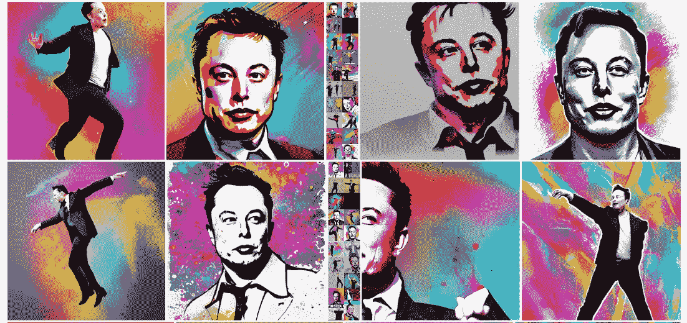
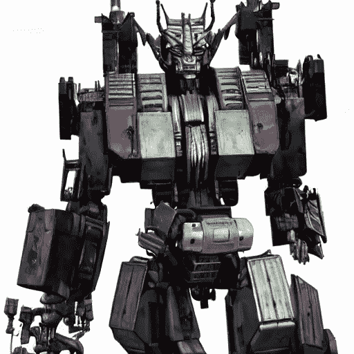
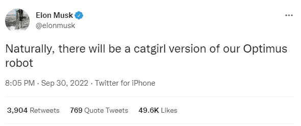
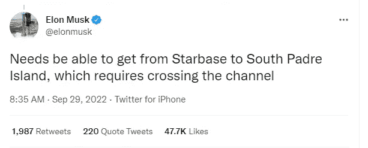
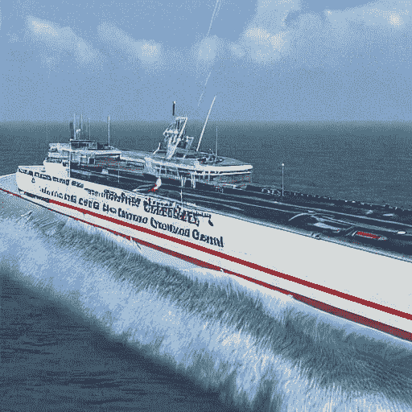
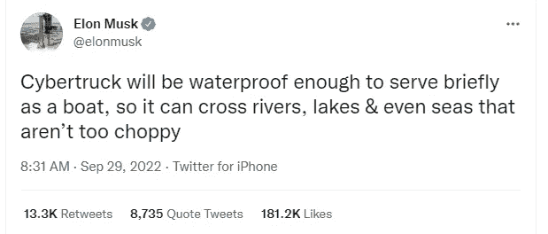
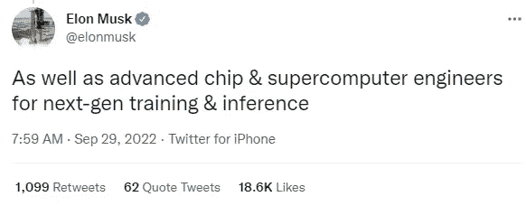
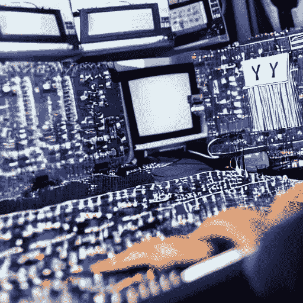
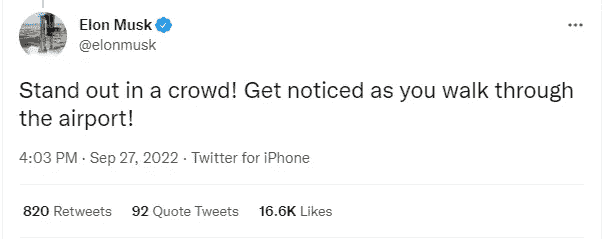

# 这就是我如何使用人工智能来绘制埃隆·马斯克的最新推文。

> 原文：<https://pub.towardsai.net/this-is-how-im-using-a-i-to-draw-elon-musk-s-latest-tweets-7a0ebb50e170?source=collection_archive---------3----------------------->

这就是 AI 如何重新想象一个跳舞的伊隆——来源:[我的稳定扩散创作](https://www.instagram.com/mystablediffusioncreations/)。

## 我可以用 Python 和稳定扩散来创建他的推文的独特图像。

每当埃隆·马斯克发布一条新的推文，它就会被他的近 1.1 亿粉丝转发和收藏。

他这样做是为了与他的追随者交流，并向他们提供有关他参与的公司或他的电动汽车公司特斯拉汽车公司、SpaceX 和 Starlink 的最新发展的信息。

自从他开始发布这些推文以来，我一直在开发一些 python 脚本，以自动使用情绪分析、预测分析和其他人工智能技术来玩埃隆的幽默和沟通策略。

现在有了稳定的扩散生成人工智能，我可以绘制或创建每一个人的超现实照片。

根据推文的不同，它们可以看起来像油画，也很复杂！

在这篇文章中，我将向你展示如何轻松地编写 Python 来自动使用人工智能来重新想象最新的 Elon tweet，这样每个人都可以最终理解他想说的话。也许吧！

> **免责声明:本文仅用于教育目的。我们不鼓励任何人抓取网站，尤其是那些可能有条款和条件反对此类行为的网站。**

下面是我用来实现它的库列表:

# 使用 tweepy 获取最新推文

用 Python 访问特定的 tweets 非常容易。您可以使用 Python API 或任何 web 浏览器，如 Safari、Firefox、Chrome 或 Edge。

在这种情况下，我想使用 Twitter API 来自动化这个过程，这使我能够做一些很酷的事情，例如查看实时推文或发布我的推文。

API 端点可在 https://api.twitter.com/.[获得](https://api.twitter.com/.)第一步是注册一个 Twitter 账户。(这年头谁在 Twitter 上没有账号？？？

一旦你完成了这些，访问你的 Twitter 账户的开发者部分并启用 Twitter API。

接下来，您需要设置一个可以用来运行 Python 脚本的环境。您可以从“设置”选项卡中完成此操作。最重要的选项是“应用类型”到“Web 应用”

完成这些步骤后，您将可以访问令牌和密钥，以便与库 TweetPy 一起使用，这是一个易于使用的 Python 库，用于访问 Twitter API。

在设置了对 Elon 的 tweets 的访问后，我选择了最新的 tweets[0]并将它们传递给一个文本变量..以后定义我想要的 A.I .的形象会很有用。

# 使用 text2image 人工智能模型来绘制推文

为了从最新的 Elon 推文中绘制一幅画、一幅画或一幅逼真的图像，我使用了推文的文本作为一种输入，供称为稳定扩散的生成性人工智能模型使用，该模型通过潜在扩散模型过程**学习数十亿幅图像和特定文本之间的联系。**

它由扩散模型提供动力，这些模型通过反复向训练数据添加高斯噪声来破坏训练数据，然后通过逆转这种添加噪声的过程来学习如何取回数据。

稳定扩散模型支持通过使用描述要包括在输出中或从输出中省略的元素的文本提示，以及结合文本提示中描述的新元素的现有图像的重新绘制，从头生成新图像的能力(该过程通常被称为通过使用模型的扩散去噪机制的引导图像合成)。

此外，当与支持这些特征的适当用户界面一起使用时，该模型允许通过修补和去修补来部分地改变现有图像，其中存在许多不同的开源实现。

如果您愿意，可以阅读我的文章“ [**快速了解稳定扩散开源架构**](https://medium.com/codex/a-quick-look-under-the-hood-of-stable-diffusion-open-source-architecture-2f07fc1e729) ”中的更多技术细节，在这篇文章中，我分析并解释了推动新一代模型的模型。

下面你可以看到我用来运行稳定扩散模型的神经网络设计。

# 用人工智能和神经网络生成图像

我喜欢将生成式人工智能定义为使用算法从真实的文本描述中制作图像的艺术。

因此，我将通过使用一个经过数十亿张图像训练的人工智能模型来制作一个看起来真实的独特图像，基于埃隆·马斯克最新的一条推文…

我制作了一个有创意的文本输入(称为 prompt ),包含单词和参数以及 tweet 的文本的特定组合。这样，人工智能模型就能“理解”我想要创造和为之工作的东西

下面是人工智能为埃隆的一些推文创造的一些例子:

# 结论

不管你喜不喜欢，埃隆·马斯克是一位鼓舞人心的领导者，他的推文是通向技术未来的一扇窗户。

特斯拉汽车公司(Tesla Motors)处于电动汽车的最前沿，人工智能有望在未来的交通运输中发挥主要作用。

对我来说，这个“人工智能绘图脚本”可以用来直观地观察埃隆的世界。

它很有趣，简单，编码也很有趣，我会在最近几天改进它…敬请期待。

# 你可能想读的其他文章。

*   [**快速浏览稳定扩散的开源架构。**](https://medium.com/codex/a-quick-look-under-the-hood-of-stable-diffusion-open-source-architecture-2f07fc1e729)
*   [**我们正在见证人工智能的下一次进化吗？**](/are-we-witnessing-the-next-evolution-of-artificial-intelligence-264f251ea06d)
*   [**这 10 个算法可以改变你的生活——如果你和数据一起工作**](/these-10-algorithms-can-change-your-life-if-you-work-with-data-ff544657922d)
*   [**这 9 篇研究论文正在改变我今年对人工智能的看法。**](https://medium.com/illumination/these-9-research-papers-are-changing-how-i-see-artificial-intelligence-this-year-cd8ba548f785)
*   **五种非常实用的方法可以帮助你提高公司的生产力**

# **你愿意支持我吗？**

***想获得无限故事，还可以考虑* [*报名*](https://medium.com/@jairribeiro/membership) *成为中等会员，只需 5 美元。此外，如果您使用我的链接注册* *，我会收到一点佣金(无需额外费用)。***

** [## 通过我的推荐链接加入媒体- Jair Ribeiro

### 阅读我分享的每一个故事(以及媒体上成千上万的其他作者)。你的会员费直接支持其他…

medium.com。](https://medium.com/@jairribeiro/membership)**