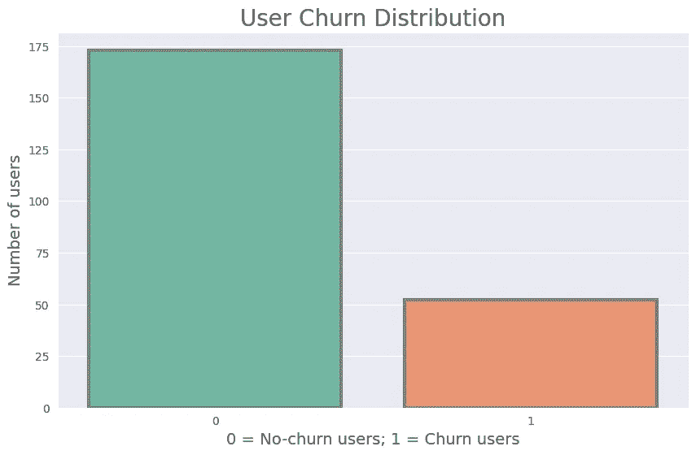
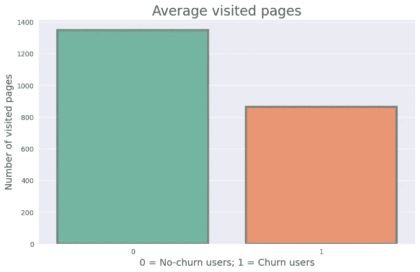
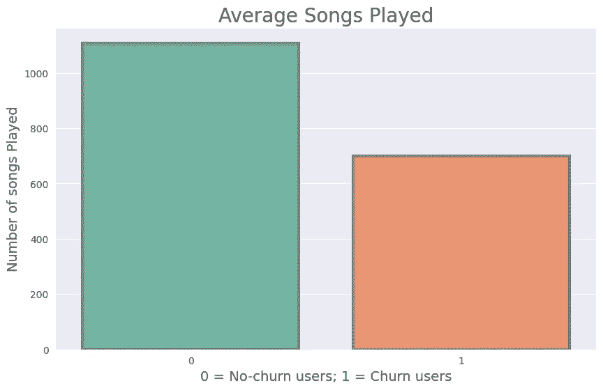
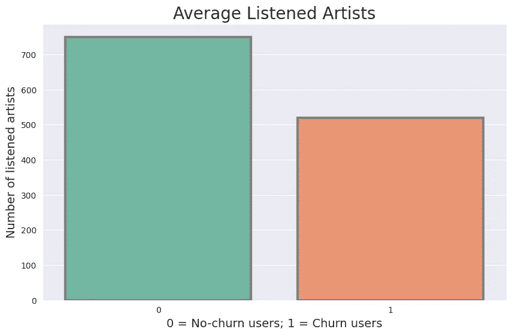
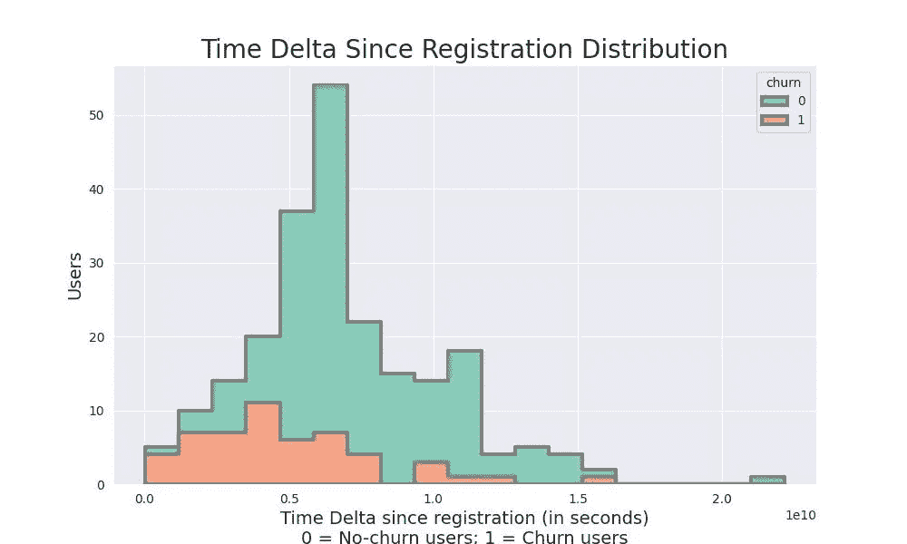

# 这就是如何使用 Apache Spark 构建客户流失预测模型

> 原文：<https://pub.towardsai.net/this-is-how-you-can-build-a-churn-prediction-model-using-spark-e187b7eca339?source=collection_archive---------3----------------------->

## 一个关于如何仅使用 Apache Spark 构建流失预测管道的端到端教程。


由作者创建的图像具有稳定的扩散性。

这篇文章是关于如何使用来自 **Spark** 的 ML 栈**构建流失预测分类器**的**教程**。

我们将使用来自一家名为 **Sparkify** 的**虚拟公司**的**数据，这是一家音乐流媒体公司。数据集包含与平台交互的用户创建的各种事件。**

在本教程中，我们将仔细查看这些数据。但是，我要感谢 *Udacity* 公开了这些数据。没有他们，我做不出这个教程。

[在这里](https://udacity-dsnd.s3.amazonaws.com/sparkify/mini_sparkify_event_data.json)你可以**下载**数据集的迷你版本，在这里[下载](https://udacity-dsnd.s3.amazonaws.com/sparkify/sparkify_event_data.json)整个数据集。

## 什么是客户流失？

客户流失是指有人选择停止使用你的产品或服务。

## 这样的模型为什么有用？

通过建立这样一个模型，我们可以理解用户离开公司的原因。因此，这是一种基于用户活动数据改善客户体验和保留的方法。

# 目录

1.  定义 Spark 会话
2.  加载数据集
3.  清理数据集
4.  定义客户流失标签
5.  探索性数据分析
6.  特征工程
7.  建模
8.  结果
9.  结论

***注:*** *我们把所有的代码都记在一个笔记本上。*

# 1️⃣定义了一个火花会话

```
spark = SparkSession.\
    builder.\
    appName("Sparkify Churn Prediction").\
    getOrCreate()
```

我们创建了一个名为 **Sparkify 流失预测**的 spark 会话。通过这个会话，我们可以加载并运行所有的计算。

# 2️⃣加载数据集

```
EVENT_DATA_LINK = "mini_sparkify_event_data.json"df = spark.read.json(EVENT_DATA_LINK)
df.persist()
```

我们将**mini _ Spark ify _ event _ data . JSON**文件下载到与笔记本相同的目录下，并借助 Spark 会话加载到内存中。

```
df.printSchema() |-- artist: string (nullable = true)
|-- auth: string (nullable = true)
|-- firstName: string (nullable = true)
|-- gender: string (nullable = true)
|-- itemInSession: long (nullable = true)
|-- lastName: string (nullable = true)
|-- length: double (nullable = true)
|-- level: string (nullable = true)
|-- location: string (nullable = true)
|-- method: string (nullable = true)
|-- page: string (nullable = true)
|-- registration: long (nullable = true)
|-- sessionId: long (nullable = true)
|-- song: string (nullable = true)
|-- status: long (nullable = true)
|-- ts: long (nullable = true)
|-- userAgent: string (nullable = true)
|-- userId: string (nullable = true)
```

本文中使用的最重要的列如下:

*   *艺术家:*当前正在播放的歌曲的艺术家。
*   *级别:*分类变量，可以*付费*或*免费*。
*   *页面:*用户在应用程序中的位置(例如，登录页面，在
*   *注册*:注册的 UTC 时间戳。
*   *sessionId:* 用户当前会话的 Id。
*   *歌曲:*当前正在播放的歌曲。
*   *状态*:事件的 HTTP 状态。(例如，200、307、404)。
*   *ts* :事件的 UTC 时间戳。
*   *用户 Id:* 用户的 Id。

# 3️⃣清理数据集

在实际的笔记本中，我们对要清理的内容做了更广泛的检查，但为了保持简洁，我们将只显示最重要的内容。

## 检查 NaNs/空值

```
df.select([
    F.count(F.when(F.isnull(c), c)).alias(c) for c in df.columns
]).show() +------+----+---------+------+-------------+--------+------+-----+--------+------+----+------------+---------+-----+------+---+---------+------+
|artist|auth|firstName|gender|itemInSession|lastName|length|level|location|method|page|registration|sessionId| song|status| ts|userAgent|userId|
+------+----+---------+------+-------------+--------+------+-----+--------+------+----+------------+---------+-----+------+---+---------+------+
| 58392|   0|     8346|  8346|            0|    8346| 58392|    0|    8346|     0|   0|        8346|        0|58392|     0|  0|     8346|     0|
+------+----+---------+------+-------------+--------+------+-----+--------+------+----+------------+---------+-----+------+---+---------+------+
```

数据集中的大多数空值都用 **None 表示。**

```
df.select([
     F.count(F.when(F.col(c) == "", c)).alias(c) for c in df.columns
]).show() +------+----+---------+------+-------------+--------+------+-----+--------+------+----+------------+---------+----+------+---+---------+------+
|artist|auth|firstName|gender|itemInSession|lastName|length|level|location|method|page|registration|sessionId|song|status| ts|userAgent|userId|
+------+----+---------+------+-------------+--------+------+-----+--------+------+----+------------+---------+----+------+---+---------+------+
|     0|   0|        0|     0|            0|       0|     0|    0|       0|     0|   0|           0|        0|   0|     0|  0|        0|  8346|
+------+----+---------+------+-------------+--------+------+-----+--------+------+----+------------+---------+----+------+---+---------+------+
```

在 **userId** 列上有一个例外，空值用一个空字符串表示。

## 未注册的用户

字符串为空的用户是未注册的用户；因此，平台不能给他们分配任何 ID。

**查看未注册用户页面分布**

```
df.filter(F.col("userId") == "").select("page").groupby("page").count().show() +-------------------+-----+
|               page|count|
+-------------------+-----+
|               Home| 4375|
|              About|  429|
|              Login| 3241|
|               Help|  272|
|              Error|    6|
|           Register|   18|
|Submit Registration|    5|
+-------------------+-----+
```

使用未注册的用户数据不能帮助我们预测客户流失。因此，我们将把这些行从 Spark 数据帧中删除。

**删除未注册用户**

```
cleaned_df = df.filter(F.col("userId") != "")
```

## 空艺术家行

```
df.filter(
    F.isnull(F.col("artist"))
).select(
    ["artist", "song", "userId", "page"]
).groupby("page").count().show() +--------------------+-----+
|                page|count|
+--------------------+-----+
|              Cancel|   52|
|    Submit Downgrade|   63|
|         Thumbs Down| 2546|
|                Home|14457|
|           Downgrade| 2055|
|         Roll Advert| 3933|
|              Logout| 3226|
|       Save Settings|  310|
|Cancellation Conf...|   52|
|               About|  924|
|            Settings| 1514|
|               Login| 3241|
|     Add to Playlist| 6526|
|          Add Friend| 4277|
|           Thumbs Up|12551|
|                Help| 1726|
|             Upgrade|  499|
|               Error|  258|
|      Submit Upgrade|  159|
|            Register|   18|
+--------------------+-----+
```

当艺术家为空时，用户花在其他页面上的时间比听音乐的时间还多。在这种情况下，这些信息对于理解注册用户的行为是有价值的。

## 填充空值

```
cleaned_df = cleaned_df.fillna({
    "length": 0,
    "artist": "unknown",
    "song": "unknown"
})
```

最后一步，我们想用 **None** 值填充这些行。此时，当用户没有在听任何东西时，空行只出现在与歌曲相关的字段中。这些行中的信息很有价值，我们不建议删除它们。

因此，我们将**歌曲的长度**设置为 **0** ，将**艺人**和**歌曲**设置为**未知**。

# 4️⃣定义客户流失标签

```
cleaned_df.select(
    F.count(
        F.when(F.col("page") == "Cancellation Confirmation", "page")
    ).alias("Cancellation Confirmation")
).show() +-------------------------+
|Cancellation Confirmation|
+-------------------------+
|                       52|
+-------------------------+
```

当订阅被取消时，我们将认为用户被“**搅动”**。

***注意:*** *如果我们想进入下一个级别，我们也可以使用* ***降级*** *事件来表示客户流失事件。*

```
labeled_df = cleaned_df.withColumn(
    "churnEvent", 
    F.when(
       F.col("page") == "Cancellation Confirmation",
       1
    ).otherwise(0)
)
```

作为中间步骤，我们将创建 **churnEvent** 列，这是一个检查“**取消确认”**事件的标志。我们在**事件**级别设计了**变化**列。

```
user.labeled_df = labeled_df.withColumn(
    "churn", 
    F.sum("churnEvent").over(Window.partitionBy("userId"))
)
labeled_df = labeled_df.withColumn(
    "churn", 
    F.when(F.col("churn") >= 1, 1).otherwise(0)
)
```

我们将 **churnEvent** 标志聚合到用户级别，并将其裁剪为 0 或 1。因此，用户在所有事件中都有一个 **churn = 1** 或 **no-churn = 0** 标志。

请记住，最终，我们要建立一个预测用户流失，而不是事件流失的分类器。这就是为什么用户要么是**流失= 1** 要么是**无流失= 0** 。

# 5️⃣探索性数据分析

**注意:**为了保持文章简短，我们将只展示那些帮助我们设计有价值特性的情节。你可以*在这里看到所有的图表*和*这些图表是如何绘制的* [。](https://github.com/IusztinPaul/distributed-churn-prediction)

## 用户流失分布



**流失**和**未流失**用户数量之间的柱状图。[图片由作者提供]

分布高度偏向于**无流失**用户。我们将使用 **F1 分数**在交叉验证步骤中找到最佳模型，以考虑这一因素。

## 可能的页面

```
eda_df.select("page").distinct().show() +--------------------+
|                page|
+--------------------+
|              Cancel|
|    Submit Downgrade|
|         Thumbs Down|
|                Home|
|           Downgrade|
|         Roll Advert|
|              Logout|
|       Save Settings|
|Cancellation Conf...|
|               About|
|            Settings|
|     Add to Playlist|
|          Add Friend|
|            NextSong|
|           Thumbs Up|
|                Help|
|             Upgrade|
|               Error|
|      Submit Upgrade|
+--------------------+eda_df.filter(
    F.col("artist") != "unknown"
).select("page").distinct().show()+--------+
|    page|
+--------+
|NextSong|
+--------+
```

唯一播放音乐的页面叫做 **NextSong** 。

## 每个用户平均访问页面数的分布



柱状图显示了**流失**和**未流失**用户之间的平均访问页面数。图片由作者提供。

留在平台上的用户平均访问了更多的页面。

## 每个用户收听的平均歌曲数量的分布



柱状图显示了在**流失用户**和**未流失用户**之间播放歌曲的平均数量。[图片由作者提供]

平均而言，留在平台上的用户听了更多的歌曲。

## 每个用户收听的艺术家平均数量的分布



柱状图显示了在**流失用户**和**未流失用户**之间被收听艺术家的平均数量。[图片由作者提供]

平均而言，留在平台上的用户在听更广泛的艺术家的音乐。

## 自注册分布以来的时间增量



直方图显示了**流失**和**未流失**用户自注册以来经过的时间分布。[图片由作者提供]

***【时间δ=****用户在平台注册后的秒数。*

对于**流失**用户来说，注册后的时间增量看起来像是*右偏*。同时**无流失**分布呈正态分布。因此，时间增量的**平均值是一个很好的预测值。**

# 6️⃣特色工程

**流失分类**将在**用户级别**执行。因此，我们需要将每个用户的数据聚集在一行中。

## 为什么要在用户级别汇总数据？

最终预测应该用于预测特定用户是否倾向于离开公司，而不是用户将退订的事件。因此，一个单独的事件对我们来说是无用的，但是它的集合是极其有价值的。

## 定义一些效用函数:

```
def count_with_condition(condition):
    """Utility function to count only specific rows based on the 'condition'."""
    return F.count(F.when(condition, True)) def count_distinct_with_condition(condition, values):
    """Utility function to count only distinct & specific rows based on the 'condition'."""
    return F.count_distinct(F.when(condition, values))
```

## **创建特征工程 Spark 数据框架**

概括地说，我们将使用 EDA 步骤中提供的功能。在[笔记本](https://github.com/IusztinPaul/distributed-churn-prediction)中，我们调查了更多的潜在功能，但这四个功能在**流失用户**和**未流失用户**之间显示出最强的预测能力:

*   *访问过的页面总数*。
*   播放的*首歌曲总数*。
*   *总艺人总数*。
*   *自*注册*以来的时间戳*(秒)。

```
aggregated_df = labeled_df.groupby("userId").agg(
    F.count("page").alias("pages"),
    count_with_condition(
        F.col("page") == "NextSong"
    ).alias("plays"),
    count_distinct_with_condition(
        F.col("artist") != "unknown", F.col("artist")
    ).alias("artists"),
    F.max(F.col("ts") - F.col("registration")).alias("delta"),
    F.max("churn").alias("churn")
)
aggregated_df.show(n=5) +------+-----+-----+-------+-----------+-----+
|userId|pages|plays|artists|      delta|churn|
+------+-----+-----+-------+-----------+-----+
|100010|  381|  275|    252| 4807612000|    0|
|100014|  310|  257|    233| 7351206000|    1|
|100021|  319|  230|    207| 5593438000|    1|
|   101| 2149| 1797|   1241| 4662657000|    1|
|    11|  848|  647|    534|10754921000|    0|
+------+-----+-----+-------+-----------+-----+
```

## 将数据帧映射到火花矢量

```
assembler = VectorAssembler(
    inputCols=[
        "pages", "plays", "artists", "delta"
], outputCol="unscaled_features")
engineered_df = assembler.transform(aggregated_df)
engineered_df = engineered_df.select(
    F.col("unscaled_features"),
    F.col("churn").alias("label")
)
```

**火花模型**期望在输入端有一个火花矢量。同样，默认情况下，他们期望**输入**特性位于名为**特性**的列中，而**目标**位于名为**标签**的列中。

# 7️⃣造型

我们将训练和测试三个模型:

1.  逻辑回归
2.  朴素贝叶斯
3.  梯度推进树

我们将使用三重交叉验证来寻找最佳超参数。

我们将在列车分割中使用 **80%** 的数据，在测试分割中使用 **20%** 的数据。

我们使用标准定标器将特征标准化。

因为标签高度不平衡，我们将使用 **F1 分数**来评估模型。 **F1 得分**指标在考虑不平衡分配问题的**精度**和**召回**下运行。

## 定义一些效用函数:

如果你只对结果感兴趣，跳过它们。

*Spark ML 语法与 Sklearn 中使用的语法非常相似。*

```
def run(pipeline, paramGrid, train_df, test_df):
    """
    Main function used to train & test a given model.
    The training step uses cross-validation to find the best hyper-parameters for the model. :param pipeline: Model pipeline.
    :param paramGrid: Parameter grid used for cross-validation.
    :param train_df: Training dataframe.
    :param test_df: Testing dataframe.
    :return: the best model from cross-validation.
    """ fitted_model = fit_model(paramGrid, pipeline, train_df)
    evaluate_model(fitted_model, test_df) return fitted_model def fit_model(paramGrid, pipeline, train_df):
    """
    Function that trains the model using cross-validation.
    Also, it prints the best validation results and hyper-parameters. :param paramGrid: Parameter grid used for cross-validation.
    :param pipeline: Model pipeline.
    :param train_df: Training dataframe.
    :return: the best model from cross-validation.
    """ crossval = CrossValidator(
        estimator=pipeline,
        estimatorParamMaps=paramGrid,
        evaluator = MulticlassClassificationEvaluator(
              metricName="f1", 
              beta=1.0
        ),
        parallelism=3,
        numFolds=3
    ) fitted_model = crossval.fit(train_df)
    print_best_validation_score(fitted_model)
    print_best_parameters(fitted_model) return fitted_model def create_pipeline(model):
    """
    Create a pipeline based on a model. :param model: The end model that will be used for training.
    :return: the built pipeline.
    """ scaler = StandardScaler(
        inputCol="unscaled_features", 
        outputCol="features"
    )
    pipeline = Pipeline(stages=[scaler, model]) return pipeline def print_best_validation_score(cross_validation_model):
    """Prints the best validation score based on the results from the cross-validation model."""
    print()
    print("-" * 60)
    print(f"F1 score, on the validation split, for the best model: {np.max(cross_validation_model.avgMetrics) * 100:.2f}%")
    print("-" * 60) def print_best_parameters(cross_validation_model):
    """Prints the best hyper-parameters based on the results from the cross-validation model.""" parameters = cross_validation_model \
       .getEstimatorParamMaps() [np.argmax(cross_validation_model.avgMetrics)] print()
    print("-" * 60)
    print("Best model hyper-parameters:")
    for param, value in parameters.items():
        print(f"{param}: {value}")
    print("-" * 60) def evaluate_model(model, test_df):
    """Evaluate the model on the test set using F1 score and print the results.""" predictions = model.transform(test_df)
    evaluator =  MulticlassClassificationEvaluator(
            metricName="f1", 
            beta=1.0
          )
    metric = evaluator.evaluate(predictions) print()
    print("-" * 60)
    print(f"F1 score, on the test set is: {metric*100:.2f}%")
    print("-" * 60) return metric
```

## 拆分数据

```
train_df, test_df = engineered_df.randomSplit([0.8, 0.2], seed=42)
```

## 逻辑回归

```
lr = LogisticRegression()
pipeline = create_pipeline(lr)paramGrid = ParamGridBuilder() \
    .addGrid(lr.maxIter, [10, 25, 50])  \
    .addGrid(lr.regParam, [0.05, 0.1, 0.2]) \
    .addGrid(lr.elasticNetParam, [0.05, 0.1, 0.2]) \
    .build()run(
   pipeline,
   paramGrid,
   train_df.alias("train_df_lr"),
   test_df.alias("test_df_lr")
);
```

## 朴素贝叶斯

```
nb = NaiveBayes()
pipeline = create_pipeline(nb)paramGrid = ParamGridBuilder() \
    .addGrid(nb.smoothing, [0.5, 1, 2])  \
    .build()run(
   pipeline,
   paramGrid,
   train_df.alias("train_df_nb"),
   test_df.alias("test_df_nb")
);
```

## 梯度推进

```
gbt = GBTClassifier()
pipeline = create_pipeline(gbt)paramGrid = ParamGridBuilder() \
    .addGrid(gbt.maxIter, [10, 20, 30]) \
    .addGrid(gbt.stepSize, [0.05, 0.1]) \
    .build()run(
   pipeline,
   paramGrid, 
   train_df.alias("train_df_gbt"),
   test_df.alias("test_df_gbt")
);
```

**训练&测试代码的三个片段**都有*相同的结构*。

我们将**管道**定义为*缩放步骤*和*实际模型*。此外，我们定义了超参数的**交叉验证网格**。最后，我们将所有这些对象传递给 **run** 函数。其在给定的数据分割和配置上训练和评估模型。

# 8️⃣结果

```
|        Model        | Validation |   Test   |
|:-------------------:|:----------:|:--------:|
| Logistic Regression |   0.6958   |  0.5952  |
|     Naive Bayes     |   0.6672   |  0.5952  |
|  Gradient Boosting  |  *0.7333*  | *0.8473* |
```

与逻辑回归和 Naive Bay 相比， **GBT** 模型具有更好的****F1 得分**，这是因为 **GBT** 模型更复杂，能够更好地理解非线性关系。**

**通常，在不考虑两个变量之间的**相关性**或**非线性关系**等因素的情况下，梯度推进方法比其他方法如 **LR** 或 **NB** 表现得更好。基于树的模型对这些问题不敏感，因为它们独立地创建叶子并支持多维关系。**

# **9️⃣结论**

**太好了！我们设法只用 **Spark** 训练一个像样的**分类器**。**

**我们**加载**数据集，**清理**它，**分析**它，最后，我们**创建了**一套有用的**特征**来预测**客户流失**。**

**有了工程数据，我们**训练**和**测试**三个流失预测模型。通过使用**交叉验证**，我们找到了以下型号的**最佳超参数**:**

*   **逻辑回归**
*   **朴素贝叶斯**
*   **梯度推进**

**我们比较了结果，发现 **GBT** 车型在验证和测试分割中的 **F1 得分最高**。**

**为了进一步改进模型，我们可以做以下工作:**

*   **添加更多功能**
*   **解决标签失衡**
*   **使用**降级**事件生成更多**流失**标签**
*   **更多超参数调整**
*   **使用 XGBoost 或 LightGBM**

> **你还有什么进一步改进模型的建议？**

*****注:*** *你可以在这里* *访问 GitHub 库* [*。*](https://github.com/IusztinPaul/distributed-churn-prediction)**

**🎉谢谢你看我的文章！**

**📢如果你喜欢这篇文章，并且想分享我进入 AI、ML 和 MLOps 的学习之旅，你也可以关注我的[**LinkedIn**](https://www.linkedin.com/in/pauliusztin/)**。****