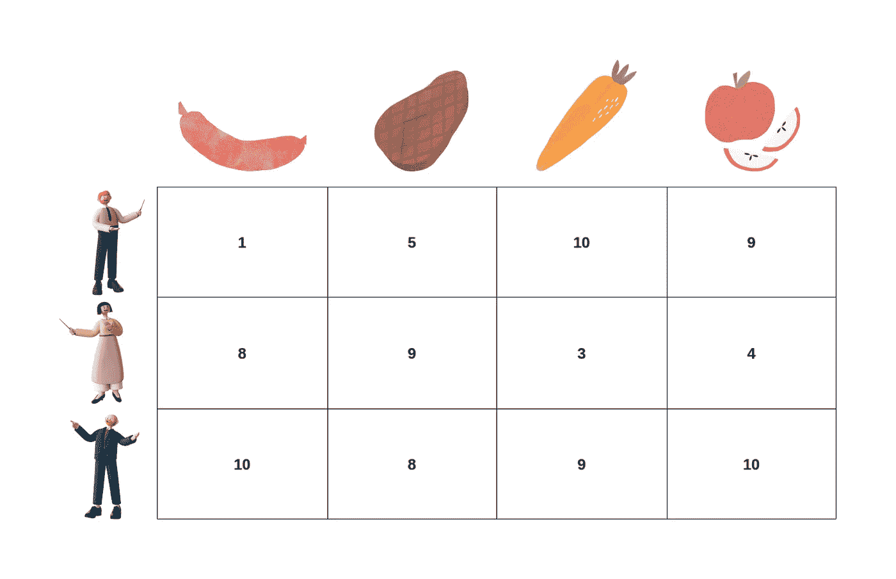
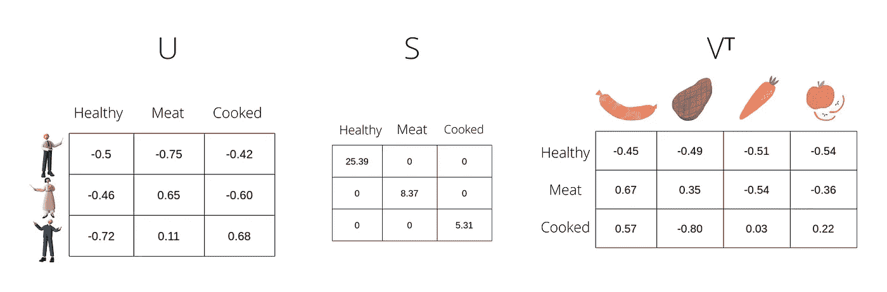
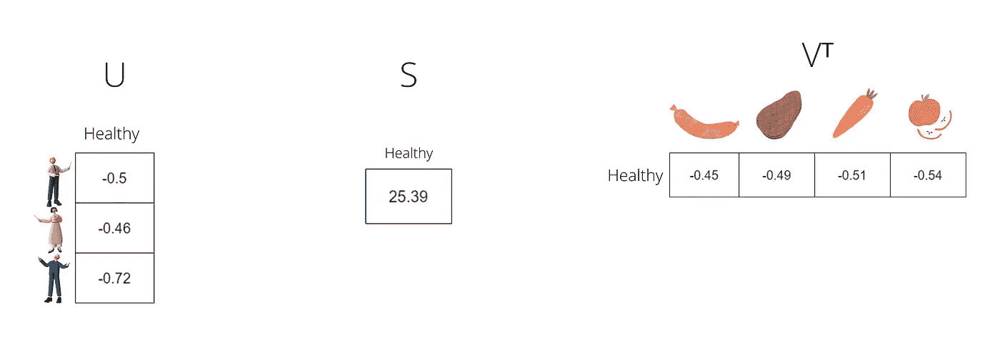

# 这就是你如何向一个 7 岁的孩子解释奇异值分解

> 原文：<https://pub.towardsai.net/this-is-how-you-can-explain-svd-to-a-7-year-old-2a4cb10632f2?source=collection_archive---------0----------------------->

## 理解奇异值分解(SVD)算法背后的直觉。


本·怀特在 [Unsplash](https://unsplash.com?utm_source=medium&utm_medium=referral) 上的照片

我写这篇文章是因为，起初，我努力理解 SVD 算法背后的数学直觉。但如果抛开所有花哨的数学术语，算法背后的思想就很容易理解了。

*看完这篇文章，你会对* ***为什么以及如何在各种应用中使用*******SVD****有一个直观的认识。**

*我可以抛出奇异值分解的定义，比如:*

> *在线性代数中，奇异值分解(SVD) 是一个实矩阵或复矩阵的因式分解。它将具有正交本征基的方阵的本征分解推广到任何 *m x n* 矩阵。[1]*

*嗯。那是什么？这个定义对于一个初学者或者不太懂数学的人来说没有任何意义。许多人正从软件进入机器学习工程，并努力理解 ML 中使用的一些高级数学概念。至少我做到了。*

*不要误解我的意思，要完全理解 SVD 是什么，您需要理解它背后的数学，但是我们在这篇文章中关注的是它是如何工作的，以及我们为什么关心 SVD。我们不会关注算法的实际计算。*

*SVD 的著名用例有:*

*   *伪逆—任何大小矩阵的逆(Moore-Penrose 逆)*
*   *降维(图像、表格数据等。)*
*   *推荐引擎(FunkSVD 算法及其衍生物)*

# *奇异值分解背后的直觉*

*让我们把问题简化到人和他们喜欢的食物。我们假设有一个矩阵 A，其中 m 代表人数，n 代表可能的食物种类。矩阵值代表一个人对一种食物的喜爱程度，编码为从 1 到 10 的等级。*

*这是一个 3x4 矩阵的例子，有三个人和四种食物:*

**

*矩阵 A 的例子【图片作者提供】。*

*SVD 将任意**矩阵 m x n A** 分解成三个矩阵， **U** 、 **S、**和 **V** ，其中 **A = USVᵀ** 。*

*我们如何用关于人和他们喜欢的食物类型的例子来解释这个公式呢？*

*我们先从另一个问题开始回答上面的问题，了解一下背后的思维过程。在我们的示例矩阵 A 中，我们有三个人，他们对四种食物进行评级。但是，如果我们想了解为什么有些人对一种食物的评价高于另一种食物呢？为了深入研究这一点，我们需要找到一组描述人们和他们喜欢的食物类型之间相互作用的特征。*

*我们想找出为什么“人 1”更喜欢吃苹果而不是香肠。*

*使用奇异值分解，我们可以快速得到有助于我们理解上面问题的特征。*

*下面是分解后的矩阵 **A = USVᵀ** 的样子:*

**

*美国、Vᵀ矩阵示例[图片由作者提供]。*

*SVD 算法创建了一组描述人们和他们喜爱的食物类型之间的相互作用的特征。*

*在我们的例子中，算法学习的特征是健康、肉和熟的。那些被称为**的潜在特征**。*

***注:**我们随机标注了潜在特征健康、肉和熟。这些是抽象的表示，我们给它们命名是为了快速理解这个概念，但是它们可以有任何其他的标签。*

***矩阵 U** 是一个 **m x k** 矩阵，其中 *k* 是潜在特征的*数量。它代表了一个*人如何与*互动或“感受到】潜在特征*，并以数学方式描述了他们是否喜欢健康的、以肉为基础的或煮熟的食物。一般来说，它表示矩阵 A 的行与潜在因子之间的关系。*

*矩阵 S 是一个对角矩阵，告诉我们每个特征的重要性。特别是，它编码了哪个健康、肉或烹饪特征更重要。更可观的值代表特定的潜在特征携带更多的信息，可以更好地预测这个人喜欢什么类型的食物。S 的对角线值按降序排列，这意味着第一个潜在特征总是比其他特征携带更多的信息。*

***矩阵 Vᵀ** 是一个 **k x n** 矩阵，其中描述了*潜在特征*如何与*类食物*相互作用。一般来说，它表示潜在因素与矩阵 a 的列之间的关系。*

# *让我们更加数学化*

*但是我们仍然会保持概念的简单性，并与我们的例子联系起来。*

## *压缩*

*通常 SVD 用于压缩。假设我们有 10 亿 x 100 万个矩阵，这在某些情况下太大而无法处理。因此，使用 SVD，我们可以压缩这个矩阵，并且仍然可以计算它的近似值。*

*在我们的例子中，我们可以通过只保留最基本的潜在特征“健康食品”来压缩矩阵 A 现在，U、S 和 V 矩阵看起来像这样:*

**

*简化的美国、Vᵀ矩阵的例子[图片由作者提供]。*

*通过乘以 **USVᵀ，**，我们仍将得到一个近似初始矩阵 a 的 3×4 矩阵，但仅使用我们的初始数据的一部分。*

*随着我们不断添加潜在特征，近似将会更精确，但是压缩的效果将会更小。*

## *推断*

***矩阵 U** 和 **Vᵀ** 是正交的，所以我们可以在我们新生成的潜在空间中把它们作为新的参考系。因此，利用这两个矩阵中的任何一个，我们可以将矩阵 A 投影到潜在特征的空间中。通过将 **A** 乘以 **V** ，我们最终得到 **A_projected = AV** 。*

*在我们的具体例子中， **A_projected** 是一个人与人之间互动的矩阵，以及他们喜欢健康的、以肉为基础的或熟食的可能性。因此，我们将食物类型的矩阵 A 投射到潜在空间。现在每个人都被潜在的特征所描述。*

## *压缩+投影*

*通过结合上述方法，我们可以快速实现一个**降维**算法。*

*让我们使用只包含“健康”潜在特征的矩阵 V，并将其乘以 a。*

*A_projected 将是包含大部分初始信息的 3×1 矩阵，因为“健康”潜在特征描述了大部分方差。因此，我们将矩阵从 4 维减少到只有 1 维。*

# *如何计算奇异值分解*

*我们可以用 Python 和 [Scipy](https://docs.scipy.org/doc/scipy/reference/generated/scipy.linalg.svd.html) 高效地计算 SVD 矩阵:*

```
*import numpy as np
import scipyA = np.array(
    [[1, 5, 10, 9], [8, 9, 3, 4], [10, 8, 9, 19]], 
    dtype=int
)
U, s, V_T = scipy.linalg.svd(A)*
```

*你可以在[2]和[3]阅读关于如何计算 SVD 的更多信息。*

# *结论*

*在这篇文章中，我们通过人们和他们喜欢的食物类型之间的具体例子回顾了 U、S 和 V 矩阵的含义。此外，我们还通过下面的同一个例子展示了算法的一些**用例**，比如**压缩**和**降维**。最后，我们展示了用 **Python** 计算 SVD 是多么容易，以及为什么理解算法背后的直觉是至关重要的，而不是计算本身。*

*现在，您很快理解了为什么 SVD 如此强大，并深入研究了它的数学。*

*🎉谢谢你看我的文章！*

*📢如果你喜欢这篇文章，并想分享我在 AI、ML 和 MLOps 方面的学习历程，你也可以通过 [**LinkedIn**](https://www.linkedin.com/in/pauliusztin/) 与我联系:*

## *参考资料:*

*[1] [奇异值分解](https://en.wikipedia.org/wiki/Singular_value_decomposition)，维基百科。*

*[2] Jason Brownlee 博士，[如何用 Python 从零开始计算 SVD](https://machinelearningmastery.com/singular-value-decomposition-for-machine-learning/)，机器学习掌握，2018。*

*[3] [奇异值分解(SVD)教程](https://web.mit.edu/be.400/www/SVD/Singular_Value_Decomposition.htm)，MIT。*