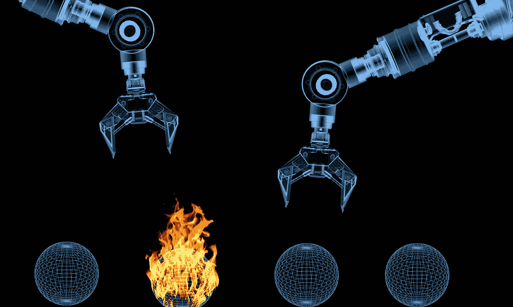
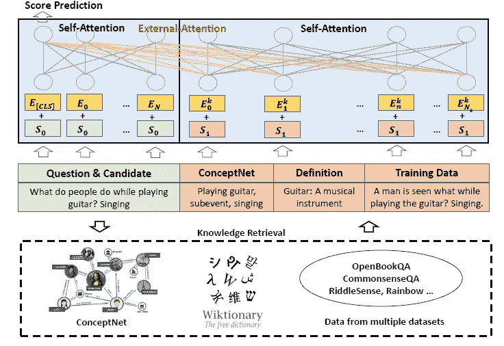

# 这个微软模型擅长常识推理

> 原文：<https://pub.towardsai.net/this-microsoft-model-excels-at-common-sense-reasoning-57a5ff360a3c?source=collection_archive---------0----------------------->

## [人工智能](https://towardsai.net/p/category/artificial-intelligence)

## KEAR 是一个聪明的架构，用常识推理来扩展 transformer 模型。

来源:https://futurism.com/teaching-ai-common-sense

常识是人脑的认知品质之一，很难量化甚至解释。毫不奇怪，在 ML 模型中重建常识推理已经成为整个领域最相关的挑战之一。重建常识的挑战是 ML 中一个基本哲学困境的根源:逻辑和知识之间的摩擦*。通过进化，人类首先发展了世界的知识模型，并整合了逻辑推理。这一过程在软件行业中被逆转，在神经网络创建两个高度不同的思想流派之前，逻辑模型已经被采用。现在，创建结合逻辑推理和神经网络的架构已经变得非常重要。*

从 ML 的角度来看，已经成为常识推理能力中心的学科是问答(QA)模型。尽管近年来我们已经看到语言模型在转换器和预训练架构方面取得了巨大的进步，但大多数模型仍然难以解决基本的常识推理问题。最近，[微软研究院发表了一篇论文](https://www.microsoft.com/en-us/research/publication/human-parity-on-commonsenseqa-augmenting-self-attention-with-external-attention/)，详细描述了一个 ML 架构，它在常识 QA 基准测试中实现了人类类型的性能。

这种新的微软架构被称为常识推理或 KEAR 的知识丰富的外部注意力，它解决了 QA 模型中常识推理的一个基本挑战，该挑战与利用文本输入之外的数据有关。举一个简单的问题，比如*“你的狗会喜欢什么样的款待？”。*为了选择正确的答案，例如*骨骼*，ML 模型将需要结合输入数据集中经常缺少的知识。解决这个问题的默认方法是用许多表达常识推理的规则来补充模型，但是这种方法很快就会遇到可伸缩性问题。

为了应对这一挑战，KEAR 用来自 ConceptNet 数据集的常识知识补充了一个语言模型。当被问及诸如*“你的狗会喜欢什么样的款待？”*，KEAR 将从 ConceptNet 中检索一系列候选答案，如*沙拉、宠物、注意力、骨头、大量注意力*。可以从外部数据集(如字典)中检索一些附加数据。之后，KEAR 将候选答案与输入连接起来，并将其传递给基于 [DeBERTa 架构](https://www.microsoft.com/en-us/research/publication/deberta-decoding-enhanced-bert-with-disentangled-attention-2/)的模型，该模型选择最终答案。

图片来源:微软研究院

从架构的角度来看，KEAR 扩展了传统的 transformer 模型，增加了额外的关注层，毫不奇怪，这就是所谓的外部关注。这种机制是对 transformer 架构中自我关注机制的补充，可以帮助确定外部数据集的哪些元素与给定的输入更相关。

图片来源:微软研究院

微软研究院使用 [CommonsenseQA](https://www.tau-nlp.org/commonsenseqa) 基准测试评估了 KEAR，该模型达到了 89.4%的准确率，与人类水平的性能相当。同样，KEAR 在 [X-CSR](https://inklab.usc.edu/XCSR/) 常识推理挑战赛的排行榜上高居榜首。KEAR 背后的想法非常有前途，并且很容易整合到 QA 模型中，所以如果我们在不久的将来看到这个模型中有更多的迭代，我们也不会感到惊讶。