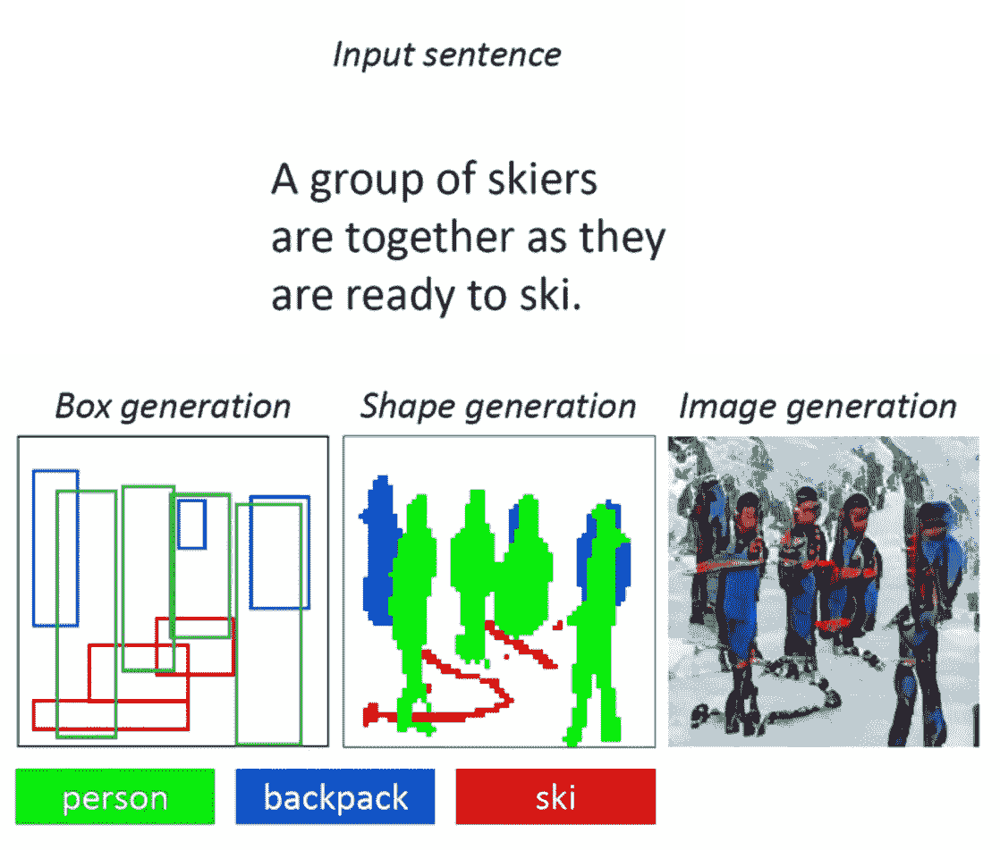
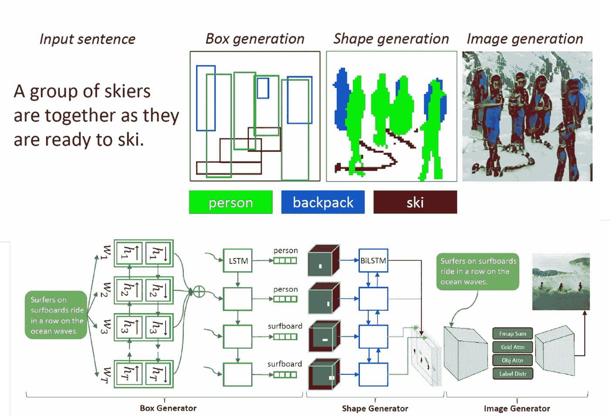
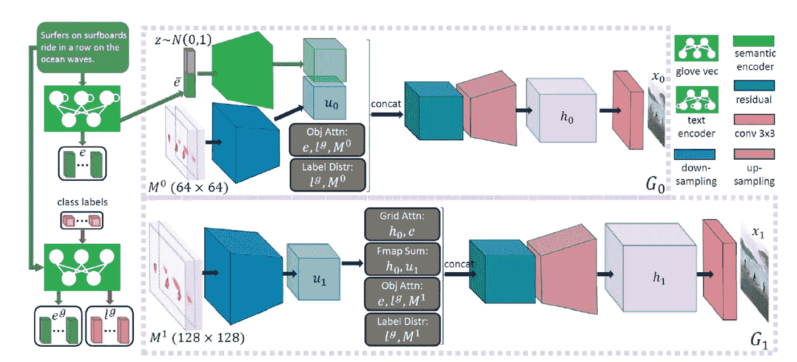
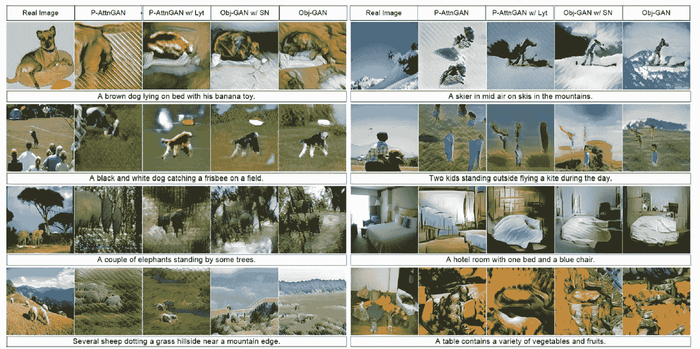

# 这个微软神经网络可以从短文本中生成图像

> 原文：<https://pub.towardsai.net/this-microsoft-neural-network-can-generate-images-from-short-texts-4b9729a1e57f?source=collection_archive---------0----------------------->

## [自然语言处理](https://towardsai.net/p/category/nlp)

## 新方法结合了生成模型和自然语言处理。

> 我最近创办了一份专注于人工智能的教育时事通讯，已经有超过 90，000 名订户。《序列》是一份无废话(意思是没有炒作，没有新闻等)的 ML 导向时事通讯，需要 5 分钟阅读。目标是让你与机器学习项目、研究论文和概念保持同步。请通过订阅以下内容来尝试一下:

 [## 序列

### 订阅人工智能世界中最相关的项目和研究论文。受到 85，000 多人的信任…

thesequence.substack.com](https://thesequence.substack.com/) 

人类在图像中建立知识。每当我们有一个想法或一次经历时，我们的大脑会立即形成它的视觉表现。类似地，我们的大脑不断在声音或纹理等感官信号与其视觉表征之间进行上下文切换。我们用视觉表示进行思考的能力还没有完全扩展到人工智能(AI)算法。今天，大多数人工智能模型都高度专注于一种形式的数据表示，如图像、文本或声音。最终，我们将开始看到能够在不同数据格式之间高效翻译的人工智能形式，以优化知识的创造。最近，来自微软[的人工智能研究人员发表了一篇论文，提出了一种基于短文本生成图像的方法。](https://www.microsoft.com/en-us/research/publication/object-driven-text-to-image-synthesis-via-adversarial-training/)

我们从声音或文字描述中产生视觉表现的能力是人类认知的神奇要素之一。如果你被要求画一个篮球比赛的图像，你可能会从位于画布中心的三个或四个球员的轮廓开始。即使没有直接指定，你也可以添加一些细节，比如乌鸦，裁判，或者特定投篮位置的球员。所有这些细节丰富了基本的文本描述，以实现我们的篮球比赛的视觉版本。如果人工智能模型也能做到这一点，岂不是很棒？文本到图像(TTI)是深度学习的新兴学科之一，专注于从基本的文本表示生成图像。虽然 TTI 领域还处于非常早期的阶段，但我们已经看到了一些切实的进展，一些模型已被证明在非常具体的场景中非常熟练。然而，它们是 TTI 模型中仍需解决的非常具体的挑战。

# 从文本生成图像:挑战与思考

有几个相关的挑战传统上阻碍了 TTI 模型的发展，但其中大多数可以归为以下几类？

1) **依赖性挑战:**显然，TTI 模型高度依赖文本和视觉分析技术，尽管近年来它们取得了很大进展，但要实现主流采用还有很多工作要做。从这个角度来看，TTI 模型的功能通常会受到底层文本分析和图像生成模型的限制。

2) **概念-对象关系:**TTI 模型中要解决的一个难以置信的难题是从文本描述中提取的概念与其对应的视觉对象之间的关系。实际上，可能有无限数量的对象匹配特定的文本描述。在 TTI 模型中，找出概念和对象之间的正确匹配仍然是关键的挑战。

3) **物物关系:**任何图像都是以视觉的形式表达物体之间的关系。为了反映给定的叙述，TTI 模型不仅要生成正确的对象，还要生成它们之间的关系。在文本到图像生成技术中，生成包含多个对象并且这些对象之间具有语义上有意义的关系的更复杂的场景仍然是一个重大挑战。

# 对象驱动的注意 GAN

为了应对 TTI 模型的一些传统挑战，微软研究院依赖于日益流行的生成对抗网络(GANs)技术。GANs 通常由两个机器学习模型组成——一个从文本描述生成图像的生成器，一个使用文本描述判断生成图像真实性的鉴别器。生成器试图让假图片通过鉴别器；另一方面，歧视者从不希望被愚弄。一起工作，鉴别器将发电机推向完美。微软对传统的 GAN 模型进行了创新，加入了自下而上的注意机制。Obj-GAN 模型开发了一个对象驱动的注意力生成器和一个对象式鉴别器，从而使 GANs 能够合成复杂场景的高质量图像。

Obj-GAN 的核心架构分两步执行 TTI 合成:

**1)生成语义布局:**该阶段包括生成元素，如类别标签、包围盒、显著对象的形状等。这个功能由两个主要组件完成:盒子生成器和形状生成器。

**2)生成最终图像:**该功能由一个多级图像生成器和一个鉴别器完成。

下图提供了 Obj-GAN 模型的高级架构。该模型接收具有一组标记的句子作为输入，然后将其编码为单词向量。之后，输入通过三个主要阶段进行处理:盒子生成、形状生成和图像生成。

图片来源:微软研究院

Obj-GAN 模型的第一步将句子作为输入，并生成语义布局，即由边界框指定的对象序列。模型的框生成器负责生成一系列边界框，然后由形状生成器使用。给定一组边界框作为输入，形状生成器预测每个对象在其对应的框中的形状。由形状生成器产生的形状然后被图像生成器 GAN 模型使用。

Obj-GAN 包括一个基于两个主要生成器的多级图像生成器神经网络。基本生成器首先根据全局句子向量和预先生成的语义布局生成低分辨率图像。然后，第二个生成器通过关注最相关的单词和预先生成的类别标签来细化不同区域的细节，并生成更高的分辨率。

图片来源:微软研究院

到目前为止，您可能想知道架构的对抗性组件在哪里发挥作用？这就是基于对象的鉴别器的作用。这个组件的作用是作为训练图像生成器的对手。Obj-GAN 模型包括两个主要鉴别器:

**逐片鉴别器:**该鉴别器用于训练盒子和形状生成器。第一个鉴别器试图评估生成的边界框是否对应于给定的句子，而第二个鉴别器做同样的事情来评估边界框和形状之间的对应关系。

**基于对象的鉴别器:**该鉴别器使用一组边界框和对象标签作为输入，并试图确定生成的图像是否符合原始描述。

对盒子、形状和图像生成使用对立的生成器-鉴别器组合使 Obj-GAN 比其他传统的 TTI 方法更有优势。微软用最先进的 TTI 模型对 Obj-GAN 进行了评估，结果非常显著。只要看看生成的图像质量的差异以及它们与原始句子的对应关系。

图片来源:微软研究院

创建给定叙事的视觉表示的能力将是下一代文本和图像分析深度学习模型的重要焦点。Obj-GAN 等想法无疑将相关创新带入了深度学习领域。