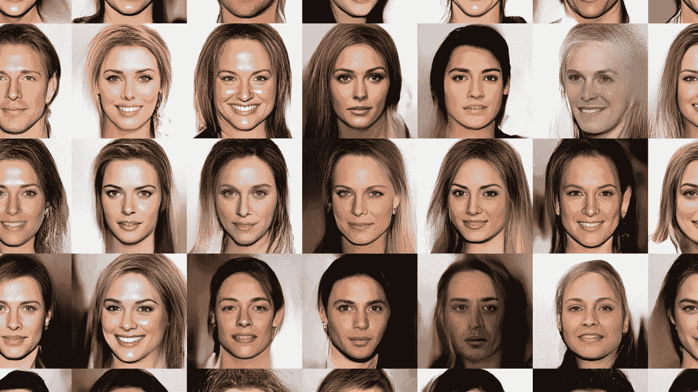
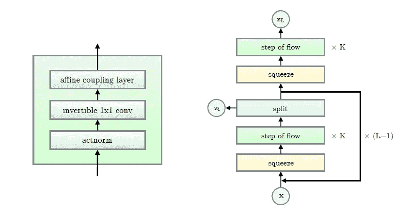

# OpenAI 的这个神经网络可以从小数据集学习

> 原文：<https://pub.towardsai.net/this-neural-networkfrom-openai-can-learn-from-small-datasets-e69efcc15c6b?source=collection_archive---------0----------------------->

## [人工智能](https://towardsai.net/p/category/artificial-intelligence)

## Glow 是一项关于深度神经网络的标志性有趣研究，可以用小训练集进行归纳。

图片来源:OpenAI

> 我最近创办了一份专注于人工智能的教育时事通讯，已经有超过 80，000 名订户。《序列》是一份无废话(意思是没有炒作，没有新闻等)的 ML 导向时事通讯，需要 5 分钟阅读。目标是让你与机器学习项目、研究论文和概念保持同步。请通过订阅以下内容来尝试一下:

 [## 序列

### 订阅人工智能世界中最相关的项目和研究论文。受到 85，000 多人的信任…

thesequence.substack.com](https://thesequence.substack.com/) 

自机器学习的早期以来，人工智能场景面临着两大挑战，以便体验主流采用。首先，我们有数据效率问题，这需要使用大而准确的数据集来训练机器或深度学习模型，正如我们所知，构建和维护这些数据集非常昂贵。第二，为了建立不同于训练数据的新知识，我们有 AI 代理面临的一般化问题。相比之下，人类在最少监督的情况下学习效率惊人，并能从少数数据示例中快速归纳知识。

生成模型是深度学习学科之一，专注于解决上述两个挑战。从概念上讲，生成模型专注于观察初始数据集，如一组图片，并试图了解数据是如何生成的。使用更多的数学术语，生成模型试图推断非常高维的输入数据中的所有相关性，通常以全联合概率分布的形式指定。语音合成或半监督学习等整个深度学习领域都是基于生成模型的。最近，生成模型如生成对抗网络(GANs)在深度学习社区中变得非常流行。最近，OpenAI 试验了一种不太为人所知的技术，称为基于流的生成模型，以改进现有的方法。结果是 Glow 的创建，这是一种新的基于流的生成模型，能够从几个训练示例中生成高质量的数据集。这些发现是在 OpenAI 于 2018 年发表的一篇非常著名的[研究论文](https://arxiv.org/abs/1807.03039)中捕获的。您可以在下面的动画中看到光晕的效果:

视频:OpenAI

由于一些无法解释的原因，基于流程的生成模型没有像 GANs 这样的对应模型那样受欢迎。然而，与替代技术相比，这种技术提供了一些切实的优势:

*   **精确潜变量推断和对数似然估计:**大多数生成方法只能近似对应于一个数据点的潜变量的值。其他像甘的根本没有编码器来推断潜在的。在可逆生成模型中，这可以在没有近似的情况下准确完成。这不仅导致了精确的推断，还使得能够优化数据的精确对数似然性，而不是它的下限。
*   **高效的推理和高效的合成:**Glow(和 RealNVP)等基于流的生成模型对于推理和合成的并行化是高效的。
*   **节省内存的巨大潜力:**在可逆神经网络中计算梯度需要恒定的内存量，而不是像 GANs 等许多其他生成模型那样深度呈线性。

# 发光建筑

OpenAI Glow 的架构建立在以前的工作基础上，如 [NICE](https://arxiv.org/abs/1410.8516) 和 [RealNVP](https://arxiv.org/abs/1605.08803) ，但它简化了这些模型。辉光模型由多尺度架构中的一系列步骤组成。每一步都基于三层:actnorm，接着是可逆的 1x1 卷积，接着是耦合层。

图片来源:OpenAI

给定一个输入数据集，Glow 的多层架构执行以下任务。

1.  通过在通道维度上反转输入顺序来排列输入。
2.  沿着特征尺寸的中间将输入分成两部分，A 和 B。
3.  将 A 输入浅卷积神经网络。根据神经网络的输出对 B 进行线性变换。
4.  连接 A 和 b。

# 在行动中发光

OpenAI 进行了一系列定量和定性实验来评估 Glow 的能力，一些结果令人惊叹。例如，Glow 能够使用可预测的稳定性能生成高分辨率图像。

视频:OpenAI

更有趣的是，Glow 可以学习图像的个人特征，如头发颜色或鼻子的派系。Glow 使用一个编码器模型对这些单独的特征进行插值，并生成新的相关图像。

视频:OpenAI

Glow 背后的研究表明，基于流的方法对生成模型的空间有很大的贡献。就像 GANs 这样的替代方案一样，基于流的方法可以成为构建深度学习模型的关键块，这些模型可以从小数据集进行学习，并有效地进行归纳。