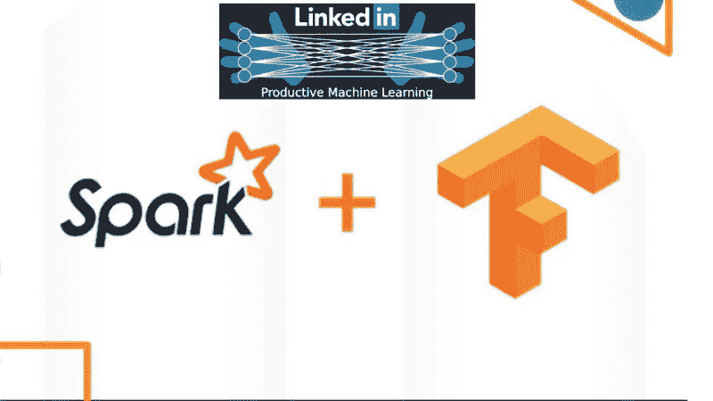
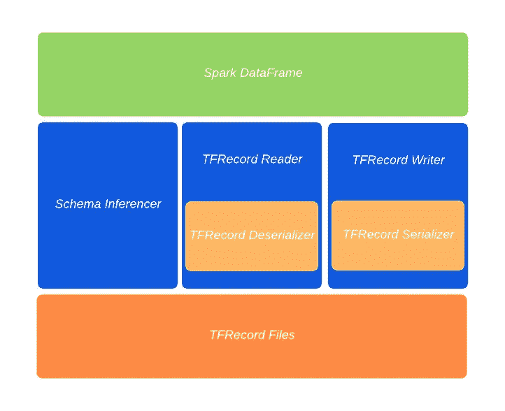

# 这个开源框架由 LinkedIn 创建，旨在简化 TensorFlow 和 Spark 之间的互操作性

> 原文：<https://pub.towardsai.net/this-open-source-framework-was-created-by-linkedin-to-simplify-the-interoperability-between-e4f327f24442?source=collection_archive---------3----------------------->

## [人工智能](https://towardsai.net/p/category/artificial-intelligence)

## Spark-TFRecord 支持在 Apache Spark 中处理 TensorFlow 的 TFRecord 结构。



来源: [K](https://www.kdnuggets.com/2020/05/linkedin-open-sources-small-component-tensorflow-spark-interoperability.html) DNuggets

> 我最近创办了一份专注于人工智能的教育时事通讯，已经有超过 80，000 名订户。《序列》是一份无废话(意思是没有炒作，没有新闻等)的 ML 导向时事通讯，需要 5 分钟阅读。目标是让你与机器学习项目、研究论文和概念保持同步。请通过订阅以下内容来尝试一下:

[](https://thesequence.substack.com/) [## 序列

### 订阅人工智能世界中最相关的项目和研究论文。受到 85，000 多人的信任…

thesequence.substack.com](https://thesequence.substack.com/) 

TensorFlow 和 Apache Spark 的互操作是现实世界机器学习场景中的常见挑战。TensorFlow 可以说是市场上最受欢迎的深度学习框架，而 Apache Spark 仍然是最广泛采用的数据计算平台之一，在大型企业和初创公司中有大量安装。很自然，公司会尝试将两者结合起来。虽然有一些框架可以使 TensorFlow 适应 Spark，但是互操作性挑战的根源通常在数据层面。TFRecord 是 TensorFlow 中的原生数据结构，在 Apache Spark 中不完全受支持。去年，LinkedIn 的工程师开源了 [Spark-TFRecord](https://github.com/linkedin/spark-tfrecord) ，这是 Spark 基于 TensorFlow TFRecord 的一个新的原生数据源。

LinkedIn 决定解决这个问题并不奇怪。这家互联网巨头长期以来一直是 Spark 技术的广泛采用者，并且一直是 TensorFlow 和机器学习开源社区的积极贡献者。在内部，LinkedIn 的工程团队经常试图在 TensorFlow 的原生 TFRecord 格式和 Spark 的内部格式(如 Avro 或 Parquet)之间实现转换。Spark-TFRecord 项目的目标是在 Spark 管道中提供 TFRecord 结构的原生功能。

# 先前的尝试

[Spark-TFRecord](https://github.com/linkedin/spark-tfrecord) 并不是第一个试图解决 Spark 和 TensorFlow 之间数据互操作性挑战的项目。其中最受欢迎的项目是由 Spark 的创造者 Databricks 推广的[Spark-tensor flow-Connector](https://github.com/tensorflow/ecosystem/tree/master/spark/spark-tensorflow-connector)。我们已经多次使用 Spark-TensorFlow-Connector，取得了不同程度的成功。从架构上来说，连接器是 TFRecord 格式到 Spark SQL 数据帧的改编。知道了这一点，Spark-TensorFlow-Connector 在关系数据访问场景中非常有效，但在其他用例中仍然非常有限就不足为奇了。

仔细想想，TensorFlow 工作流的一个重要部分与磁盘 I/O 操作有关，而不是数据库访问。在这些场景中，当使用 Spark-TensorFlow-Connector 时，开发人员最终会编写大量的代码。此外，当前版本的 Spark-TensorFlow-Connector 仍然缺少重要的功能，例如在 TensorFlow 计算中经常使用的*分区*。最后，连接器更像是处理 Spark SQL 数据帧中 TensorFlow 记录的桥梁，而不是原生文件格式。

考虑到这些限制，LinkedIn 工程团队决定从稍微不同的角度解决 Spark-TensorFlow 互操作性挑战。

# 火花 TFRecord

Spark-TFRecord 是 Apache Spark 的原生 TensorFlow TFRecord。具体来说，Spark-TFRecord 提供了从/向 Apache Spark 读取和写入 TFRecord 数据的例程。Spark-TFRecord 不是构建一个连接器来处理 TFRecord 结构，而是像 Avro、JSON 或 Parquet 一样构建一个原生 Spark 数据集。这意味着所有 Spark 的 DataSet 和 DataFrame I/O 例程在 Spark-TFRecord 中都是自动可用的。

一个显而易见的值得探讨的问题是，为什么要构建一个新的数据结构，而不是简单地对开源的 Spark-TensorFlow 连接器进行版本控制？看起来，使连接器适应磁盘 I/O 操作需要一个基本的重新设计。

LinkedIn 工程团队没有遵循这条路线，而是决定实现一个新的 [Spark FileFormat 接口](https://github.com/apache/spark/blob/master/sql/core/src/main/scala/org/apache/spark/sql/execution/datasources/FileFormat.scala)，它的基本设计是为了支持磁盘 I/O 操作。新接口将使 TFRecord 本机操作适应任何 Spark 数据帧。在体系结构上，Spark-TFRecord 由一系列抽象读/写和序列化/反序列化例程的基本构建块组成:

***模式推理器:*** *这是离 Spark-TensorFlow-Connector 最近的组件。该接口将 TFRecords 表示映射到本机 Spark 数据类型。*

****TFRecord Reader:****该组件读取 TF record 结构，并将它们传递给反序列化器。**

****TFRecord 编写器:*** *该组件从序列化器接收一个 TFRecord 结构，并将其写入磁盘。**

****TFRecord 序列化器:*** *该组件将 Spark InternalRow 转换为 TFRecord 结构。**

****TFRecord 反序列化器:*** *该组件将 TFRecord 转换为 Spark InternalRow 结构。**

**

*来源:[https://engineering.linkedin.com/blog/2020/spark-tfrecord](https://engineering.linkedin.com/blog/2020/spark-tfrecord)*

*使用 LinkedIn 的 Spark-TFRecord 与其他 Spark 原生数据集并无不同。开发人员只需包含 spark-tfrecord jar 库，并使用传统的 DataFrame API 来读写 tfrecord，如以下代码所示:*

```
*import org.apache.commons.io.FileUtils
import org.apache.spark.sql.{ DataFrame, Row }
import org.apache.spark.sql.catalyst.expressions.GenericRow
import org.apache.spark.sql.types._val path = "test-output.tfrecord"
val testRows: Array[Row] = Array(
new GenericRow(Array[Any](11, 1, 23L, 10.0F, 14.0, List(1.0, 2.0), "r1")),
new GenericRow(Array[Any](21, 2, 24L, 12.0F, 15.0, List(2.0, 2.0), "r2")))
val schema = StructType(List(StructField("id", IntegerType),
                             StructField("IntegerCol", IntegerType),
                             StructField("LongCol", LongType),
                             StructField("FloatCol", FloatType),
                             StructField("DoubleCol", DoubleType),
                             StructField("VectorCol", ArrayType(DoubleType, true)),
                             StructField("StringCol", StringType)))val rdd = spark.sparkContext.parallelize(testRows)//Save DataFrame as TFRecords
val df: DataFrame = spark.createDataFrame(rdd, schema)
df.write.format("tfrecord").option("recordType", "Example").save(path)//Read TFRecords into DataFrame.
//The DataFrame schema is inferred from the TFRecords if no custom schema is provided.
val importedDf1: DataFrame = spark.read.format("tfrecord").option("recordType", "Example").load(path)
importedDf1.show()//Read TFRecords into DataFrame using custom schema
val importedDf2: DataFrame = spark.read.format("tfrecord").schema(schema).load(path)
importedDf2.show()*
```

*Spark 和深度学习框架(如 TensorFlow)之间的互操作性可能会继续成为大多数组织面临的一个挑战。然而，像 LinkedIn 的 Spark-TFRecord 这样经过大规模测试的项目肯定有助于简化这两种技术之间的桥梁，而这两种技术对许多现代机器学习架构来说是必不可少的。*