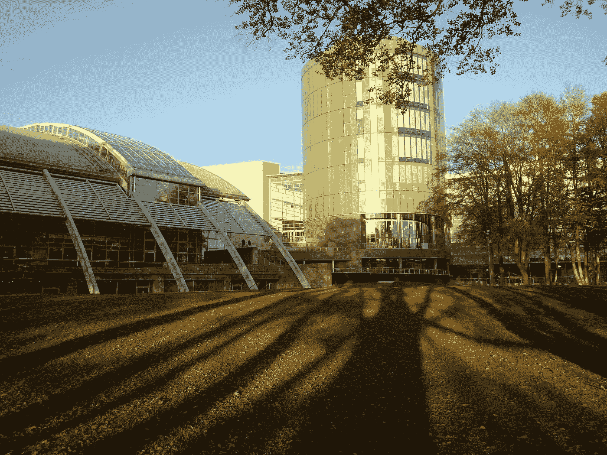

# 这所大学发布了一门免费的在线数据科学课程(带学分)

> 原文：<https://pub.towardsai.net/this-university-released-a-free-online-data-science-course-with-credits-41d75893764c?source=collection_archive---------0----------------------->

## [教育](https://towardsai.net/p/category/education)

## 只有 125 个座位。

[【档案:RGU 的秋天 2 . jpg】](https://commons.wikimedia.org/w/index.php?curid=29588907)由 [Jackofhearts101](https://commons.wikimedia.org/w/index.php?title=User:Jackofhearts101&action=edit&redlink=1) 在 [CC BY-SA 3.0](https://creativecommons.org/licenses/by-sa/3.0?ref=ccsearch&atype=rich) 下授权

罗伯特·戈登大学旨在支持苏格兰的技能需求，并为此推出了一系列免费的在线短期课程，包括 125 个全额资助的**“Python 数据科学入门”课程这是 RGU 的新闻稿。**

虽然你不需要知道编程来做数据科学，但显然像[这样的无代码人工智能工具。AI](http://obviously.ai) ，如果你想获得一个技术职位，了解 Python 将是关键，所以这个免费课程是一个很好的机会。

# 你会学到什么

除了探索 Python 和各种数据科学技术，您还将深入研究数据科学生命周期中无数的伦理和法律问题。毕竟，人们很容易忘记数据科学通常需要处理敏感信息，无论是用户对话、闭路电视录像、浏览习惯，还是我们每天生成的数百万条其他数据。

# 125 个资助席位

125 个席位由所谓的苏格兰资助委员会(SFC)技能提升基金支持，优先考虑“目前失业或工作受到威胁的人”也就是说，即使你被雇佣了，你也完全有可能得到一个资助的职位，因为上面只写着“优先”给予。

一位参与这项倡议的教授说:

> “SFC 技能提升基金为解决苏格兰技能短缺问题做出了如此受欢迎的贡献…我们很高兴能够在这一成功的基础上提供 125 个数据科学导论课程的名额。”

# 报名

实际的课程注册链接可在下面的网站上找到。如你所见，完成这门课程实际上会给你 15 个大学学分，否则代价会很高。

 [## SCQF 级别 9 的 Python - 15 学分数据科学简介

### 独立的学习材料和练习可在网上获得，允许参与者灵活地学习和…

www.rgu.ac.uk](https://www.rgu.ac.uk/study/courses/3274-introduction-to-data-science-with-python-15-credits-at-scqf-level-9) 

为期 10 周的课程将于 2 月份开始，现在已经开始接受申请。本课程分为理论和实践两部分，具体如下:

*   8 周完成在线材料和练习
*   两周时间将学到的技术应用到顶点项目中

# 做好工作准备

该大学强调，这是一门为就业做好准备的有意义的课程，因为其目的是提高学生的技能，让他们加入劳动力大军。

特别是，你将学习按需业务技能，如提取和理解数据中包含的知识，并使用这些知识做出业务决策(如预测结果、诊断故障或减少响应时间)。

# 摘要

正如我之前所写的，课程不是一切，因为你需要执行你所学的，但是这门课程在提供理论和实践方面做得非常好。

此外，通过获得实际的大学学分，这是获得技术学位的一个很好的免费途径。最后，如果你想要一个技术职位，最好抓紧这个机会，因为只有 125 个资助席位。