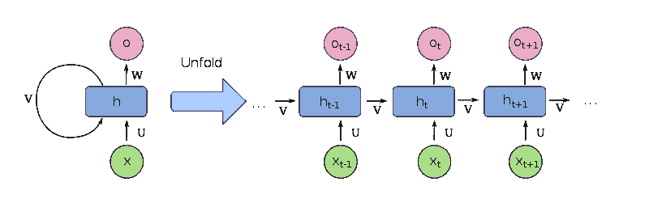
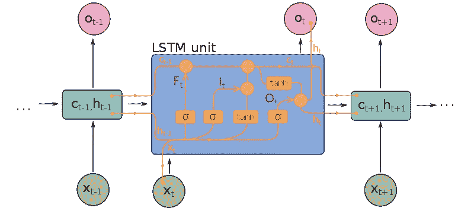
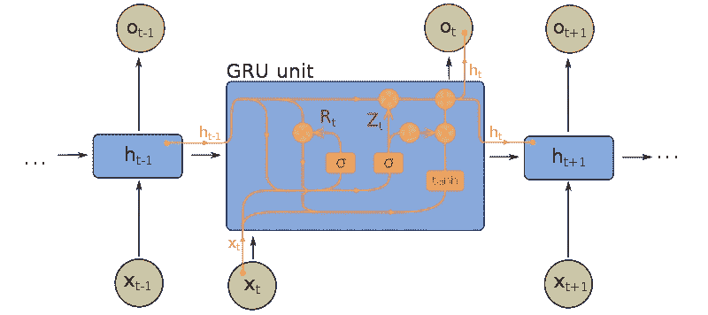
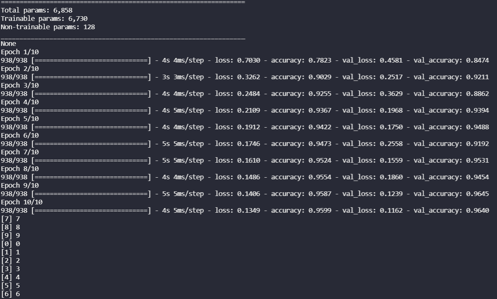
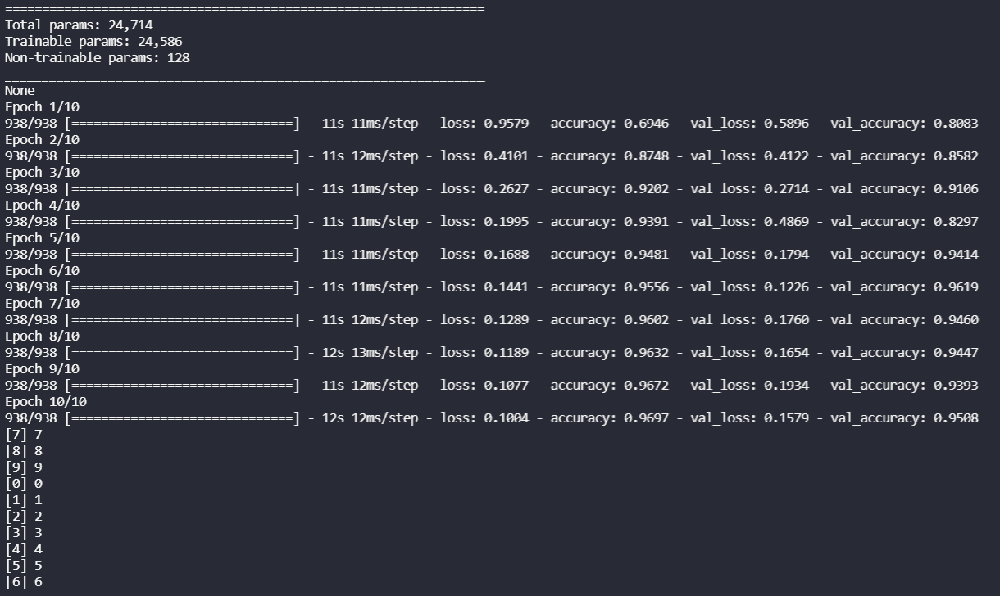
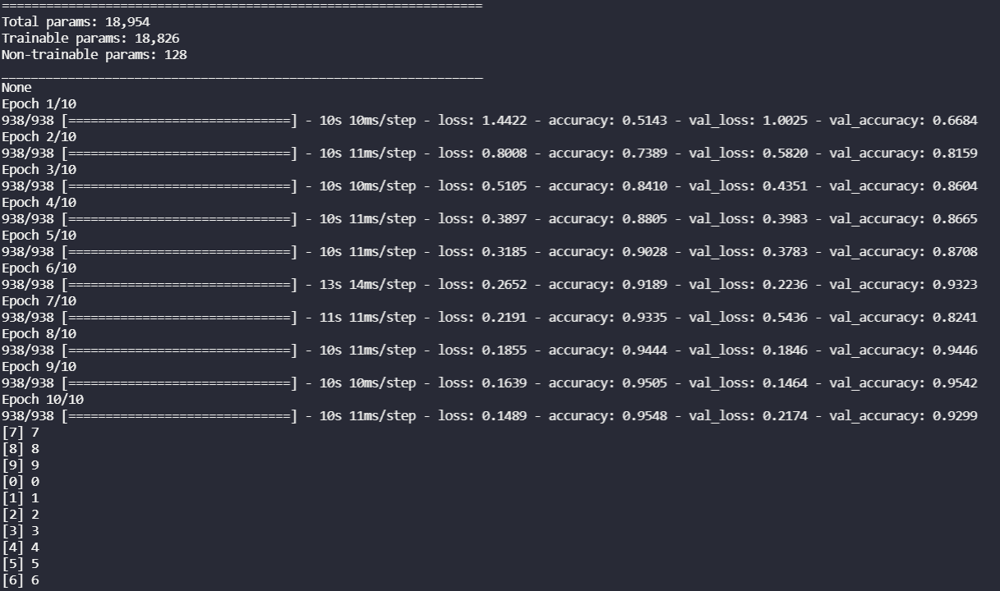

# 三种类型的递归神经网络

> 原文：<https://pub.towardsai.net/three-types-of-recurrent-neural-networks-567b4e9c4261?source=collection_archive---------0----------------------->

## [深度学习](https://towardsai.net/p/category/machine-learning/deep-learning)

## 让我们来看看 RNNs、LSTMs 和 GRUs



[图片来自维基百科](https://upload.wikimedia.org/wikipedia/commons/b/b5/Recurrent_neural_network_unfold.svg)

递归神经网络是为序列数据设计的神经网络。序列数据是以前面的数据点影响后面的数据点的形式出现的任何数据。RNNs 可以应用于图像数据、时间序列数据，以及最常见的语言数据。在本帖中，我们将介绍三种最常见的递归神经网络，以及如何在 TensorFlow 上的 Keras 中实现它们。

# 三种类型的递归神经网络

三种最著名的递归神经网络是简单 RNN、长短期记忆神经网络和门控递归单元神经网络。RNN 建筑归功于大卫鲁梅尔哈特 1986 年的论文。十多年后，Hochreiter 和 Schmidhuber 在 1997 年的一篇论文中展示了长短期记忆细胞的准确性优势。近二十年后，KyungHyun Cho 等人用门控循环单位显示了某些类型数据的改善。

## 简单递归神经网络


RNN，[图片来自堆栈交换](https://i.stack.imgur.com/KmrmP.png)

我们要研究的第一种 RNN 是“简单的”递归神经网络。简单意味着网络的节点(或单元)不被修改。在大多数情况下，它还表明我们正在使用一个标准的全连接前馈神经网络作为我们的基础架构。通过为至少*一层神经元*添加一个“反馈”回路，从基本前馈神经网络扩充 rnn。

这个反馈回路产生了递归神经网络的“递归”。这些反馈环是使 RNNs 成为序列数据理想选择的特征。有了这种设置，使用一个数据点在网络中运行一次就可以利用上一次运行的结果。

## 长短期记忆神经网络



LSTM，[图片来自维基百科](https://upload.wikimedia.org/wikipedia/commons/6/63/Long_Short-Term_Memory.svg)

长短期记忆实际上是指 RNN 中的细胞类型。整个网络的架构保持不变。当然，架构也可以有变化，但这里的主要创新是细胞类型。LSTM 单元为单元引入了额外的三个“门”。

这些门是输入门、输出门和遗忘门。这些门的引入创造了一个更复杂的方法来确定我们是否应该使用递归数据。这对于图像、视频或文字等非正常序列数据尤其有用。LSTMs 已经被证明在视频数据、音频数据和异常检测上实现了高得多的准确度。

LSTMs 解决的 RNN 问题之一是[消失梯度](https://en.wikipedia.org/wiki/Vanishing_gradient_problem)的问题。在迭代过程中，梯度呈指数下降，梯度告诉网络它犯了多大的错误。LSTM 通过允许梯度不变地流过网络来解决这个问题。然而，LSTMs 仍然可能成为爆炸梯度的受害者，这是相反的效果。

## 门控递归单元神经网络



GRU，[图片来自维基百科](https://upload.wikimedia.org/wikipedia/commons/5/5f/Gated_Recurrent_Unit.svg)

像 LSTMs 一样，门控循环单位也指细胞类型。GRU 电池和 LSTM 电池的区别在于 GRU 电池没有输出门。这降低了 GRUs 的训练复杂性。与参数数量为四倍的 LSTMs 相比，GRU 层的参数数量是简单 RNN 的三倍。

GRUs 在大多数系列数据上表现出与 LSTMs 相似的性能，尤其是音频和语言数据。然而，gru 在一些分类频率较低的较小数据集上表现更好。

# RNN、LSTM 和 GRU 的 Python 实现

我们可以使用 TensorFlow 上的 Keras 轻松创建 RNN、LSTM 和 GRU 模型。请记住，RNNs、LSTMs 和 GRUs 之间的主要区别在于单元的类型。在天真的意义上，任何具有递归层的神经网络都是 RNN，任何具有 LSTM 或 GRU 细胞的神经网络分别是这些类型的模型。

在 Keras 中创建神经网络很简单。我们需要做的就是初始化一个模型类型并添加层。在我们的例子中，我们正在创建`Sequential`模型。对于下面的三个示例，我们将为每种类型的 RNN 创建三层神经网络。在下面的例子中，你会注意到代码几乎完全相同。这是因为它们之间唯一需要改变的是细胞类型。

注意，我们可以随意改变第一层的形状。我们做`28x28`的原因是因为我们一会儿将在 MNIST 数字数据集上训练这些。

## 克拉斯·RNN

```
import tensorflow as tffrom tensorflow import kerasfrom tensorflow.keras import layersmodel = keras.Sequential()model.add(layers.SimpleRNN(64, *input_shape*=(28, 28)))model.add(layers.BatchNormalization())model.add(layers.Dense(10))print(model.summary())
```

## 克拉斯·LSTM

```
import tensorflow as tffrom tensorflow import kerasfrom tensorflow.keras import layersmodel = keras.Sequential()model.add(layers.LSTM(64, *input_shape*=(28, 28)))model.add(layers.BatchNormalization())model.add(layers.Dense(10))print(model.summary())
```

## 克拉斯·GRU

```
import tensorflow as tffrom tensorflow import kerasfrom tensorflow.keras import layersmodel = keras.Sequential()model.add(layers.GRU(64, *input_shape*=(28, 28)))model.add(layers.BatchNormalization())model.add(layers.Dense(10))print(model.summary())
```

## MNIST 数字数据集上 RNNs、LSTMs 和 GRUs 的比较

我们可以通过添加以下代码块，在 MNIST 数字数据集上训练上述神经网络:

```
mnist = keras.datasets.mnist(x_train, y_train), (x_test, y_test) = mnist.load_data()x_train, x_test = x_train/255.0, x_test/255.0x_validate, y_validate = x_test[:-10], y_test[:-10]x_test, y_test = x_test[-10:], y_test[-10:]model.compile(*loss*=keras.losses.SparseCategoricalCrossentropy(*from_logits*=True), *optimizer*="sgd", *metrics*=["accuracy"],)model.fit(x_train, y_train, *validation_data*=(x_validate, y_validate), *batch_size*=64, *epochs*=10)
```

在 MNIST 数字数据集上训练这些神经网络的结果如下。

10 个时代的 RNN。



RNN 结果，作者图片

10 个时代的 LSTM。



LSTM 结果，作者图片

10 个时代的 GRU。



GRU 结果，作者图片

# rnn、LSTMs 和 gru 的摘要

在本文中，我们了解了 rnn、LSTMs 和 gru。我们回顾了每种技术的简史，从 20 世纪 80 年代的 RNNs、20 世纪 90 年代的 LSTMs 和 21 世纪 10 年代的 GRUs 开始。然后我们看了如何用 Keras 和 TensorFlow 库在 Python 中实现这些。最后，我们比较了它们在 MNIST 数字数据集上的表现。如需更深入的分析，请参见 RNNs、LSTMs 和 GRUs 的[对比。](https://pythonalgos.com/the-best-rnn-for-image-classification-rnn-lstm-or-gru/)

如果你喜欢这篇文章，请在 Twitter 上分享！为了无限制地访问媒体文章，今天就注册成为[媒体会员](https://www.medium.com/@ytang07/membership)！别忘了关注我，[唐](https://www.medium.com/@ytang07)，获取更多关于技术、[自然语言处理](https://pythonalgos.com/2021/11/23/what-is-natural-language-processing-nlp/)，以及成长的文章！

## 进一步阅读

*   [用 Python 构建你自己的文本摘要器](https://pythonalgos.com/build-your-own-ai-text-summarizer-in-python/)
*   [Python 3 中的神经网络代码](https://pythonalgos.com/build-a-recurrent-neural-network-from-scratch-in-python-3/)
*   [你的投资组合中需要的三个 NLP 项目](https://blog.devgenius.io/three-nlp-projects-you-need-in-your-portfolio-2a1a124f2570)
*   [你可能不知道的五种软件工作](https://blog.devgenius.io/five-jobs-in-software-jobs-you-may-not-know-9712b26623b0)
*   [为什么编程容易而软件工程难](https://blog.devgenius.io/why-programming-is-easy-but-software-engineering-is-hard-90019fd78ed5)