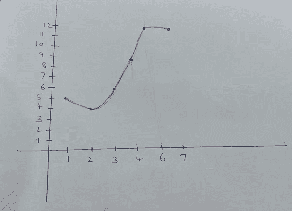
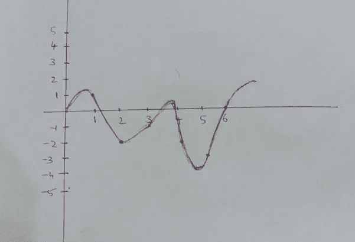

# 时间序列分析和预测

> 原文：<https://pub.towardsai.net/time-series-analysis-and-forecasting-223f4f134962?source=collection_archive---------1----------------------->

## [数据科学](https://towardsai.net/p/category/data-science)

## 介绍它的组成和平稳性

时间序列分析是一种基于历史数据预测或预报未来时间的方法。它用于各种平台，如股票市场价格分析、产品销售、房间预订预测、食品需求、疫情的传播等。时间序列可以对未来有直接或间接因素的任何组成部分产生影响。时间序列可以定义为给定时间间隔序列上的观察偏差。观察可以是股票价格、销售计数、一天中报告的案例数量。但是在所有这些观察中，有一个共同的东西是值得注意的。我们可以得出结论，一切都是时间的函数。因此，时间序列分析是一个单变量变量分析。

由[马库斯·斯皮斯克](https://unsplash.com/@markusspiske?utm_source=unsplash&utm_medium=referral&utm_content=creditCopyText)在 [Unsplash](https://unsplash.com/s/photos/stock-market-analysis?utm_source=unsplash&utm_medium=referral&utm_content=creditCopyText) 上拍摄的照片

## 时间的组成:

## 1.趋势:

趋势是时间的一个组成部分，如果观察值相对于时间图绘制，则显示向上流动或向下流动。趋势告诉我们，随着时间的推移，观察的模式要么在减少，要么在增加。

例如，让我们假设我们在城市的郊区建立了一个新的酒店和住宿设施，在那里新建的酒店周围没有商业存在。但是由于城市发展，当地政府宣布为城市开放一个新机场，幸运的是离你新建的旅馆更近。一旦机场建成并完全投入使用，你会发现酒店的预订量每天都在呈指数增长。因此，在这里，时间是一个显示趋势组件的例子。

照片由 [Burak K](https://www.pexels.com/@weekendplayer?utm_content=attributionCopyText&utm_medium=referral&utm_source=pexels) 从 [Pexels](https://www.pexels.com/photo/space-grey-ipad-air-with-graph-on-brown-wooden-table-187041/?utm_content=attributionCopyText&utm_medium=referral&utm_source=pexels)

## 2.季节性:

时间序列的季节性成分是为观察记录的模式，在较长的时间间隔内重复记录。季节性因素表明，在一年的特定时期或阶段，可能会有一个可预测的峰值记录。

例如，回到酒店预订示例的时间序列分析，让我们假设我们获取了过去五年的酒店预订数据。据观察，我们可以记录一年中某个特定时期的突然峰值。进一步深入分析，我们可以得出结论，预订量的突然上升是由于人们来到城市庆祝的节日模式。

照片由[像素](https://www.pexels.com/photo/blur-chart-check-up-curve-415779/?utm_content=attributionCopyText&utm_medium=referral&utm_source=pexels)的[皮克斯拜](https://www.pexels.com/@pixabay?utm_content=attributionCopyText&utm_medium=referral&utm_source=pexels)拍摄

## 3.错误:

时间序列的误差成分是为观察记录的不寻常的行为模式。误差分量表明观察到了奇怪的尖峰，这在关于时间的观察的历史数据中从未发生过。

例如，回到酒店预订示例的时间序列分析，让我们假设，看着你在业务上的进展，考虑到你最近几年正在享受的利润率，全市的投资者决定在你旁边建立一个新的酒店。在未来几年，我们观察到酒店预订量突然下降，这是在您的酒店预订历史数据中观察到的不寻常的峰值。发生这种情况的原因是由于你的观察与时间相对照的一些外部因素。新酒店的设立影响了你的业务，这是你从未预料到的。所以这是时间的组成部分，它是不可预测的，因为它是导致产生它的外部因素。

照片由[马库斯·温克勒](https://unsplash.com/@markuswinkler?utm_source=unsplash&utm_medium=referral&utm_content=creditCopyText)在 [Unsplash](https://unsplash.com/s/photos/graph?utm_source=unsplash&utm_medium=referral&utm_content=creditCopyText) 上拍摄

## 平稳性:

为了预测(t+1)时段的观测值，我们必须确定由 t，t-1，t-2，…..，t-k 一定是静止的。术语平稳意味着方差和均值在不同的时间间隔都必须保持不变。如果方差和均值不是随时间稳定的，那么很难预测(t+1)时间间隔的观测值。此外，平稳点是非季节性时间序列观测值。

验证固定点的点:

1.平均值是常数

2.方差是常数

3.非季节性时间序列观测。

## 方差是常数，但平均值是不规则的

让我们通过一个例子来理解这一点，以区分平稳和非平稳时间序列分析。以下图为例。让我们以任何两个时间间隔 P1 和 P2。P2 区间中的平均值或平均斜率大于 P1 区间中的平均值。虽然方差是恒定的，但是间隔周围的平均值不是恒定的，从而导致非平稳时间序列分析。

图片来自 [Pixabay](https://pixabay.com/?utm_source=link-attribution&utm_medium=referral&utm_campaign=image&utm_content=3373119) 的[图米苏](https://pixabay.com/users/Tumisu-148124/?utm_source=link-attribution&utm_medium=referral&utm_campaign=image&utm_content=3373119)

## 平均值是常数，但方差是不规则的

考虑下面的另一个例子，其中平均值在 P1 和 P2 区间是常数。但是方差是随时间变化的。这是一个非平稳时间序列观察的例子。

来自 [Pixabay](https://pixabay.com/?utm_source=link-attribution&utm_medium=referral&utm_campaign=image&utm_content=160248) 的[openclipbart-Vectors](https://pixabay.com/users/OpenClipart-Vectors-30363/?utm_source=link-attribution&utm_medium=referral&utm_campaign=image&utm_content=160248)图片

## 均值和方差不变，但具有季节性

考虑下面的另一个例子，其中均值和方差在 P1 和 P2 区间都是常数。但是季节性是在给定观测值的时间序列中观察到的。这是一个非平稳时间序列观察的例子。

图片来自 [Pixabay](https://pixabay.com/?utm_source=link-attribution&utm_medium=referral&utm_campaign=image&utm_content=163708) 的 [PublicDomainPictures](https://pixabay.com/users/PublicDomainPictures-14/?utm_source=link-attribution&utm_medium=referral&utm_campaign=image&utm_content=163708)

## 如何将非平稳序列转化为平稳序列

为了转换成平稳的时间序列数据，我们应用差分概念。我们从 t 中减去(t-1)处的观察值，并将结果存储在新的系列数据中。绘制数据后，如果满足平稳性的所有条件，那么我们可以开始建模，通过应用时间序列模型来预测 t+1 的值。然而，如果它们即使在第一次差分之后也没有达到平稳性，那么我们可以继续差分，直到我们达到所需的平稳性条件。

X = [5，4，6，7，9，12，12]

作者图片

应用第一次差分后:

X(1) = [1，-2，-1，-2，-3，0]

作者图片

如果图形仍然没有达到平稳性，我们可以再次应用差分来查看输出图形是否达到平稳性。

这都是关于时间序列的各种组成部分，如何确定这些组成部分，以及什么是平稳性和如何实现平稳性。

感谢您阅读这篇文章。

在下一篇文章中，我将介绍时间序列模型。