# 时间序列分析:SciKit 实践-学习特征工程

> 原文：<https://pub.towardsai.net/time-series-analysis-hands-on-with-scikit-learn-feature-engineering-1e958e6534da?source=collection_archive---------0----------------------->

## [数据科学](https://towardsai.net/p/category/data-science)

## Python 和 Google Colab 项目

> ***内容***
> 
> 0.简介
> 1。探索性数据分析
> 2。数据集分割和变量定义
> 3。梯度推进
> 4。朴素线性回归
> 5。时间步长分类
> 6。三角函数特征
> 7。周期性花键特征
> 8。特征对线性模型预测影响的定性分析
> 9。用样条和多项式特征模拟成对交互
> 10。用内核模拟非线性特征交互
> 结论

**简介**

时间就是金钱。尽管这种说法可能很老套，但事实是每个人都需要技能来理解与时间相关的事件。这种类型的分析已经使用了几个世纪，例如在行星运动或天气预测中。然而，有了实际的计算机能力和数据可用性，就有可能比以往做更多的事情。

在时间序列分析(TSA)中，时间是中心变量，研究人员或分析人员需要了解时间“前后”发生了什么，以及这些事件如何随时间变化并受时间和其他变量的影响。通过这种方式，TSA 的数据集通常由在一段时间间隔内收集的数据构建而成，并且应该包括大量的观察数据，以避免偏差，并为研究人员提供事件的真实表示。

在这个数据分析的小项目中，我们将评估一年内以小时为单位的缺勤时间。我们的目标是分析趋势，帮助管理层预测未来的缺勤率。如果我们可以找到一个足够好的模型，我们就可以预测未来的行为，为我们的业务做准备。

我们将使用来自加州大学欧文分校(UCI)机器学习知识库的开放数据集。该数据集包含企业中雇主的缺勤时间数据，以及关于员工的一些其他变量，如服务时间、工作距离、工作量或儿子数量。

对于这个项目，我们将在 Google Colab 环境中使用 Python，并使用 [SciKit-Learn 库进行与时间相关的特征工程](https://scikit-learn.org/stable/auto_examples/applications/plot_cyclical_feature_engineering.html#trigonometric-features)。

如果您不能直接从本文中复制所有代码，请不要担心，您可以在 [GitHub](https://github.com/cdanielaam/Time_Series_Analysis/blob/main/time_series.ipynb) 上找到该项目中使用的确切代码。

开始吧！

**探索性数据分析**

首先要做的是导入数据集并研究它。为了完成整个项目，我将使用谷歌 Colab 免费版，因为它已经安装了几个 Python 库，随时可以使用。这样我们可以避免在我们的机器上安装更多的包或者处理不同的版本。

我还建议您将数据集导入到您的 Google Drive，并从 Google Colab 访问它。通过这种方式，您可以避免在会话到期时上传数据集。要在 Google Colab 上安装 Google Drive，请使用:

```
from google.colab import drive #This code will mount Google Drive
drive.mount('/content/drive')
```

现在导入项目所需的库:

```
import pandas as pd
import matplotlib.pyplot as plt
import seaborn as sns
import numpy as pd
import statistics#DataSet Split
from sklearn.model_selection import TimeSeriesSplit#Gradient Boosting
from sklearn.pipeline import make_pipeline
from sklearn.preprocessing import OrdinalEncoder
from sklearn.compose import ColumnTransformer
from sklearn.ensemble import HistGradientBoostingRegressor
from sklearn.model_selection import cross_validate#Naive Linear Regression
from sklearn.preprocessing import OneHotEncoder
from sklearn.preprocessing import MinMaxScaler
from sklearn.linear_model import RidgeCV
import numpy as np#Trigonometric features
from sklearn.preprocessing import FunctionTransformer#Periodic Spline Features
from sklearn.preprocessing import SplineTransformer#Pairwise interactions with splines and polynomial features
from sklearn.preprocessing import PolynomialFeatures
from sklearn.pipeline import FeatureUnion#Non-Linear feature interactions with kernels
from sklearn.kernel_approximation import Nystroem
```

加载和检查数据集:

```
df = pd.read_csv('/content/drive/MyDrive/ColabNotebooks/time_series.csv')df #To see the tabular dataset
print(df.columns) #Will print columns names
```

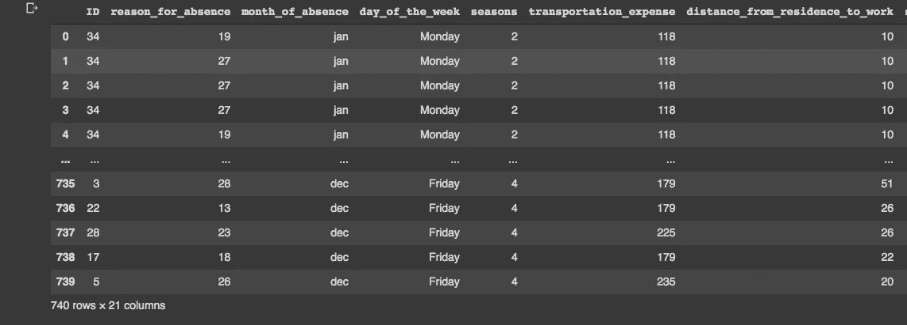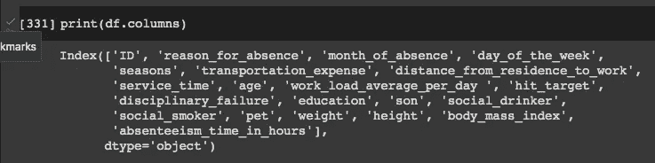

我们可以检查数值变量的最大值、最小值、平均值和标准差，并更好地理解我们的数据集。我们将从“旷工 _ 时间 _ 小时”开始，因为这是我们想要建模的变量。

```
#Check max and min for some variables (columns) and their distribution:print("Max absent time:", df["absenteeism_time_in_hours"].max())
print("Min absent time:", df["absenteeism_time_in_hours"].min())print("Mean absent time: ", df["son"].mean())
print("SD absent time: ", statistics.pstdev(df["son"]))sns.kdeplot(df["absenteeism_time_in_hours"], shade=True)
```

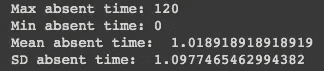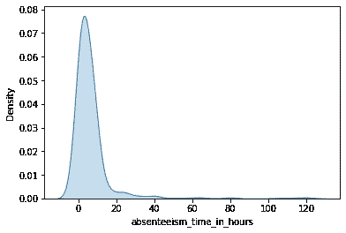

我们可以对其他数值变量做同样的处理，得到它们分布的密度图。最终结果将是这样的:

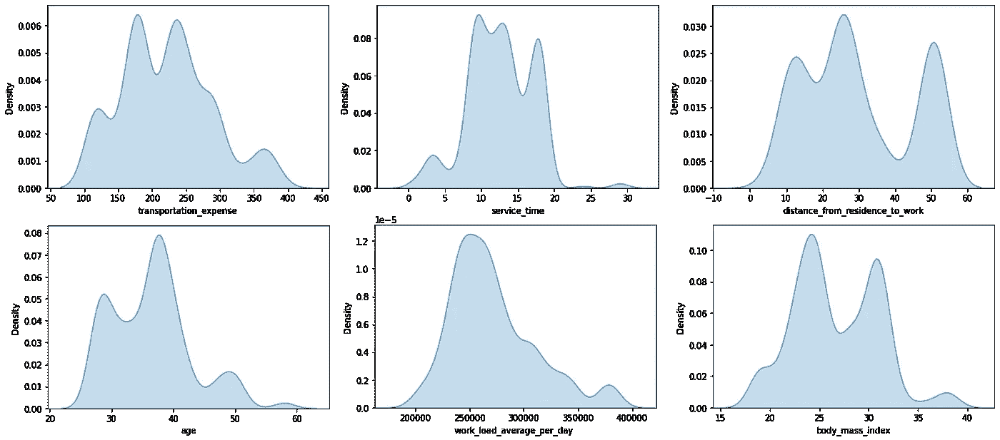

一些分类变量被编码为数字，但是，我们可以重新编码一些然后构建条形图:

```
df["day_of_the_week"].value_counts()
```

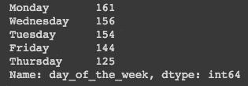

并创建一个条形图:

```
values = [161, 156, 154, 144, 125]
days = ("Monday", "Tuesday", "Wednesday", "Thursday", "Friday")plt.bar(days, values)
plt.show()
```

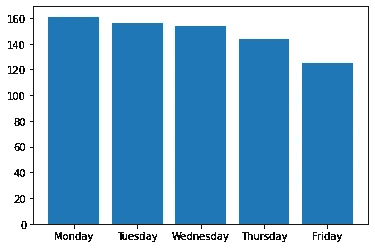

这同样适用于“缺勤月份”和“命中目标”。

```
df["month_of_absence"].value_counts()absence_hours = [53, 72, 87, 53, 64, 54, 67, 54, 53, 71, 63, 49]
month = ("Jan", "Feb", "Mar", "Apr", "May", "Jun", "Jul", "Aug", "Sep", "Oct", "Nov", "Dec")plt.bar(month, absence_hours)
plt.show()
```

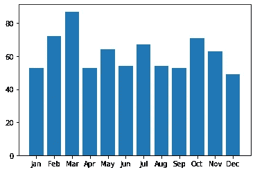

```
df["hit_target"].value_counts()hit = [105, 102, 89, 79, 75, 75, 66, 45, 34, 28, 19, 12, 11]
percent_target = ("93", "99", "97", "92", "96", "95", "98", "91",    "94", "88", "81", "87", "100")plt.bar(percent_target, hit)
plt.show()
```

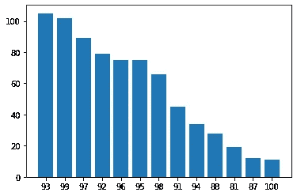

具有较少类别的分类数据的另一个选项是将它们显示在作为缺勤时间的函数的箱线图中:

```
df["disciplinary_failure"].value_counts()
sns.boxplot( x=df["disciplinary_failure"], y=df["absenteeism_time_in_hours"], showfliers = False)
```

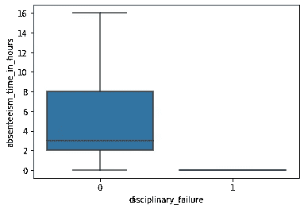

其他分类变量也是如此:

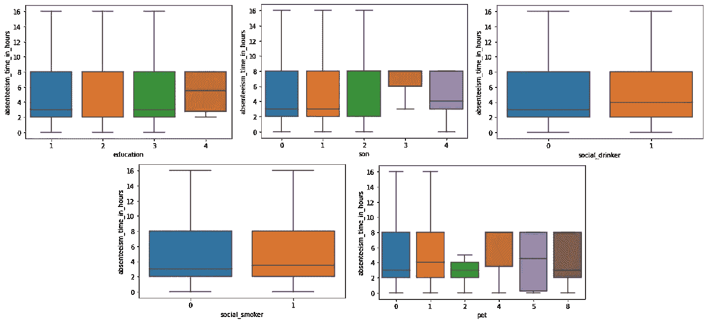

变量之间的相关性可以基于*的专业知识*(鉴于人力资源的话题，这不是我的情况)，或者我们可以走简单的路线，建立一个相关图。首先，我们将删除带有分类变量“缺席月份”和“星期几:

```
df_1 = df.drop("month_of_absence", axis="columns")
df_2 = df_1.drop("day_of_the_week", axis="columns")
```

现在是相关矩阵:

```
corr_matrix=df_2.corr()mask = np.zeros_like(corr_matrix)
mask[np.triu_indices_from(mask)] = Truesns.heatmap(corr_matrix, mask=mask, square=True)
```

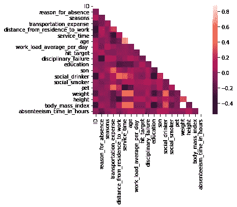

检查我们数据的最后一步是一年中缺勤时间的图表:

```
fig, ax = plt.subplots(figsize=(12, 4))week_demand = df.groupby(["month_of_absence", "day_of_the_week"]).count()["absenteeism_time_in_hours"]week_demand.plot(ax=ax)
_ = ax.set(
          title="Hourly absence during the year",
          xticks=[i * 5 for i in range(12)],
          xticklabels=["jan", "feb", "mar", "apr", "may", "jun", "jul", "aug", "sep", "oct", "nov", "dec"],
          xlabel="Month of Absence",
          ylabel="Hours of Absence",
)
```

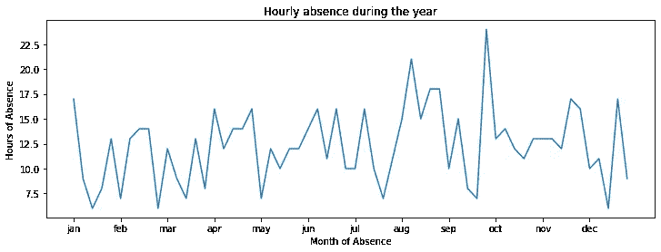

**数据集分割和变量定义**

正如在其他机器学习项目中一样，我们需要将数据分成训练和测试子样本。对于数据集分割，我们将使用 SciKit-Learn 的 **TimeSeriesSplit** 函数，在训练集中随着数量的增加进行 5 次分割。这允许与前一组交叉验证，从而降低偏倚。我们将让函数自动选择每组的大小。

```
ts_cv = TimeSeriesSplit(
         n_splits=5,  #Number of splits used
         gap=0,  #No time needed between sets
         max_train_size=None, #Auto train sample size 
         test_size=None, #Auto test sample size
)
```

为了定义预测(X)和预测(y)变量，我们需要从表中删除“旷工时间小时数”列:

```
y = df["absenteeism_time_in_hours"] / df["absenteeism_time_in_hours"].max()X = df.drop("absenteeism_time_in_hours", axis="columns")
```

并检查我们新的 *y* 变量(我们想要预测的变量)的分布:

```
fig, ax = plt.subplots(figsize=(12, 4))
y.hist(bins=30, ax=ax)_ = ax.set(
    xlabel="Fraction of absenteeism time in hours",
    ylabel="Number of hours",
)
```

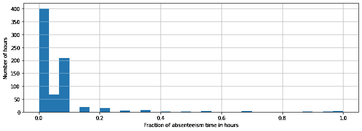

我们可以检查我们的 5 个拆分，看看它们看起来如何:

```
all_splits = list(ts_cv.split(X, y))train_0, test_0 = all_splits[0]
X.iloc[test_0]
X.iloc[train_0][OUT]: 125 rows × 20 columnstrain_1, test_1 = all_splits[1]
X.iloc[test_1]
X.iloc[train_1][OUT]: 248 rows × 20 columnstrain_2, test_2 = all_splits[2]
X.iloc[test_2]
X.iloc[train_2][OUT]: 371 rows × 20 columnstrain_3, test_3 = all_splits[3]
X.iloc[test_3]
X.iloc[train_3][OUT]: 494 rows × 20 columnstrain_4, test_4 = all_splits[4]
X.iloc[test_4]
X.iloc[train_4][OUT]: 617 rows × 20 columns
```

在我们开始第一个模型之前，我们还需要做两件事:对分类变量“缺勤月份”和“星期几”进行编码:

```
categorical_columns = [
    "month_of_absence",
    "day_of_the_week",
]categories = [
    ["jan", "feb", "mar", "apr", "may", "jun", "jul", "aug", "sep", "oct", "nov", "dec"],
    ["Monday", "Tuesday", "Wednesday", "Thursday", "Friday"],
]ordinal_encoder = OrdinalEncoder(categories=categories)
```

并定义一个函数来评估我们的模型:

```
def evaluate(model, X, y, cv):
    cv_results = cross_validate(
        model,
        X,
        y,
        cv=cv,
        scoring=["neg_mean_absolute_error", "neg_root_mean_squared_error"],
    )
    mae = -cv_results["test_neg_mean_absolute_error"]
    rmse = -cv_results["test_neg_root_mean_squared_error"]
    print(
        f"Mean Absolute Error:     {mae.mean():.3f} +/- {mae.std():.3f}\n"
        f"Root Mean Squared Error: {rmse.mean():.3f} +/- {rmse.std():.3f}"
    )
```

准备开始！

**梯度增强**

梯度推进是一种机器学习技术，通常用于克服高维稀疏数据。梯度提升背后的主要思想是对训练数据执行连续的树生长。该过程产生树的集合，集合中的每棵树可以使用梯度增强来构建，并且反过来可以从集合中的前一棵树学习。集合中的下一棵树可以用不同的特征集来创建，并且集合中的每棵树在分类方面都是性能最好的。

梯度增强还可以处理多类分类任务，这就是我们在可行示例中遇到的数值和分类变量的情况。要构建模型，请执行以下操作:

```
gbrt_pipeline = make_pipeline(
    ColumnTransformer(
        transformers=[
            ("categorical", ordinal_encoder, categorical_columns),
        ],
        remainder="passthrough",
    ),
    HistGradientBoostingRegressor(
        categorical_features=range(2),
    ),
)
```

并评估:

```
evaluate(gbrt_pipeline, X, y, cv=ts_cv)
```

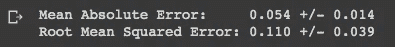

还不错，可以看到我们有 4%到 7%的误差。

**朴素线性回归**

下一个模型是简单线性回归。简单线性回归可用于模拟单个自变量和单个因变量之间的关系。它由著名的公式表示:

> *y = m.x+b*

该模型由一条穿过数据点的直线组成。回归系数表示每个自变量如何影响因变量，因此系数越大表明变量之间的关系越强。简单线性回归是一种常见的技术，可以快速了解如何根据几个独立变量预测响应变量。然而，它不能很好地推广到高维数据，并且经常不能捕捉重要的非线性关系。

当我们处理时间序列时，简单的线性回归是有意义的，因为数据点被假定为独立的观察值。此外，应考虑趋势，换句话说，趋势应包含在模型中。使用 sci kit-学习构建模型:

```
one_hot_encoder = OneHotEncoder(handle_unknown="ignore", sparse=False)
alphas = np.logspace(-6, 6, 25)
naive_linear_pipeline = make_pipeline(
    ColumnTransformer(
        transformers=[
            ("categorical", one_hot_encoder, categorical_columns),
        ],
        remainder=MinMaxScaler(),
    ),
    RidgeCV(alphas=alphas),
)
```

然后我们评估这个模型:

```
evaluate(naive_linear_pipeline, X, y, cv=ts_cv)
```

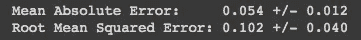

结果与梯度增强非常相似，平均绝对误差在 4.2%和 6.6%之间。

**时间步长分类**

时间步长作为类别用于多元统计学习中的特征选择和后续分类。这种技术适用于包含低维趋势的时间序列，因为关于潜在趋势的信息被编码在系数中，并且系数的大小作为时间距离的函数而增加。

然而，它在具有强非线性趋势的时间序列上表现不佳，因为没有办法将其从趋势中分离出来，因为回归在趋势中被强制为零。这种技术的另一个限制是，它考虑的特征数量取决于用于回归的时间步数。

如果时间序列的持续时间比趋势的持续时间长，这种方法就很有效。在我们的数据集中，我们没有一个明确的趋势，所以这种技术应该会产生相当好的结果。用下面的代码来做:

```
one_hot_linear_pipeline = make_pipeline(
    ColumnTransformer(
        transformers=[
            ("categorical", one_hot_encoder, categorical_columns),
            ("one_hot_time", one_hot_encoder, ["month_of_absence", "day_of_the_week"]),
        ],
        remainder=MinMaxScaler(),
    ),
    RidgeCV(alphas=alphas),
)
```

和评价:

```
evaluate(one_hot_linear_pipeline, X, y, cv=ts_cv)
```

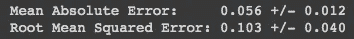

平均绝对误差在 4.4%和 6.8%之间变化。

**三角函数特征**

三角特征是由时域中的一组正弦(sin)和余弦(cos)波形组成的序列。如果我们表示 sin 和 cos 函数，我们将得到以下结果:

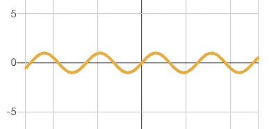

y = sin(x)

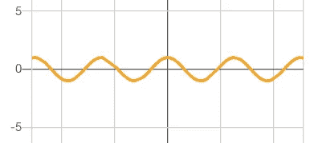

y = cos(x)

如果我们观察一年中(或几个月中)缺席的小时数，我们可以看到 a 线像正弦或余弦函数一样上下波动。所以可以尝试用三角特征建模。我们开始定义 *sin* 和 *cos* 的变压器函数:

```
def sin_transformer(period):
    return FunctionTransformer(lambda x: np.sin(x / period * 2 * np.pi))def cos_transformer(period):
    return FunctionTransformer(lambda x: np.cos(x / period * 2 * np.pi))
```

我们将使用变量“季节”变量来使用三角函数进行转换:

```
seasons_df = pd.DataFrame(
    np.arange(26).reshape(-1, 1),
    columns=["seasons"],
)seasons_df["seasons_sin"] = sin_transformer(4).fit_transform(seasons_df)["seasons"]seasons_df["seasons_cos"] = cos_transformer(4).fit_transform(seasons_df)["seasons"]seasons_df.plot(x="seasons")_ = plt.title("Trigonometric encoding for the 'seasons' feature")
```

注意我们用*sin _ transformer(****4****)*和*cos _ transformer(****4****)*因为我们有四季。

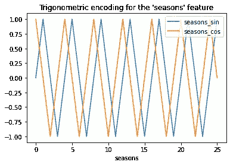

可视化所应用的转换的另一个选项是:

```
fig, ax = plt.subplots(figsize=(7, 5))sp = ax.scatter(hour_df["seasons_sin"], seasons_df["seasons_cos"], c=seasons_df["seasons"])ax.set(
      xlabel="sin(seasons)",
     ylabel="cos(seasons)",
)
_ = fig.colorbar(sp)
```

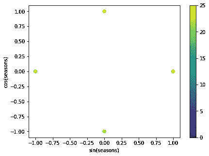

现在我们可以建立模型了:

```
cyclic_cossin_transformer = ColumnTransformer(
    transformers=[
        ("categorical", one_hot_encoder, categorical_columns),
        ("seasons_sin", sin_transformer(4), ["seasons"]),
        ("seasons_cos", cos_transformer(4), ["seasons"]),
    ],
    remainder=MinMaxScaler(),
)cyclic_cossin_linear_pipeline = make_pipeline(
    cyclic_cossin_transformer,
    RidgeCV(alphas=alphas),
)
```

并评估:

```
evaluate(cyclic_cossin_linear_pipeline, X, y, cv=ts_cv)
```

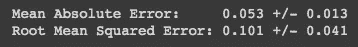

该模型与之前的模型表现相似，平均误差在 4%到 6.6%之间。

**周期性花键特征**

样条函数是通过连接多项式函数构建的。几个多项式函数连接在一起的点叫做纽结。使用样条函数而不是简单的多项式函数允许我们保持多项式的低阶。当我们有一个非常动态的数据集用于建模时，使用这些类型的函数，我们使用一个结来建模一个区域，当数据在方向上有重大变化时，函数将假设下一个结。

我们将从定义样条函数开始:

```
def periodic_spline_transformer(period, n_splines=None, degree=3):
    if n_splines is None:
        n_splines = period
    n_knots = n_splines + 1  
    return SplineTransformer(
        degree=degree,
        n_knots=n_knots,
        knots=np.linspace(0, period, n_knots).reshape(n_knots, 1),
        extrapolation="periodic",
        include_bias=True,
    )
```

同样，我们将使用“季节”变量:

```
seasons_df = pd.DataFrame(
    np.linspace(0, 26, 1000).reshape(-1, 1),
    columns=["seasons"],
)splines = periodic_spline_transformer(4, n_splines=4).fit_transform(seasons_df)splines_df = pd.DataFrame(
    splines,
    columns=[f"spline_{i}" for i in range(splines.shape[1])],
)pd.concat([seasons_df, splines_df], axis="columns").plot(x="seasons", cmap=plt.cm.tab20b)_ = plt.title("Periodic spline-based encoding for the 'seasons' feature")
```

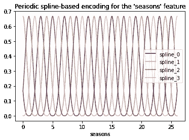

最后建立模型:

```
cyclic_spline_transformer = ColumnTransformer(
    transformers=[
        ("categorical", one_hot_encoder, categorical_columns),
        ("cyclic_seasons", periodic_spline_transformer(4, n_splines=4), ["seasons"]),
    ],
    remainder=MinMaxScaler(),
)cyclic_spline_linear_pipeline = make_pipeline(
    cyclic_spline_transformer,
    RidgeCV(alphas=alphas),
)
```

并评估模型:

```
evaluate(cyclic_spline_linear_pipeline, X, y, cv=ts_cv)
```

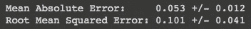

同样，我们的平均误差是 0.052 +/- 0.012。

**定性分析特征对线性模型预测的影响**

现在我们已经建立了五个模型，是时候分析它们了。我们将测试我们创建的所有 5 个分割，并获得一个直观检查的图表。

```
#Create teh predicted values:
naive_linear_pipeline.fit(X.iloc[train_0], y.iloc[train_0])
naive_linear_predictions = naive_linear_pipeline.predict(X.iloc[test_0])one_hot_linear_pipeline.fit(X.iloc[train_0], y.iloc[train_0])
one_hot_linear_predictions = one_hot_linear_pipeline.predict(X.iloc[test_0])cyclic_cossin_linear_pipeline.fit(X.iloc[train_0], y.iloc[train_0])
cyclic_cossin_linear_predictions = cyclic_cossin_linear_pipeline.predict(X.iloc[test_0])cyclic_spline_linear_pipeline.fit(X.iloc[train_0], y.iloc[train_0])
cyclic_spline_linear_predictions = cyclic_spline_linear_pipeline.predict(X.iloc[test_0])#Change "_0" with"_1", "_2", "_3" and "_4" for remaining splits#Build the graph:last_days = slice(-100, None)
fig, ax = plt.subplots(figsize=(12, 4))
fig.suptitle("Predictions by linear models")
ax.plot(
    y.iloc[test_0].values[last_days], #Change "_0" with 1,2,3 and 4
    "x-",
    alpha=0.2,
    label="Actual absenteeism in hours ",
    color="black",
)
ax.plot(
    naive_linear_predictions[last_days], 
    "x-", 
    label="Ordinal time features"
)
ax.plot(
    cyclic_cossin_linear_predictions[last_days],
    "x-",
    label="Trigonometric time features",
)
ax.plot(
    cyclic_spline_linear_predictions[last_days],
    "x-",
    label="Spline-based time features",
)
ax.plot(
    one_hot_linear_predictions[last_days],
    "x-",
    label="One-hot time features",
)
_ = ax.legend()
```

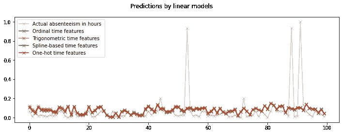

拆分 0

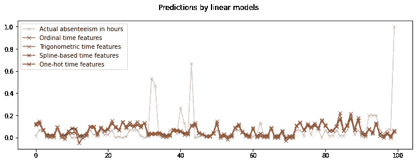

拆分 1

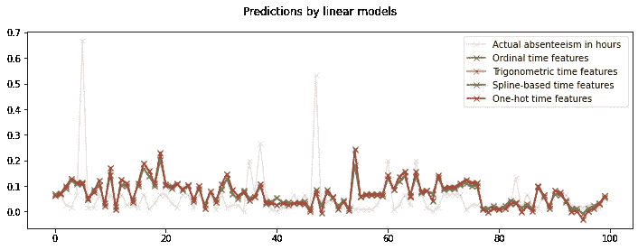

拆分 2

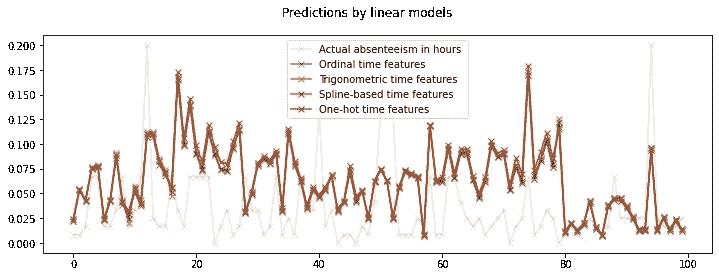

分割 3

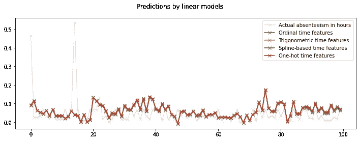

拆分 4

要获得每个模型中使用的特征数量:

```
naive_linear_pipeline[:-1].transform(X).shape
[OUT] (740, 35)one_hot_linear_pipeline[:-1].transform(X).shape
[OUT] (740, 52)cyclic_cossin_linear_pipeline[:-1].transform(X).shape
[OUT] (740, 36)cyclic_spline_linear_pipeline[:-1].transform(X).shape
[OUT] (740, 38)
```

我们也可以用预测值和真实值之间的散点图来评估我们的模型。但是，这可能不是我们数据的最佳选择:

```
fig, axes = plt.subplots(ncols=3, figsize=(12, 4), sharey=True)
fig.suptitle("Non-linear regression models")
predictions = [
    cyclic_cossin_linear_predictions,
    cyclic_spline_linear_predictions,
    one_hot_linear_predictions,
]
labels = [
    "cyclic_cossin_linear_predictions",
    "Splines + polynomial kernel",
    "Gradient Boosted Trees",
]
for ax, pred, label in zip(axes, predictions, labels):
    ax.scatter(y.iloc[test_0].values, pred, alpha=0.3, label=label)
    ax.plot([0, 0.125], [0, 0.125], "--", label="Perfect model")
    ax.set(
           xlim=(0, 0.125),
           ylim=(0, 0.125),
           xlabel="True absenteeism",
           ylabel="Predicted absenteeism",
    )
    ax.legend()#Change "test_0" with _1, _2, _3 or _4 to obtain graphical visualisations for the other splits.
```

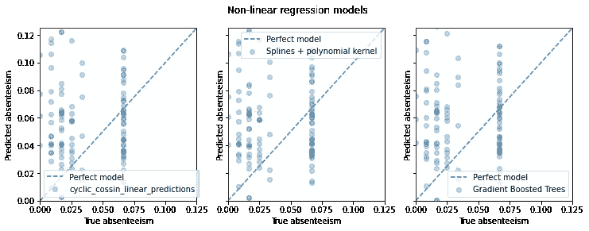

拆分 0

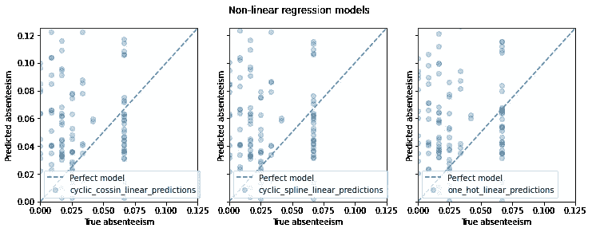

拆分 1

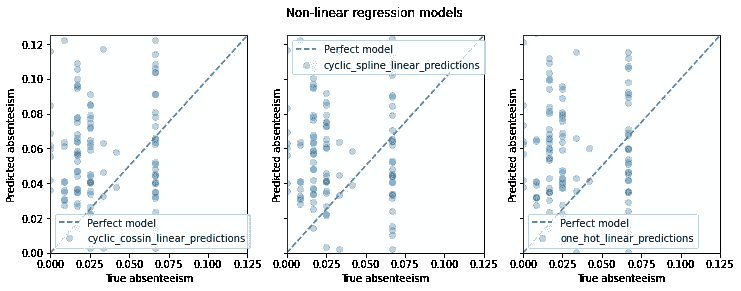

拆分 2

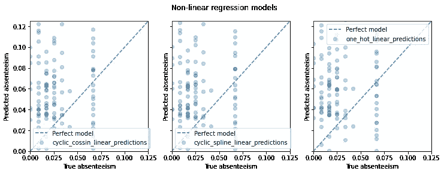

分割 3

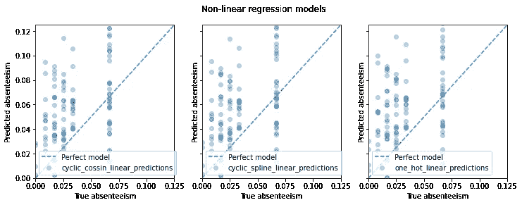

拆分 4

**用样条和多项式特征模拟成对交互**

我知道这是一项长期的工作，但是，如果我们对获得的结果不满意，我们可以尝试改进它的交互模型。在这个例子中，我将尝试季节和学科失败之间的相互作用，但是您可以尝试与您的数据进行多种相互作用，并检查哪个表现更好。

```
#Creating the interaction:seasons_month_interaction = make_pipeline(
    ColumnTransformer(
      [
          ("cyclic_seasons", periodic_spline_transformer(4, n_splines=4), ["seasons"]),
          ("disciplinary_failure", FunctionTransformer(), ["disciplinary_failure"]),
      ]
    ),
    PolynomialFeatures(degree=2, interaction_only=False, include_bias=False),
)
```

建立这个模型:

```
cyclic_spline_interactions_pipeline = make_pipeline(
    FeatureUnion(
       [
          ("marginal", cyclic_spline_transformer),
          ("interactions", seasons_month_interaction),
       ]
    ),
    RidgeCV(alphas=alphas),
)
```

并评估模型:

```
evaluate(cyclic_spline_interactions_pipeline, X, y, cv=ts_cv)
```

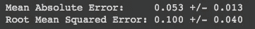

正如我们所看到的，在这种情况下，该模型并不比以前的模型更好。

**用内核模拟非线性特征交互**

另一种选择是使用内核。核是一种将非线性函数转换成线性形式的方法，这样就可以在不丢失数据的情况下进行计算。核可以以两种不同的方式使用:一种是寻找数据的对齐方式，使序列之间的比较成为可能；另一种是通过构建数据的更高级表示来改变数据的结构，并使用这种新的表示来执行比较。

第一个选项:

```
cyclic_spline_poly_pipeline = make_pipeline(
    cyclic_spline_transformer,
    Nystroem(kernel="poly", degree=2, n_components=300, random_state=0),
    RidgeCV(alphas=alphas),
)evaluate(cyclic_spline_poly_pipeline, X, y, cv=ts_cv)
```

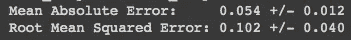

第二个选择是:

```
one_hot_poly_pipeline = make_pipeline(
    ColumnTransformer(
        transformers=[
            ("categorical", one_hot_encoder, categorical_columns),         
            ("one_hot_time", one_hot_encoder, ["month_of_absence", "day_of_the_week"]),
        ],
        remainder="passthrough",
    ),
    Nystroem(kernel="poly", degree=2, n_components=300, random_state=0),
    RidgeCV(alphas=alphas),
)evaluate(one_hot_poly_pipeline, X, y, cv=ts_cv)
```

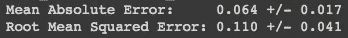

正如我们所看到的，这些模型似乎都没有比前一个模型表现得更好。我们仍然可以想象它们:

```
#This code is for split_0, use the same code for other splits:
#Obtaining the predicted values:gbrt_pipeline.fit(X.iloc[train_0], y.iloc[train_0])
gbrt_predictions = gbrt_pipeline.predict(X.iloc[test_0])one_hot_poly_pipeline.fit(X.iloc[train_0], y.iloc[train_0])
one_hot_poly_predictions = one_hot_poly_pipeline.predict(X.iloc[test_0])cyclic_spline_poly_pipeline.fit(X.iloc[train_0], y.iloc[train_0])
cyclic_spline_poly_predictions = cyclic_spline_poly_pipeline.predict(X.iloc[test_0])#Building the graphical visualisation:last_hours = slice(-100, None)
fig, ax = plt.subplots(figsize=(12, 4))
fig.suptitle("Predictions by non-linear regression models")
ax.plot(
    y.iloc[test_0].values[last_hours],
    "x-",
    alpha=0.2,
    label="Actual absenteeism in hours",
    color="black",
)
ax.plot(
    gbrt_predictions[last_hours],
    "x-",
    label="Gradient Boosted Trees",
)
ax.plot(
    one_hot_poly_predictions[last_hours],
    "x-",
    label="One-hot + polynomial kernel",
)
ax.plot(
    cyclic_spline_poly_predictions[last_hours],
    "x-",
    label="Splines + polynomial kernel",
)
_ = ax.legend()
```


拆分 0

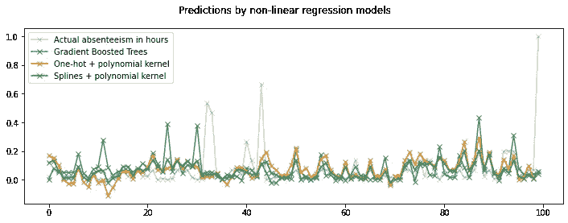

拆分 1

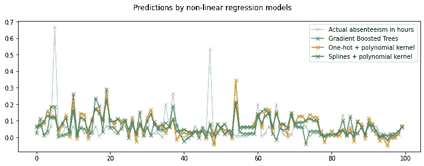

拆分 2

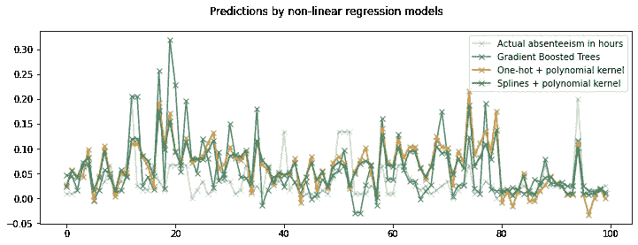

分割 3

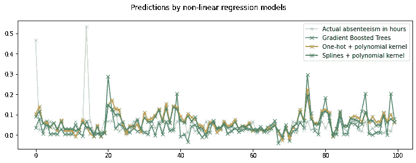

拆分 4

**结论**

如果你还在读到这一点，恭喜你！这是一个漫长的旅程，但我相信现在您已经准备好将这些技术应用到您自己的数据中，构建您的模型并做出您的预测，这肯定会对您的业务有所帮助。

如有反馈、修正或改进建议，请联系我或留下评论。谢谢你。

**如果:**你喜欢这篇文章，别忘了关注我，这样你就能收到关于新出版物的所有更新。

**否则如果:**你想了解更多，你可以通过[我的推荐链接](https://cdanielaam.medium.com/membership)订阅媒体会员。它不会花你更多的钱，但会给我一杯咖啡。

**别的:**坦克你！