# SAS 中的时间序列分析

> 原文：<https://pub.towardsai.net/time-series-analysis-in-sas-8b6c03b39fd4?source=collection_archive---------1----------------------->

## [预测分析](https://towardsai.net/p/category/predictive-analytics)

## 分析荷兰死亡率数据

预测——或预测——有一种天然的吸引力，因为它让我们相信，我们可以通过知道将会发生什么来控制未来。

幸运的是，我们大多数人都知道我们实际上无法控制将要发生的事情，但也许我们可以对可能发生的事情采取行动。我们还可以进一步解释为什么对可能发生的事情采取行动甚至会影响可能发生的事情，但这不是这篇文章的目的。

不，今天，我只是想用一些很好的旧的****时间序列分析**——使用 **SAS** 和**计量经济学和时间序列分析** ( [ETS](https://www.sas.com/en_us/software/ets.html) )软件包——来预测荷兰的死亡人数。**

**自新冠肺炎以来，超额死亡的衡量标准被重新启用。并不是说它已经消失了，而是变得比以往任何时候都重要。对大多数国家而言，超额死亡是通过将当前死亡人数与 2015-2019 年间的 5 年平均值进行比较而确定的。**

**用时间序列或计量经济学术语来说，这叫做**。****

****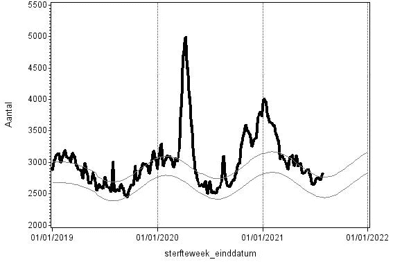****

****移动平均数和实际死亡总数。图片来自 CBS。****

****我想采取不同的方法，使用来自荷兰统计局的公开数据。****

****数据本身不能直接用于分析，因此需要扩充。这是因为时间序列数据的分析遵循关于数据结构的严格规则。*你不仅需要一个日期或日期时间变量，而且数据还需要等间距*。几天，几个月，几周，几年。幸运的是，ETS 包有一些非常简单的工具可以做到这一点，比如 **PROC EXPAND** 。下面，您可以看到代码片段来导入、争论和整理数据，使其为可视化和时序分析做好准备。****

****接下来是可视化数据的代码。虽然我们可以检查表格和进行数值分析，但更直接的方法是绘制数据，看看它是否有意义。数据争论过程中的任何错误都会立即显现出来。****

****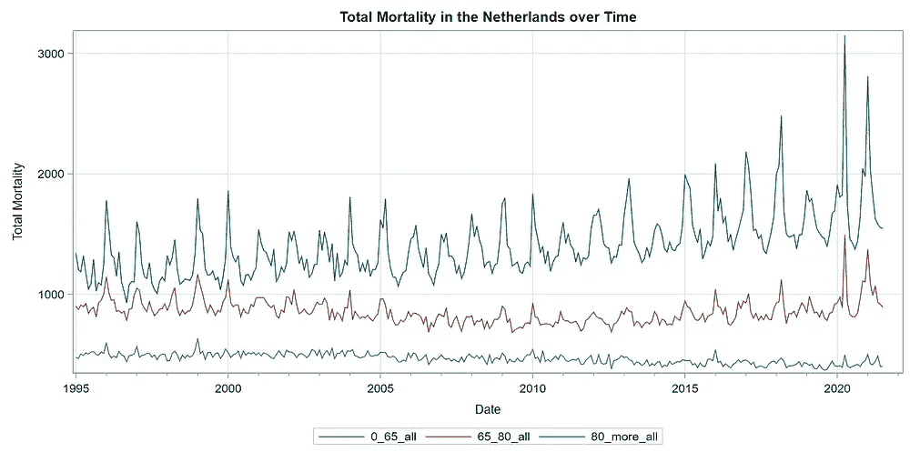********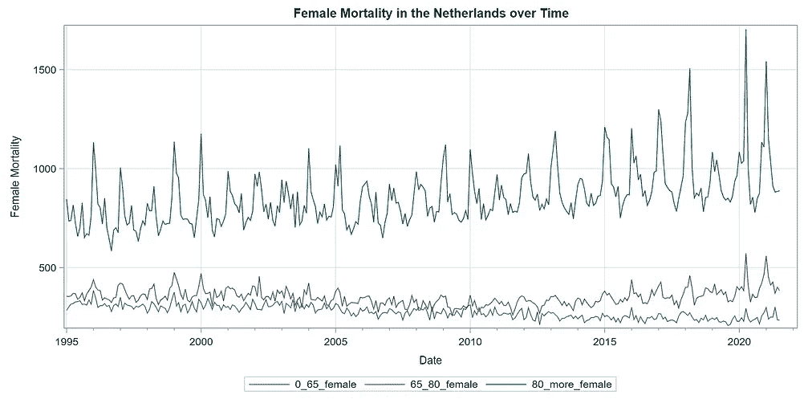********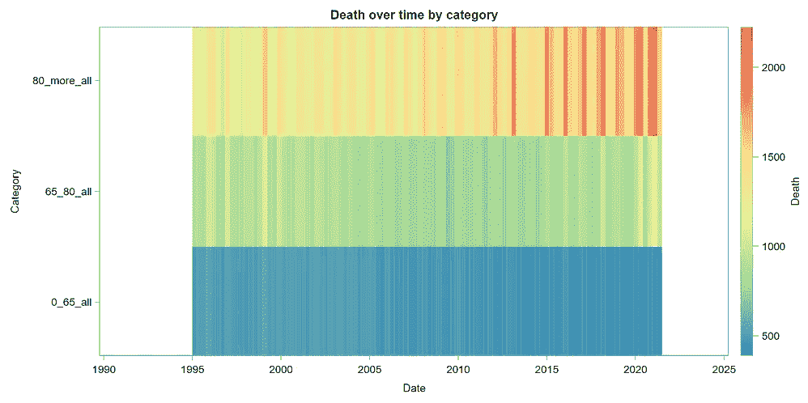********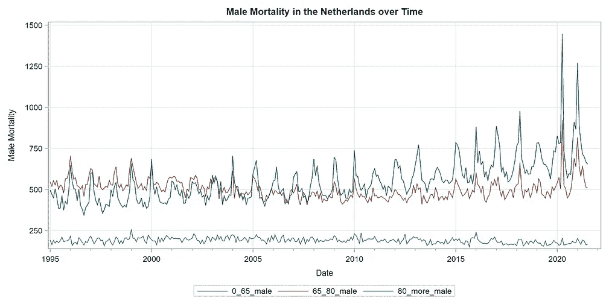****

****下一个最好的步骤是使用分解分析( **PROC TIMESERIES** )来仔细查看数据。大多数软件包，像 **R** 和 **Python** ，都有时序库，也提供分解分析，因为这是一个标准化的过程。通过要求 SAS 进行分解，数据被分割成趋势、周期、季节或不规则性。在这里，我选择不做其他时间序列模型所需的任何数据准备，如 **PROC ARIMA** ，因为我想看看原始数据。****

****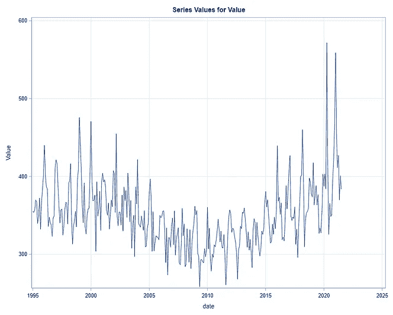********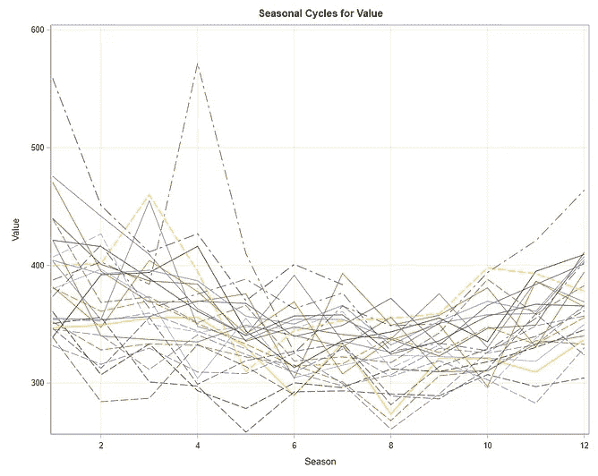********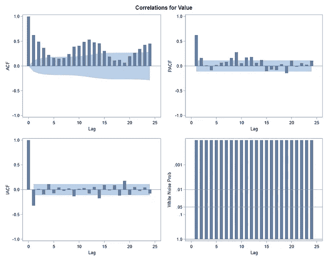********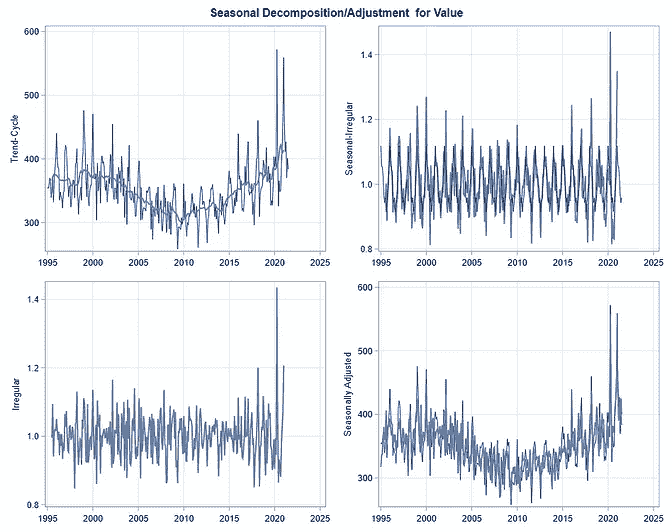********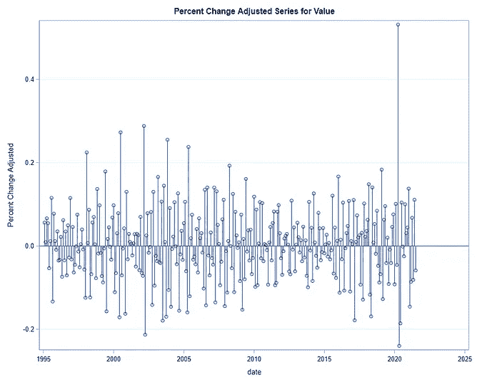********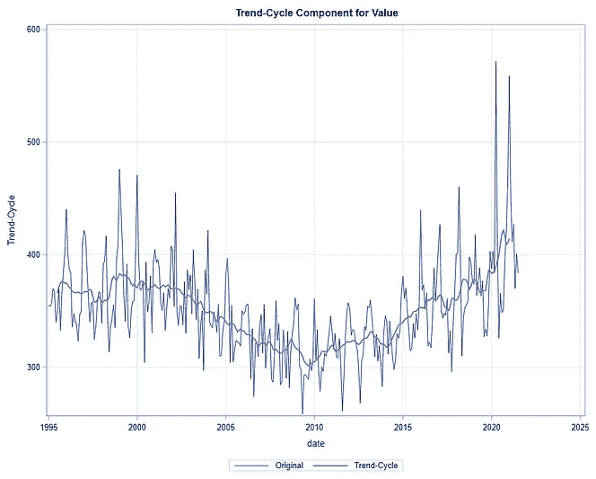****

****来自分解分析的结果可能是压倒性的，但是它有直观的吸引力。它将绘制所需的时间序列，为您提供季节分析(由一年中的 12 个月定义)，计算自相关和部分自相关。时间序列中的趋势、周期、季节性和不规则性被标绘，随时间变化的百分比也被标绘。趋势周期可能模仿荷兰统计局使用的移动平均数。****

****接下来就是我们分析数据、创建模型的时候了。我对荷兰统计局使用的模型印象不深，但这并不意味着他们的模型没有价值。这只意味着我想创建一个不同的模型，它可能会识别并包含更多对预测有用的时间序列部分。****

****我选择使用 [**PROC UCM**](https://www.lexjansen.com/nesug/nesug04/an/an03.pdf) ，它代表**未观察组件模型**。Python 和 [R](https://cran.r-project.org/web/packages/rucm/vignettes/rucm_vignettes.html) 都有可用的库。这个模型实际上是我最喜欢的模型之一，因为就像分解分析一样，它通过使用未观察到的成分(水平、斜率、周期、季节、不规则性、滞后等)来建立模型。这是一个繁重的统计模型，考虑到其底层的统计理论，SAS、Python 和 R 使得创建这样一个模型似乎太容易了。****

****下面你看到的是最终型号的代码，而不是断断续续的选型号过程。为了创建所选的模型，您将获得大量的输出，揭示每个所选组件对模型的额外影响。当然，您可以使用过多的指标来比较模型，但我认为最好的方法是深入研究提供给您的许多图表。****

****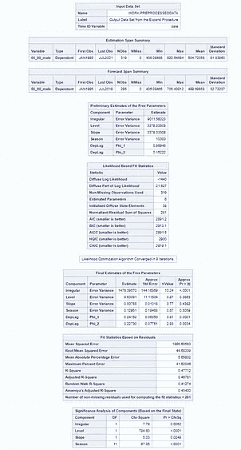********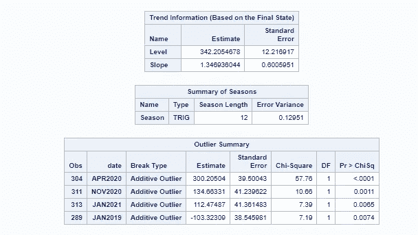********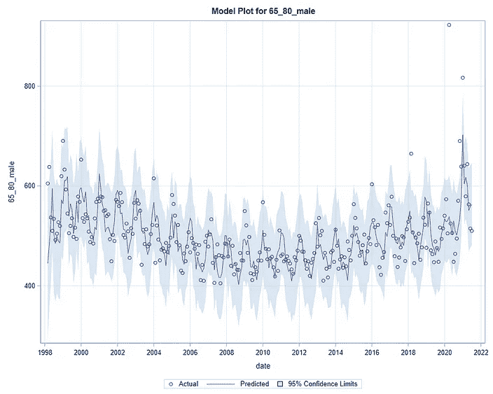********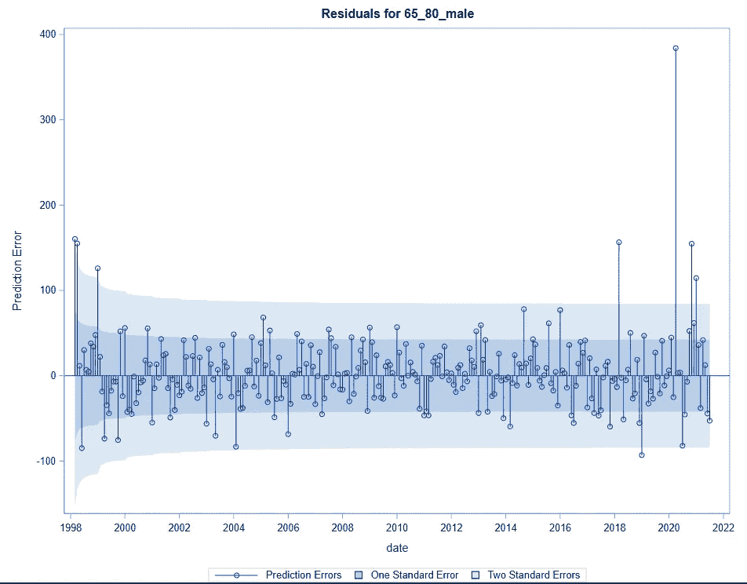********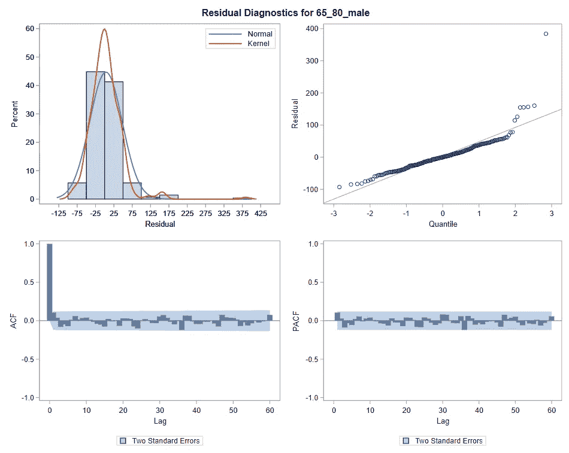****

****这些是您收到的起始表和图。它们显示模型、模型所基于的数据以及每个组件的重要性。诀窍是不要从一个组件的任何统计显著性中获得太多的指导，而是查看估计值和标准误差。 **PROC UCM** 非常灵活，您仍然可以包含一个组件，但可以将其均值和方差设置为任意值，或者指示算法应该从哪里开始搜索。对我来说，模型的残差图是最重要的。如果它没有表现出极端，我就满足了。特别是，当 ACF 和 PACF 在它们的边界内时，没有显示自相关。****

****接下来是显示模型的不同组件以及它们如何作用于模型本身的图。和往常一样，置信区间比实际值更有趣。****

****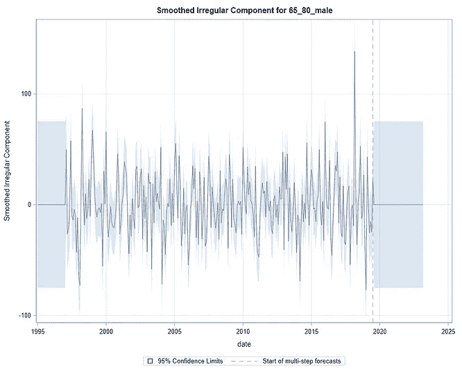********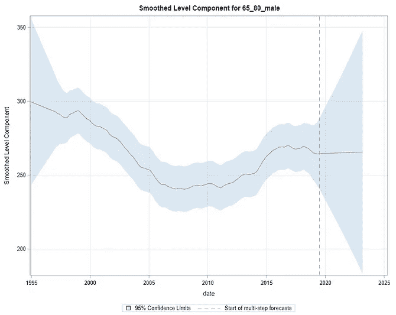********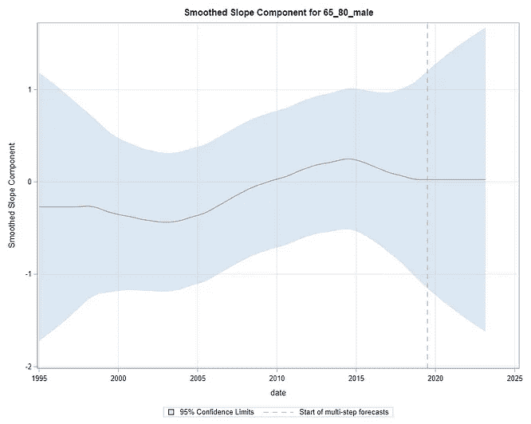****

****显示模型的不规则、水平和坡度组件的地块。****

****然后， **PROC UCM** 为我们提供了丰富的——或者说铺天盖地的——一系列图片，展示了最终的 **UCM 模型**是如何预测出来的。将组件加在一起肯定会改变您想要看到的预测。同样在这里，看看预测的置信区间。它们可以揭示很多东西，特别是在多步设置中，以前的预测也会影响未来的预测。如果预测很快变得难以接受，你最好不要把目光放得太远，至少要承认，在缺乏更有用的预测因素的情况下，潜在的过程是不稳定的。****

****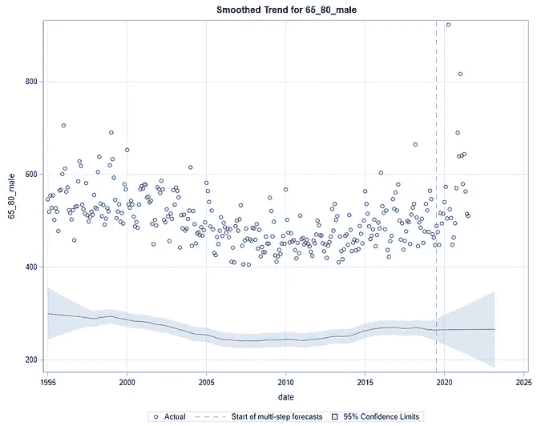********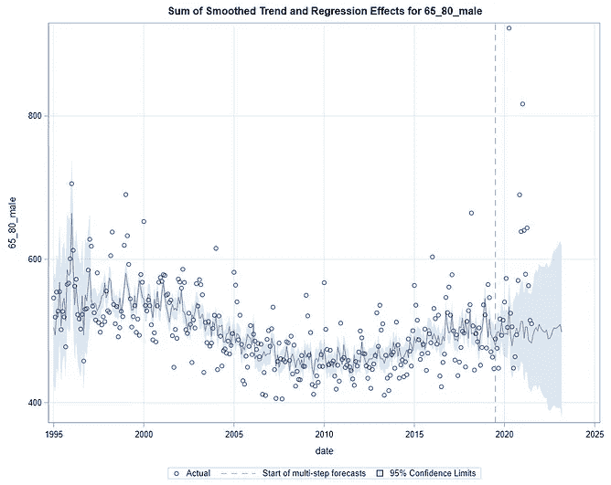********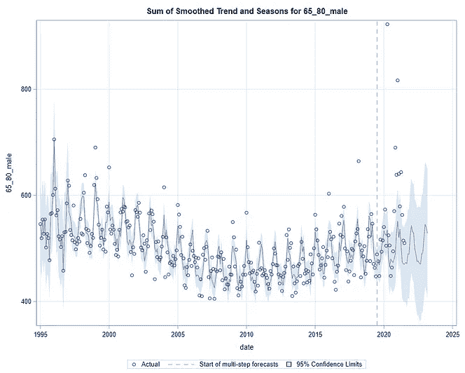********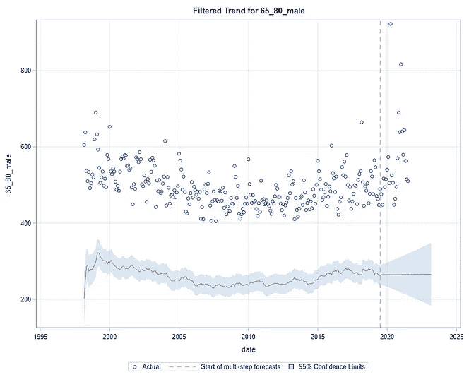****************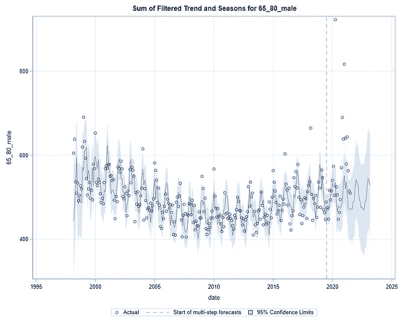****

****显示添加组件如何改变预测的图表。在这里，可以很清楚地看到季节性因素的力量，这一点没有包括在荷兰统计局的分析中。****

****最后，但并非最不重要的，这是好的，包括最终的情节和预测。这些预测并非突如其来。数据集的时间周期大约为 20 年。因为我想看看这个模型是否能‘预测’新冠肺炎时代的死亡，所以我让这个模型从 2019 年 9 月起开始产生预测。这意味着除了检查预测误差之外，该模型不使用该时间点之后的任何数据。因此，它可以用来评估模型预测新冠肺炎时代死亡的能力。****

****我将绩效评估留给读者。****

****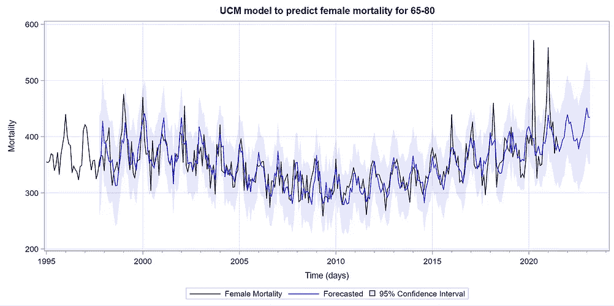********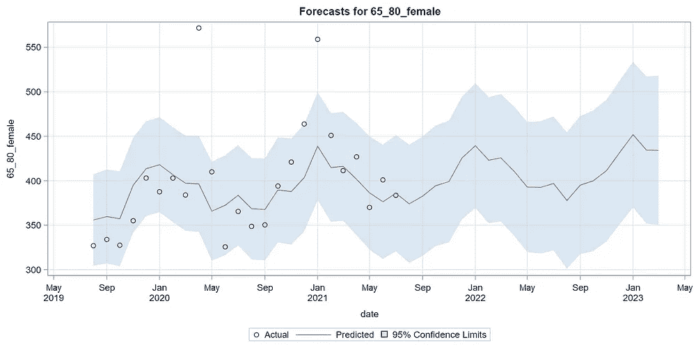********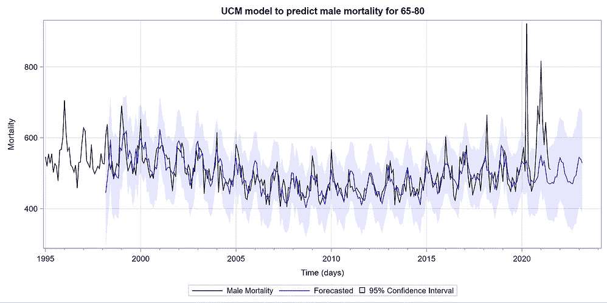********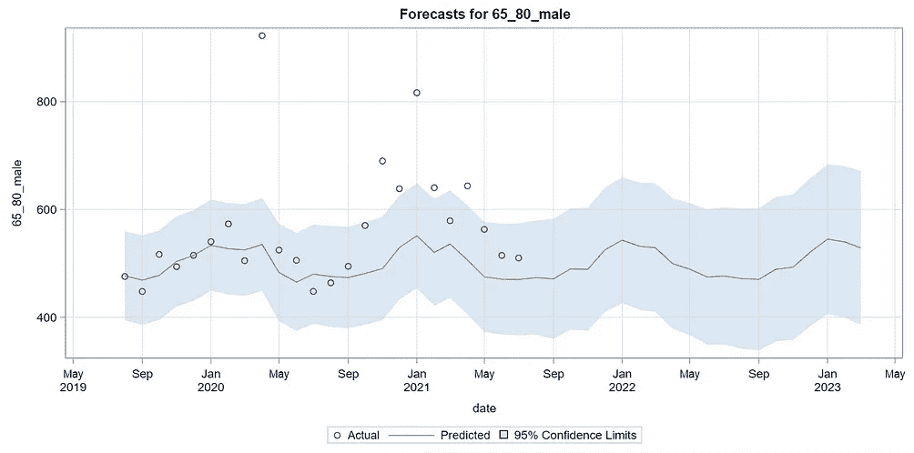****

****一如既往，这些帖子只是一个例子，并不是对 PROC UCM 或 SAS ETS 所能做的完整评估。****

****玩得开心！****