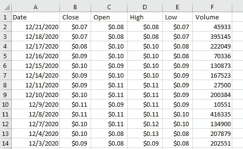
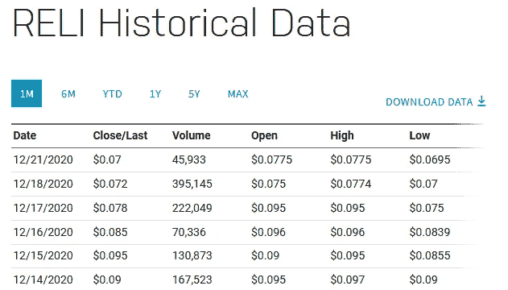
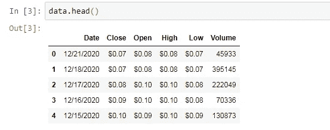
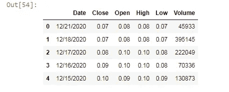
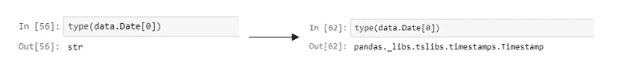
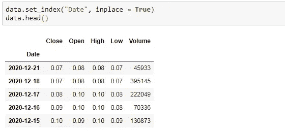
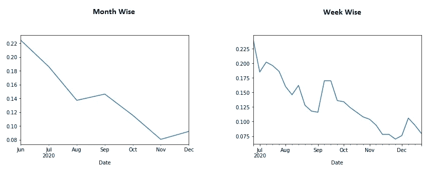

# 用 Python 进行时间序列分析

> 原文：<https://pub.towardsai.net/time-series-analysis-with-python-6002ec6d5aa4?source=collection_archive---------0----------------------->

## [数据可视化](https://towardsai.net/p/category/data-visualization)

## 熊猫数据框的日期和时间分析


由[克里斯·利维拉尼](https://unsplash.com/@chrisliverani?utm_source=medium&utm_medium=referral)在 [Unsplash](https://unsplash.com?utm_source=medium&utm_medium=referral) 上拍摄

时间序列分析处理数据框中的日期和时间索引点。金融领域中最常用的时间序列。这篇文章将帮助那些总是根据日期和时间分析数据的人。对于时间序列分析，我们需要一个熟练的分析师，他知道预测评估。金融分析师现在非常擅长编程，也相当于用经典的方式进行分析。统计和机器学习如何帮助金融部门随着我们周围的先进技术而增长。

本文只讨论关于日期和时间的基本分析。大分析首先需要基础技能。希望你会对这篇文章感兴趣。

从[这里](https://www.nasdaq.com/market-activity/stocks/reli/historical)下载信实全球集团(RELI)的历史数据。通过这个链接，你可以下载所有其他的历史数据。我下载了六个月的 RELI CSV 数据表，用于教育分析。在本文中，我们将使用 python 学习时间序列的一些基本概念。

为了进行分析，我们将使用 anaconda 发行版的 jupyter 笔记本。我们将工作表的名称更改为 reli_data。

[](https://medium.com/towards-artificial-intelligence/z-statistics-t-statistics-p-statistics-are-still-confusing-you-87557047e20a) [## Z-统计量，T-统计量，P-统计量还在迷惑你？

### 机器学习统计学中的定义和概念

medium.com](https://medium.com/towards-artificial-intelligence/z-statistics-t-statistics-p-statistics-are-still-confusing-you-87557047e20a) 

数据看起来像这样



纳斯达克的 CSV 数据和历史数据

这些列的名称是日期、收盘、开盘、盘高、盘低和成交量。

打开 jupyter 笔记本，需要导入库才能读取 CSV 文件。当读取 CSV 文件时，有时分隔符后有空格，为了消除它们，我们在读取 CSV 文件时使用“skipinitialspace=True”。

```
#importing the library
import pandas as pd#reading the csv file and save it to data variable
data = pd.read_csv('reli_data.csv', skipinitialspace=True)#view the data up to 5 rows
data.head()
```



RELI 的数据集视图。作者的照片

如果我们注意到数据中有一个美元符号，我们必须将其移除，以便只对整数进行分析。我们有四个带美元符号的列。

```
#removing dollar sign 
data['Close'] = data['Close'].str.replace('$', '')
data['Open'] = data['Open'].str.replace('$', '')
data['High'] = data['High'].str.replace('$', '')
data['Low'] = data['Low'].str.replace('$', '')#view updated dataframe
data.head()
```



美元符号在列的值中被删除。作者的照片

现在检查日期列的类型，它是一个字符串，new 希望它是一个日期列，因此为此，我们需要在读取 CSV 文件时将日期列解析为“日期”。



日期列的类型已更改。作者的照片

有时当我们处理时间序列时，我们需要日期作为索引。要将默认索引改为 Date 作为索引，我们使用 set_index 函数。

```
data.set_index("Date", inplace = True)
data.head()
```



日期被设置为索引值

另一件事是在访问有美元符号的列时遇到的。删除美元符号后，仍然有 str 值。因此，我们还需要将这些列更改为浮点值，因为它们包含小数点。

```
#value before converting
type(data.Low[0])#output: str#converting str values of column to float values
data["Close"] = pd.to_numeric(data["Close"], downcast="float")
data["Open"] = pd.to_numeric(data["Open"], downcast="float")
data["High"] = pd.to_numeric(data["High"], downcast="float")
data["Low"] = pd.to_numeric(data["Low"], downcast="float")#to check after converting
type(data.Low[0])#output: numpy.float32
```

有时我们会看到图表随着日期的变化而变化，比如日、周、月甚至年。为了得到这样的图表，我们把柱的平均值作为月平均值，让我们来看看。我们使用 matlotlip 进行可视化。

```
#Month wise
%matplotlib inline
data.Open.resample('M').mean().plot()#Week wise - just to change it to W(Week)data.Open.resample('W').mean().plot()
```



每月和每周 RELI 数据记录的开放值图。作者的照片

## 结论:

本文只是对时间序列分析的一个基本认识。本文的优点是我们下载了原始数据和 did 数据清理部分，我们正面临 60–70%的 ETL 过程。

我希望你喜欢这篇文章。通过我的 [LinkedIn](https://www.linkedin.com/in/data-scientist-95040a1ab/) 和 [twitter](https://twitter.com/amitprius) 联系我。

# 推荐文章

1.  [NLP——用 Python 零到英雄](https://medium.com/towards-artificial-intelligence/nlp-zero-to-hero-with-python-2df6fcebff6e?sk=2231d868766e96b13d1e9d7db6064df1)

2. [Python 数据结构数据类型和对象](https://medium.com/towards-artificial-intelligence/python-data-structures-data-types-and-objects-244d0a86c3cf?sk=42f4b462499f3fc3a160b21e2c94dba6)

3. [MySQL:零到英雄](https://medium.com/towards-artificial-intelligence/mysql-zero-to-hero-with-syntax-of-all-topics-92e700762c7b?source=friends_link&sk=35a3f8dc1cf1ebd1c4d5008a5d12d6a3)