# Python 中用于股市预测的时间序列聚类-第 1 部分

> 原文：<https://pub.towardsai.net/time-series-clustering-for-stock-market-prediction-in-python-part-1-738ab6462f0e?source=collection_archive---------0----------------------->

## 尝试识别股票模式以进行聚类和预测。N 的第 1 部分

[韦德拉纳·菲利波维奇](https://unsplash.com/@vedranafilipovic?utm_source=unsplash&utm_medium=referral&utm_content=creditCopyText)在 [Unsplash](https://unsplash.com/s/photos/sequence?utm_source=unsplash&utm_medium=referral&utm_content=creditCopyText) 上的照片

如果你是一名分析师，不管你的工作部门，你肯定知道有许多不同的方法来预测股市。目前最相关的方法大多使用应用于序列数据的神经网络，如 LSTMs，或者涉及情感分析和信号检测。

这些方法肯定很有趣，而且有一个很好的理由——互联网上有大量的资源处理提到的主题。这不是一件坏事，因为分析师可以遵循一个共享的基线来启动他们的项目，然后用他们自己的方法来扩展。

今天，我想提出一个不同的方法，一个我几周前梦寐以求的方法，它让我一直在思考，因为有意想不到的机会。我说的是应用于股票市场的**时间序列聚类。**

我的主要想法是

> 如果我可以识别数据中的模式，找到相似的模式，将它们组合在一起，并为每个模式分配投资机会，会怎么样？

这将允许我以概率的方式找出可以预测特定趋势的相关序列。

我已经花了几个小时在这个项目上，我想和你分享这个系列的第一部分。随着我继续从事这个项目，我将在另一篇文章中分享我的发现。

请记住，这是我的方法——如果你喜欢整体推理，但你会做一些不同的事情，请告诉我👌

我希望你和我一样对这个项目感到兴奋。我们开始吧！

# 潜在的直觉

这个想法是，如果我们选取一个时间序列，不管它的性质和背景(不管是股票还是其他什么)，我们可以把它分成块，并孤立地研究每个块。

这让我们可以对这些词块做出假设，并相互检验。

说到这里——这是这个问题的假设

> 如果我把一个时间序列分成特定长度的块，我就可以把这些块分成两部分，我称之为 A 和 B。
> 
> 通过研究 A，我能够找到以相似方式运行的模式和分组元素。这让我可以计算 B 跟随某个 A 有相似趋势的概率。

在我看来，概率方法是最合适的方法。一会儿你就会明白为什么了。

总而言之，**我想找到在整个时间序列中具有一定相似度的趋势部分。我想对这些相似的部分进行分组，并查看之后的*部分在趋势方面的表现，趋势是使用斜率计算的。***

这是我如何想象解决这个问题的图表

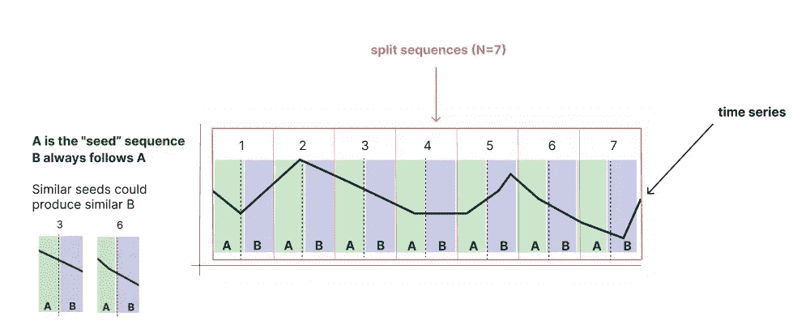

聚类算法的工作原理。图片由作者提供。

如果我们发现一些 a 具有高度的相似性，那么我们可以将它们分组在一起，并通过计算多少个 B 具有正斜率或负斜率来找到 B 上升或下降的概率。

# 该算法

根据上面的解释，我是这样设计算法的

1.  将时间序列分割成长度为`N`的序列
2.  根据大小`K`将每个序列分成两部分，以创建`A`和`B`序列。
3.  计算`A`的所有序列之间的相似度`S`
4.  基于阈值对所有相似的`A`序列进行分组
5.  对于每组`G`,计算序列`B`中正、负或稳定趋势的概率`P`
6.  在一个新的、看不见的时间序列中，识别分组序列`A`以获得后续部分`B`的概率

如果这些步骤现在对你来说还不是非常清楚，不要担心。我将用详细的论证和代码来解释每一步。

让我们马上开始编码。

# 要求

我们将从头开始编写逻辑代码，所以我们将只依赖少量的 Python 库。

这里唯一值得一提的是，我们将使用 *pandas_datareader* 作为股票市场数据的提供者。我们将在几个 tickers 上测试这个算法的部分。

# 时间序列

我们将使用 pandas_datareader 获取 1000 天前的苹果股票数据。这将包括 689 个数据点。这是因为排除了周末和其他节假日。

我选择这个数字并没有什么特别的原因，它看起来就像足够的数据。让我们定义一个助手函数来完成这个任务。

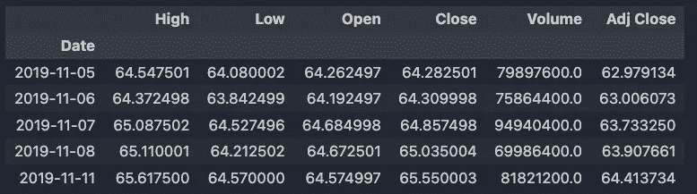

我们时间序列的第一行。图片作者。

我们将使用*收盘*列作为我们的时间序列。

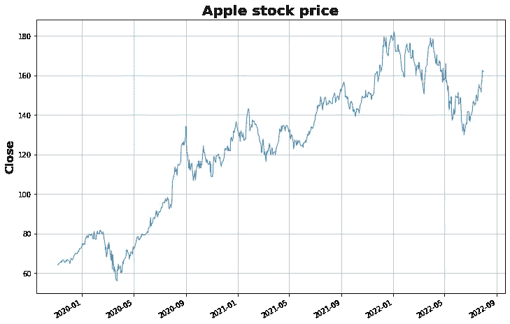

本文中使用的时间序列。图片由作者提供。

现在让我们根据上面提到的逻辑继续拆分时间序列。

# 拆分时间序列

我们将定义两个函数，首先将时间序列分割成序列，然后分割成*分割序列。让我给你看一个例子:*

假设我们有一个 20 个数字的 Numpy 数组

`s = np.array([i for i in range(30)])`

我们想把这个系列分成大小相等的 N 个片段。我们可以这样实现它

如果我们用`n = 6`将这个函数应用于`s`，我们将获得一个没有丢弃元素的完整的分割序列(因为当 30 除以 6 时没有余数)。

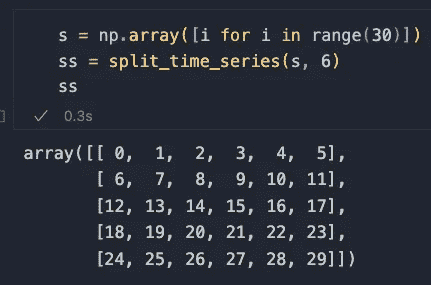

分裂序列法的应用。图片由作者提供。

现在我们需要根据大小`K`将每个序列分成两部分，以创建`A`和`B`序列。让我们为此定义两个新函数，称为 *split_sequence 和 split_sequences* 。

在 *split_sequence* 中，参数`K`允许我们如何控制第一个序列的大小。将其视为 Sklearn 的 *train_test_split 中的 *test_size* 参数。*

*split_sequences* 只是负责将逻辑应用于数组。

让我们将它应用到我们的例子中来理解它是如何工作的

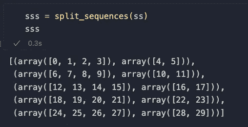

分割序列法。图片由作者提供。

`A`和`B`序列定义如下

`[seq[0] for seq in sss], [seq[1] for seq in sss]`

因此 Numpy 数组中第一个和第二个列表中的成对元素。

让我们将所有这些应用到我们的时间序列中。

实现算法前两步的代码

如果我们看一下`A[0]`和`B[0]`，我们会得到苹果收盘数据的第一部分，显示预处理是成功的。

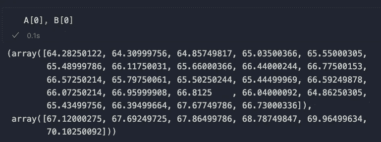

我们预处理产生的第一个序列。图片作者。

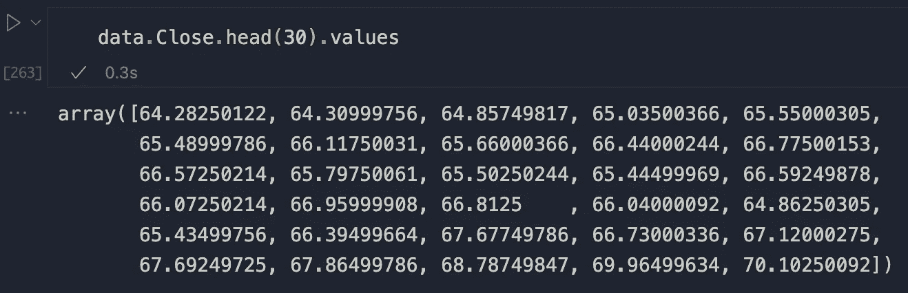

原始数据与预处理数据的对比。图片由作者提供。

现在我们准备通过相似性来比较序列。

# 相似度计算

这是算法的第三步。为了计算相似性，我们将结合使用**皮尔森相关性和动态时间扭曲。相关性帮助我们匹配趋势的大致方向，而 DTW 帮助我们计算两点之间的距离。关于这两个话题，网上有很多资源，如果你有兴趣的话，建议你去看看。**

公式如下，它是相关性和 DWT 的加权乘积

`DWT * (1 — correlation)`

虽然可能不是最佳的(帮我找到一个更好的解决方案！)，它似乎是有效的，正如您将简要看到的。

这里的想法是创建一个相似性矩阵`S`来存储属于`A`的所有序列的成对得分。请记住，我们希望在 A 中找到相似的元素，以计算在趋势中找到某个 B 的概率。

具有高于某个任意阈值的相似性的元素将被分组在一起。不过，我们以后会看到的。现在，让我们编写相似性计算的代码。

为了清楚起见，我只打印矩阵的前两行

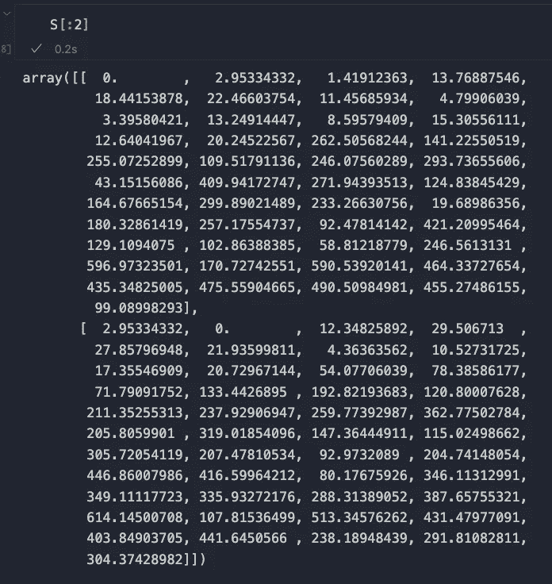

相似性矩阵的前两行由作者绘制。

如你所见，相同系列的分数为 0。所以，相似序列越来越相似，就越趋向于 0。让我们用热图来描绘一下。

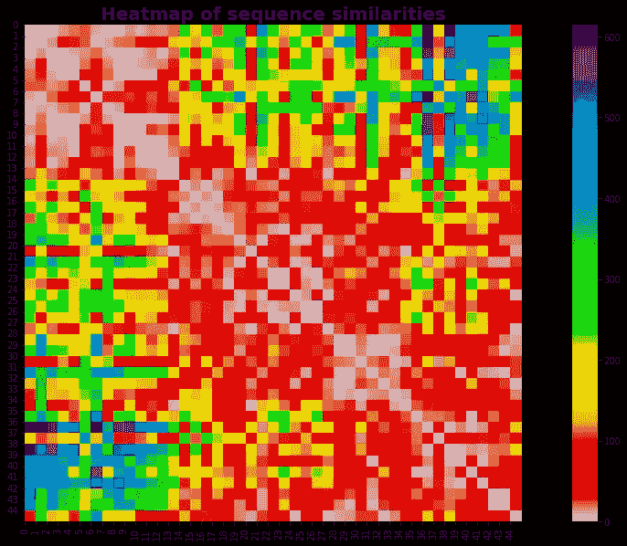

序列相似性热图。图片由作者提供。

热图揭示了一条重要信息:最相似的序列大多出现在我们时间序列的开头和结尾。

不知道为什么会这样——我很想听听你对此的看法。我们继续吧。

# 相似序列分组

下一步是将`A`中相似的序列分组在一起。这里的想法很简单:如果序列的相似性得分低于某个阈值，那么将它们分组到一个名为。`G`。`G`将为这个项目举办所有有意义的集群。

关于阈值的说明:我通过反复试验使用了值 6，因为它似乎在相似性分组方面产生了最好的结果(参见下文)。你可能想使用其他的价值观——尝试其他的价值观，让我知道它是如何为你工作的。

我们通过打印字典的一部分来看看`G`是什么样子的。

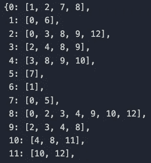

聚类 A 序列的一部分。图片作者。

酷…但没那么酷！字典并不能真正有效地传达信息。我们看到一些序列被组合在一起，但是它们看起来像什么呢？

# 将小组形象化

现在最激动人心的部分来了…让我们来想象一下各组吧！

对于`G`字典中引用种子序列的每个键，让我们绘制所有相似序列的专用图表。

记住:所有相似的序列都有一个低的动态时间弯曲值和一个相似的趋势。用于实现这种分组的参数是

N = 15
K = 0.70
阈值= 6

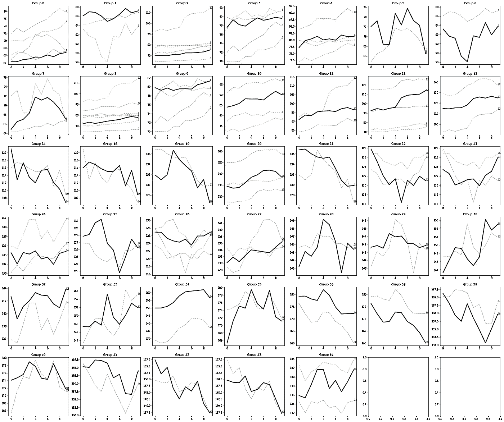

这些团体形象化了。在每个图表中，种子序列是黑色的，相似的是几种颜色的—图片由作者提供。

逻辑似乎工作得很好，因为黑线，也就是种子序列，**被在解剖和方向上相似的序列所包围。**

让我们检查另一个参数组合。

n = 25K = 0.6阈值= 25

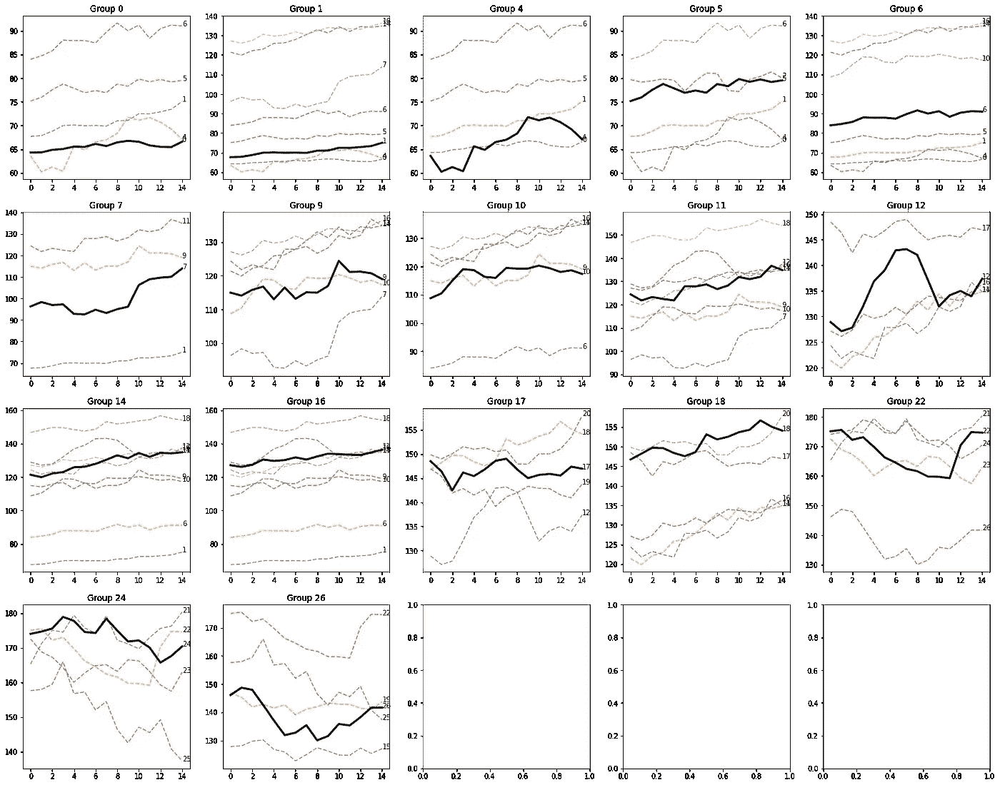

基于新参数的新序列分组。图片由作者提供。

**根据输入参数**，结果可能会发生剧烈变化。这是意料之中的，因为窗口大小、A/B 序列分割大小和阈值都会影响聚类算法的逻辑。

有些模式非常突出，比如第 22 组中的这个

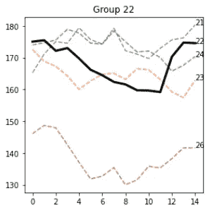

第 22 组。图片由作者提供。

和第 26 组

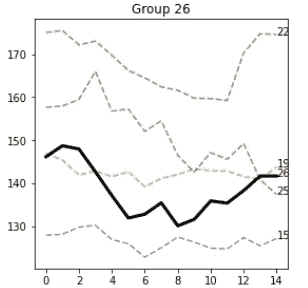

第 26 组。图片由作者提供。

种子序列周围的大多数序列确实是相似的，并且在视觉上与种子共享几个特征。我认为需要更精确的方法来评估这些属性。

虽然我确信有更好的方法来计算分数，但这些结果对我来说似乎很有希望。

# 计算概率

我们将讨论本文的最后一部分。我们现在将计算 B 序列出现上升趋势、下降趋势或稳定趋势*的概率。*回想一下`B`总是跟在`A`后面——这意味着 B_i 的*第一个元素跟在 A_i 的最后一个元素后面。*

我们将定义另一个名为 *classify_trend* 的辅助函数，它负责计算斜率并理解 B 序列的大致方向。

这些是结果。

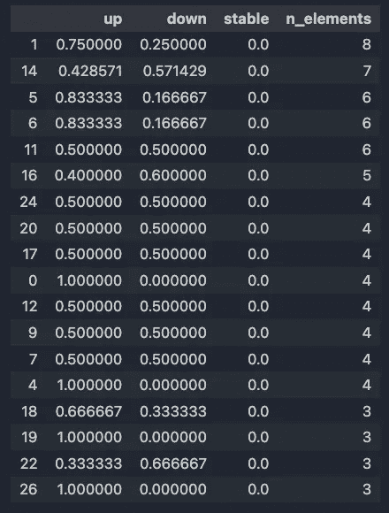

概率被放在一个数据框架中。图片由作者提供。

让我们画出概率分布图。

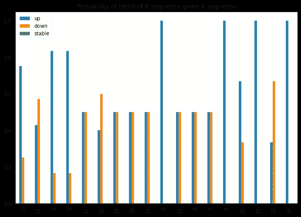

B 序列的方向分布。图片作者。

我选择按 *n_elements* 对项目进行排序，因为越多的序列组合在一起，聚类就越相关。其实 1 组和 14 组分别有 8 个和 7 个元素，相似的模式还挺多的。

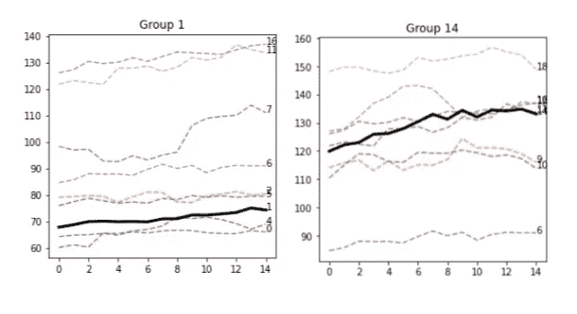

第一组和第十四组。图片由作者提供。

这并不奇怪，因为两个 A 序列基本上是平的。这里肯定有优化的空间，例如，删除所有的扁平线。但是我们将来会看到这一点。

在任何情况下，组 1 中 75%的 B 序列具有向上的方向，而组 14 中 57%的 B 序列具有向下的方向。也许两条线在某些方面确实不同，或者这种影响只是随机的。让我们画出 B 序列。

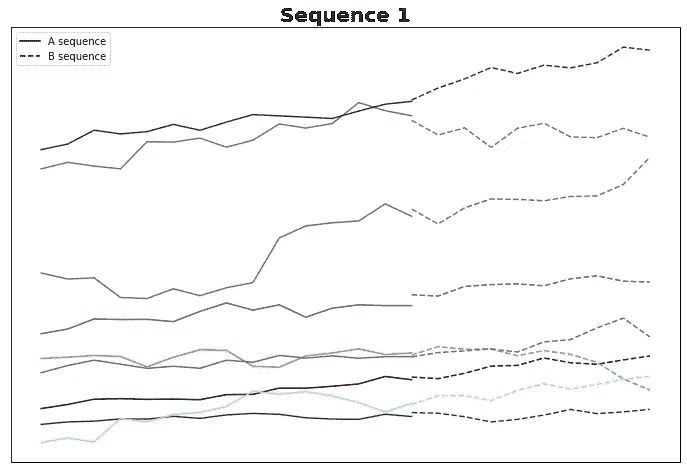

A 看同组的 A 和 B 序列。图片由作者提供。

这些 B 序列中的大多数确实上升了。有一些工作要做，以确保这不只是噪音。

让我们检查第 14 组

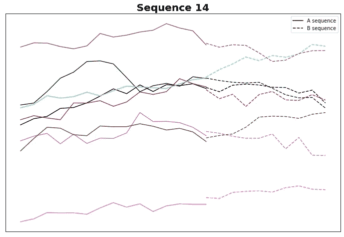

A 看同组的 A 和 B 序列。图片由作者提供。

事实上，他们中的大部分都走下坡路了。虽然逻辑似乎是正确的，但也许斜率计算需要一些改进:也许我们可以从默认的 0.05 增加阈值…但我们将在下一篇文章中讨论这个问题。

纯粹出于好奇，让我们绘制第 22 组，从视觉角度来看，这似乎也很有趣。

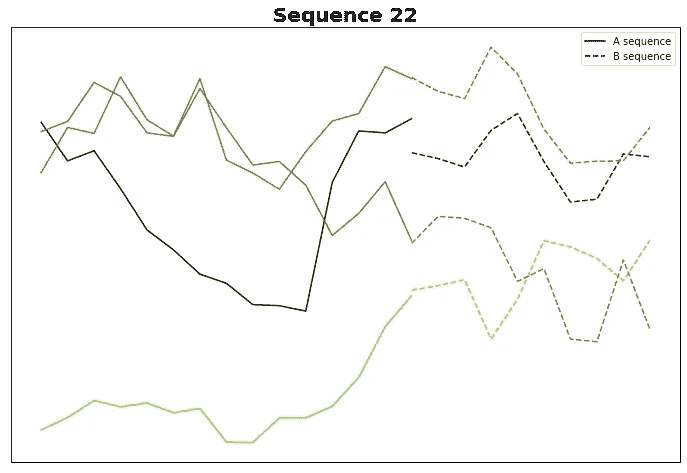

A 看同组的 A 和 B 序列。图片由作者提供。

哇哦。仅仅是我，还是 B 序列*实际上看起来彼此相似？*虽然这需要深入的分析，但如果这被证明是真的，那么 A 真的可以预测 B，因此，这将解释为什么我们会看到类似的 B。

# 第一部分结束

这很有趣。在第 1 部分中，我们看到了算法是如何工作的，以及它在预测股票市场趋势方面的潜力。

实际上，如果这可行，它可能是一个通用的方法…适用于任何时间序列。太令人兴奋了！在不久的将来，随着我对这个想法的继续研究，我将扩展这个分析。

请分享您对该方法的意见、疑问和想法。我喜欢整合反馈和贡献！😊

**如果你想支持我的内容创作活动，欢迎点击我下面的推荐链接，加入 Medium 的会员计划**。我将获得你投资的一部分，你将能够以无缝的方式访问 Medium 的大量数据科学文章。

 [## 通过我的推荐链接加入 Medium-Andrew D # data science

### 阅读 Andrew D #datascience(以及媒体上成千上万的其他作者)的每一个故事。您的会员费直接…

medium.com](https://medium.com/@theDrewDag/membership) 

下一篇文章再见👋