# Python 中的时间序列数据分析

> 原文：<https://pub.towardsai.net/time-series-data-analysis-in-python-1492ee4ca974?source=collection_archive---------0----------------------->

## Python Pandas 中时间序列数据分析的实用指南

ime 系列数据是行业中最常见的数据类型之一，在您的职业生涯中可能会用到它。因此，了解如何使用它以及如何应用分析和预测技术对于每个有抱负的数据科学家来说至关重要。在这一系列文章中，我将介绍处理时间序列数据的基本技术，从数据操作、分析和可视化开始，以了解您的数据并为其做准备，然后使用统计技术、机器和深度学习技术进行预测和分类。这更像是一个实践指南，我将把每个讨论和解释的概念应用到真实数据中。

这个系列将由 10 篇文章组成:

1.  [在 Python Pandas 中操作时间序列数据【实用指南】](/manipulating-time-series-data-in-python-49aed42685a0)
2.  [Python 熊猫中的时间序列分析【实用指南】](/time-series-data-analysis-in-python-1492ee4ca974)(你在这里)
3.  [用 Python 可视化时间序列数据【实用指南】](https://medium.com/towards-artificial-intelligence/time-series-data-visualization-in-python-2b1959726312)
4.  [利用 Python 中的 ARIMA 模型进行时间序列预测【第一部分】](/time-series-forecasting-with-arima-models-in-python-part-1-c2940a7dbc48)
5.  [利用 Python 中的 ARIMA 模型进行时间序列预测【第二部分】](/time-series-forecasting-with-arima-models-in-python-part-2-91a30d10efb0)
6.  [时间序列数据的机器学习【回归】](/machine-learning-for-time-series-data-in-python-regression-5e19fa2e7471)
7.  时间序列数据的机器学习[分类](即将推出)
8.  时间序列数据的深度学习[实用指南](即将推出)
9.  使用统计分析、机器学习和深度学习的时间序列预测项目(即将推出)
10.  使用统计分析、机器学习和深度学习进行时间序列分类(即将推出)

时序数据分析/由 [Luke Chesser](https://unsplash.com/@lukechesser?utm_source=medium&utm_medium=referral) 在 [Unsplash](https://unsplash.com?utm_source=medium&utm_medium=referral) 上拍摄

# 目录:

1.  相关性和自相关性
2.  时间序列模型
3.  自回归模型
4.  移动平均(MA)和 ARMA 模型
5.  案例研究:气候变化

**本文使用的所有代码和数据集都可以在这个** [**资源库**](https://github.com/youssefHosni/Time-Series-Analysis/tree/main/Time%20Series%20Analysis) **中找到。**

**如果你想免费学习数据科学和机器学习，看看这些资源:**

*   免费互动路线图，自学数据科学和机器学习。从这里开始:[https://aigents.co/learn/roadmaps/intro](https://aigents.co/learn/roadmaps/intro)
*   数据科学学习资源搜索引擎(免费)。将你最喜欢的资源加入书签，将文章标记为完整，并添加学习笔记。[https://aigents.co/learn](https://aigents.co/learn)
*   想要在导师和学习社区的支持下从头开始学习数据科学吗？免费加入这个学习圈:[https://community.aigents.co/spaces/9010170/](https://community.aigents.co/spaces/9010170/)

如果你想在数据科学& AI 领域开始职业生涯，但你不知道如何开始。我提供数据科学指导课程和长期职业指导:

*   长期指导:[https://lnkd.in/dtdUYBrM](https://lnkd.in/dtdUYBrM)
*   辅导会议:[https://lnkd.in/dXeg3KPW](https://lnkd.in/dXeg3KPW)

***加入*** [***中等会员***](https://youssefraafat57.medium.com/membership) ***计划，只需 5 美元，继续无限制学习。如果你使用下面的链接，我会收到一小部分会员费，不需要你额外付费。***

 [## 加入我的介绍链接媒体-优素福胡斯尼

### 阅读 Youssef Hosni(以及媒体上成千上万的其他作家)的每一个故事。您的会员费直接支持…

youssefraafat57.medium.com](https://youssefraafat57.medium.com/membership) 

# 1.相关性和自相关性

在本节中，您将了解时间序列的相关性和自相关性的概念。相关性描述两个时间序列之间的关系，而自相关描述时间序列与其过去值之间的关系。

## 1.1.两个时间序列的相关性

两个时间序列的相关性衡量它们之间的差异。相关系数用一个数字概括了这种关系。相关性为 1 意味着两个系列具有完美的线性关系，没有偏差。高相关性意味着这两个系列一起变化很大。低相关性意味着它们一起变化，但关联很弱。高度负相关意味着它们在相反的方向上变化，但仍然具有线性关系。

在计算两个趋势时间序列之间的相关性时，有一个常见的错误。考虑两个趋势相同的时间序列。即使这两个系列完全不相关，你仍然可以得到一个非常高的相关性。这就是为什么，当你看两只股票的相关性时，你应该看它们的**回报**的相关性，而不是它们的**水平**的相关性。

在下面的例子中，两个数列， [**的股票价格和**](https://github.com/youssefHosni/Time-Series-Analysis/tree/main/Time%20Series%20Analysis) 的 UFO 目击事件，都随时间呈上升趋势。当然，那两个数列没有关系，但是相关系数是 0.94。但是如果你计算百分比变化的相关性，相关性下降到接近零。

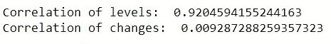

水平和变化的相关性。

下图显示了这两个系列与时间的关系。如上所述，这是因为它们都是趋势系列。

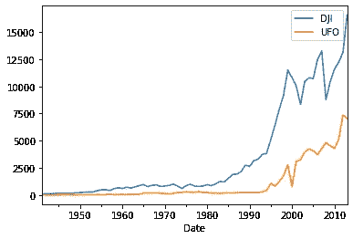

两个系列随时间的变化。

## 1.2.简单线性回归

时间序列的简单线性回归可找出因变量 y 和自变量 x 之间的最佳拟合直线的斜率β和截距α。x 和 y 可以是两个时间序列。

回归技术非常普遍，因此 Python 中有许多包可以使用。在统计模型中，有 OLS。在 **numpy** 中，有 **polyfit** ，如果你设置 degree，它将数据拟合成一条线，这就是线性回归。熊猫有 **ols** 方法， **scipy** 有线性回归函数。注意 x 和 y 的顺序在不同的包中是不一致的。

在下面的例子中，我们将遗憾地使用标准普尔 500 指数作为独立变量的石油价格值。数据可以在 [**这里找到**](https://github.com/youssefHosni/Time-Series-Analysis/tree/main/Time%20Series%20Analysis) 。您需要添加一列 1 作为从属的右侧变量。您必须这样做的原因是，回归函数假设如果没有常量列，那么您希望在没有截距的情况下运行回归。通过添加一列 1， **statsmodels** 还将计算该列的回归系数，这可以解释为直线的截距。statsmodels 方法“添加常数”是添加常数的一种简单方法。

回归输出如下图所示。

我们将只关注回归结果中的黄色高亮项。系数包含回归分析的斜率和截距。因为两个变量负相关，所以斜率为负。需要注意的第二个重要统计数据是 R 的平方，为 0.12。R 平方衡量线性回归线与数据的拟合程度。相关性和 R 平方之间存在关系。相关的幅度是 R 平方的平方根。并且相关性的符号是回归线斜率的符号。

## 1.3.自相关

自相关是单个时间序列与其自身滞后副本的相关性。也叫序列相关。通常，当我们提到一个序列的自相关时，我们指的是“滞后一”自相关。例如，当使用每日数据时，自相关将是滞后一天的相同序列的相关性。

正自相关，也称为趋势跟踪，意味着在一个时间间隔内观察到的增加会导致滞后时间间隔的成比例增加。而负自相关被称为均值回复，意味着如果特定值高于平均值，则下一个值(或之前的值)更有可能低于平均值。下图显示了两者的一个例子。

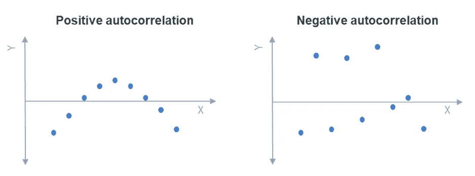

正与负自相关

时间序列的自相关在现实世界中有许多应用。许多对冲基金策略只是均值回归和动量策略的稍微复杂一点的版本。由于股票在大约一周的时间范围内一直具有负自相关性，一个流行的策略是买入上周下跌的股票，卖出上涨的股票。对于大宗商品和货币等其他资产，它们在过去几个月的时间里一直具有正的自相关性，因此典型的对冲基金策略是买入过去几个月上涨的大宗商品，卖出那些下跌的大宗商品。

## 1.4.自相关函数

自相关函数(ACF)是滞后的自相关函数。任何显著的非零自相关都意味着该序列可以从过去预测。它可以是您应该依赖于哪些值来预测未来的值，通过观察这些季节的自相关函数来发现季节性收益，并可用于选择拟合数据的模型，如第 3 节所示。

**plot_acf** 是用于绘制自相关函数的 **statsmodels** 函数。输入 x 是一个序列或数组。自变量 lags 表示将绘制自相关函数的多少个滞后。alpha 参数设置置信区间的宽度。例如，如果 alpha 等于 0.05，这意味着如果该滞后的真实自相关为零，则样本自相关落在该窗口之外的可能性只有 5%。如果您将 alpha 设置得更低，或者如果您的观察值更少，您将获得更宽的置信区间。

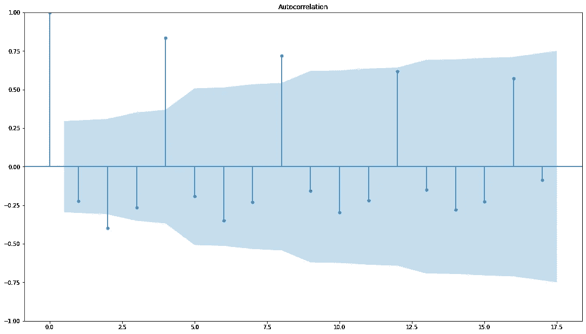

如果你不想要债券，设置 alpha = 1

# 2.时间序列模型

在本节中，您将了解一些简单的时间序列模型。这些包括白噪声和随机游走。

## 2.1.白噪声

白噪声是均值和方差随时间恒定且在所有滞后时间自相关为零的序列。白噪声有几种特殊情况。例如，如果数据是白噪声，但也具有正态或高斯分布，则称为高斯白噪声。

白噪声看起来如下:

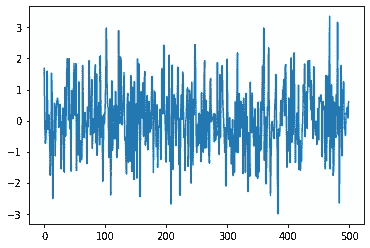

白噪声的自相关性:

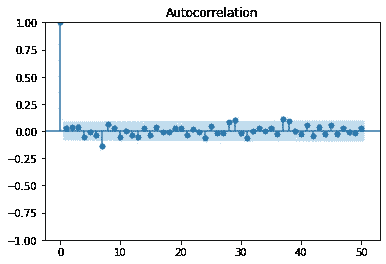

## 2.2.随机游动

随机走了一圈，今天的价格除了白噪音和昨天的价格一样。

P(t) = P(t-1) +白噪声

因此，价格的变化是白噪声。因为我们无法预测白噪音，所以对今天价格的最佳预测将是昨天的价格。

为了测试时间序列是否遵循随机游走，我们可以用滞后值回归当前值(例如价格)。如果斜率明显小于 1，我们可以拒绝零假设(序列遵循随机游走)。如果它与 1 没有显著不同，我们不能拒绝零假设。

另一种方法是回归滞后值的差值，并测试斜率是否为零而不是一。这被称为**迪基-富勒**测试，如果添加更多的滞后值，它将被称为**增强迪基-富勒** (ADF)测试。

下面的例子展示了如何使用 **statsmodels** 库对 python 中的 **SP500** 数据进行测试。

p 值为 0.9，这意味着差异不显著，我们不能拒绝零假设，因此 SP500 时间序列遵循随机游走。

## 2.3.静止的

平稳信号是其联合分布不依赖于时间的信号。更实际的定义是弱平稳定义，这意味着信号的均值、方差和自相关不依赖于时间。

在时间序列分析和预测中，平稳性是一个非常重要的概念。其原因是，如果序列不是平稳的，我们就无法对其进行建模和预测。建模步骤的主要任务是估计一组可用于所需任务(如预测)的参数。如果序列是非平稳的，其参数将随时间变化，因此您将无法对其建模。随机游走是一种常见的非平稳序列。方差随时间增长。例如，如果股票价格是随机游走的，那么明天价格的不确定性远小于 10 年后的不确定性。季节性序列也是非平稳的。

许多非平稳序列可以通过简单的变换变成平稳的。随机游走是一个非平稳序列，但是如果你求一阶差分，新的序列就是白噪声，是平稳的。

在下面的例子中， [**S & P 500 价格**](https://github.com/youssefHosni/Time-Series-Analysis/tree/main/Time%20Series%20Analysis) 为非平稳随机游走，通过取一阶差分将信号转换为平稳白噪声信号。

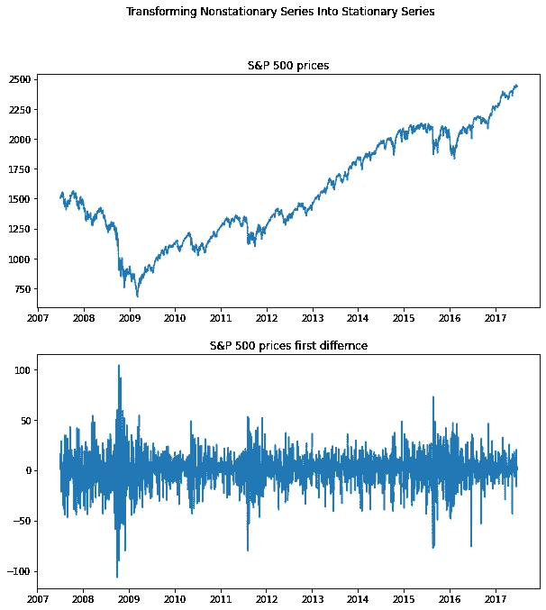

下面的例子是 [**H & R 块**](https://github.com/youssefHosni/Time-Series-Analysis/tree/main/Time%20Series%20Analysis) 的季度收益，它有很大的季节性成分，因此不是稳定的。如果我们采用季节性差异，通过采用滞后 4 的差异，转换后的序列看起来是平稳的。

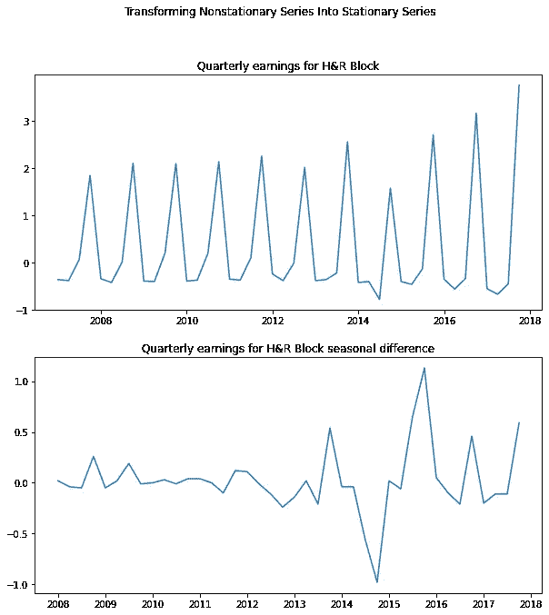

最后一个例子是亚马逊的季度营收。它呈指数增长，并呈现出强烈的季节性。首先，我们将只取系列的对数来消除指数增长。但是，如果你同时考虑序列的对数和季节差异，转换后的序列看起来是平稳的。

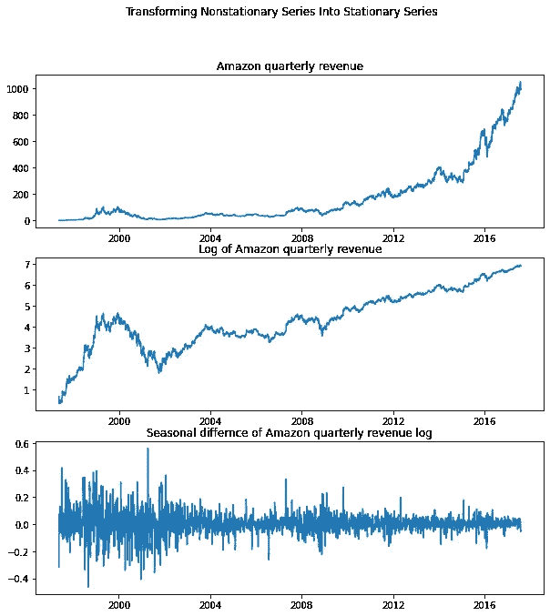

# 3.自回归模型

在这一节中，我们将解释时间序列的自回归(AR)模型。这些模型使用序列的过去值来预测当前值。

## 3.1.AR 模型定义

自回归(AR)模型**根据过去的行为预测未来的行为**。它用于预测时间序列中的值与它们之前和之后的值之间的相关性。

在 AR 模型中，除了噪声和平均值之外，今天的值等于昨天值的分数(phi ),如下式所示:

R(t) =均值+ phi*R(t-1) +噪声。

由于我们只查看时间上的一个先前步骤，因此这是 AR(1)模型，该模型可以扩展为包括更多滞后值和更多 phi 参数。这里我们展示了一个 AR(1)，一个 AR(2)，和一个 AR(3)。

如果 phi 等于 1，则该系列将代表上一节中讨论的随机行走，如果它为零，则它将是白噪声。为了使过程稳定，phi 必须在-1 和+1 之间。如果 phi 为负值，则上一期在 t-1 时间的正回报意味着该期的回报更可能为负。我们在 1.3 节中称之为均值回归。如果 phi 为正值，则上一期的正回报意味着本期的回报预期为正。我们在 1.3 节中称之为动量。

以下示例显示了具有不同 phi 值(0.9，-0.9，0.5，-0.5)的四个模拟时间序列:

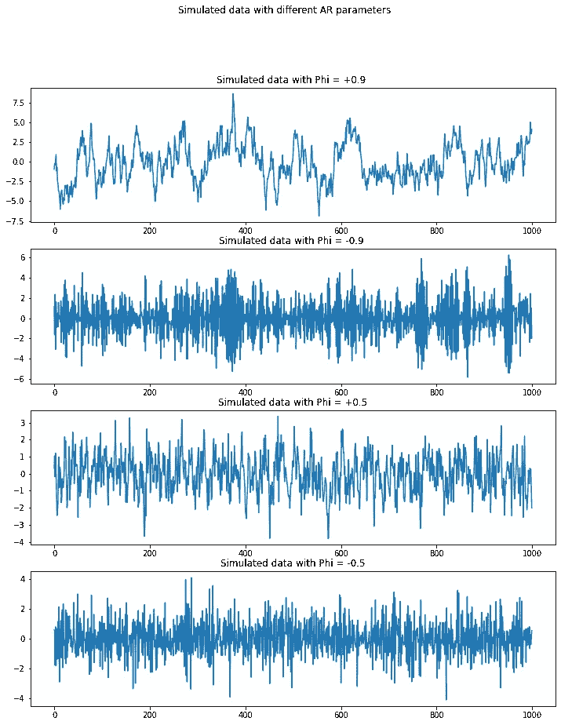

当 phi 为 0.9 时，它看起来接近随机行走。当 phi 等于-0.9 时，该过程有一个很大的正值，后面通常是一个很大的负值。底部的两个类似，但没有那么夸张，更接近白噪声。

为了更好地理解，让我们看看这四个模拟时间序列的自相关函数:

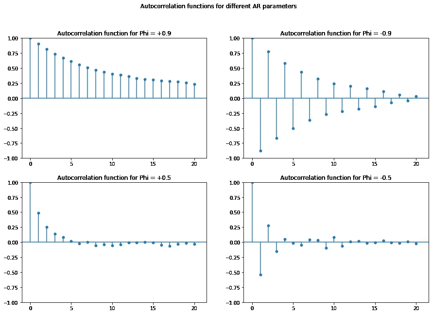

如果 phi 为正，自相关函数将以 phi 的速率指数衰减。这意味着，如果 phi 为 0.9，则 1 处的自相关为 0.9，2 处为(0.9)**2，3 处为(0.9)**3，依此类推。如果 phi 是负的，那么它将是相同的，但它将在每个滞后处反转其符号。

## 3.2.估计和预测 AR 模型

要估计时间序列的 AR 模型的参数，我们可以使用 ARIMA 类，如下例所示:

order (1，0，0)表示您正在将数据拟合到 AR(1)模型。order (2，0，0)表示您正在将数据拟合到 AR(2)模型。订单的第二和第三部分将在下一节讨论。

结果汇总如下所示，phi 参数以黄色突出显示。我们可以看到它是 0.91，类似于上一小节中使用的模拟数据的 phi 参数。

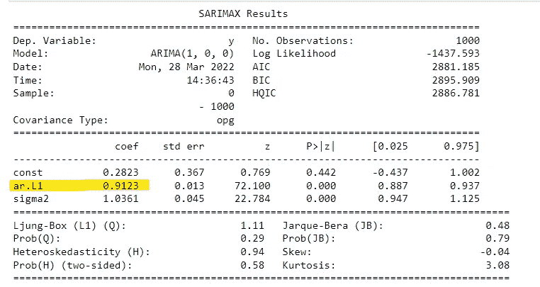

## 3.3.选择正确的模型

在前面的小节中，模型的阶是已知的。但是，实际上，这个是不会给你的。有不同的方法来确定 AR 模型的阶数。我们将集中讨论其中的两个:偏自相关函数和信息准则。

偏相关函数(PACF)测量增加另一个滞后的增量收益。为了更好地理解 PACF，让我们首先定义偏相关。偏自相关是对时间序列中的观测值和早期时间步长数据之间关系的描述，早期时间步长**没有考虑干预观测值之间的相关性。**连续时间步的观测值之间的相关性是间接相关性的线性函数。使用部分自相关函数消除了这些间接联系。

根据偏自相关的定义，PACF 只表示两个数据之间的关联，而这种关联是那些观测值之间的较短滞后所不能解释的。例如，滞后 3 的部分自相关仅仅是滞后 1 和 2 没有解释的相关性。**换句话说，每个滞后的偏相关是去除中间相关后两个观测值之间的唯一相关**。

要绘制 PACF，可使用 statsmodels 库中的 plot_pacf 函数，如下例所示:

我们用 AR(1)和 AR(2)生成了两个模拟数据，下图显示了它们的 PACF:

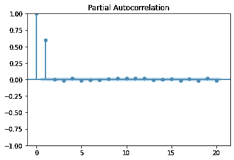

AR(1)模型的 PACF

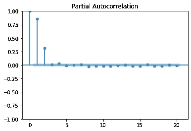

AR(2)模型的 PACF。

这些图显示了不同阶 AR 模型的部分自相关函数。在上图中，对于 AR(1)模型，只有滞后(1) PACF 显著不同于零。同样，对于 AR(2)模型，两个滞后不等于零。

如果我们将上一小节中使用的 ARIMA 函数应用于上一个示例中使用的模拟数据，并使用模型的阶数，就可以得到 PACF 图。我们应该从函数中获得与生成模拟数据时使用的参数相同的参数。在下面的示例中，我们使用 AR(2)和 phi 分别为 0.6 和 0.3 的模拟数据:

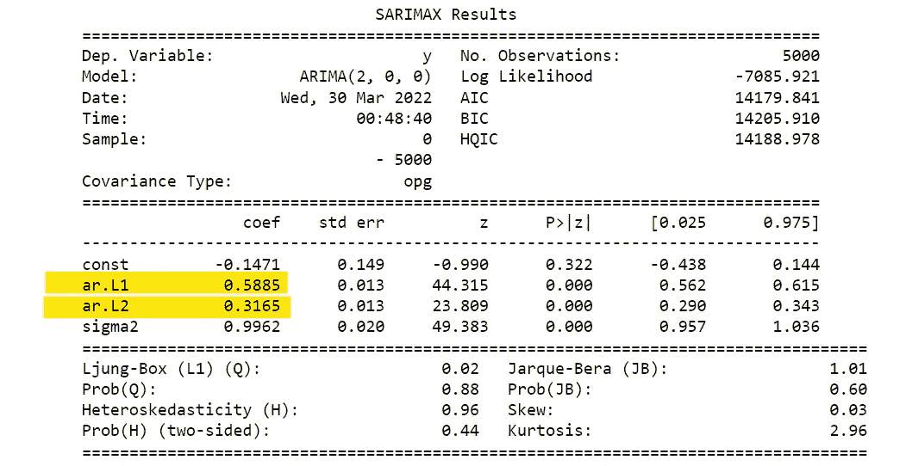

用黄色突出显示的系数是 phi_1 和 phi_2，正如预期的 0.6 和 0.3。

模型中的参数越多，模型对数据的拟合就越好。但这可能导致模型过度拟合数据。**信息标准**通过基于所用参数的数量施加惩罚来调整模型的拟合优度。两种常见的经调整的拟合优度度量被称为阿卡克信息准则(AIC)和贝叶斯信息准则(BIC)。

AIC 是一种数学方法，用于评估模型与生成该模型的数据的拟合程度。在统计学中，AIC 用于比较不同的可能模型，并确定哪个模型最适合数据。根据 AIC 的理论，最适合的模型是用最少的独立变量解释最大变化的模型。BIC 是在有限的模型集中选择模型的标准。它部分基于似然函数，并且与 AIC 密切相关。拟合模型时，可以通过添加参数来增加可能性，但这样做可能会导致过度拟合。BIC 通过为模型中的参数数量引入惩罚项来解决这个问题。BIC 的刑期比 AIC 长。

在实践中，使用信息标准的方法是拟合几个模型，每个模型具有不同数量的参数，并选择具有最低贝叶斯信息标准的模型。如下例所示:

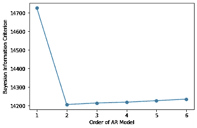

AR(2)模型模拟数据的 BIC。

您可以看到 AR(2)的 BIC 最低，这就是模拟数据的来源。

# 4.移动平均和 ARMA 模型

在这一节中，我们将讨论另一种模型，移动平均线模型。我们还将看到如何将 AR 和 MA 模型结合成一个强大的 ARMA 模型。

## 4.1 .移动平均模型定义

在 MA 模型中，今天的值等于平均值加上噪声，再加上昨天噪声的一部分。这在下面的等式中示出:

R(t) =平均值+噪声+θ*(昨天-噪声)

这被称为一阶 MA 模型，或者简单地称为 MA(1)模型，因为我们只考虑昨天的噪声，如果我们寻找前两天，它将是 MA(2)，以此类推。如果 MA 参数θ为零，则该过程是白噪声。MA 模型对于所有θ值都是稳定的。

假设 R(t)是股票收益的时间序列。如果θ为负，则上一期的正冲击(由ε(t-1)表示)将导致上一期的回报为正，但这一期的回报更可能为负。两个时期前的冲击对今天的回报没有影响——只有现在和上一个时期的冲击。

要从 MA 模型创建模拟数据，我们可以使用 statsmodels 库中的 ArmaProcess，如下例所示:

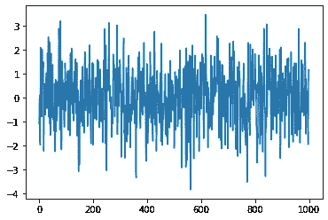

来自 MA(1)模型的模拟数据。

## 4.2.MA 模型的估计

为了从给定的时间序列中估计 MA 模型，我们可以使用与前面 3.2 节中所示的估计 AR 模型相同的方法。我们将使用 ARIMA 函数，但顺序将是(0，0，1)而不是(1，0，0)。这方面的一个例子如下所示:

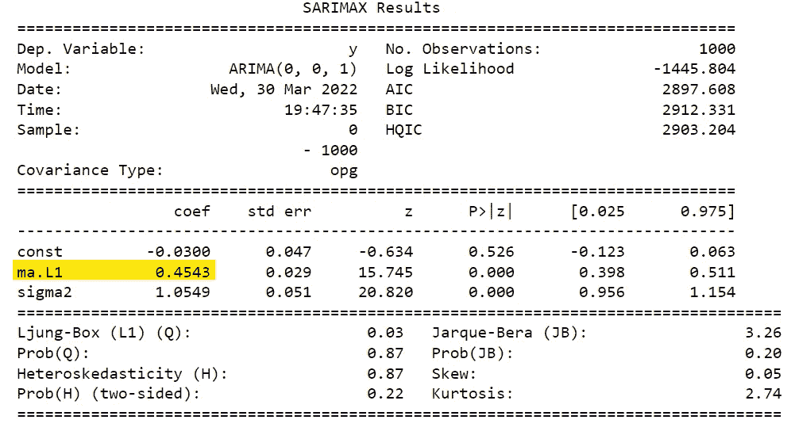

黄色突出显示的数字是模拟数据的θ参数。结果与我们的预期一致，因为用于生成模拟数据的参数是 0。

## 4.3.ARMA 模型

ARMA 模型是 AR 和 MA 模型的组合。以下是 ARMA(1，1)模型的公式:

R(t) =平均值+θ*噪声(t-1)+φ* R(t-1)+噪声(t)

# 5.案例研究:气候变化

让我们通过气候变化案例研究将本文中涉及的所有概念放在一起。我们将分析近 150 年来的一些温度数据。这些数据是从 NOAA 网站下载的。

将完成以下步骤:

*   通过将索引转换为日期时间并绘制数据来应用 pandas 方法。
*   应用扩展的 Dickey-Fuller 检验来查看数据是否是随机游走。
*   取数据中的一阶差分，将其转换为平稳序列
*   计算数据的自相关函数和偏自相关函数。
*   根据数据拟合 AR、MA 和 ARMA 模型。
*   使用信息标准从你看到的模型中选择最佳模型。
*   最后，用最好的模型，预测未来 30 年的气温。

前两步用下面的代码完成:

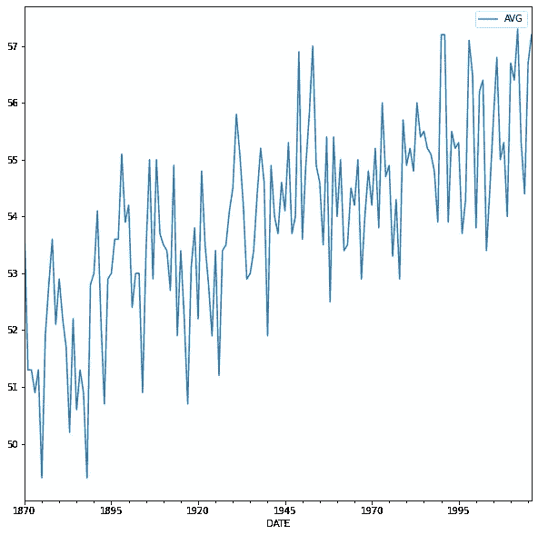

纽约市的平均气温。

ADF 检验的 p 值是 0.58，这意味着时间序列不是平稳的，我们不能拒绝它是随机游走。

使用下面的代码将第三和第四步应用于数据:

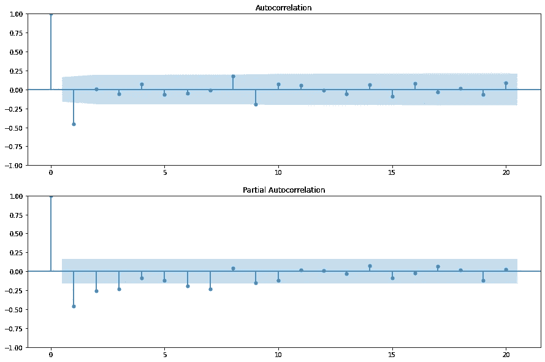

数据一阶差分的相关和自相关函数。

除了 ACF 中的负滞后-1 自相关之外，ACF 和 PACF 中没有明确的模式。

之后，将对三个模型的数据进行拟合，并为每个模型计算 AIC。这是使用下面的代码完成的:

三种型号的 AIC 如下所示:

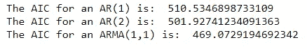

在三个模型中，ARMA(1，1)的 AIC 值最低。因此，它将用于参数估计和预测。

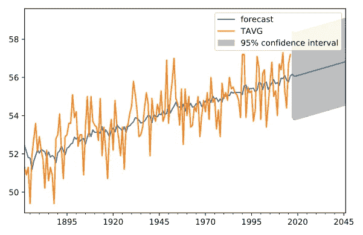

根据该模型，预计 30 年后气温将升高约 0.6 度(几乎完全是由于趋势)，但围绕这一点的 95%置信区间超过 5 度。

## **参考文献**

[1].[https://app . data camp . com/learn/courses/time-series-analysis-in-python](https://app.datacamp.com/learn/courses/time-series-analysis-in-python)

[2].[https://www.statisticshowto.com/autoregressive-model/](https://www.statisticshowto.com/autoregressive-model/)

[3].[https://analyticsindiamag . com/what-is-auto correlation-and-partial-自相关-in-time-series-data/](https://analyticsindiamag.com/what-are-autocorrelation-and-partial-autocorrelation-in-time-series-data/)

[4].[https://www . scribbr . com/statistics/a kaike-information-criterion/](https://www.scribbr.com/statistics/akaike-information-criterion/)

[5].[https://medium . com/@ analy ttica/what-is-Bayesian-information-criterion-BIC-b 3396 a 894 be 6](https://medium.com/@analyttica/what-is-bayesian-information-criterion-bic-b3396a894be6)

 [## 加入我的介绍链接媒体-优素福胡斯尼

### 阅读 Youssef Hosni(以及媒体上成千上万的其他作家)的每一个故事。您的会员费直接支持…

youssefraafat57.medium.com](https://youssefraafat57.medium.com/membership) 

*感谢阅读！如果你喜欢这篇文章，一定要鼓掌(高达 50！)并在* [*LinkedIn*](https://www.linkedin.com/in/youssef-hosni-b2960b135/) *上与我联系，并在*[*Medium*](https://youssefraafat57.medium.com/)*上关注我的新文章*