# Python 中的时间序列数据可视化

> 原文：<https://pub.towardsai.net/time-series-data-visualization-in-python-2b1959726312?source=collection_archive---------0----------------------->

## Python 时序数据可视化实用指南

ime 系列数据是行业中最常见的数据类型之一，在您的职业生涯中可能会用到它。因此，了解如何使用它以及如何应用分析和预测技术对于每个有抱负的数据科学家来说至关重要。在这一系列文章中，我将介绍处理时间序列数据的基本技术，从数据操作、分析和可视化开始，以了解您的数据并为其做准备，然后使用统计、机器学习和深度学习技术进行预测和分类。这更像是一个实践指南，我将把每个讨论和解释的概念应用到真实数据中。

这个系列将由 10 篇文章组成:

1.  [在 Python Pandas 中操作时间序列数据【实用指南】](/manipulating-time-series-data-in-python-49aed42685a0)
2.  [Python Pandas 中的时间序列分析【实用指南】](/time-series-data-analysis-in-python-1492ee4ca974)
3.  [用 Python 可视化时间序列数据【实用指南】](https://medium.com/towards-artificial-intelligence/time-series-data-visualization-in-python-2b1959726312)(你在这里)
4.  [利用 Python 中的 ARIMA 模型进行时间序列预测【第一部分】](/time-series-forecasting-with-arima-models-in-python-part-1-c2940a7dbc48)
5.  [利用 Python 中的 ARIMA 模型进行时间序列预测【第二部分】](/time-series-forecasting-with-arima-models-in-python-part-2-91a30d10efb0)
6.  [时间序列数据的机器学习【回归】](/machine-learning-for-time-series-data-in-python-regression-5e19fa2e7471)
7.  时间序列数据的机器学习[分类](即将推出)
8.  时间序列数据的深度学习[实用指南](即将推出)
9.  使用统计分析、机器学习和深度学习的时间序列预测项目(即将推出)
10.  使用统计分析、机器学习和深度学习进行时间序列分类(即将推出)

时序可视化/照片由 [Carlos Muza](https://unsplash.com/@kmuza?utm_source=medium&utm_medium=referral) 在 [Unsplash](https://unsplash.com?utm_source=medium&utm_medium=referral) 上拍摄

# 目录:

1.  线形图
2.  汇总统计和诊断
3.  季节性、趋势和噪音
4.  可视化多个时间序列
5.  案例研究:失业率

**本文使用的所有代码和数据集都可以在这个** [**资源库**](https://github.com/youssefHosni/Time-Series-Analysis/tree/main/Time%20Series%20Data%20Visualization) **中找到。**

**如果你想免费学习数据科学和机器学习，看看这些资源:**

*   免费互动路线图，自学数据科学和机器学习。从这里开始:[https://aigents.co/learn/roadmaps/intro](https://aigents.co/learn/roadmaps/intro)
*   数据科学学习资源搜索引擎(免费)。将你最喜欢的资源加入书签，将文章标记为完整，并添加学习笔记。[https://aigents.co/learn](https://aigents.co/learn)
*   想要在导师和学习社区的支持下从头开始学习数据科学吗？免费加入这个学习圈:[https://community.aigents.co/spaces/9010170/](https://community.aigents.co/spaces/9010170/)

如果你想在数据科学&人工智能领域开始职业生涯，但你不知道如何开始。我提供数据科学指导课程和长期职业指导:

*   长期指导:[https://lnkd.in/dtdUYBrM](https://lnkd.in/dtdUYBrM)
*   辅导会议:[https://lnkd.in/dXeg3KPW](https://lnkd.in/dXeg3KPW)

***加入*** [***中等会员***](https://youssefraafat57.medium.com/membership) ***计划，只需 5 美元，继续无限制学习。如果你使用下面的链接，我会收到一小部分会员费，不需要你额外付费。***

 [## 加入我的介绍链接媒体-优素福胡斯尼

### 阅读 Youssef Hosni(以及媒体上成千上万的其他作家)的每一个故事。您的会员费直接支持…

youssefraafat57.medium.com](https://youssefraafat57.medium.com/membership) 

# 1.线形图

在本节中，我们将学习如何利用 Python 中的基本绘图工具，以及如何注释和个性化您的时间序列图。

## 1.1.创建时间序列折线图

首先，我们将上传发现数据集，并使用。 **read_csv** 然后剧情在用**。绘制**的方法如下面的代码所示:

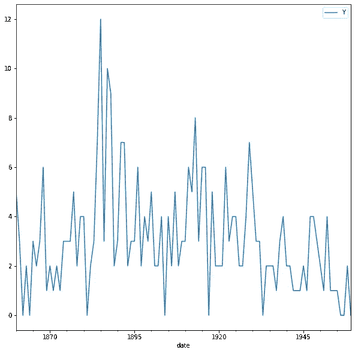

从 1860 年到 1959 年的伟大发明和科学发现。

matplotlib 图的默认样式不一定是您喜欢的样式，但是可以改变。因为定制每个绘图或创建自己的模板会很耗时，所以提供了几个 matplotlib 样式的模板供使用。这些可以通过使用 **plt.style** 命令调用，并自动将预先指定的字体、线条、点、背景颜色等的默认值添加到你的绘图中。在这种情况下，我们选择使用著名的 **fivethirtyeight** 样式表。要设置这种样式，您可以使用下面的代码:

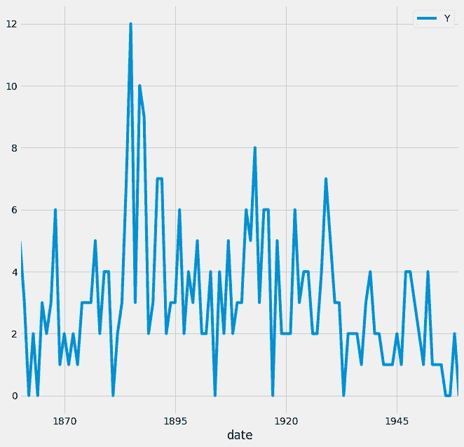

从 1860 年到 1959 年的伟大发明和科学发现使用了**五三八**风格。

要查看所有可用的样式，请使用以下代码:

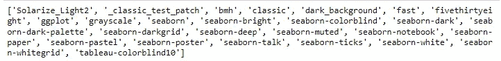

**matplotlib** 图的可用样式。

您还可以使用 color 参数更改绘图的颜色，如下面的代码所示:

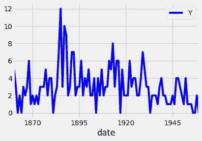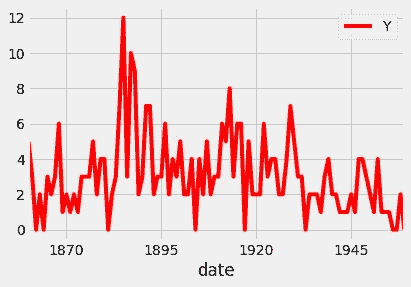

因为你的情节应该总是讲述一个故事并传达相关信息。因此，用轴标签和图例仔细注释每个图是至关重要的。**。pandas 中的 plot()** 方法返回一个 matplotlib AxesSubplot 对象，通常的做法是将这个返回的对象赋给一个名为 ax 的变量。这样做还允许您在绘图中包含附加的符号和规范，如轴标签和标题。特别是，您可以使用**。set_xlabel()** ，**。set_ylabel()** 和**。set_title()** 方法指定 x 轴和 y 轴标签，以及绘图的标题。

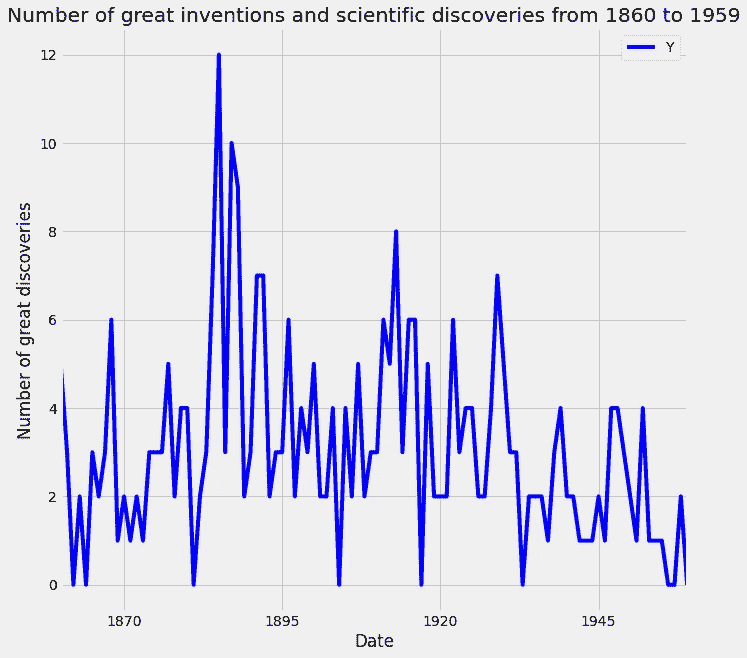

从 1860 年到 1959 年的伟大发明和科学发现使用了**fivethirtyeeight**风格，并增加了标题、x 标签和 y 标签。

## 1.2.自定义您的时间序列图

图表很棒，因为它们能让用户理解数据。但是，有时您可能想要突出特定的事件，或者通过您的思路引导用户。

为了绘制数据的子集，并且 pandas 数据帧的数据索引由日期组成，您可以使用表示您感兴趣的时间段的字符串来分割数据。如下例所示:

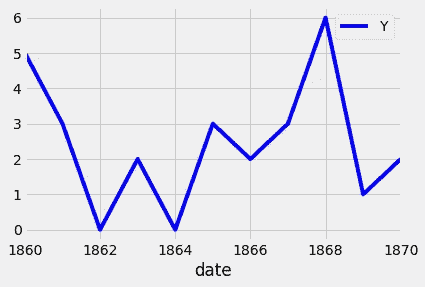

从 1860 年到 1870 年的伟大发明和科学发现。

附加注释也有助于强调时间序列中的特定观察或事件。这可以用 **matplotlib** 通过使用 **axvline** 和**axv line**方法来实现。如下例所示，使用 **axvline** 和**axv line**方法绘制垂直线和水平线。

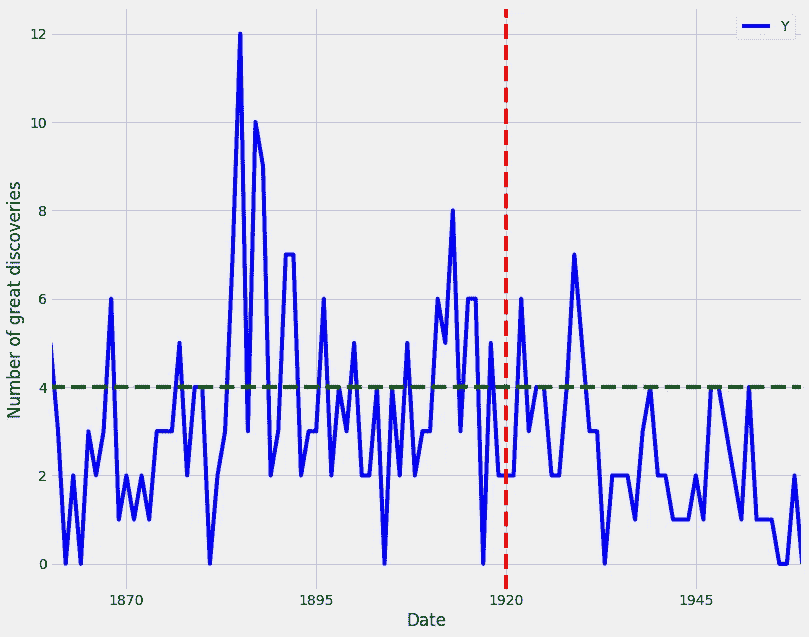

从 1860 年到 1950 年的伟大发明和科学发现，垂直线在 1920 年，水平线在 4。

除了注释之外，您还可以突出显示时间序列图中感兴趣的区域。这有助于围绕您的数据提供更多的上下文，并真正强调您试图用图表传达的故事。为了给绘图的特定区域添加阴影部分，可以使用 **matplolib** 中的 **axvspan** 和 **axhspan** 方法分别产生垂直区域和水平区域。下面的代码显示了这样一个例子:

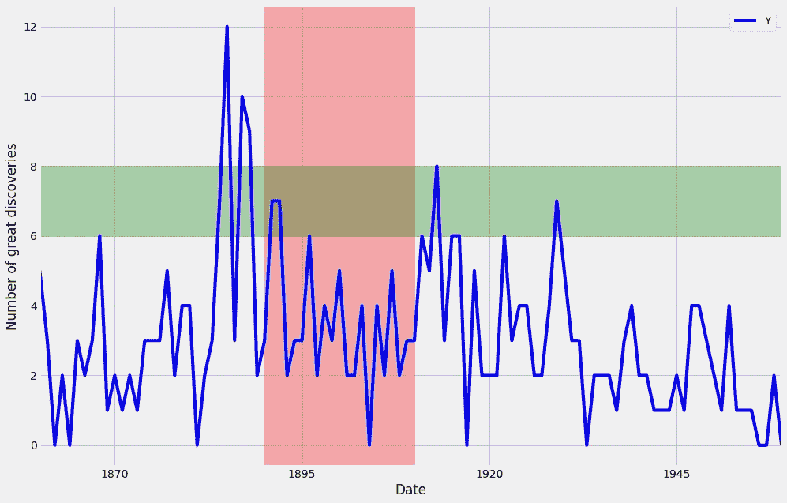

从 1860 年到 1950 年的伟大发明和科学发现，从 1890 年到 1910 年垂直突出显示区域，从 6 到 8 线突出显示水平区域。

# 2.汇总统计和诊断

在本节中，我们将解释如何通过计算汇总统计数据和绘制数据的聚合视图来更深入地了解时间序列数据。

在本节中，我们将使用一个新的数据集，它在时序社区中很有名。该时间序列数据集包含夏威夷莫纳罗亚天文台 1958 年至 2001 年间的 CO2 测量值。数据集可以从 [**这里**](https://github.com/youssefHosni/Time-Series-With-Python/tree/main/Time%20Series%20Data%20Visualization) 下载。

## 2.1.清理您的时间序列数据

在现实生活中，数据经常以混乱和/或嘈杂的格式出现。数据中的“噪声”可能包括异常值、格式错误的数据点和缺失值等。为了能够对您的数据进行充分的分析，仔细处理和清理您的数据非常重要。虽然这看起来会减慢您最初的分析，但是这项投资对于未来的发展是至关重要的，并且可以真正帮助加快您的调查分析。

实现这一目标的第一步是检查数据中是否有缺失值。在 pandas 中，数据帧中缺失的值可以用**找到。isnull()** 方法。相反，使用**可以找到具有非空值的行。notnull()** 方法。在这两种情况下，这些方法都返回非缺失值和缺失值所在的 True/False 值。

如果您想知道有多少行包含缺失值，您可以组合**。isnull()** 方法同**。sum()** 计算 df 数据帧每一列中缺失值总数的方法。这是因为 **df.isnull()** 如果行值为空，则返回值 True，而 dot sum()返回缺失行的总数。这是通过下面的代码完成的:

缺失值的数量是 59 行。要替换数据中缺失的值，我们可以使用不同的选项，如平均值、前一时间点的值或后一时间点的值。为了替换时间序列数据中缺失的值，您可以使用**。fillna()** 法熊猫。注意方法参数是很重要的，它指定了我们希望如何处理丢失的数据。使用方法**b 填充**(即回填)将确保缺失值被下一个有效的观测值替换。另一方面，ffill(即向前填充)将用最近的非缺失值替换缺失值。这里，我们将使用**b 填充**方法。

## 2.2.绘制数据的聚合图

移动平均，也称为滚动平均，是时间序列分析领域中常用的技术。它可以用来消除短期波动，消除异常值，并突出长期趋势或周期。取时间序列的滚动平均值相当于“平滑”时间序列数据。在熊猫中，**。rolling()** 方法允许您指定在计算您的指标时要使用的数据点的数量。

这里，您指定一个 52 点的滑动窗口，并在窗口沿日期轴移动时计算这 52 点的平均值。计算移动平均线时使用的点数取决于应用，这些参数通常通过反复试验或根据某些季节性来设置。例如，您可以采用每日数据的移动平均值，并指定窗口为 7，以获得每周移动平均值。在我们的例子中，我们使用的是周数据，因此我们指定了一个 52 的窗口(因为一年有 52 周)来获取年度滚动平均值。使用以下代码将窗口 52 的滚动平均值应用于数据:

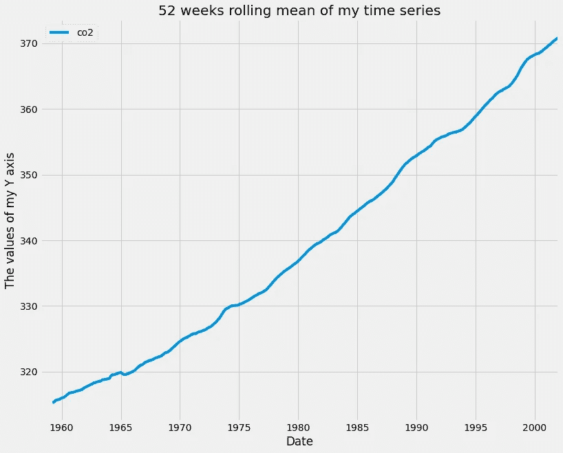

二氧化碳水平时间序列的 52 周滚动平均值。

另一种可视化时间序列数据的有用技术是对数据中的值进行聚合。例如，co2_levels 数据包含每周数据，但是您可能希望查看这些值在一年中的各个月份的表现。因为您已经将 co2_levels 数据帧的索引设置为日期时间类型，所以可以直接提取索引中每个日期的日、月或年。例如，您可以使用命令 co2_levels **提取月份。索引** **。月份**。类似地，您可以使用命令 co2_levels **提取年份。索引。年份**。

聚合时间序列中的值有助于回答诸如“我们的时间序列在周日的平均值是多少”或“我们的时间序列在一年中每个月的平均值是多少”之类的问题。如果您的 pandas 数据帧的索引由 DateTime 类型组成，那么您可以提取索引并按这些值对数据进行分组。在这里，您使用了**。groupby()** 和**。mean()** 计算二氧化碳水平数据的月平均值和年平均值的方法，并将其分配给一个名为 co2_levels_by_month 和 co2_levels_by_year 的新变量。**。groupby()** 方法允许您根据一组定义的类别将记录分组到桶中。在这种情况下，类别是一年中不同的月份和每年。

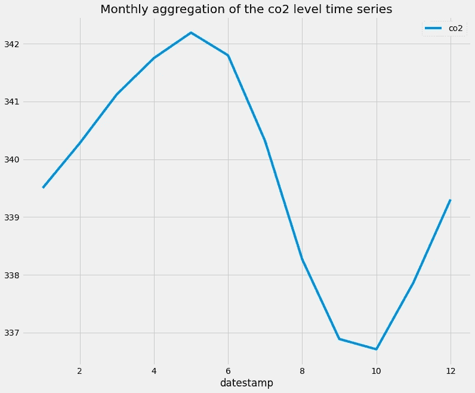

二氧化碳水平时间序列的每月汇总。

当我们绘制 **co2_levels_by_month** 时，我们看到 co2 水平的月平均值在一年的第 5 至第 7 个月达到峰值。这与夏季我们看到阳光和环境中二氧化碳排放增加的事实是一致的。我非常喜欢这个例子，因为它展示了绘制时间序列数据聚合值的能力。

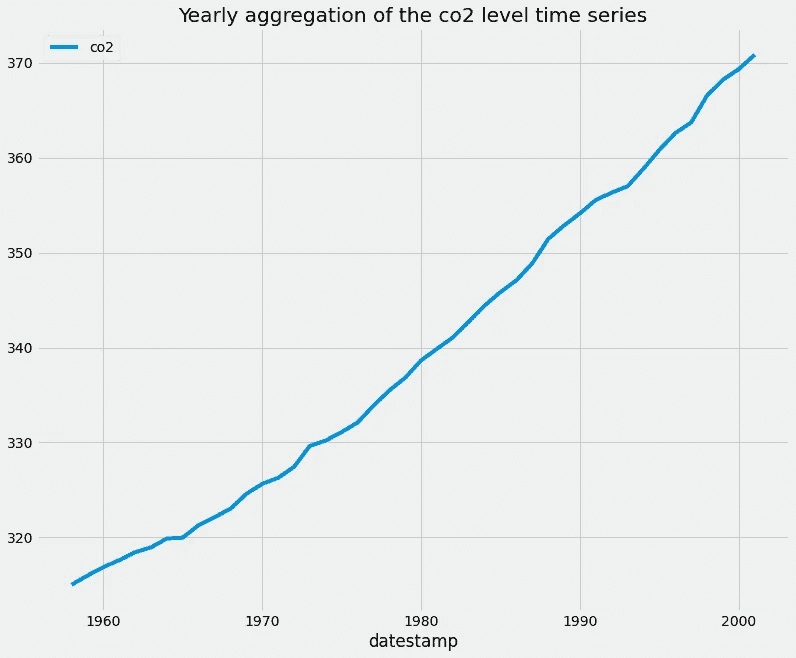

二氧化碳水平时间序列的年度汇总。

当我们按年绘制二氧化碳水平图时，我们可以看到二氧化碳水平每年都在增加，这是意料之中的。

## 2.3.汇总数据集中的值

理解数据的一个重要步骤是创建您正在处理的时间序列的汇总统计图。这样做将允许您共享和讨论数据的统计属性，从而进一步支持您生成的图和您想要传达的任何假设。有三种基本的图表来显示数据的汇总统计数据，即箱线图、直方图和密度图。

箱线图提供了关于数据的形状、可变性和中位数的信息。这对于显示数据范围和识别任何潜在的异常值特别有用。

从方框平行延伸的线通常被称为“胡须”，用于表示上四分位数(即 75%百分位数)和下四分位数(即 25%百分位数)之外的可变性，即异常值。这些异常值通常被绘制成与须状物一致的单个点。

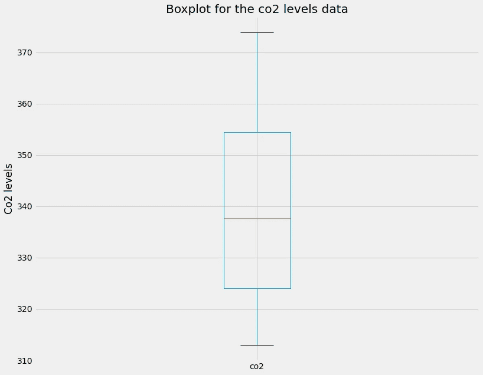

二氧化碳水平数据的箱线图。

直方图是一种绘图类型，允许您检查数据的基本分布。它可视化了数据中每个值出现的频率。这些有时可能比箱线图更有用，因为团队中的非技术成员通常更熟悉直方图，因此更有可能快速理解您正在探索或向他们展示的数据的形状。

在熊猫中，简单地使用标准**就可以产生直方图。plot()** 方法，并将种类参数指定为 **hist** 。此外，您可以指定 bin 参数，该参数决定了您应该将数据分割成多少个区间。关于 **bin** 参数，没有硬性规定可以找到它的最优值，往往需要通过反复试验才能找到。

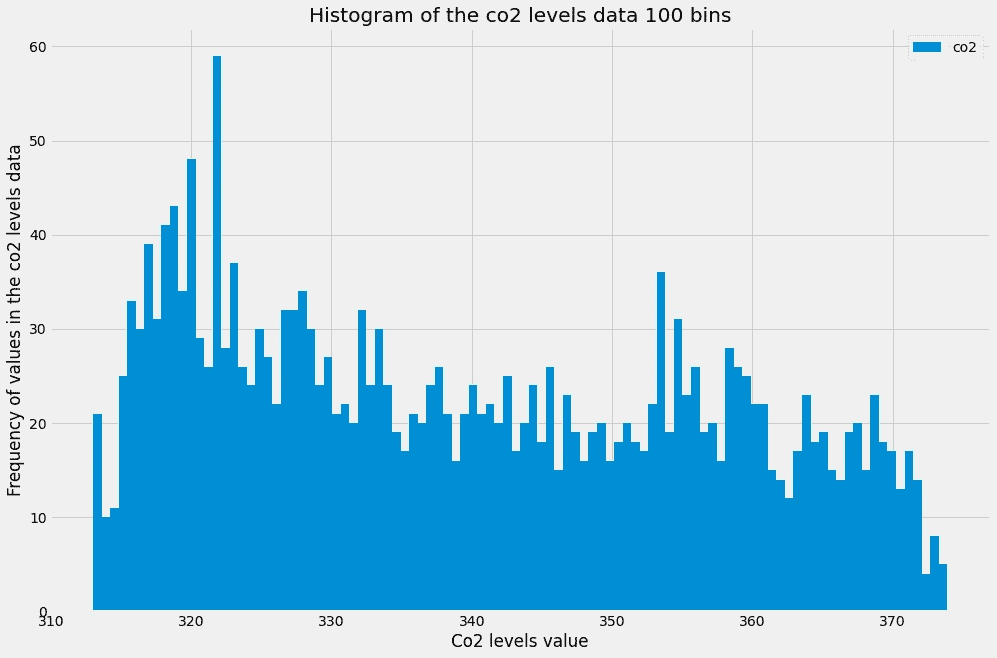

二氧化碳水平数据的直方图。

由于确定最佳的条柱数量可能会令人困惑，因此直方图可能是评估数据分布的一种麻烦方法。相反，您可以依靠内核密度图来查看数据的分布。核密度图是直方图的变体。它们使用核平滑来绘制数据的值，并通过抑制噪声和异常值的影响来实现更平滑的分布，同时显示大量数据的位置。用 panda 的库生成密度图很简单，因为你只需要使用标准。plot()方法，同时将种类参数指定为**密度**。

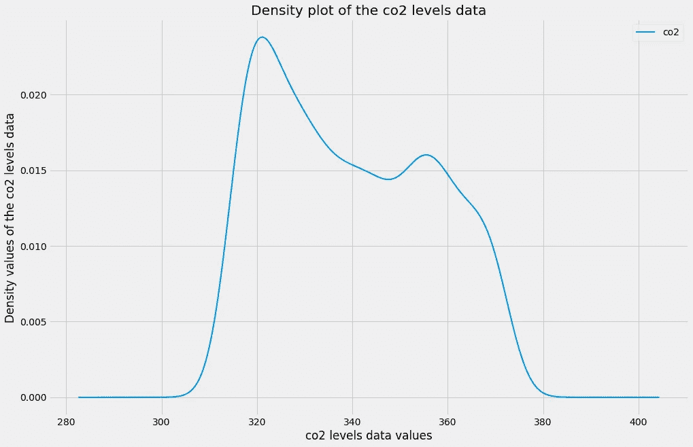

二氧化碳水平数据的密度图。

# 3.季节性、趋势和噪音

在本节中，我们将通过学习自相关和偏自相关图来超越汇总统计。您还将学习如何自动检测时间序列数据中的季节性、趋势和噪声。自相关和偏自相关在本系列的**上一篇文章**中有更详细的介绍。

## 3.1.自相关和偏自相关

**自相关**是你的时间序列和它自身的延迟副本之间的相关性的度量。例如，3 阶自相关返回时间序列在 t(1)、t(2)、t(3)点与其自身滞后 3 个时间点(即 t(4)、t(5)、t(6)的值之间的相关性。自相关用于发现时间序列数据中的重复模式或周期性信号。自相关原理可以应用于任何信号，而不仅仅是时间序列。因此，在其他领域遇到同样的原理是很常见的，有时也被称为自协方差。

在下面的例子中，我们将使用 **statsmodels** 库中的 **plot_acf** 函数绘制 co2 水平时间序列的自相关图。

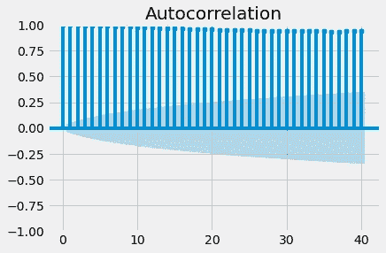

二氧化碳水平时间序列的自相关。

因为自相关是一种相关性度量，所以自相关系数只能取-1 和 1 之间的值。自相关为 0 表示无相关性，而 1 和-1 表示强负相关和正相关。为了帮助您评估自相关值的重要性，**。plot_acf()** 函数还计算并返回不确定性的边界，在图形中以蓝色阴影区域表示。高于这些区域的值可以被解释为与自身的滞后版本具有统计显著关系的时间序列。

除了自相关之外，偏相关度量时间序列与其滞后版本之间的相关系数。然而，**它也通过移除先前时间点**的影响来扩展这个想法。例如，3 阶偏相关函数返回时间序列在 t(1)、t(2)、t(3)点的相关性，以及它自身在 3 个时间点 t(4)、t(5)、t(6)的滞后值，但只是在去除了所有可归因于滞后 1 和 2 的影响之后。

就像自相关一样，我们需要使用 statsmodels 库来计算和绘制时间序列中的部分自相关。这个例子使用了**。plot_pacf()** 函数计算并绘制 co2 水平时间序列前 40 个滞后的部分自相关。

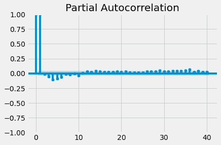

二氧化碳水平时间序列的部分自相关。

如果偏相关值接近 0，您可以得出结论，这些值彼此不相关。相反，值接近 1 或-1 的部分自相关表明时间序列的滞后观测值之间存在很强的正相关或负相关。如果偏自相关值超出不确定性的界限(由蓝色阴影区域标记),则可以假设观察到的偏自相关值在统计上是显著的。

## 3.2.时间序列数据中的季节性、趋势和噪声

在查看时间序列数据时，您可能已经注意到了它们展示的一些清晰模式。正如您在下图所示的 co2 水平时间序列中所看到的，数据显示出明显的上升趋势以及周期性信号。

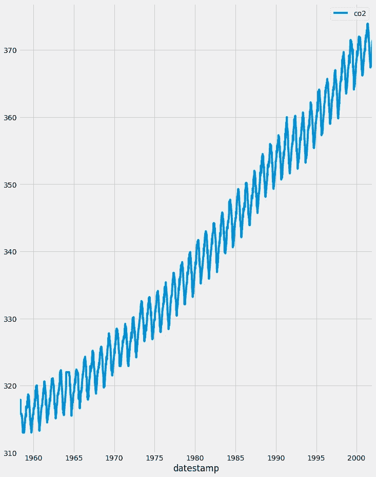

二氧化碳水平时间序列显示上升趋势。

一般来说，大多数时间序列可以分解成三个主要部分。第一个是**季节性**，描述你的时间序列中的周期信号。第二个组件是**趋势**，它描述了时间序列是随时间减少、保持不变还是增加。最后，第三个成分是**噪声**，它描述了你的时间序列无法解释的方差和波动性。让我们来看一些例子，以便更好地理解这三个组件。

为了分解你的时间信号，我们还将使用 **statsmodel** 库的 **tsa** 子模块。 **sm.tsa.dot 季节性分解()**函数可用于应用现成的时间序列分解。让我们将它应用于二氧化碳水平数据。

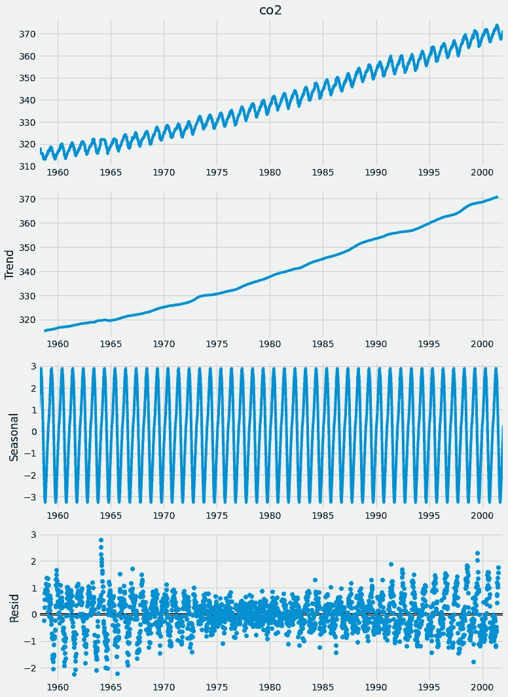

二氧化碳水平数据的组成部分。

提取每个单独的组件并绘制它们是很容易的。正如您在这里看到的，您可以使用 **dir()** 命令打印与之前生成的分解变量相关联的属性，并使用 **decomposition.seasonal** 命令打印季节性组件。

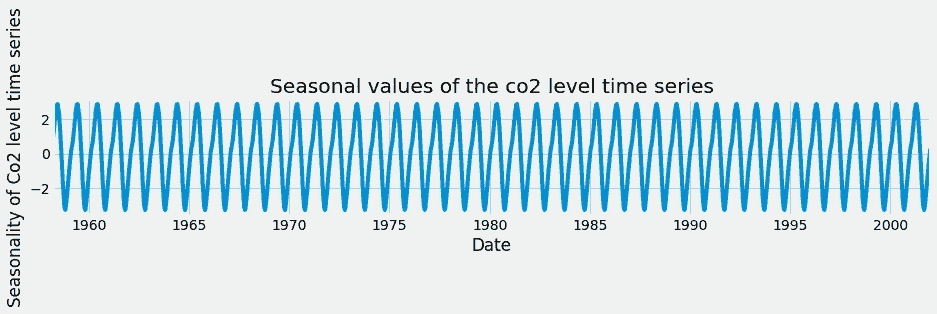

co2 水平时间序列的季节性成分。

当时间序列受季节性因素影响时，就存在季节性模式。季节性应该总是一个固定的、已知的时期。例如，一天中的温度应该显示出明显的每日季节性，因为白天总是比晚上暖和。或者，它也可以显示每月的季节性，因为夏天总是比冬天暖和。

让我们重复同样的练习，但是这次提取时间序列分解的趋势值。趋势部分反映了时间序列的整体进展，可以使用分解**提取。趋势**命令。

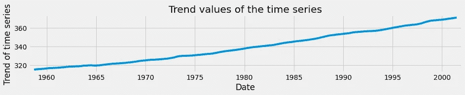

二氧化碳水平时间序列的趋势成分。

最后，您还可以提取噪声，或时间序列的剩余部分，如下所示。

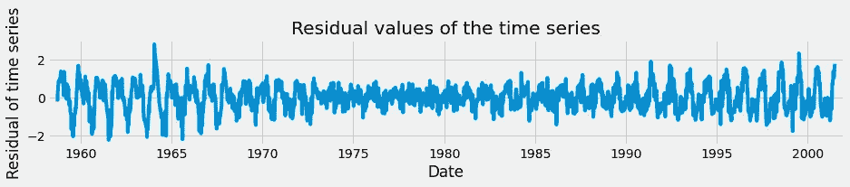

二氧化碳水平时间序列的剩余成分。

残差部分描述了随机的、不规则的影响，这些影响既不能归因于趋势，也不能归因于季节性。

## 3.3.分析航空公司数据

您将通过著名的 [**航空公司数据集**](https://github.com/youssefHosni/Time-Series-With-Python/tree/main/Time%20Series%20Data%20Visualization) 磨练您的技能，该数据集由 1949 年 1 月至 1960 年 12 月的航空公司乘客月度总数组成。它包含 144 个数据点，通常用作时间序列分析的标准数据集。**处理这类数据会让你为处理现实世界中可能遇到的任何数据做好准备！**

让我们首先加载数据，并用下面的代码绘制每月航空乘客的数量:

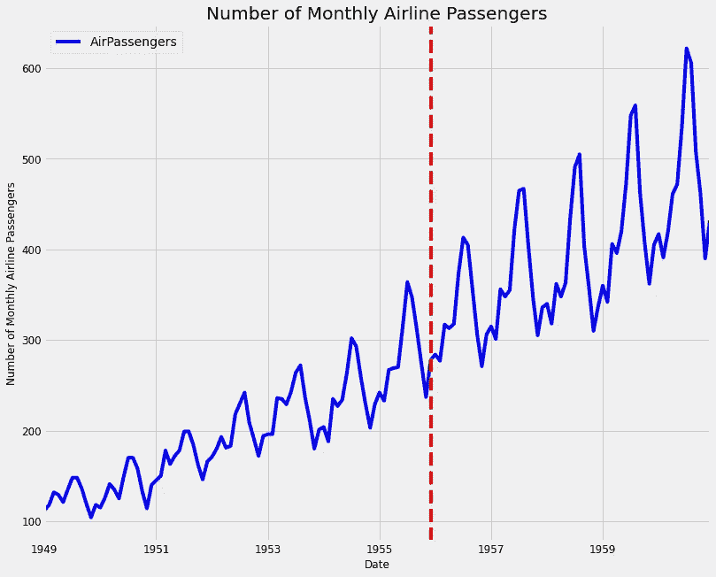

每月航空乘客的数量。

然后，我们将通过打印数据摘要和缺失值的数量来绘制时间序列摘要，然后绘制时间序列数据的箱线图。

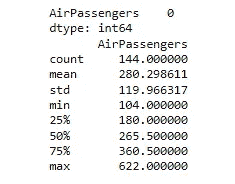

航空旅客时间序列综述。

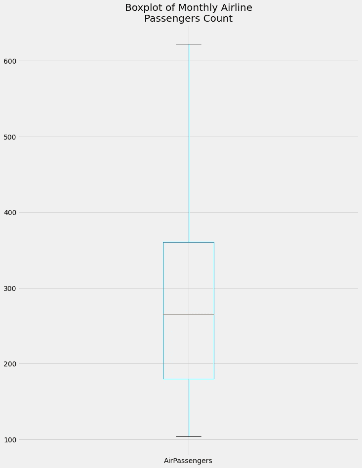

航空乘客时间序列的箱线图。

从箱线图中，我们可以得到以下信息。每月航空乘客的最大值为 600 多人，最小值为 100 人左右。数据中没有异常值。数据的中位数约为 270，第 75 百分位约为 360，第 25 百分位约为 180。

让我们创建并绘制航空公司乘客数据的月度汇总。

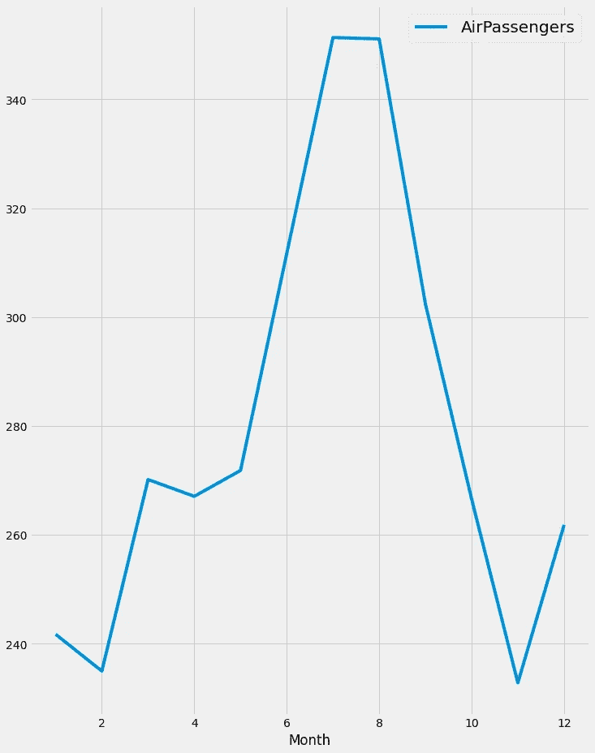

航空公司乘客数据的每月汇总。

显而易见，7 月和 8 月的航空乘客数量有所上升，这是合理的，因为这一时期有假期。

最后，我们将分解时间序列，并在数据中绘制趋势和季节性。

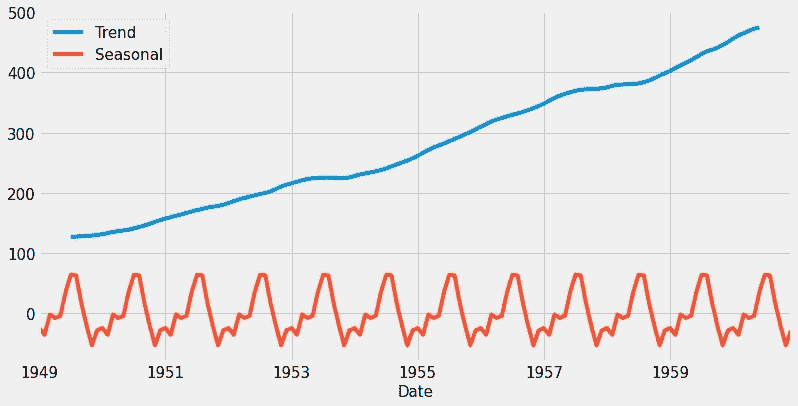

乘客数量时间序列的趋势和季节性。

趋势表明，从 1949 年到 1959 年，乘客的数量在增加，这是合理的，因为飞机的数量本身也在增加。数据中也存在季节性，如月度汇总图所示。

# 4.可视化多个时间序列。

在数据科学领域，参与需要同时研究多个时间序列的项目是很常见的。在本节中，我们将向您展示如何一次绘制多个时间序列，以及如何发现和描述多个时间序列之间的关系。在本节中，我们将使用一个新的数据集，该数据集包含 1944 年至 2012 年间美国生产的不同类型的肉类。数据集可以从 [**这里**](https://github.com/youssefHosni/Time-Series-With-Python/tree/main/Time%20Series%20Data%20Visualization) 下载。

## 4.1 处理多个时间序列

在数据科学领域，您经常会遇到包含多个时间序列的数据集。例如，我们可以测量 CPU 服务器在一段时间内的性能，在另一种情况下，我们可以探索不同公司在一段时间内的股票表现。这些情况引入了许多不同的问题，因此需要额外的分析工具和可视化技术。

pandas 的一个方便之处在于，处理多个时间序列与处理单个时间序列非常相似。就像前面几节一样，您可以快速利用**。plot()** 和**。描述()**可视化和生成数据统计摘要的方法。

1944 年至 2012 年间，美国生产了不同类型肉类的体积线图。

绘制多个时间序列的另一个有趣方法是使用面积图。面积图通常在处理多个时间序列时使用，可以用来表示累计总数。有了熊猫库，你可以简单地利用**。area()** 方法如本幻灯片所示产生一个面积图。

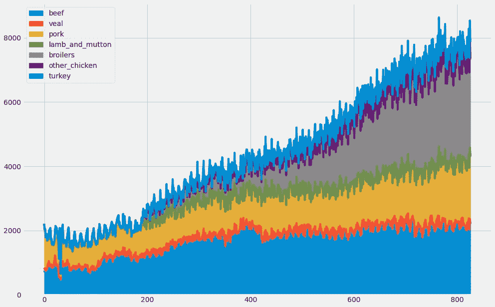

4 美国在 1944 年至 2012 年间生产的不同类型肉类的体积面积图。

## 4.2.绘制多个时间序列

在绘制多个时间序列时，matplotlib 将遍历其默认的颜色方案，直到 DataFrame 中的所有列都绘制完毕。因此，默认颜色的重复可能会导致难以区分某些时间序列。例如，由于肉类数据集中有七个时间序列，因此一些时间序列被分配相同的蓝色。此外，matplotlib 不考虑背景的颜色，这也是一个问题。

为了补救这一点，**。plot()** 方法有一个名为 colormap 的附加参数。此参数允许您分配具有不同对比度和强度的大范围调色板。您可以定义自己的 matplotlib 色彩映射表，也可以使用与 Matplotlib 注册的色彩映射表相匹配的字符串。在这个例子中，我们使用**暗 2** 调色板。

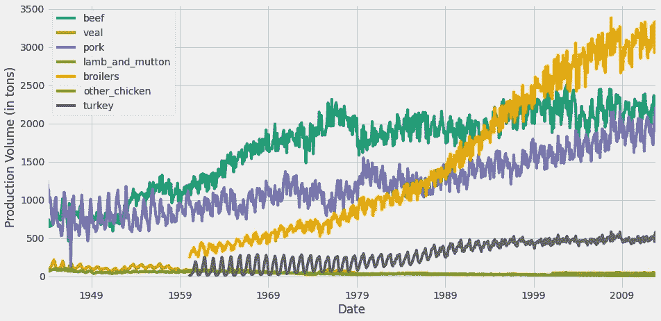

1944 年至 2012 年间，美国生产的不同种类肉类的体积线图采用了 **Dark2** 调色板。

为演示文稿制作幻灯片或与利益相关者共享图表时，在一个图表上同时显示时间序列图表和数字摘要会更方便您自己和他人。为此，首先绘制数据帧的列，并将 matplotlib AxesSubplot 对象返回到变量 ax。然后，您可以将 pandas 中的任何表格信息作为数据帧或数据系列传递给 ax 对象。这里，我们通过使用**获得数据帧的汇总统计数据。describe()** 方法，然后用 ax dot table 命令将此内容作为表格传递。

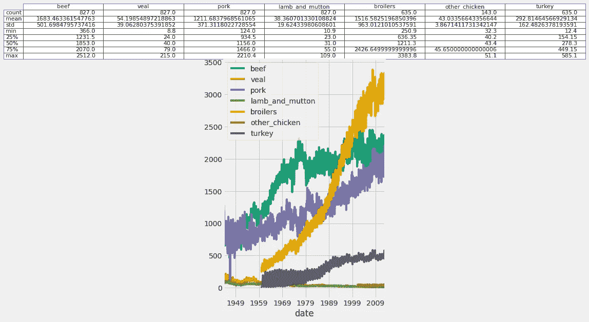

为了克服可视化包含不同比例时间序列的数据集的问题，您可以利用 subplots 参数，它将在不同的 subplot 上绘制数据帧的每一列。此外，可以使用 layout 关键字指定子情节的布局，该关键字接受两个整数来指定要使用的行数和列数。确保子情节的总数大于或等于数据帧中时间序列的数量是很重要的。您还可以使用 **sharex** 和 **sharey** 参数指定每个子图是否应该共享它们的 x 轴和 y 轴的值。最后，您需要使用 **figsize** 参数指定图的总大小(将包含所有子图)。

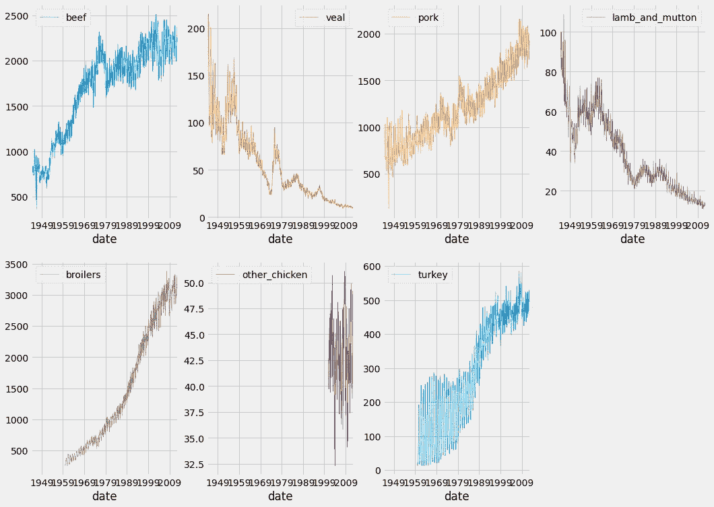

## 4.3.可视化多个时间序列之间的关系

评估一组时间序列之间的相似性的最广泛使用的方法之一是使用相关系数。相关系数是用于确定两个变量之间关系的强度或缺乏程度的度量。计算相关系数的标准方法是使用皮尔逊系数，**,当您认为感兴趣的变量之间的关系是线性时，应该使用该系数。**否则，当您感兴趣的变量之间的关系被认为是非线性时，您可以**使用 Kendall Tau 或 Spearman 等级系数方法。**在 Python 中，通过使用 **scipy.stats.stats** 模块中的 **pearsonr** 、 **spearmanr、**或 **kendalltau** 函数，可以快速计算两个变量之间的相关系数。所有这三种相关性度量都返回两个变量 x 和 y 之间的相关性和 p 值。

如果你想同时调查多个变量之间的相关性，你需要计算一个相关矩阵。结果是一个包含每对变量之间相关系数的表格。相关系数可以取-1 到 1 之间的任何值。相关性为 0 表示无相关性，而 1 和-1 表示强正相关和负相关。

熊猫图书馆有一个**。corr()** 允许您测量数据帧中所有列对之间的相关性的方法。使用肉类数据集，我们选择了牛肉、小牛肉和火鸡列，并调用了**。corr()** 通过调用 Pearson 和 spearman 方法。结果是相关矩阵，存储为两个新的熊猫数据帧，称为 corr_p 和 corr_s。

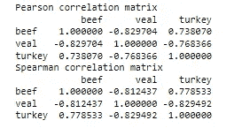

一旦将相关矩阵存储在新的数据帧中，可视化它可能会比试图一次解释几个相关系数更容易。为了实现这一点，我们将引入 Seaborn 库，它将用于生成我们的关联矩阵的热图。

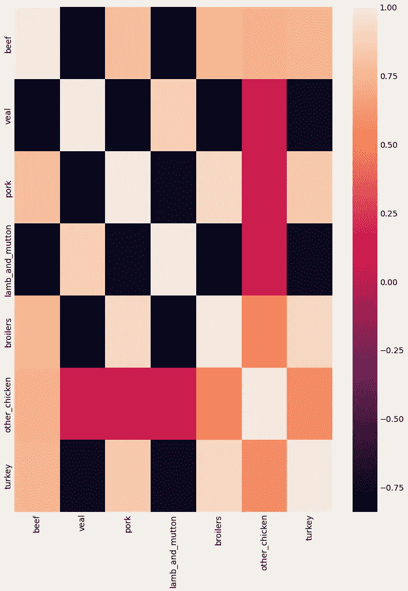

肉类数据集相关矩阵的热图。

热图是可视化相关矩阵的有用工具，但缺乏顺序会使其难以阅读，甚至难以识别哪组时间序列最相似。因此，建议利用**。seaborn 库中的 clustermap()** 函数，该函数将层次聚类应用于您的关联矩阵，以绘制一个排序的热图，其中相似的时间序列被放置在彼此更靠近的位置。

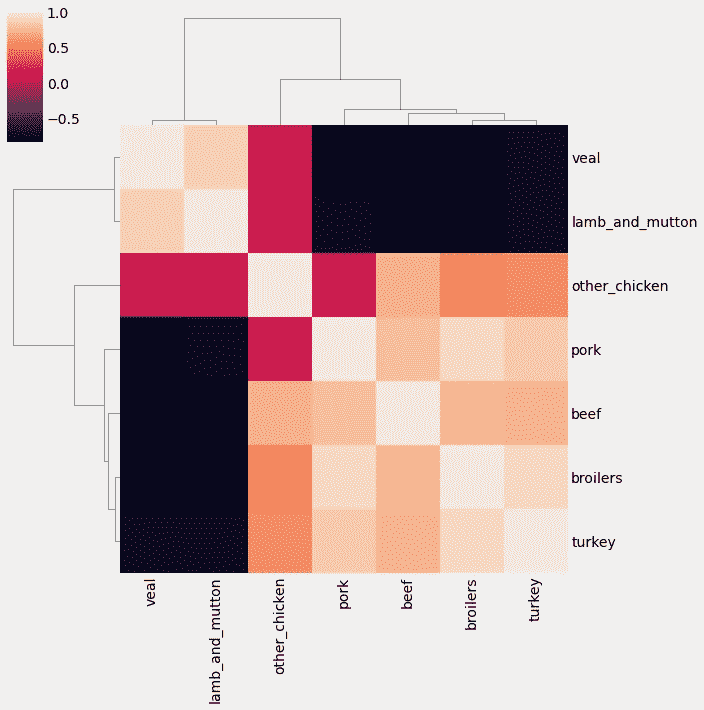

# 5.案例研究:失业率

在这一部分，我们将练习课程中涉及的所有概念。我们将把美国从 2000 年到 2010 年的**失业率形象化。就业数据集包含 16 个行业的时间序列，共 122 个时间点，每个月一个，持续 10 年。**

## **5.1.探索数据**

**数据探索的第一步是打印汇总统计数据，并使用箱线图绘制数据汇总。**

**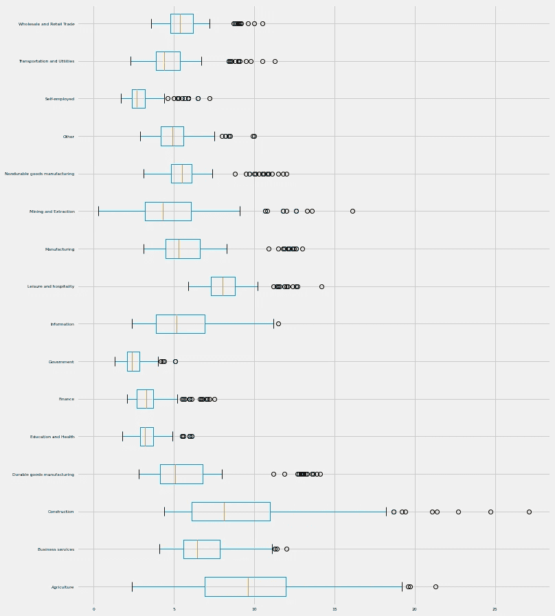**

**失业数据的箱线图。**

**我们也可以在一个面图中为每个特征绘制一个线图，如下所示:**

**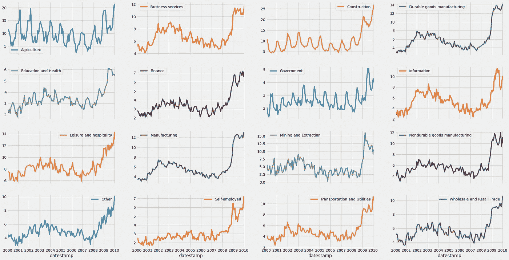**

**失业数据集的分面图。**

**如你所见，2008 年金融危机后，美国的失业率飙升。看到所有行业都受到影响，令人印象深刻！由于 2008 年似乎是美国失业率开始上升的一年，让我们用熟悉的**轴线**符号用垂直线来标注我们的曲线图。**

**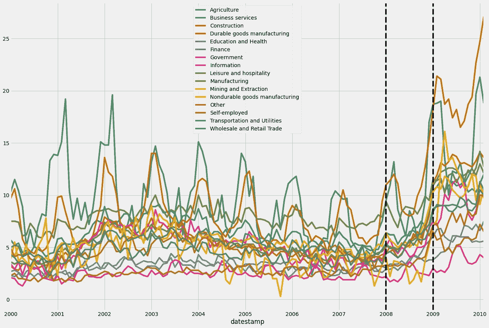**

**失业数据的折线图**

**我们还可以计算和绘制每个工作部门的月平均或日平均失业率，如第 2 节所示。**

**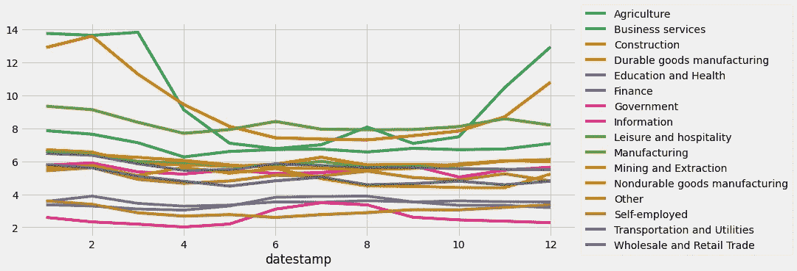**

**每个工作部门的月平均失业率。**

**由此产生的情节显示了一些有趣的模式！例如，农业和建筑业的失业率在冬季会出现明显的高峰，这与这些行业在寒冷的月份会不太活跃的观点是一致的！**

## **5.2.时序数据中的季节性、趋势和噪声**

**在前面的小节中，我们从 jobs 数据集中的一些时间序列中提取了有趣的模式和季节性。在第 3 节中，引入了时间序列分解的概念，它允许我们自动提取时间序列的季节性、趋势和噪声。**

**在下面的代码中，我们将从初始化 my_dict 字典并提取 jobs 数据集的列名开始。**

**然后，我们将使用一个“for”循环来遍历 df 的列，并应用 statsmodels 库中的季节性分解()函数，该函数存储在 my_dict 中。然后，我们将提取趋势分量，并将其存储在新的数据帧中，然后绘制它。**

**现在让我们画出这三个组成部分。首先是工作数据集的季节性部分:**

**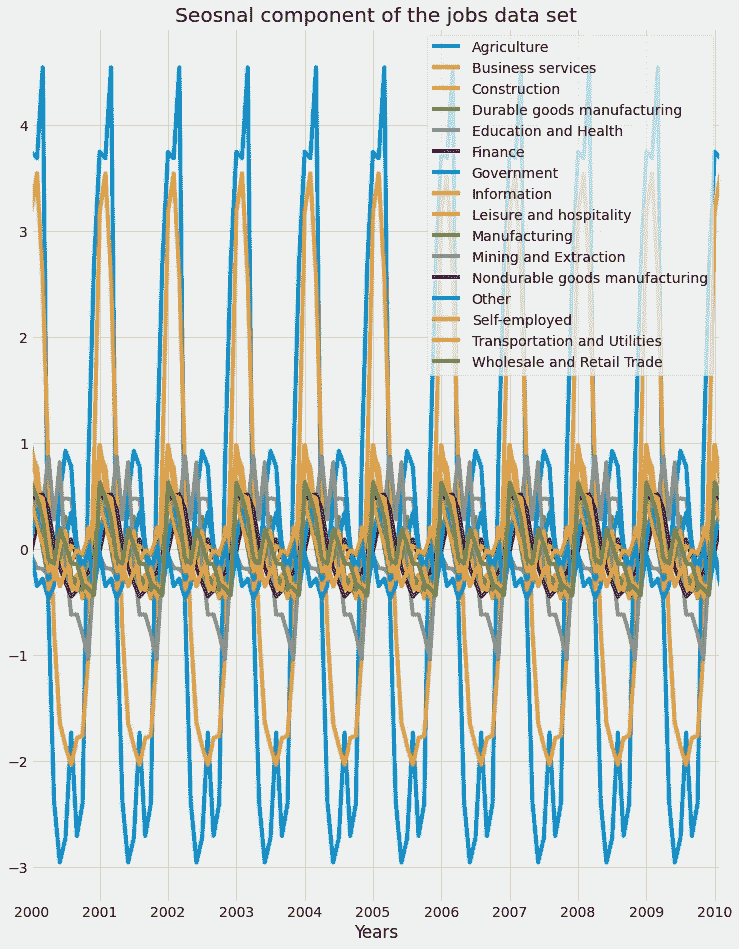**

**我们可以看到，某些行业比其他行业更受季节性的影响，因为我们看到农业和建筑业在冬季较冷的几个月里失业率上升。接下来，绘制作业数据集的趋势部分:**

**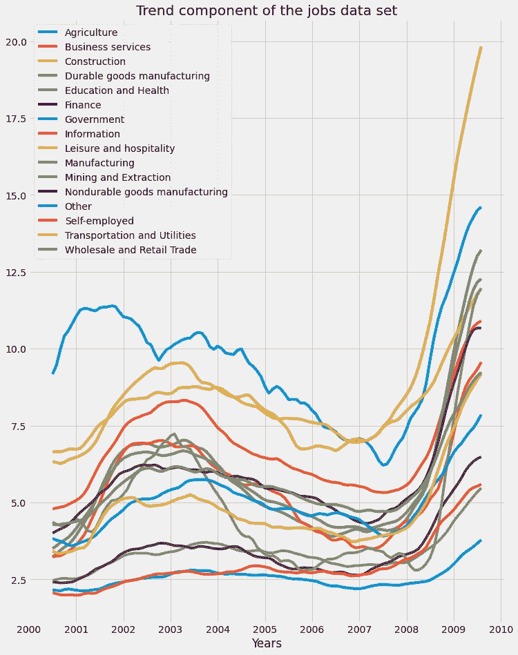**

**我们可以看到 2008 年的金融危机是如何导致所有行业的失业率上升的。最后，绘制了作业数据集的剩余部分:**

**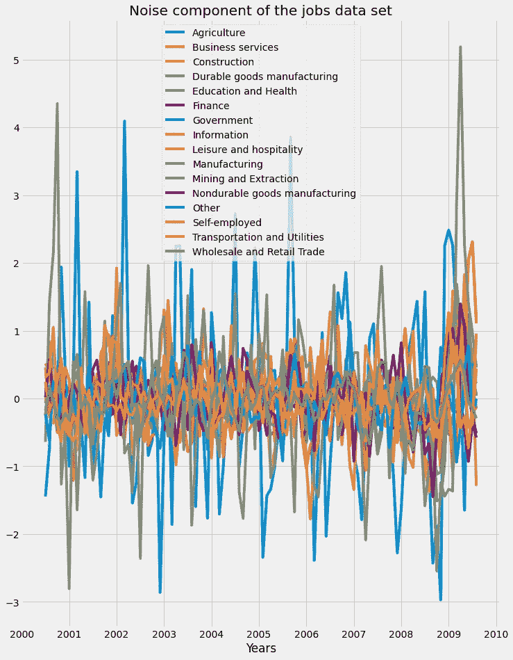**

## **5.3.计算作业数据集时间序列之间的相关性**

**首先，使用 spearman 方法计算 trend_df 数据帧中所有列之间的相关性，并将结果赋给名为 trend_corr 的新变量。然后，使用 seaborn 库中的 clustermap 函数生成相关性矩阵 trend_corr 的 **clustermap()** 。第 3 行和第 4 行指定 y 轴标签的旋转角度为 0，x 轴标签的旋转角度为 90。**

**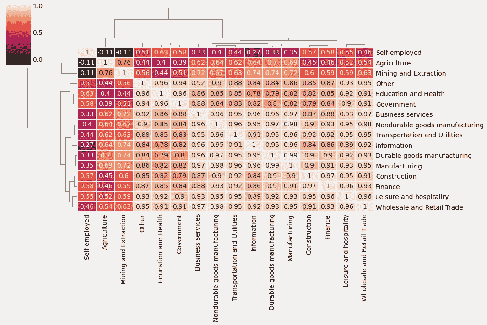**

# **参考**

**[1].[https://app . data camp . com/learn/courses/visualizing-time-series-data-in-python](https://app.datacamp.com/learn/courses/visualizing-time-series-data-in-python)**

** [## 加入我的介绍链接媒体-优素福胡斯尼

### 阅读 Youssef Hosni(以及媒体上成千上万的其他作家)的每一个故事。您的会员费直接支持…

youssefraafat57.medium.com](https://youssefraafat57.medium.com/membership) 

*感谢阅读！如果你喜欢这篇文章，一定要鼓掌(高达 50！)并在*[*LinkedIn*](https://www.linkedin.com/in/youssef-hosni-b2960b135/)*上与我联系，并在*[*Medium*](https://youssefraafat57.medium.com/)*上关注我的新文章。***