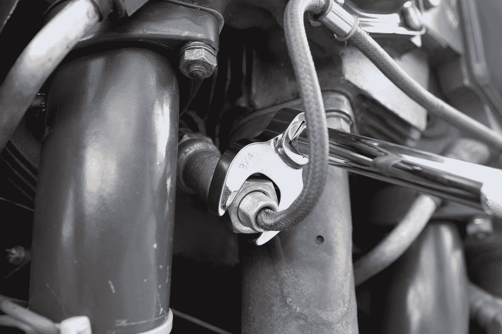
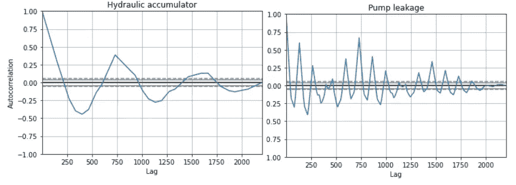
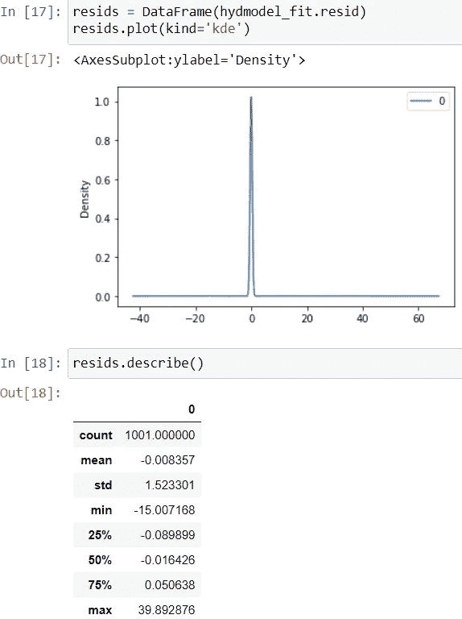
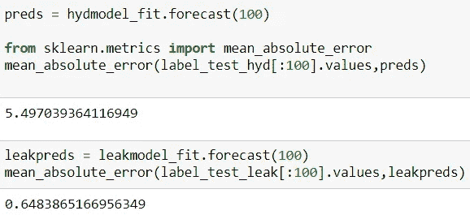
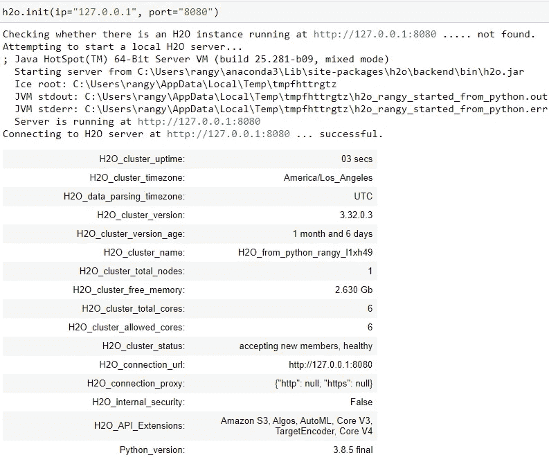
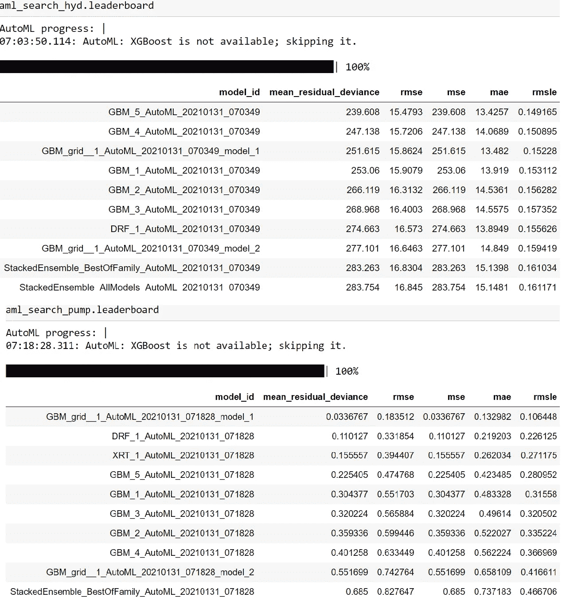
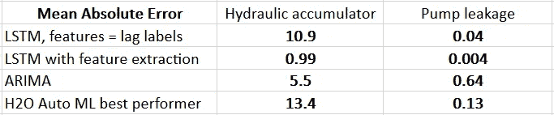

# 时间序列预测—构建和部署模型，续

> 原文：<https://pub.towardsai.net/time-series-forecasting-building-and-deploying-models-continued-deee0588b28c?source=collection_archive---------4----------------------->

## [自动化机器学习](https://towardsai.net/p/category/automl)

## 第 2/2 部分:使用 ARIMA 和 AutoML 预测液压油试验台的状况。



由[泰克顿](https://unsplash.com/@tekton_tools?utm_source=medium&utm_medium=referral)在 [Unsplash](https://unsplash.com?utm_source=medium&utm_medium=referral) 上拍摄

在我之前的文章的后续文章[中，我继续使用 UCI ML 知识库的液压系统](https://medium.com/towards-artificial-intelligence/time-series-forecasting-building-and-deploying-models-f647c2ec7567)[数据集](https://archive.ics.uci.edu/ml/datasets/Condition+monitoring+of+hydraulic+systems)进行时间序列预测。在这篇文章中，我使用了 ARIMA 和 Auto ML——所有这些都磨练了我的技能，因为我在工作中开始了一个使用带有时间戳的数据的项目。

我计划使用 Azure ML 时间序列预测，但是访问问题迫使我使用 H2O 的 Auto ML 功能。

零件 1 和零件 2 的 GitHub repo 代码在这里是。

请参考第 1 部分(上面的链接)了解数据和业务案例的背景。在实现了 ARIMA 和自动 ML 之后，我将比较两种方法的性能。与第一篇文章一样，我将重点关注高效的应用程序，并谈到优化机会。

# ARIMA

自回归积分移动平均依赖于我对三个超参数(p，d，q)的设置值。它们连续确定用于预测的滞后观测值的数量，是否需要微分来保持序列平稳(即季节性/趋势的影响)，以及是否应该应用移动平均来校正历史观测值中检测到的误差。我在下面记录了我的选择和想法，但是还有优化这些选择的空间。

设置 p、d 和 q 的第一步是制作和分析自相关图，显示数值之间随时间的相关性。例如，下图告诉我，在最初的 250 个循环中，液压累积读数与近 220 个循环相关；我知道这一点，因为 y 轴只有在 200 左右才开始接近 0。*所以*我设 p = 200。



图 1:自相关图

我从第一篇文章中选取了下面的图 2，因为从中我了解到大多数目标标签数据没有明显的上升或下降趋势。因此，至少对于两个感兴趣的标签，我设置 d = 0。对于 cooler_condition，我会设置 d = 1 或 2。


图 2:标签数据的趋势

现在我对使用移动平均线来调整 ARIMA 模型不感兴趣，所以我将设置 q = 0。

由于 ARIMA 只关注标签，我将使用下面的代码来导入标签数据，并将标签分成训练和测试数据。然后，我用上面得到的设置将训练数据拟合到 ARIMA 模型中。

```
*# Import label data from profile.txt file in UCI repository  and name columns*label = pd.read_csv(".hyddata\\profile.txt",delim_whitespace=True,header=None)
label.columns = ['cooler_condition', 'valve_condition', 'pump_leak', 'hydraulic_accumulator', 'stable_flag']*# Split label into training, then import and fit ARIMA model*label_train, label_test = label.loc[:1000,:], label.loc[1001:,:]from statsmodels.tsa.arima.model import ARIMAhydmodel = ARIMA(label_train['hydraulic_accumulator'],order=(100,0,0))
hydmodel_fit = hydmodel.fit()
```

绘制残差(实际值小于预测值)表明预测中没有偏差，即残差中的非零均值。统计数据证实了这一点。



图 3:ARIMA 预测的剩余误差

检查测试装置上的预测误差显示液压累积的平均绝对误差为 5.5，泵泄漏的平均绝对误差为 0.65。



图 4:ARIMA 平均绝对误差

# 自动 ML

我选择 H2O 的 AutoML 是因为它简单有效。他们的[文档](http://docs.h2o.ai/h2o/latest-stable/h2o-docs/automl.html#:~:text=The%20H2O%20AutoML%20interface%20is%20designed%20to%20have,limit%20on%20the%20number%20of%20total%20models%20trained.)提供了一个熟悉这个包的简单通道。

下面我正在导入 h2O.ai 包，并在一个开放端口初始化一个实例。

```
%pip install h2o
import h2o
from h2o.automl import H2OAutoMLh2o.init(ip="127.0.0.1", port="8080")
```

在确认了运行的实例之后——参见下面的图 5——我使用 tsfresh 的 extract_features 来派生标签，以供给 AutoML 模型。既然 [part 1](https://medium.com/towards-artificial-intelligence/time-series-forecasting-building-and-deploying-models-f647c2ec7567) 深究了这个话题，我就不在这里讨论了。



图 5:工作中的 AutoML

提取特征后，我把它们和标签结合起来，分成训练/测试两部分。H2O 模型输入需要创建特定的 H2Oframe 格式，之后我声明了因变量和自变量。

```
*# Creating combined dataframe of labels and features, then splitting into training and testing sets.*combined_extracted = extracted_features.join(label)
combined_extracted.reset_index(inplace=True)train_extracted = combined_extracted.iloc[:1100,:]
test_extracted = combined_extracted.iloc[1101:,:]*# Below: creating H2Oframes for use in modeling*hf_train_extracted = h2o.H2OFrame(train_extracted)
hf_test_extracted = h2o.H2OFrame(test_extracted)*# Below: declare independent (X) and dependent (y) variables*y = 'hydraulic_accumulator'
X = hf_train_extracted.columns
X.remove(y)
```

现在是时候拟合 H2O 汽车模型，训练它，然后在测试集上评估各种模型的性能。以下是泵泄漏和液压积聚的代码:

```
aml_search_hyd = H2OAutoML(max_runtime_secs = 600)aml_search_hyd.train(x = X, 
          y = y,
          training_frame = hf_train_extracted,
          leaderboard_frame = hf_test_extracted)aml_search_hyd.leaderboard# *Code above declares and fits H2O Auto ML model on training set, and asks for a leaderboard of top performers using test set.**# Repeating earlier process below, but now for pump leakage as dependent variable.*yleak = 'pump_leak'aml_search_pump = H2OAutoML(max_runtime_secs = 600)aml_search_pump.train(x = X, 
          y = yleak,
          training_frame = hf_train_extracted,
          leaderboard_frame = hf_test_extracted)aml_search_pump.leaderboard
```

排行榜(如下图 6 所示)使用测试集，通过使用在训练集上训练的模型的多个指标来评估绩效。有一个*优化机会来降低 max_runtime_secs 超参数，因为模型没有超时。*



图 6: H2O.ai Auto ML 排行榜

# 结论

为了准备我的项目，我提高了对时间序列分析和预测概念的认识。此外，我还开发和部署了一些工具来帮助重工业规划和预测液压系统状况，而无需过多的测试。客户可以利用现有工具可靠预测系统状况的知识，建立规模化运营。

各种方法进展如何？看起来 LSTM 的特征提取非常有效，但是通过调整超参数，Auto ML 还有一定的改进空间。

