# 时间序列预测—构建和部署模型

> 原文：<https://pub.towardsai.net/time-series-forecasting-building-and-deploying-models-f647c2ec7567?source=collection_archive---------0----------------------->

## [数据可视化](https://towardsai.net/p/category/data-visualization)，[机器学习](https://towardsai.net/p/category/machine-learning)

## 使用集成学习和神经网络预测液压油试验台随时间的状态。第 1 / 2 部分


由[泰克顿](https://unsplash.com/@tekton_tools?utm_source=medium&utm_medium=referral)在 [Unsplash](https://unsplash.com?utm_source=medium&utm_medium=referral) 上拍摄

**TL/DR:我使用各种工具构建模型来预测液压钻机条件，这些工具包括:tsfresh、集成学习和递归神经网络(RNNs)。模型通过使用 HTML 接口的 Flask 进行部署。**

作为一个对机器学习在能源行业的应用感兴趣的人——参见我的其他[帖子](https://medium.com/@rangys3)——我很关注时间序列预测。在炼油厂和石化厂通过庞大的传感器网络收集的数据通常有数据历史学家提供的时间戳，许多分析将受益于考虑时间。

当我在我的公司内计划一个使用时间戳数据的机器学习应用程序时，我想首先使用一个公开可用的数据集来磨练我的技能。我将使用来自 UCI 机器学习库[的液压系统数据集](https://archive.ics.uci.edu/ml/datasets/Condition+monitoring+of+hydraulic+systems)。

因为我的目的是练习各种技术，所以我将简单地讲述优化模型性能的进一步步骤，也不会重复对多个标签的分析。我还注意到，在处理没有预先打包成方便的 csv 文件的数据时，需要根据没有时间组件的数据集的不同方法进行特征工程/选择。

本文的第二部分也是最后一部分将探索 AzureML 的预测工具和 ARIMA。

我的方法在这个链接目录中有所概述——链接打开了一个新窗口

1.  **定义业务问题**
2.  **数据审核**
3.  [**加载数据**](#e2cc)
4.  [**特征工程**](#45dd) —与#5 和#6 相互影响
5.  [**特征选择**](#10f3) —与#4 和#6 相互作用
6.  [**开发和评估模型**](#6456) —与#4 和#5 相互作用
7.  [**部署车型**](#1987)
8.  [**业务总结及要点**](#d095)

这里是配套的 GitHub [回购](https://github.com/Ranga2904/Hydraulics)。

# **定义业务问题**

液压试验台实验通过在实验室环境中模拟工业条件，深入了解机油性能和机械条件。通过进行这种模拟，我们了解了石油是否是允许安全和可持续操作的合适候选物，以及在大规模工业设置中会发生什么。

通过预测系统性能的关键指标，我们将让工业客户相信，他们可以计划和预测比实验室试验具有更大安全和财务影响的大规模操作。

# **数据审核**

该存储库包含 16 个文本文件，每个文件代表来自不同传感器的测量压力、温度、流量、振动和冷却效率的数据。温度传感器文件示例见下图 1。

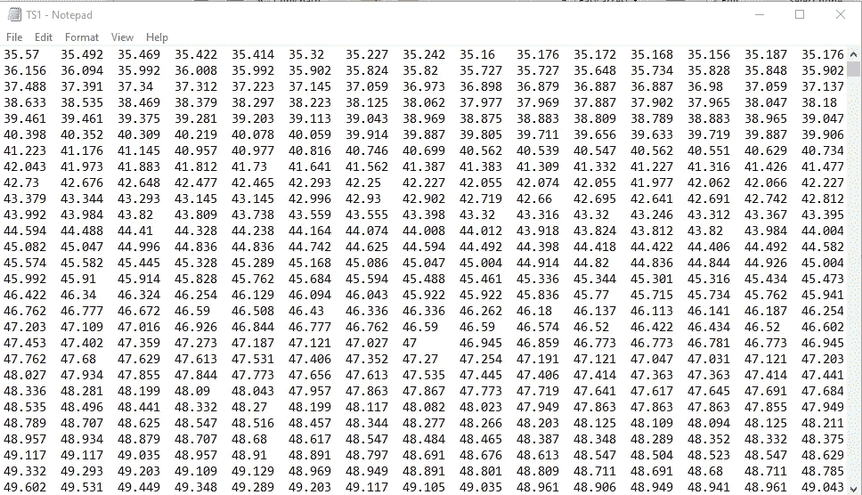

图 1:温度传感器(TS) 1

有 6 个压力传感器、4 个温度传感器、1 个电机功率传感器、2 个体积流量传感器、2 个测量冷却效率和功率的传感器和 1 个测量一般效率的传感器。

每个文本文件有 2205 个实例，即行和 60 列，因为传感器每分钟捕获数据。

一个文本文件包含标签，即我们试图预测的目标。这些是对液压累积、钻机稳定性、阀门/冷却器状况和内部泵泄漏的测量。下面的图 2 是这样一个文本文件的快照。

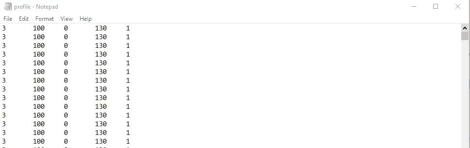

图 2:标签

我在现实世界的项目中没有遇到的 UCI ML 知识库的一个奢侈之处是他们礼貌地通知我，我没有丢失数据。

# **加载数据**

没有经过策划的 csv 文件来应用 Pandas 库的 *read_csv* 方法，我需要一种不同的方法。我可以分别打开每个文件，然后读取每个文件中的每一行

```
import numpy as np
import pandas as pdcooleff = [] 
ce = open('CE.txt','r') *# Read in a new file*
for line in ce:
    cooleff.append(line.split()) *# Read in each line of opened file, while separating each line.*cooleff = np.reshape(cooleff,(2205,60)) *# Reshape the array*
cooleffDF = pd.DataFrame(cooleff)       *# Convert array to dataframe*
```

这是最好的不雅，在最坏的情况下，减慢了我的模型。因此，我将使用 Python 的 *glob 模块*首先创建一个需要导入的文本文件列表，然后遍历这些文件。然后我会用熊猫 *read_csv* :

```
import numpy as np
import pandas as pd
import globlocn = ".Downloads\\hyddata\\*.txt" # *find all the text files in the path* 
files = glob.glob(locn) # *Compile list of aforementioned text files*
features = {} *# use a dictionary to save all the variables*for file in files:
    df = pd.read_csv(open(file),delim_whitespace=True,header=None)
```


图 3:特性的数据框架

稍后，我们将把 df 的内容附加到一个单独的文件中，并标记数据。然而，我首先想后退一步，考虑一下我对这个问题的策略，因为它影响了我如何对待这些特性。

在考虑我的方法之前，让我们快速导入标签数据。

```
label = pd.read_csv (".Downloads \\hyddata\\ profile.txt", delim_whitespace=True, header=None)
label.columns = ['cooler_condition', 'valve_condition', 'pump_leak', 'hydraulic_accumulator', 'stable_flag']
```

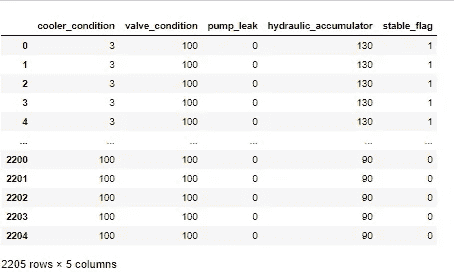

图 4:标签的数据框架

现在来评估我方法:下面的图 5 是解决方案策略的流程图。

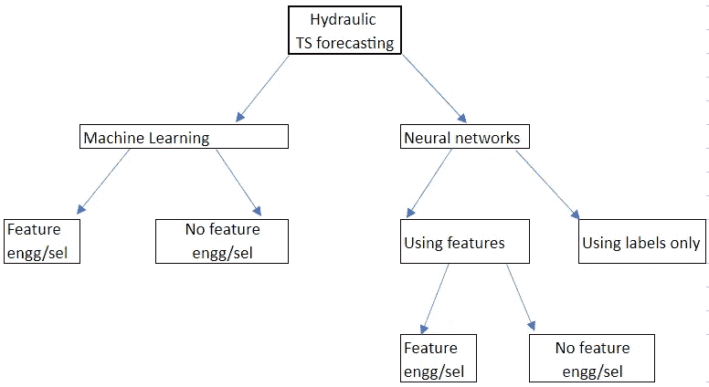

图 5:一系列方法

我将再次使用多种多样的策略来最大化我的学习。

仅贝尔:我可以直接去**开发和评估一个模型**。这种方法使用以前时间段的标签来预测未来的标签——这是一种合理的方法，我在下面生成的子图显示了目标指标在周期中表现出一致的模式。

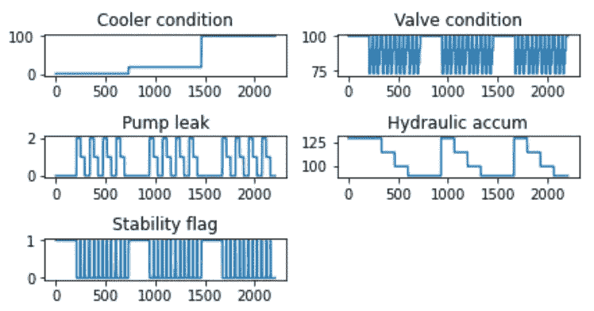

图 6:标签的趋势

我将使用长短期记忆(LSTM)模型，这是一种递归神经网络(这些解释了序列值之间的依赖性)。要用 Keras 实现这一点，我首先需要将时间序列转换成适合监督学习的数据集。

我将使用 *series_to_supervised()* 函数，该函数创建一个数据帧，其中先前的值构成了相同值的未来预测的特征集。这个功能是由杰森·布朗利的机器学习大师提供的。

我将使用这种方法来预测液压蓄能器标签。

```
univar = series_to_supervised(label[['hydraulic_accumulator']],n_in=2,n_out=1)*# Creating a dataframe above for use in a supervised learning problem. 2 columns will have 2 preceding values in the sequence while the last column features value at that time i.e. the label*univar = univar.valuestrain,test = univar[:1201,:], univar[1202:,:]*# Creating training and testing sets, by simply splitting the data.**# Final step below splits training and testing sets into features and labels. Remember that only the last column features labels i.e. the y.*xtrain,ytrain = train[:,0:2],train[:,-1]
xtest,ytest = test[:,0:2],test[:,-1]
```

这是之前和之后:如你所见，我现在在底部有 3 列——其中 2 列显示之前的值。

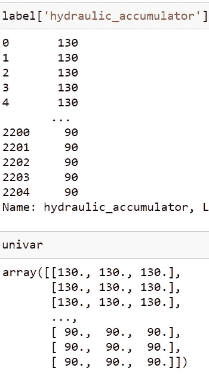

图 7:从系列到监督

LSTMs 要求要素输入为 3-D:因此下面的代码将 xtrain 和 xtest 整形为具有相同的行数，即 xtrain 为 1201，时间步长数(1)和要素数(2)。

```
xtrain = xtrain.reshape((xtrain.shape[0], 1, xtrain.shape[1]))
xtest = xtest.reshape((xtest.shape[0], 1, xtest.shape[1]))
```

我现在可以使用 Keras 及其顺序类来创建分层模型。对于 LSTM 层，我选择了 60 个单位，并坚持使用默认的 tanh 激活函数**——这两个都是优化的机会，也是:**用于训练模型的时期数和批量大小。

```
%pip install keras
%pip install tensorflow
import tensorflow
import keras
from keras.models import Sequential
from keras.layers import Activation, Dense, LSTMmodel = Sequential()
model.add(LSTM(60, input_shape=(xtrain.shape[1], xtrain.shape[2])))
model.add(Dense(1))
model.compile(loss='mae', optimizer='adam')*# I've used mean absolute error as a performance metric for the LSTM and the Adam optimizer, to minimize this error.*# *Fit the model*
history = model.fit(xtrain, ytrain, epochs=50, batch_size=20, validation_data=(xtest, ytest), verbose=0, shuffle=False)*# Above: fitting the model above with pre-prepared test and validation data. Below is a plot the results of my fitting and validation.*from matplotlib import pyplot
pyplot.plot(history.history['loss'], label='train')
pyplot.plot(history.history['val_loss'], label='test')
pyplot.legend()
pyplot.show()
```

本文不会深入探讨选择超参数值的细节。我在下面观察到，模型的性能在 50 个时期的训练中得到改善，最终误差约为 10%(误差为 10.95/ytest 的平均值)

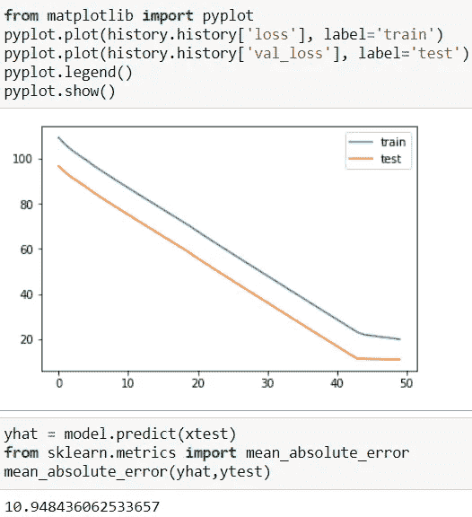

图 8:液压蓄能器的 LSTM，无特征

这是稳定性标志的趋势——一个分类标签——和泵泄漏，根据 UCI 知识库文档，这是一个很难预测的指标。后者的误差为 0.04 /泵泄漏平均值或 6%。

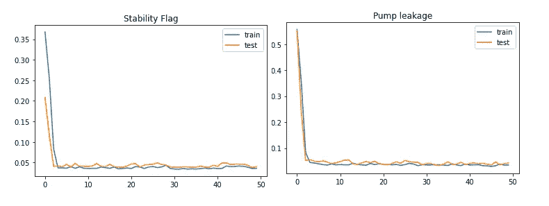

图 9:稳定性标志和泵泄漏的 LSTM，无其他特征

# **特征工程**

F 特性使用*配合特性工程*:能提高性能吗？要回答这个问题，让我们首先了解时间序列的特征工程侧重于提取关于趋势的信息。供我们使用的现成 python 包的一个例子是 tsfresh，它的 [extract_features](https://tsfresh.readthedocs.io/en/latest/api/tsfresh.feature_extraction.html#module-tsfresh.feature_extraction.extraction) 函数计算一组综合的[特性](https://tsfresh.readthedocs.io/en/latest/text/list_of_features.html)。该函数要求数据帧具有明确指定的 id 号列，每个时间序列一个 id 号。另一列排序数字将帮助我们组织每个系列中的时间戳。

然而，上面的图 3 并不是这样排序的。即使我将所有特征收集到一个数据框架中，它仍然需要修改。继续图 3 中产生输出的代码片段…

```
df.index.name="cycle"
df_T = df.T *# Transpose*
df_T.index.name="time"
df_T.reset_index(inplace=True)*# Setting indices name for all rows and columns*string = ' cycle'.join(str(e) for e in list(temp_df_transposed.columns))
            temp_df_transposed.columns = string.split(" ")

*# Adjusting the names of columns to add prefix of "cycle". This prefix acts as a stub to guide the reorientation of the dataframe when using the pandas method wide_to_long below.*temp_df_long = pd.wide_to_long(temp_df_transposed.iloc[1:,:],stubnames='cycle', i=['time'], j='c')temp_df_long.reset_index(inplace=True)
```

也许理解宽到长应用程序的影响的最好方法是查看之前和之后。如下图 9 所示，时间和周期在不同轴上的 60x2206 矩阵变成了两个变量在同一轴上的矩阵。现在，一列中的值总数为 60*2206— 60(索引)= 132，300。

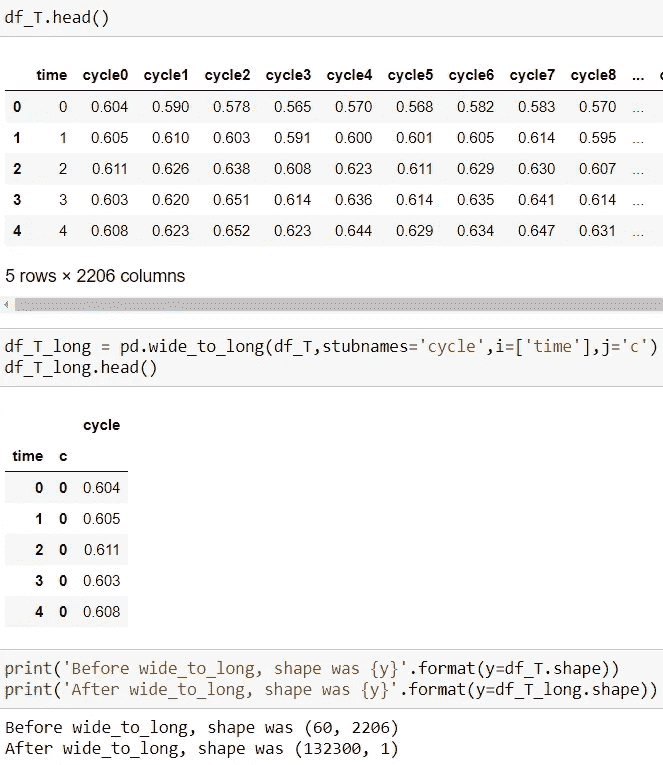

图 10:宽到长的影响

这些长数据帧中的每一个都被读入一个名为“特征”的新字典，然后需要切换回数据帧格式。

```
features[name[9:-4]] = temp_df_long
for key in list(features.keys()):
    features[key].columns=['seconds','cycle',key]dfs= [features['...\\features\\CP'],
      features['..features\\CE'],
 .....
     features['rangy\\Downloads\\Hydraulics-main\\features\\VS1']]from functools import reduce
features_join = reduce(lambda left,right: pd.merge(left,right,on=['seconds','cycle']), dfs)
features_join.head()
```

上面的最后一段代码使用 Python 的 reduce 函数对创建的 dfs 进行合并，最终得到一个标识每个时间序列的列和另一个对每个序列进行排序的列。前者是“周期”，后者是“秒”，如下图 10 所示。

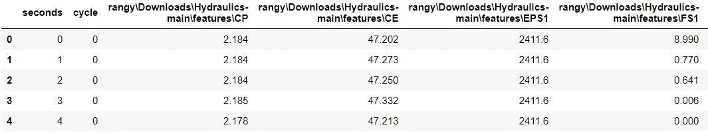

图 11:用于提取特征的数据帧

现在，我们可以使用 tsfresh 的 extract_features 方法来生成一个数据帧，它是特征工程的结果，可用于建模。有关该数据帧的快照，请参见图 12。

```
%pip install tsfresh
from tsfresh import extract_features*# Automatic feature extraction using the tsfresh package*extracted_features = extract_features(features_join, column_id = "cycle", column_sort="seconds")impute(extracted_features)
```

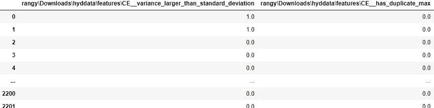

图 12:具有特征工程的时间序列数据框架

以下是使用 tsfresh 的特征工程产生的统计测量类型的概念:

```
extracted_features.columnsIndex(['.\features\CE__variance_larger_than_standard_deviation',
       '.\features\CE__has_duplicate_max',
       '.\features\CE__has_duplicate_min',
       ...
       '.\features\CE__mean_abs_change',
       '.\features\CE__mean_change',
       '.\features\CE__mean_second_derivative_central',
       '.\features\CE__median',
       ...
       '.\features\VS1__fourier_entropy__bins_2',
       '.\hyddata\features\VS1__fourier_entropy__bins_3',
       '.\features\VS1__fourier_entropy__bins_100',
       '.\features\VS1__permutation_entropy__dimension_3__tau_1',
       ...
       '.\features\VS1__permutation_entropy__dimension_7__tau_1'] 
      dtype='object', length=13243)
```

与只使用标签的方法相比，使用 tsfresh 的特征工程是否提供了明显的改进？首先，我必须建立类似于上述方法的 Keras 模型——只是现在，x 代表我们提取的特征，而不是时间序列中前面的两个条目。

请参见下面图 13 中的模型训练和测试性能。

# 开发和评估模型

```
quadvar_y = label['hydraulic_accumulator']
quadvar_x = extracted_features.valuesxtrain_quad,ytrain_quad = quadvar_x[:1201,:], quadvar_y[:1201,]
xtest_quad,ytest_quad = quadvar_x[1202:,:],quadvar_y[1202:,]xtrain_quad = xtrain_quad.reshape((xtrain_quad.shape[0], 1, xtrain_quad.shape[1]))
xtest_quad = xtest_quad.reshape((xtest_quad.shape[0], 1, xtest_quad.shape[1]))quadmodel = Sequential()
quadmodel.add(LSTM(60, input_shape=(xtrain_quad.shape[1], xtrain_quad.shape[2])))
quadmodel.add(Dense(5))
quadmodel.add(Dense(1))
quadmodel.compile(loss='mae', optimizer='adam')*# Fit the model*quadhistory = quadmodel.fit(xtrain_quad, ytrain_quad, epochs=50, batch_size=20, validation_data=(xtest_quad, ytest_quad), verbose=0, shuffle=False)
```

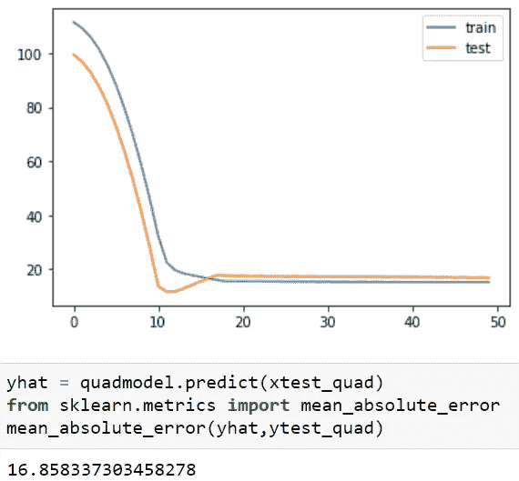

图 13:液压蓄能器的 LSTM，带有特征

使用所有的特性并没有明显的好处，也许使用部分特性会带来一些好处。此外，我们似乎可以通过更少的培训获得最佳成绩——这一点很重要，继续努力。

# 特征选择

我现在要做另一个步骤，并使用集成学习评估它的好处——我下面提到的性能也应该在 LSTM 中观察。

这一步是使用 tsfresh 的 *select_features* 函数找到给定目标的相关特性。有用的[文档](https://tsfresh.readthedocs.io/en/latest/api/tsfresh.feature_selection.html)详细说明了如何选择与所选目标/标签相关的特征。

```
from tsfresh import select_featuresglobal features_filtered_accum
features_filtered_accum = select_features(extracted_features, label['hydraulic_accumulator'])global features_filtered_leak
features_filtered_leak = select_features(extracted_features, label['pump_leak'])
```

对于所选的特征，我接下来使用交叉验证来评估集成算法在预测液压累积和泵泄漏方面的影响。现在我使用提取和选择的特征。

```
import xgboost
from xgboost import XGBClassifier, XGBRegressorxgr = XGBRegressor()
xgc = XGBClassifier()features_filtered_accum = features_filtered_accum.valueslabel['hydraulic_accumulator'] = label['hydraulic_accumulator'].valuesfeatures_filtered_leak = features_filtered_leak.values
label['pump_leak'] = label['pump_leak']from sklearn.model_selection import KFold, cross_validate
cv = KFold(n_splits=7,shuffle=True)cross_validate(xgr,features_filtered_accum,label['hydraulic_accumulator'],cv=cv,scoring='neg_mean_absolute_error')cross_validate(xgr,features_filtered_leak,label['pump_leak'],cv=cv,scoring='neg_mean_absolute_error')
```

# 开发和评估模型

提取的特征取得了显著的改进——以下的平均绝对误差(test_score)比 LSTM 在没有特征选择的情况下获得的误差低几个数量级！

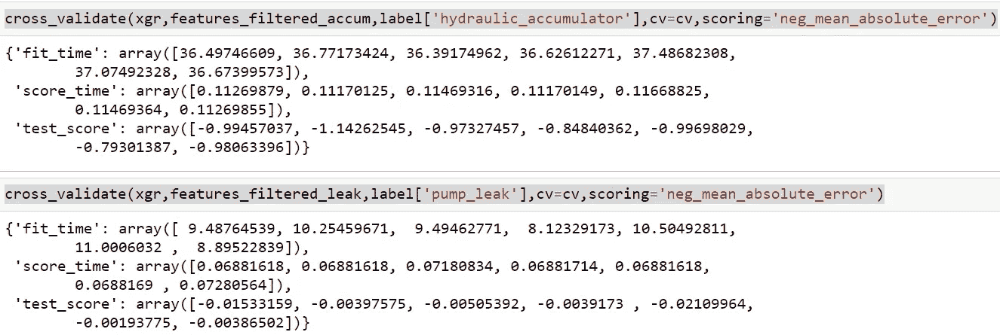

图 14:具有特征工程和特征选择的集成学习

# 部署模型

咨询 tsfresh 的[资源](https://tsfresh.readthedocs.io/en/latest/text/sklearn_transformers.html)关于创建一个 scikit-learn 管道的功能给了我这一步所必需的洞察力。

以下代码为两个不同的标签(液压蓄能器和稳定性标志)创建 scikit-learn 管道，然后将管道转储到保存的模型中。

```
from tsfresh.transformers import RelevantFeatureAugmenter
from sklearn.pipeline import Pipelinepipeline_flag = Pipeline([('augmenter', RelevantFeatureAugmenter (column_id="cycle", column_sort="seconds")), ('xgc' , XGBClassifier())])pipeline_accum = Pipeline([('augmenter', RelevantFeatureAugmenter (column_id="cycle", column_sort="seconds")), ('xgr', XGBRegressor())])y_stable_flag = label['stable_flag']
y_hydraulic_accumulator = label['hydraulic_accumulator']
X = pd.DataFrame(index = y_stable_flag.index)pipeline_flag.set_params(augmenter__timeseries_container=features_join)
pipeline_accum.set_params(augmenter__timeseries_container=features_join)pipeline_flag.fit(X,y_stable_flag)
pipeline_accum.fit(X,y_hydraulic_accumulator)import pickle
pickle.dump(pipeline_accum,open('pipeline_accum.pkl','wb'))
pickle.dump(pipeline_flag,open('pipeline_flag.pkl','wb'))
```

我的模型现在已保存，我可以开始部署了。现在，我将坚持只在我的计算机上使用 Flask 进行本地部署——下面的文本介绍了高级步骤，并且有许多好的资源可以进行更深入的介绍。

1.  为用户建立一个输入时间戳的界面，用于预测稳定性标志和水力累积。见下面的 HTML 代码——我是为了功能，所以有机会让事情看起来更好。

我下面的*#评论*是为了读者的利益，不是 HTML 脚本的一部分。这个脚本之后的图 15 是用户看到的快照。

```
<html><body><h3>Prediction of Stability Flag and Hydraulic Accumulation </h3>
*# Comment: this is the title of the webpage.*<div><form action="/predict" method="POST"><label for="timstmp">Cycle number</label>
*# Comment: this is the label and variable that users will be asked to enter*<input type="number" step="1" id="timstmp" name="timstmp">
*# Comment: this is the actual box into which a user enters the above variable.*<br><input type="submit" value="Submit">
*# Comment: creating a submit button so the user can run the query.*</form></div></body></html>
```

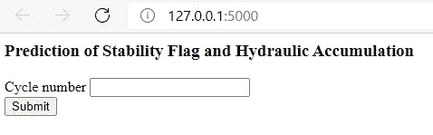

图 15:hyindex.html

2.建立一个界面，为用户提供机器学习模型的结果。在这种情况下，简单地显示预测。

```
<!doctype html><html><body><h1> {{ prediction_text}}</h1></body></html>
```

如果我在索引页面中输入一个特定的周期，当我点击“提交”时，这里是结果——再次声明，我在这篇文章中的目的不是美观，只是功能。

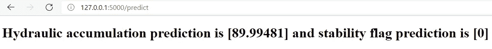

图 16:hypredict.html

提交按钮是如何让我从一个页面转到另一个页面的？通过使用:

3.编写一个脚本，用 pickle 加载保存的模型，然后通过 hyindex 页面指定输入。加载的模型使用输入进行预测，这些预测将返回到 hypredict 页面。再次声明，我下面的*#评论*是为了读者的利益，并不是 HTML 脚本的一部分。

```
import pandas as pd, numpy as np
import pickle
import flask
from flask import Flask, request, jsonify, render_templateapp = Flask(__name__) *#Creating instance of Flask class for web app*
[@app](http://twitter.com/app).route('/')
def Hm():
    return render_template('hyindex.html')*#Code above routes any user from localhost:5000 to the hyindex.html webpage through the Hm() function.*model_accum = pickle.load(open('pipeline_accum.pkl','rb'))
model_flag = pickle.load(open('pipeline_flag.pkl','rb'))*# Loading models that were saved earlier.**# Code below reads the number specified in the request form, converts it into a dataframe for use in the saved model's predict method. The dataframe's index must be set as equal to the values for running the code.*[@app](http://twitter.com/app).route('/predict', methods=['POST'])
def predict():
    inputt = [int(x) for x in request.form.values()]
    xtest = np.array(inputt)
    xtest_df = pd.DataFrame(xtest)
    xtest_df.set_index(xtest,inplace=True)
    Xtest_df = pd.DataFrame(index = xtest_df.index) prediction_accum = model_accum.predict(Xtest_df)
    prediction_flag = model_flag.predict(Xtest_df)*#Having made my predictions above, I'll now send these over to hypredict with the variable name prediction_text.*

    return render_template('hypredict.html',prediction_text= 'Hydraulic accumulation prediction is ' + format(prediction_accum) + ' and stability flag prediction is ' + format(prediction_flag))*#Python assigns the name "_main_" to this script; hence below, we tell the app to run if this script is run.*if __name__ == "__main__": 
    app.run(debug=True)
```

因此，要实际运行这个部署的模型，我只需在终端上运行上面的脚本，如图 17 所示。我把上面的脚本叫做 *hyapp.py*

请注意，索引和预测 HTML 文件应该位于名为 templates 的文件夹中。

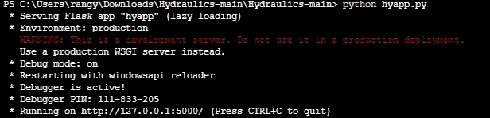

图 17:运行部署的模型

# **业务总结和要点**

通过开发和部署这种机器学习模型，工业设置可以使用各种油的实验数据来预测其液压系统的状况。这项工作可以帮助他们避免重复实验，也可以推动安全高效的大规模建设。

当我在使用时间序列预测的工作中处理这个新的风险时，这份复习提高了我的工具箱。

本系列的下一篇也是最后一篇文章将在这个问题中应用 ARIMA 和 AzureML。我欢迎任何评论。