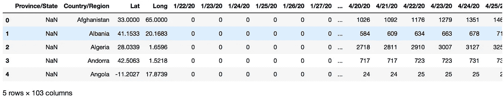
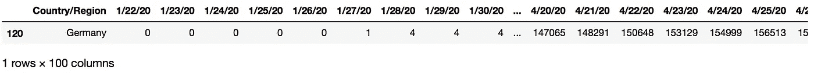
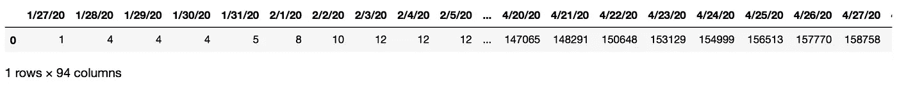
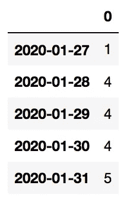
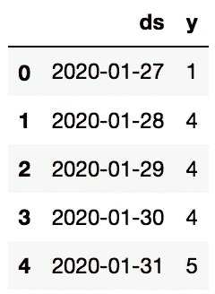
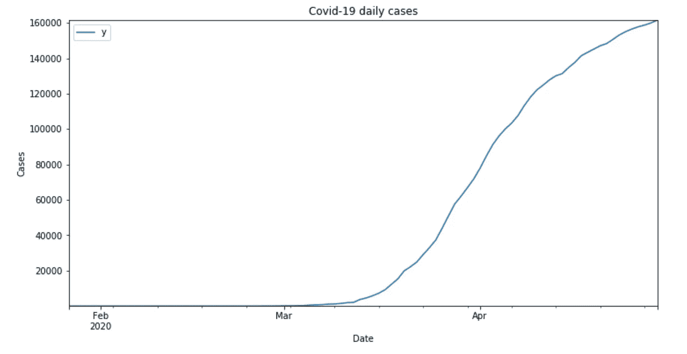
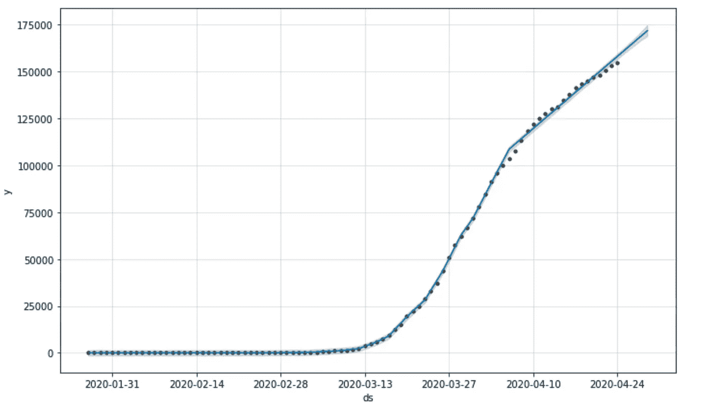
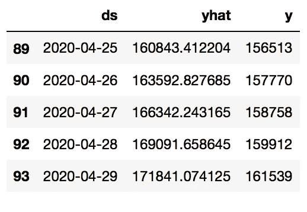

# 新冠肺炎时间序列预测

> 原文：<https://pub.towardsai.net/time-series-forecasting-for-covid-19-c638688d8835?source=collection_archive---------1----------------------->

## *使用来自约翰·霍普金斯大学中心的新冠肺炎数据对脸书先知进行时间序列预测的指南*

时间序列仅仅是一系列按固定时间间隔排列的数据点，其中时间通常是独立变量，目标是对未来进行预测。时间序列是一种常见的模式，在生活中有许多应用，例如股票价格、天气、销售。学习如何预测时间序列数据是数据科学领域的一项基本技能。

新型冠状病毒，又称新冠肺炎，是一种持续的疫情，自 2019 年 12 月以来在全球范围内广泛传播。使用时间序列预测来预测未来每天的新冠肺炎病例，无疑将有助于了解它的增长速度以及可能决定这种增长的因素。此外，它有助于了解物理距离或锁定等干预措施可能会随着时间的推移而影响增长。

Prophet 是由脸书的数据科学工程团队提供的一个库，它是一个用于分析和预测周期性数据的强大而简单的工具，可用于 Python 和 r

本文旨在解释如何使用来自约翰霍普金斯大学中心的新冠肺炎数据用 Prophet 进行时间序列预测。

# 工具

本文的环境设置使用 Python 3.7，并安装了以下包:

*   NumPy
*   熊猫
*   Matplotlib
*   FB 先知
*   sci kit-学习

# 加载数据集

本文中使用的数据由约翰霍普金斯大学中心提供。它每天从官方来源更新全球新报告的新冠肺炎病例。该数据集可在 https://github.com/CSSEGISandData/COVID-19[的 GitHub 仓库](https://github.com/CSSEGISandData/COVID-19)获得。

对于本文，我们将通过 URL 直接从存储库中访问原始 CSV 文件。首先，我们使用 Pandas 的 read_csv()方法加载数据，该方法将 csv 数据从 URL 加载到 DataFrame 中。然后，我们使用 head()显示前几行，以简要了解数据结构和组成。

数据是从 2020 年 1 月 22 日到我们访问它的日期。每行代表一个省(州)，各列代表国家、纬度、经度和每天的确诊病例数。国家按字母顺序排列，每个日期都有一列存储确诊病例总数。

> 将熊猫作为 pd
> %matplotlib 内联导入
> 
> #加载数据
> data _ URL = '[https://raw . githubusercontent . com/CSSEGISandData/新冠肺炎/master/csse _ covid _ 19 _ data/csse _ covid _ 19 _ time _ series/time _ series _ covid 19 _ confirmed _ global . CSV '](https://raw.githubusercontent.com/CSSEGISandData/COVID-19/master/csse_covid_19_data/csse_covid_19_time_series/time_series_covid19_confirmed_global.csv')
> df = PD . read _ CSV(data _ URL)
> df . head()

# 数据准备

下一步是准备和清理数据。首先，我们使用国家/地区列过滤数据，因为我们将按国家进行预测。loc[]通过传递一个包含过滤条件的布尔数组来访问一组行和列，在我们的例子中是 df[' Country/Region ']= ' Germany。'请注意，您可以在这一行中更改国家名称，以预测不同国家的结果。接下来，我们删除不需要的列，例如省/州、纬度和经度。

> #使用国家名称过滤
> df = df.loc[df['国家/地区'] = '德国']#在此更改国家名称
> 
> #删除未使用的列
> df.drop('省/州'，axis=1，inplace=True)
> df.drop('纬度'，axis=1，inplace=True)
> df.drop('长'，axis=1，inplace=True)
> df.head()

接下来，使用 group by 操作来组合使用 Country/Region 列的结果，即，一些国家的多个省/州可以有多个行。使用 sum 函数对每天的病例数求和。我们继续删除所有零值列(无案例)。然后，我们重置索引以删除未使用的国家列。

> #对同一国家的所有行进行分组
> df = df.groupby('国家/地区')。总和()
> 
> #删除零值
> df = df.loc[:，(df！= 0).任何(轴=0)]
> 
> #删除未使用的国家列
> df . reset _ index(in place = True)
> df . drop(' Country/Region '，axis=1，inplace=True)
> df.head()

我们将需要我们的数据框有一个时间序列值的一行。我们使用 transpose()函数将索引和列转置成所需的格式。此外，我们将日期列的数据类型转换为 Timestamp，而不是 string。

> #转置矩阵，为每个日期条目创建一行
> df = df.transpose()
> 
> #更改为日期时间
> d format = ' % m/% d/% y '
> df . index = PD。datetime index(PD . to _ datetime(df . index，format=dformat))
> df.head()

Prophet 模型要求数据框具有特定的列格式，我们将列的名称更改为“ds”和“y ”,以匹配所需的格式。我们使用 reset_index 来重置我们的索引。

> # prepare for Prophet
> df . reset _ index(in place = True)
> df . rename(columns = { ' index ':' ds '，0:'y'}，inplace=True)
> df.head()

# 数据可视化

现在，我们的数据已经按照要求的格式准备好了，我们使用 plot 函数绘制数据，日期显示在 x 轴上，案例数显示在 y 轴上。这一步的目的是更深入地理解数据。这有助于我们以后选择用于我们模型的超参数。下图显示，病例数量随着时间的推移急剧增加。

> #plot 跨时间的案例数
> ax = df.plot(x='ds '，y='y '，figsize=(12，6)，title= '新冠肺炎每日案例')
> ax.autoscale(axis='both '，tight = True)
> ax . set(xlabel = ' Date '，y label = ' Cases ')；

# 模特培训

接下来，我们将设置 Prophet 来开始建模我们的数据。我们导入所需的库。此外，我们将数据分为训练集和测试集。由于每次我们想要生成新的预测时，我们的模型都将被重新训练，因此我们将使用 95%用于训练，5%用于测试来评估模型结果。

> 从 fbprophet 导入 prophet
> 
> #将数据分成训练集和测试集
> train _ to _ index = round(len(df)* 0.95)
> train _ data = df . iloc[:train _ to _ index]
> test _ data = df . iloc[train _ to _ index:]
> 
> print('训练数据长度'，len(训练数据)，'测试数据长度'，len(测试数据))

我们创建了先知模型的一个实例。由于我们的数据图显示了指数趋势，即数据在一段时间内增长的一般趋势，我们将输入参数 seasonality _ mode 设置为“乘法”和“线性”因为我们的数据是基于每日频率的，所以我们设置 daily _ seasonality = True。调整参数 changepoint_prior_scale 将其设置为 0.5。接下来，我们在训练集上训练我们的模型。此外，可以基于数据集和问题域调整参数调整。

使用频率设置为“D”的“make_future_dataframe”生成一个包含未来日期的数据框，用于预测，因为我们的数据是每日数据。这些日期的长度被设置为与测试集的长度相同，因为我们将在稍后比较模型评估的结果。然后将数据帧传递给我们的模型，以预测这些日期的值。

> #创建模型并在训练集上训练
> model = Prophet(growth = ' linear '，
> 季节性 _ 模式= '乘法'，
> changepoint_prior_scale=0.5，
> weekly _ 季节性=False，
> daily _ 季节性= True)
> model . fit(train _ data)
> 
> #生成具有未来日期的数据帧，频率设置为每日
> future = model . make _ future _ data frame(periods = len(test _ data)，freq='D ')
> 
> #预测未来日期的值
> 预测=模型.预测(未来)

# 绘制模型结果

既然我们的模型已经训练好了，我们需要可视化结果。Prophet 有一个名为 plot 的绘图功能，可以绘制原始数据(黑点)、模型(蓝线)和预测误差(蓝色阴影区域)。

> #plot 模型结果
> m.plot(预测)；

# 模型评估

为了帮助我们了解预测的准确性，我们将时间序列的预测病例数与实际病例数进行了比较。为此，我们需要使用来自预测的“yhat”和来自数据的原始“y”值构建一个组合数据框架。

> #生成组合数据帧
> metric _ df = forecast . set _ index(' ds ')[[' yhat ']]。join(df.set_index('ds ')。y)。reset _ index()
> metric _ df . tail()

现在我们有了预测值和真实值的对比，我们使用 sci-kit-learn 中的 r2_score()来生成我们的 R 平方。决定系数(用 R2 表示)被解释为可从自变量预测的因变量方差的比例。

最好的可能得分是 1.0，因此 0.99 的值对于我们的模型来说是非常好的。

> 从 sklearn.metrics 导入 r2_score
> 
> r2_score(metric_df.y，metric_df.yhat)

此外，我们使用 scikit-learn 的 mean_squared_error()来评估我们的结果。均方误差(MSE)是所有(预测值-实际值)的平方和除以数据点数。MSE 是对估计量质量的一种度量。MSE 越小，我们就越接近找到最佳拟合线。我们的 MSE 值是 4455269，这是一个相当大的值，这意味着仍然有进一步改进的空间，可以对模型或更多数据使用超参数调整来获得更好的结果。

> 从 sklearn.metrics 导入均方误差
> 
> 均方误差(metric_df.y，metric_df.yhat)

# 预测未来日期

在前面的章节中，我们根据已经有的测试数据日期的预测来评估我们的模型。现在，我们需要构建一些未来日期来进行预测。为了预测这些未来数据，我们生成一个包含未来 10 天的数据框架，然后通过 Prophet 模型的“预测”功能运行它，并显示结果。

> #生成具有未来日期的数据帧，频率设置为每日
> future = m . make _ future _ data frame(periods = 10，freq = 'D ')
> 
> #预测未来日期的值
> forecast = m.predict(future)
> 
> #仅打印所需的列 ds、yhat、yhat_lower、yhat_upper
> 预测[['ds '、' yhat '、' yhat_lower '、' yhat_upper']]。尾巴(10)

# 结论

我们已经解释了如何使用来自约翰霍普金斯大学中心的冠状病毒(Covid19)数据用 Prophet 进行时间序列预测。我们经历了加载数据、为 Prophet 模型准备数据、绘制数据、训练模型、绘制模型结果、模型评估和预测未来日期。我们注意到，不可能对所有的预测问题都提出一个通用的方法，因为每个问题都有其自身的特点，需要特殊的步骤。然而，本文旨在给出一个关于时间序列预测的基本指南和理解，可以根据问题领域进一步修改。

# 参考资料和进一步阅读

[1][https://github.com/CSSEGISandData/COVID-19](https://github.com/CSSEGISandData/COVID-19)
【2】[https://facebook.github.io/prophet/docs/quick_start.html](https://facebook.github.io/prophet/docs/quick_start.html)
【3】[https://nextjournal.com/eric-brown/forecasting-with-prophet](https://nextjournal.com/eric-brown/forecasting-with-prophet)
【4】[https://next journal . com/Eric-brown/forecasting-with-prophet-part-4](https://nextjournal.com/eric-brown/forecasting-with-prophet-part-4)
【5】[https://towards data science . com/implementing-Facebook-prophet-efficient-c 241305405 a3](https://towardsdatascience.com/implementing-facebook-prophet-efficiently-c241305405a3)