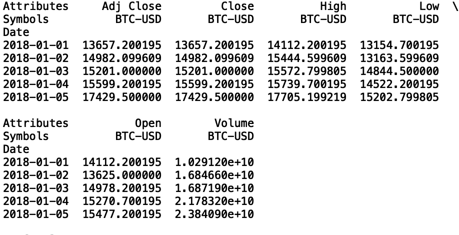
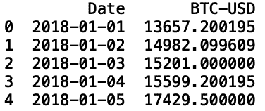
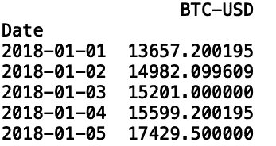
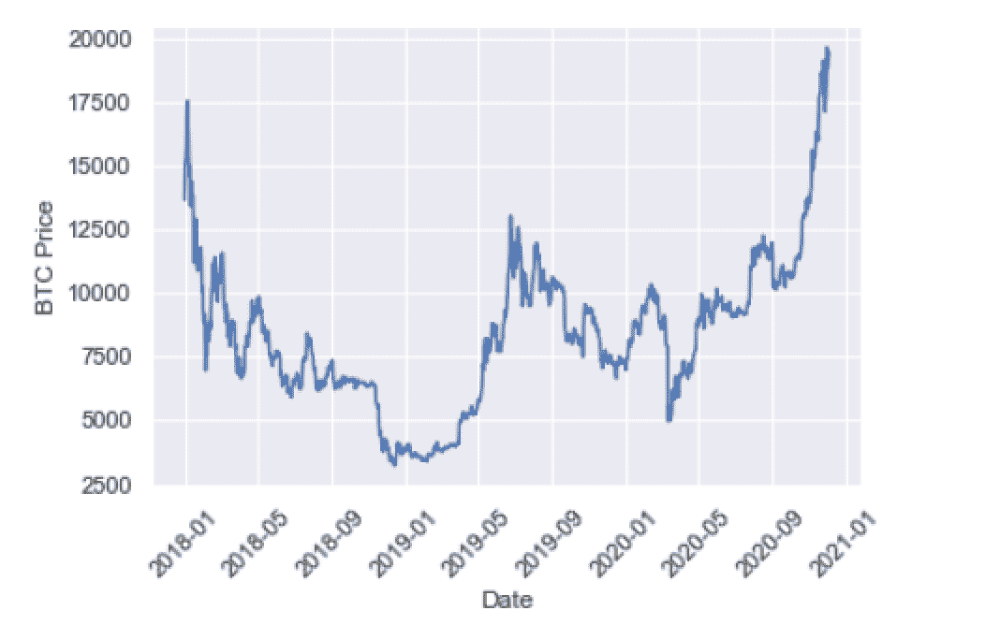
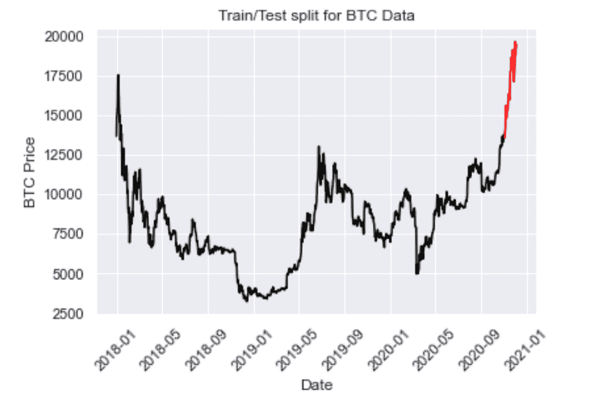
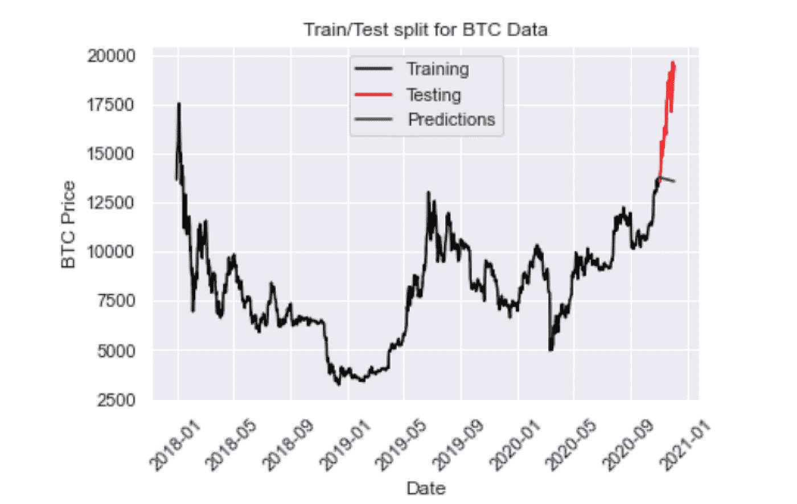
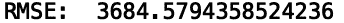
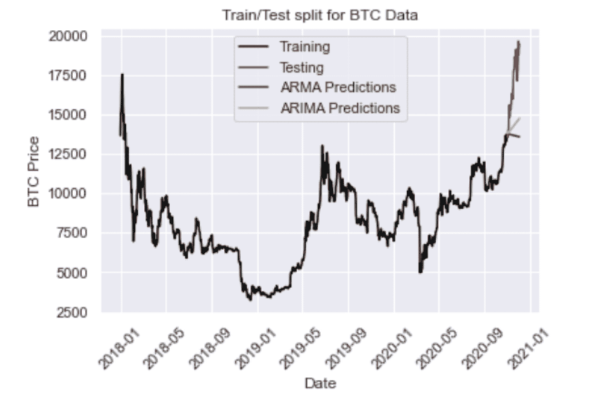
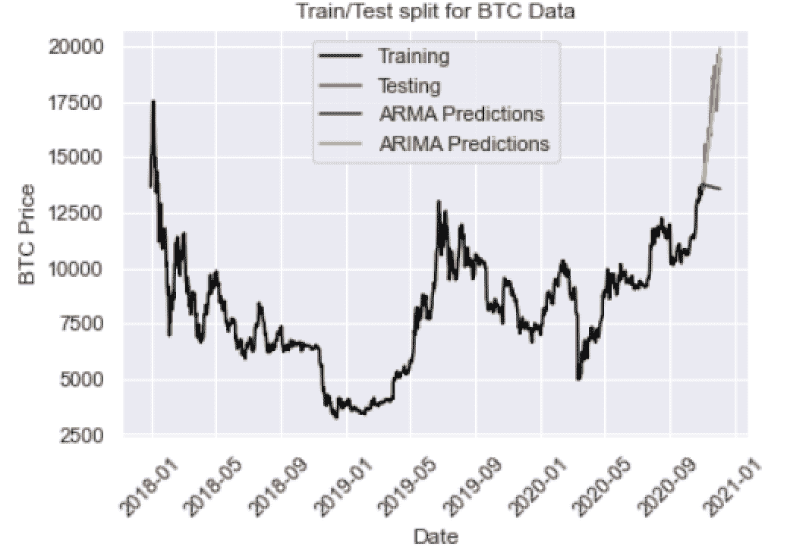
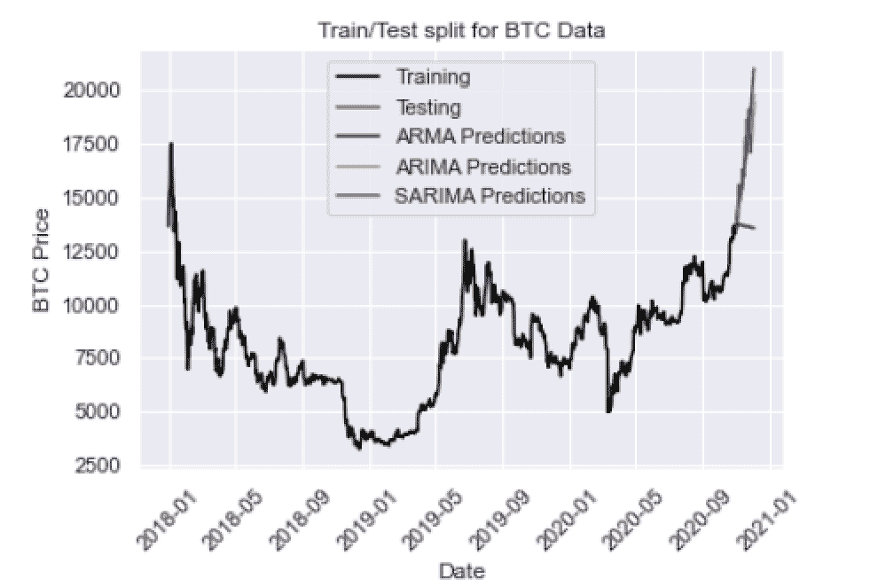

# Python 中的时间序列预测

> 原文：<https://pub.towardsai.net/time-series-forecasting-in-python-4e7d65580b9?source=collection_archive---------1----------------------->

## [数据科学](https://towardsai.net/p/category/data-science)

## Python 中的三种时间序列预测方法


照片由
T3【马体】米罗什尼琴科 T5 上[像素](https://www.pexels.com/photo/dawn-technology-time-watch-8327973/)

时间序列预测是根据历史数据预测未来值的任务。跨行业的例子包括天气预报、销售数据和股票价格。最近，它被应用于预测比特币和以太坊等加密货币的价格趋势。鉴于时间序列预测应用在各行各业的流行，每个数据科学家都应该对时间序列预测的可用方法有所了解。

时间序列预测有各种各样的方法。最常用的一种是自回归移动平均(ARMA)，这是一种利用过去值预测未来值的统计模型。然而，这种方法是有缺陷的，因为它没有捕捉到季节趋势。它还假设时间序列数据是稳定的，这意味着它的统计属性不会随时间而改变。这种类型的行为是一种理想化的假设，在实践中并不成立，这意味着 ARMA 可能会提供扭曲的结果。

ARMA 的一个扩展是自回归综合移动平均(ARIMA)模型，它不假设平稳性，但仍然假设数据很少或没有季节性。幸运的是，季节性 ARIMA (SARIMA)变量是一个统计模型，可以处理非平稳数据并捕捉一些季节性。

Python 提供了许多易于使用的库和工具来执行时间序列预测。具体来说，Python 中的 [stats](https://www.statsmodels.org/stable/index.html) 库提供了只需几行代码就可以构建 ARMA、ARIMA 和 SARIMA 模型的工具。由于所有这些模型都可以在一个库中获得，所以您可以在同一个脚本或笔记本中使用不同的模型轻松地运行许多实验。

在这里，我们将看看如何建立 ARMA、ARIMA 和萨里玛模型来预测比特币(BTC)的未来价格。

**读取和显示 BTC 时间序列数据**

我们将从使用熊猫数据阅读器读取 BTC 的历史价格开始。让我们在终端中使用简单的 pip 命令来安装它:

```
pip install pandas-datareader
```

让我们打开一个 Python 脚本，从 Pandas 库中导入数据阅读器:

```
import pandas_datareader.data as webimport datetime
```

让我们也导入 Pandas 库本身，并放宽列和行的显示限制:

```
import pandas as pdpd.set_option("display.max_columns", None)pd.set_option("display.max_rows", None)
```

我们现在可以导入日期时间库，这将允许我们定义数据拉取的开始和结束日期:

```
import datetime
```

现在我们已经拥有了获取比特币价格时间序列数据所需的一切。让我们从…获取数据

```
import pandas_datareader as webbtc = web.get_data_yahoo(["BTC-USD"], start=datetime.datetime(2018, 1, 1), end=datetime.datetime(2020, 12, 2))["Close"]print(btc.head())
```



作者图片

我们看到我们的数据框包含许多列。让我们看一下这些列的含义:

1.  Date:这是我们的时间序列中的索引，它指定了与价格相关的日期。
2.  收盘价格:当日购买 BTC 的最后价格。
3.  开盘价:当天购买 BTC 的第一个价格。
4.  高:当天购买 BTC 的最高价格。
5.  低:当天购买 BTC 的最低价格。
6.  成交量:当日总交易笔数。
7.  调整收盘价:根据股息和股票分割调整后的收盘价。

我们将在预测模型中使用收盘价。具体来说，我们将使用历史收盘 BTC 价格来预测未来的 BTC 价格。

让我们将收盘价 BTC 数据写入一个 csv 文件。通过这种方式，我们可以避免使用 Pandas 数据读取器重复提取数据。

```
btc.to_csv("btc.csv")
```

现在，让我们读入 csv 文件并显示前五行:

```
btc = pd.read_csv("btc.csv")print(btc.head())
```



作者图片

为了使用 stats 库提供的模型，我们需要将 date 列设置为数据框索引。我们还应该使用 to_datetime 方法格式化该日期:

```
btc.index = pd.to_datetime(btc["Date"], format="%Y-%m-%d")
```

既然日期是索引，我们可以删除日期列:

```
del btc["Date"]
```

让我们展示我们的数据框:

```
print(btc.head())
```



作者图片

让我们绘制我们的时间序列数据。为此，让我们导入数据可视化库 Seaborn 和 Matplotlib:

```
import matplotlib.pyplot as pltimport seaborn as sns
```

让我们使用 Seaborn 格式化我们的可视化:

```
sns.set()
```

并使用 Matplotlib 标记 y 轴和 x 轴。我们还将旋转 x 轴上的日期，以便于阅读:

```
plt.ylabel("BTC Price")plt.xlabel("Date")plt.xticks(rotation=45)
```

最后，用 Matplotlib 生成我们的图:

```
plt.plot(btc.index, btc["BTC-USD"], )
```



作者图片

现在，我们可以着手建立我们的第一个时间序列模型，自回归移动平均线。

**分割数据用于训练和测试**

模型构建的一个重要部分是拆分我们的数据用于训练和测试。为训练和测试拆分数据可确保您构建的模型能够在训练数据之外进行归纳，并确保性能和输出在统计上有意义。

我们将拆分我们的数据，以便 2020 年 11 月之前的所有数据都将用作训练数据，2020 年之后的所有数据都将成为测试数据:

```
train = btc[btc.index < pd.to_datetime("2020–11–01", format="%Y-%m-%d")]test = btc[btc.index > pd.to_datetime("2020–11–01", format="%Y-%m-%d")]plt.plot(train, color = "black")plt.plot(test, color = "red")plt.ylabel("BTC Price")plt.xlabel("Date")plt.xticks(rotation=45)plt.title("Train/Test split for BTC Data")plt.show()
```



作者图片

**自回归移动平均(ARMA)**

ARMA 中的术语“自回归”是指模型使用过去的值来预测未来的值。具体来说，预测值是过去值的加权线性组合。这种回归方法类似于线性回归，不同之处在于此处的要素输入是历史值。

移动平均指的是由白噪声项的加权线性组合表示的预测，其中白噪声是随机信号。这里的想法是，ARMA 使用过去值和白噪声的组合来预测未来值。自回归模型模拟市场参与者的行为，如买卖 BTC。白噪音模型震惊事件，如战争、经济衰退和政治事件。

我们可以使用 SARIMAX 包定义 ARMA 模型:

```
from statsmodels.tsa.statespace.sarimax import SARIMAX
```

让我们定义我们的输入:

```
y = train["BTC-USD"]
```

然后让我们定义我们的模型。为了用 SARIMAX 类定义 ARMA 模型，我们传入(1，0，1)的顺序参数:

ARMAmodel = SARIMAX(y，order = (1，0，1))

然后我们可以拟合我们的模型:

```
ARMAmodel = ARMAmodel.fit()
```

生成我们的预测:

```
y_pred = ARMAmodel.get_forecast(len(test.index))y_pred_df = y_pred.conf_int(alpha = 0.05)y_pred_df["Predictions"] = ARMAmodel.predict(start = y_pred_df.index[0], end = y_pred_df.index[-1])y_pred_df.index = test.indexy_pred_out = y_pred_df["Predictions"]
```

并绘制结果:

```
plt.plot(y_pred_out, color="green", label = "Predictions")plt.legend()
```



作者图片

我们还可以使用均方根误差来评估性能:

```
import numpy as npfrom sklearn.metrics import mean_squared_errorarma_rmse = np.sqrt(mean_squared_error(test["BTC-USD"].values, y_pred_df["Predictions"]))print("RMSE: ",arma_rmse)
```



作者图片

RMSE 相当高，这一点我们在考察地块时就已经猜到了。不幸的是，当价格实际上升时，模型预测价格会下降。同样，ARMA 的局限性在于它不适用于非平稳的时间序列，并且不能捕捉季节性。让我们看看我们是否能提高 ARIMA 的表现

**自回归综合移动平均线(ARIMA)**

让我们从统计库导入 ARIMA 包:

```
from statsmodels.tsa.arima.model import ARIMA
```

ARIMA 任务有三个参数。第一个参数对应于滞后(过去的值)，第二个对应于差分(这使得非平稳数据平稳)，最后一个参数对应于白噪声(用于模拟冲击事件)。

让我们用顺序参数(2，2，2)定义一个 ARIMA 模型:

```
ARIMAmodel = ARIMA(y, order = (2, 2, 2))ARIMAmodel = ARIMAmodel.fit()y_pred = ARIMAmodel.get_forecast(len(test.index))y_pred_df = y_pred.conf_int(alpha = 0.05)y_pred_df[“Predictions”] = ARIMAmodel.predict(start = y_pred_df.index[0], end = y_pred_df.index[-1])y_pred_df.index = test.indexy_pred_out = y_pred_df["Predictions"]plt.plot(y_pred_out, color="Yellow", label = "ARIMA Predictions")plt.legend()import numpy as npfrom sklearn.metrics import mean_squared_errorarma_rmse = np.sqrt(mean_squared_error(test["BTC-USD"].values, y_pred_df["Predictions"]))print("RMSE: ",arma_rmse)
```


作者图片

我们看到 ARIMA 预测(黄色)落在 ARMA 预测之上。让我们尝试将差分参数增加到 ARIMA (2，3，2):



作者图片

我们看到这有助于捕捉价格上涨的方向。让我们试着用 ARIMA(5，4，2)更进一步地玩参数:



作者图片

我们有一个 793 的 RMSE，比 ARMA 好。

最后，让我们看看纳入季节性的 SARIMA 是否会进一步提高性能。

**季节性 ARIMA(萨里玛)**

季节性 ARIMA 捕捉历史价值、冲击事件和季节性。我们可以使用 SARIMAX 类定义一个 SARIMA 模型:

```
SARIMAXmodel = SARIMAX(y, order = (5, 4, 2), seasonal_order=(2,2,2,12))SARIMAXmodel = SARIMAXmodel.fit()y_pred = SARIMAXmodel.get_forecast(len(test.index))y_pred_df = y_pred.conf_int(alpha = 0.05)y_pred_df["Predictions"] = SARIMAXmodel.predict(start = y_pred_df.index[0], end = y_pred_df.index[-1])y_pred_df.index = test.indexy_pred_out = y_pred_df["Predictions"]plt.plot(y_pred_out, color="Blue", label = "SARIMA Predictions")plt.legend()
```



作者图片

这里我们有一个 966 的 RMSE，比 ARIMA 稍差。这可能是由于缺少超参数调整。如果我们试验一下 SARIMA 模型的参数，我们应该能够进一步提高性能。

我鼓励你尝试一下超参数，看看你是否能建立一个胜过 ARIMA 的萨里玛模型。此外，您可以使用网格搜索等方法，通过算法为每个模型找到最佳参数。

这篇文章的代码可以在 [GitHub](https://github.com/spierre91/builtiin/blob/main/time_series_forecasting.py) 上找到。

**结论**

时间序列预测是许多数据科学团队跨行业面临的一项常见任务。掌握常用工具和方法的可靠知识将使数据科学家能够快速运行新的实验并生成结果。了解每个模型中参数的重要性，如滞后参数、差分、白噪声和季节性，可以为建立简单的时间序列模型奠定基础。这也为理解一些更高级的技术提供了良好的基础。

能够准确可靠地预测未来事件是一项有价值的技能，在加密货币和传统金融市场之外也有应用。尽管如此，对于任何数据科学家来说，不管他们从事什么行业，熟悉基础知识都是有用的。Python 提供了一些库，使数据科学家初学者能够轻松开始学习如何实现时间序列预测模型。

如果你有兴趣学习 python 编程的基础知识、Pandas 的数据操作以及 python 中的机器学习，请查看[*Python for Data Science and Machine Learning:Python 编程、Pandas 和 sci kit-初学者学习教程*](https://www.amazon.com/dp/B08N38XW2Q/ref=sr_1_1?dchild=1&keywords=sadrach+python&qid=1604966500&s=books&sr=1-1) *。我希望你觉得这篇文章有用/有趣。*

***本帖原载于*** [***内置博客***](https://builtin.com/data-science) ***。原片可以在这里找到***[](https://builtin.com/data-science/time-series-forecasting-python)****。****