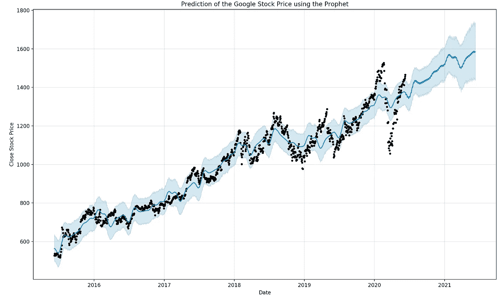
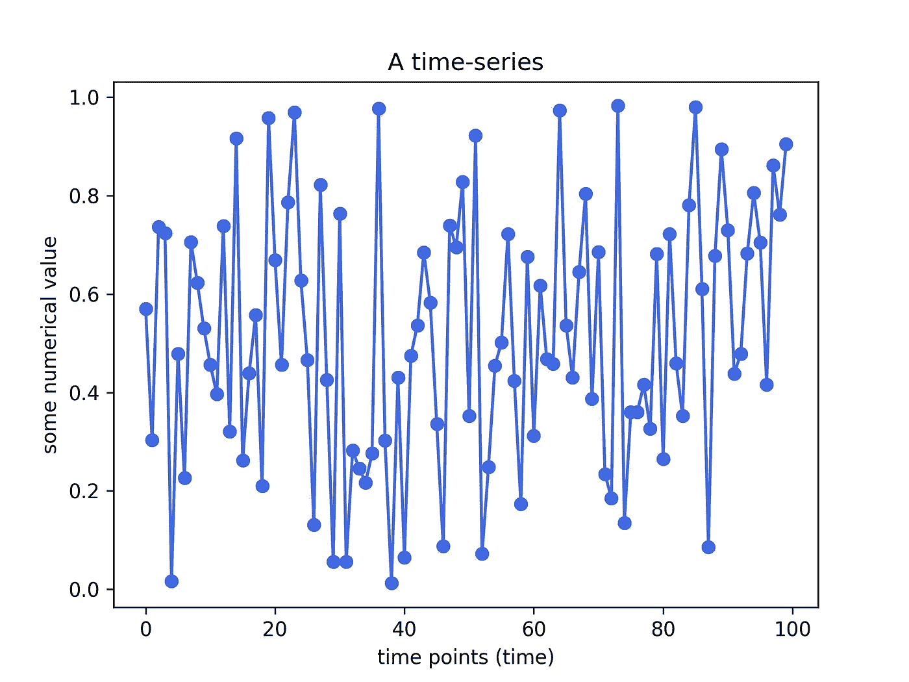
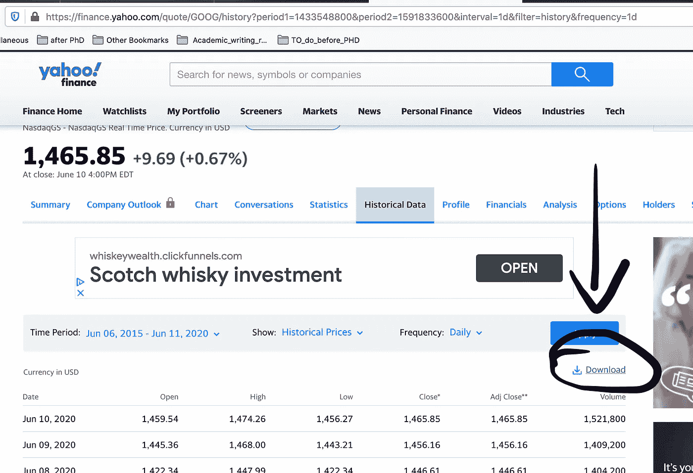
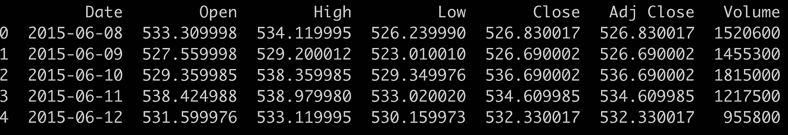
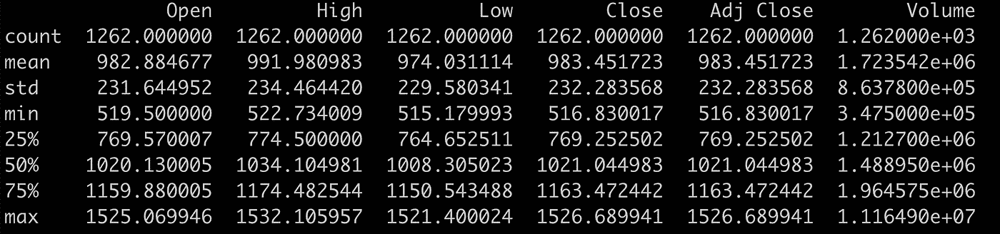
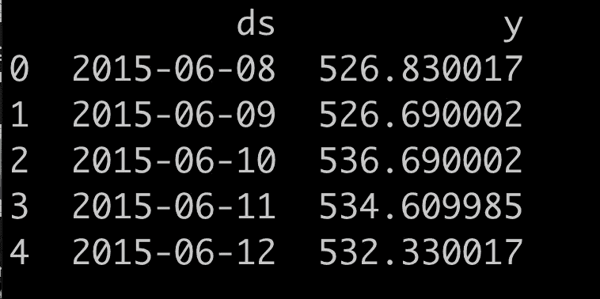
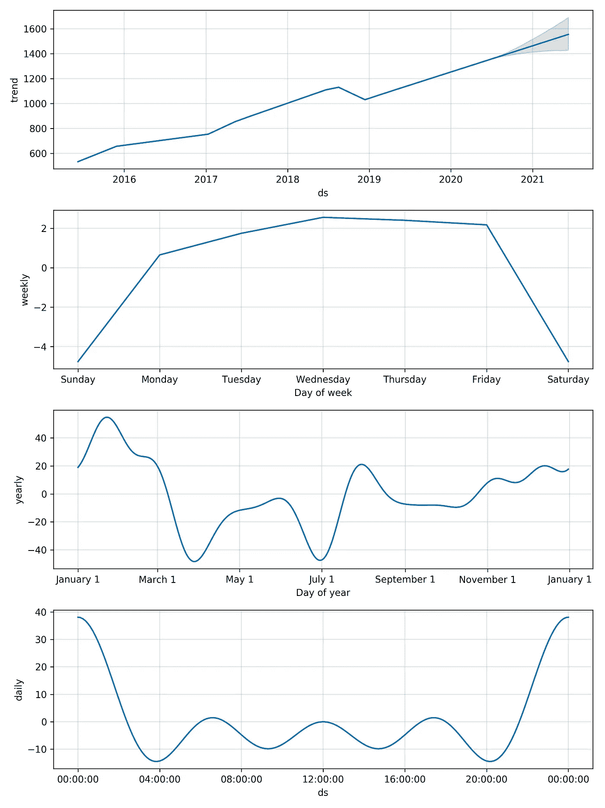

# 时间序列预测:用脸书的先知模型预测股票价格

> 原文：<https://pub.towardsai.net/time-series-forecasting-predicting-stock-prices-using-facebooks-prophet-model-c7b764fb592?source=collection_archive---------0----------------------->

## [数据科学](https://towardsai.net/p/category/data-science)，[数据可视化](https://towardsai.net/p/category/data-visualization)

## 在这篇文章中，我将向您展示如何使用脸书数据科学团队公开提供的预测模型来预测股票价格



作者用 Python 创建的图。

# 1.介绍

## 1.1.时间序列和预测模型

传统上，大多数机器学习(ML)模型使用一些观察值(样本/示例)作为输入特征，但数据中没有**时间** **维度**。

**时间序列预测**模型是能够根据**先前** **观测** **值**预测 **未来值**的模型。时间序列预测广泛用于**非平稳数据**。**非平稳数据**被称为其统计属性(例如，平均值和标准偏差)不随时间保持不变，而是随时间变化的数据。

这些非平稳输入数据(用作这些模型的输入)通常被称为**时间序列。时间序列的一些例子包括随时间变化的温度值、随时间变化的股票价格、随时间变化的房屋价格等。因此，输入是一个**信号**(时间序列),它是由在时间**中连续进行的观察所定义的**。**

> 时间序列是按时间顺序进行的一系列观察。



时间序列的一个例子。剧情是作者用 Python 创作的。

**观察:时序**数据记录在**离散**时间**时间**刻度**刻度**上。

**免责声明**(在我们继续之前):已经有人尝试使用时间序列分析算法来预测股票价格，尽管它们仍然不能用于在真实市场中下注。这只是一篇教程文章，并不打算以任何方式“指导”人们购买股票。

如果你想在交互式路线图和活跃的学习社区的支持下自学数据科学，看看这个资源:[https://aigents.co/learn](https://aigents.co/learn)

## 1.2 预测模型:脸书的先知

预测预测最常用的模型是 [**自回归**](https://en.wikipedia.org/wiki/Autoregressive_model) 模型。简而言之，自回归模型规定输出变量线性依赖于它自己以前的值和一个随机项(一个不完全可预测的项)。

最近，为了开发一个可以在时间序列数据中捕捉**季节性**的模型，**脸书**开发了著名的 **Prophet** 模型，每个人都可以公开获得。在本文中，我们将使用这个最先进的模型: **Prophet 模型。** Prophet 通过实现 [**加法回归**](https://en.wikipedia.org/wiki/Additive_model) **模型，能够捕捉**每日****每周****年度季节性**以及**节假日** **影响**。**

Prophet 模型背后的数学方程式定义为:

> y(t) = g(t) + s(t) + h(t) + e(t)

*   其中，g(t)代表趋势。Prophet 使用分段线性模型进行趋势预测。
*   s(t)代表周期性变化(每周、每月、每年)。
*   h(t)代表假期的影响(回想一下:假期影响业务)。
*   e(t)是误差项。

Prophet 模型拟合过程通常非常快(即使对于成千上万的观察)，并且不需要任何数据预处理。它还处理缺失数据和异常值。

**在本文中，我们将使用先知模式来预测谷歌未来的股价。**

我们开始吧！

# 2.获取股票价格历史数据

感谢**雅虎财经，**我们可以免费获得**的数据**。使用以下链接获取谷歌的股价历史:[https://finance.yahoo.com/quote/GOOG/history?周期 1=1433548800 &周期 2=1591833600 &间隔=1d &过滤器=历史&频率=1d](https://finance.yahoo.com/quote/GOOG/history?period1=1433548800&period2=1591833600&interval=1d&filter=history&frequency=1d)

您应该看到以下内容:



如何下载股价历史？

点击**下载**并保存**。csv** 文件本地保存在您的计算机上。

数据是从 **2015** 到现在( **2020** )！

# 3.Python 工作示例

现在有了数据，就来考察数据，建立模型，预测股价吧！

**3.1。加载&检查数据**

```
import numpy as np
import pandas as pd
import matplotlib.pyplot as plt# Load the dataset using pandas
data = pd.read_csv("/Users/loukas/Downloads/GOOG.csv") 
data.head(5)
```

上面的代码应该打印出以下内容:



数据集的前 5 行。

现在，让我们打印一些**统计数据**，例如上述特征(列)的平均值、中值、最小值、最大值和标准偏差值。

```
data.describe()
```



过去 5 年(2015–2020)，收盘时的**均值**股价为 983.45！真的很高！

**3.2。建立预测模型**

现在让我们继续建模。我们将**仅**使用**日期**和**收盘**价格**作为我们模型的特征。**

```
# Select only the important features i.e. the date and price
data = data[["Date","Close"]] # select Date and Price# Rename the features: These names are NEEDED for the model fitting
data = data.rename(columns = {"Date":"ds","Close":"y"}) #renaming the columns of the datasetdata.head(5)
```

最后一个 python 命令应该返回数据集的前 5 行。您应该会看到类似这样的内容:



这里，`ds`是日期，`y`是**谷歌** **股票**价格。

在本教程中，我们不会将数据拆分为**训练**和**测试**集，而是使用所有数据来拟合模型，然后要求模型预测未来值，即 2021 年的股价。

通常，人们将数据分为训练和测试，因为他们不想在测试集上训练模型。如果我们隐藏一个测试集，那么模型将会预测看不见的数据的值。在这种情况下，我们也能够测量模型的误差。

接下来，我们从 **fbprophet** 模块导入 prophet 类，然后创建 Prophet 类的一个对象。

> **旁注:**模特的 github 页面是这样的:[https://github.com/facebook/prophet](https://github.com/facebook/prophet)
> 
> 要在您的控制台上安装模块类型:`*pip install fbprophet*`。

```
from fbprophet import Prophetm = Prophet(daily_seasonality = True) # the Prophet class (model)
m.fit(data) # fit the model using all data
```

安装后，您应该会看到:

> 优化正常终止:
> 检测到收敛:相对梯度幅度低于公差

**3.3。绘制预测图**

现在，对于最后一步，我们将要求模型预测未来值，然后将预测可视化。

```
future = m.make_future_dataframe(periods=365) #we need to specify the number of days in future
prediction = m.predict(future)
m.plot(prediction)plt.title("Prediction of the Google Stock Price using the Prophet")
plt.xlabel("Date")
plt.ylabel("Close Stock Price")
plt.show()
```


## 该模型使用了所有用于训练的数据(黑点),并预测了从 2020 年 6 月到 2021 年 6 月的未来股价！蓝色阴影是置信区间。

**结论**:根据模型的预测，2021 年 6 月谷歌股价似乎会在 1600 左右。

**侧** **注**:在这种情况下，**我们无法测量模型**的误差。如果有人想这样做，那么他们应该将数据分为训练集和测试集，仅使用训练集拟合模型，预测测试集的价格，然后使用测试集的基本真实价格值来衡量误差。

**观察**:2020 年 3 月，由于新冠肺炎封锁，股价大幅下跌。

# 奖金

**3.4。绘制趋势、周、季、年和日成分图**

如果您想要查看预测组件，即**趋势、每周、季节性、每年和每日组件**，那么您可以使用以下命令来完成。

```
m.plot_components(prediction)
plt.show()
```



# 结果

根据估计的趋势，我们可以看到，通常情况下，股价在**早**早**一月**(见第三条支线剧情)和**大部分时间**在**周三**(见第二条支线剧情)最高。最后，第 1 个子图显示了在不久的将来(在 2020 年 6 月和 2021 年 6 月之间)股票价格的增长。

就这些了，伙计们！我希望你喜欢这篇文章！

## 也可以看看我最近用 LSTM 模型写的文章:

[](https://towardsdatascience.com/lstm-time-series-forecasting-predicting-stock-prices-using-an-lstm-model-6223e9644a2f) [## LSTM 时间序列预测:使用 LSTM 模型预测股票价格

### 在这篇文章中，我将向你展示如何使用预测 LSTM 模型来预测股票价格

towardsdatascience.com](https://towardsdatascience.com/lstm-time-series-forecasting-predicting-stock-prices-using-an-lstm-model-6223e9644a2f) 

## 也可以看看我最近用 ARIMA 模型写的文章:

[](https://towardsdatascience.com/time-series-forecasting-predicting-stock-prices-using-an-arima-model-2e3b3080bd70) [## 时间序列预测:使用 ARIMA 模型预测股票价格

### 在这篇文章中，我将向你展示如何使用预测 ARIMA 模型来预测特斯拉的股票价格

towardsdatascience.com](https://towardsdatascience.com/time-series-forecasting-predicting-stock-prices-using-an-arima-model-2e3b3080bd70) 

# 参考

[1][https://Facebook . github . io/prophet/docs/quick _ start . html # python-API](https://facebook.github.io/prophet/docs/quick_start.html#python-api)

[https://en.wikipedia.org/wiki/Additive_model](https://en.wikipedia.org/wiki/Additive_model)

# 敬请关注并支持这一努力

如果你喜欢这篇文章并且觉得它有用，请关注我，这样你就可以看到我所有的新帖子。

有问题吗？把它们作为评论贴出来，我会尽快回复。

# 最新帖子

[](https://medium.com/@seralouk/the-best-free-data-science-resources-free-books-online-courses-9c4a2df194e5) [## 最佳免费数据科学资源:免费书籍和在线课程

### 最有用的免费书籍和在线课程，适合想了解更多数据科学知识的人。

medium.com](https://medium.com/@seralouk/the-best-free-data-science-resources-free-books-online-courses-9c4a2df194e5) [](https://towardsdatascience.com/roc-curve-explained-using-a-covid-19-hypothetical-example-binary-multi-class-classification-bab188ea869c) [## 用新冠肺炎假设的例子解释 ROC 曲线:二分类和多分类…

### 在这篇文章中，我清楚地解释了什么是 ROC 曲线以及如何阅读它。我用一个新冠肺炎的例子来说明我的观点，我…

towardsdatascience.com](https://towardsdatascience.com/roc-curve-explained-using-a-covid-19-hypothetical-example-binary-multi-class-classification-bab188ea869c) [](https://towardsdatascience.com/support-vector-machines-svm-clearly-explained-a-python-tutorial-for-classification-problems-29c539f3ad8) [## 支持向量机(SVM)解释清楚:分类问题的 python 教程…

### 在这篇文章中，我解释了支持向量机的核心，为什么以及如何使用它们。此外，我还展示了如何绘制支持…

towardsdatascience.com](https://towardsdatascience.com/support-vector-machines-svm-clearly-explained-a-python-tutorial-for-classification-problems-29c539f3ad8) [](https://towardsdatascience.com/pca-clearly-explained-how-when-why-to-use-it-and-feature-importance-a-guide-in-python-7c274582c37e) [## PCA 清楚地解释了——如何、何时、为什么使用它以及特性的重要性:Python 指南

### 在这篇文章中，我解释了什么是 PCA，何时以及为什么使用它，以及如何使用 scikit-learn 在 Python 中实现它。还有…

towardsdatascience.com](https://towardsdatascience.com/pca-clearly-explained-how-when-why-to-use-it-and-feature-importance-a-guide-in-python-7c274582c37e) [](https://towardsdatascience.com/everything-you-need-to-know-about-min-max-normalization-in-python-b79592732b79) [## 关于 Python 中的最小-最大规范化，您需要知道的一切

### 在这篇文章中，我解释了什么是最小-最大缩放，何时使用它，以及如何使用 scikit-learn 在 Python 中实现它

towardsdatascience.com](https://towardsdatascience.com/everything-you-need-to-know-about-min-max-normalization-in-python-b79592732b79) [](https://towardsdatascience.com/how-and-why-to-standardize-your-data-996926c2c832) [## Scikit-Learn 的标准定标器如何工作

### 在这篇文章中，我将解释为什么以及如何使用 scikit-learn 应用标准化

towardsdatascience.com](https://towardsdatascience.com/how-and-why-to-standardize-your-data-996926c2c832) 

# 和我联系

*   **LinkedIn**:【https://www.linkedin.com/in/serafeim-loukas/ 
*   https://www.researchgate.net/profile/Serafeim_Loukas**研究之门**:[](https://www.researchgate.net/profile/Serafeim_Loukas)
*   **https://people.epfl.ch/serafeim.loukas**EPFL**简介**:
*   **堆栈** **溢出**:[https://stackoverflow.com/users/5025009/seralouk](https://stackoverflow.com/users/5025009/seralouk)