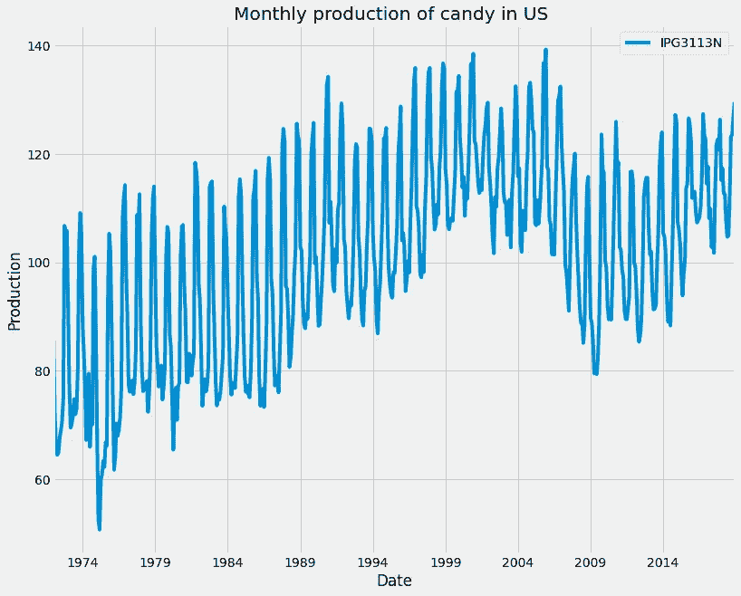
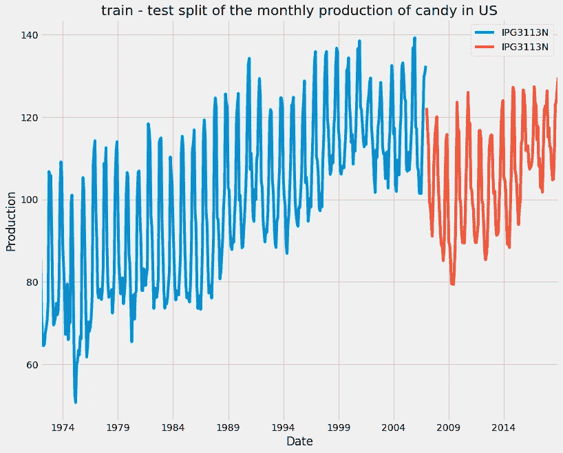
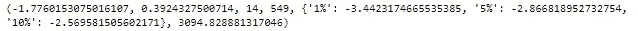
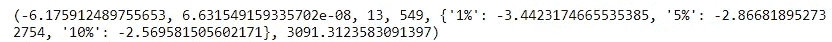
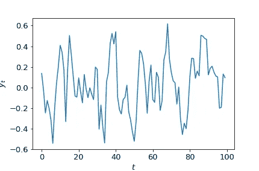
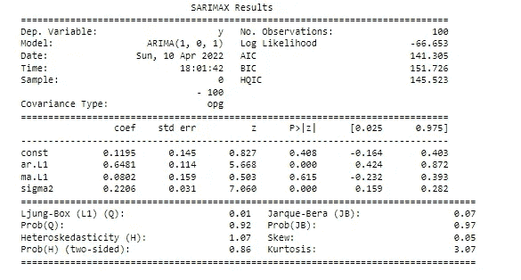
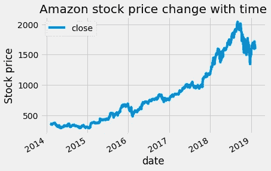

# Python 中 ARIMA 模型的时间序列预测[第一部分]

> 原文：<https://pub.towardsai.net/time-series-forecasting-with-arima-models-in-python-part-1-c2940a7dbc48?source=collection_archive---------1----------------------->

## 使用 Python 中的 ARIMA 模型进行时间序列预测的实用指南

ime 系列数据是行业中最常见的数据类型之一，在您的职业生涯中可能会用到它。因此，了解如何使用它以及如何应用分析和预测技术对于每个有抱负的数据科学家来说至关重要。在这一系列文章中，我将介绍处理时间序列数据的基本技术，从数据操作、分析和可视化开始，以了解您的数据并为其做准备，然后使用统计、机器和深度学习技术进行预测和分类。这更像是一个实践指南，我将把每个讨论和解释的概念应用到真实数据中。

这个系列将由 10 篇文章组成:

1.  [在 Python Pandas 中操作时间序列数据【实用指南】](/manipulating-time-series-data-in-python-49aed42685a0)
2.  [Python Pandas 中的时间序列分析【实用指南】](/time-series-data-analysis-in-python-1492ee4ca974)
3.  [用 Python 可视化时间序列数据【实用指南】](https://medium.com/towards-artificial-intelligence/time-series-data-visualization-in-python-2b1959726312)
4.  [用 Python 实现 ARIMA 模型的时间序列预测【第一部分】](/time-series-forecasting-with-arima-models-in-python-part-1-c2940a7dbc48)(你来了！)
5.  [利用 Python 中的 ARIMA 模型进行时间序列预测【第二部分】](/time-series-forecasting-with-arima-models-in-python-part-2-91a30d10efb0)
6.  [时间序列数据的机器学习【回归】](/machine-learning-for-time-series-data-in-python-regression-5e19fa2e7471)
7.  时间序列数据的机器学习[分类](即将推出)
8.  时间序列数据的深度学习[实用指南](即将推出)
9.  使用统计分析、机器学习和深度学习的时间序列预测项目(即将推出)
10.  使用统计分析、机器学习和深度学习进行时间序列分类(即将推出)

用 ARIMA 模型预测未来/照片由 [Michael Dziedzic](https://unsplash.com/@lazycreekimages?utm_source=medium&utm_medium=referral) 在 [Unsplash](https://unsplash.com?utm_source=medium&utm_medium=referral) 上拍摄

你曾经试图预测未来吗？未来是一个谜，通常只有等待才能解开。在这篇文章和接下来的文章中，我们将停止等待，学习使用强大的 ARIMA 类模型来预测未来。您将学习如何使用 statsmodels 包来分析时间序列、构建定制的模型以及在不确定的情况下进行预测。未来 24 小时股市将如何走势？未来十年，二氧化碳的水平会有怎样的变化？明年会有多少次地震？你将学会解决所有这些问题，甚至更多。

> 本文使用的数据和代码可以在 [**这个资源库**](https://github.com/youssefHosni/Time-Series-With-Python/tree/main/Arima%20Models%20in%20Python) **中找到。**

# 目录:

**1。ARMA 模型介绍**

*   平稳性介绍
*   使时间序列平稳
*   AR、MA 和 ARMA 模型简介

2.**拟合未来**

*   拟合时间序列模型
*   预测
*   非平稳时间序列的 ARIMA 模型

**3。参考文献**

**如果你想免费学习数据科学和机器学习，看看这些资源:**

*   免费互动路线图，自学数据科学和机器学习。从这里开始:[https://aigents.co/learn/roadmaps/intro](https://aigents.co/learn/roadmaps/intro)
*   数据科学学习资源搜索引擎(免费)。将你最喜欢的资源加入书签，将文章标记为完整，并添加学习笔记。[https://aigents.co/learn](https://aigents.co/learn)
*   想要在导师和学习社区的支持下从头开始学习数据科学吗？免费加入这个学习圈:[https://community.aigents.co/spaces/9010170/](https://community.aigents.co/spaces/9010170/)

如果你想在数据科学领域开始职业生涯，而你不知道如何开始。我提供数据科学指导课程和长期职业指导:

*   长期指导:[https://lnkd.in/dtdUYBrM](https://lnkd.in/dtdUYBrM)
*   辅导会议:[https://lnkd.in/dXeg3KPW](https://lnkd.in/dXeg3KPW)

***加入*** [***中等会员***](https://youssefraafat57.medium.com/membership) ***计划，只需 5 美元，继续无限制学习。如果你使用下面的链接，我会收到一小部分会员费，不需要你额外付费。***

 [## 加入我的介绍链接媒体-优素福胡斯尼

### 阅读 Youssef Hosni(以及媒体上成千上万的其他作家)的每一个故事。您的会员费直接支持…

youssefraafat57.medium.com](https://youssefraafat57.medium.com/membership) 

# 1.ARMA 模型

我们将从平稳性的简单介绍开始，以及平稳性对 ARMA 模型的重要性。然后我们将修改如何用肉眼和标准的统计测试来检验平稳性。如果你想获得关于这些主题的更多信息，你可以查看我以前的文章[**Python 中的时间序列分析**](/time-series-data-analysis-in-python-1492ee4ca974) ，因为它们在其中有更详细的介绍。最后，您将学习 ARMA 模型的基本结构，并使用它来生成一些 ARMA 数据和拟合 ARMA 模型。

我们将使用 [**糖果生产数据集**](https://github.com/youssefHosni/Time-Series-With-Python/blob/main/Arima%20Models%20in%20Python/candy_production.csv) ，它代表了 1972 年至 2018 年间美国每月的糖果产量。具体来说，我们将使用工业生产指数 IPG3113N。这是美国每月生产的糖和糖果产品总量，占 2012 年 1 月产量的百分比。因此，120 将是 2012 年 1 月工业产量的 120%。

## 1.1.平稳性介绍

平稳意味着数据的分布不随时间变化。对于一个平稳的时间序列，它必须满足三个标准:

*   该系列有零趋势。它没有增长也没有萎缩。
*   方差是常数。数据点离零线的平均距离没有变化。
*   自相关是恒定的。时间序列中的每个值与其相邻值的关系保持不变。

平稳性的重要性来自于建模一个时间序列，它必须是平稳的。其原因在于，建模的目的是估计代表数据的参数，因此，如果数据的参数随时间变化，则很难估计所有的参数。

让我们首先加载并绘制月度糖果生产数据集:

1974 年至 2018 年美国糖果月产量。

一般来说，在机器学习中，你有一个适合你的模型的训练集，和一个测试集，用来测试你的预测。时间序列预测也是一样。我们的火车测试分割将会不同。我们使用过去的值来预测未来，因此我们需要及时分割数据。我们根据时间序列中较早的数据进行训练，并根据随后的数据进行测试。我们可以使用数据框的**分割给定日期的时间序列，如下所示。锁定**方法。

美国每月糖果产量的测试分割。

## 1.2.使时间序列平稳

有许多方法来测试静态，其中一种是用眼睛，其他的更正式的是使用统计测试。也有将非平稳时间序列转化为平稳时间序列的方法。我们将在这一小节中解决这两个问题，然后您就可以开始建模了。

识别时间序列是否为非平稳的最常见测试是扩展的 Dicky-Fuller 测试。这是一个统计测试，零假设是你的时间序列由于趋势而不稳定。我们可以使用 statsmodels 实现增强的 Dicky-Fuller 测试。首先，我们导入如图所示的 **adfuller** 函数，然后我们可以在糖果生产时间序列上运行它。

结果对象是一个元组。第零个元素是测试统计量，在本例中，它是-1.77。这个数字越负，数据越可能是稳定的。结果元组中的下一项是测试 p 值。这里是 0.3。如果 p 值小于 0.05，我们拒绝零假设，并假设我们的时间序列必须是平稳的。元组中的最后一项是字典。这存储了等同于不同 p 值的检验统计的临界值。在这种情况下，如果我们想要 p 值为 0.05 或更低，我们的测试统计需要低于-2.86。

基于这一结果，我们确信时间序列是非平稳的。因此，在建模之前，我们需要将数据转换成静态形式。我们可以认为这有点像经典机器学习中的特征工程。使时间序列平稳的一个非常常见的方法是求它的差。这是我们从时间序列中的每个值减去前一个值的地方。

从结果中，我们可以看到现在的时间序列是平稳的。这一次，求差就足以使它稳定，但对于其他时间序列，我们可能需要多次求差或进行其他变换。有时，我们需要执行其他转换来使时间序列稳定。这可以是取对数，或时间序列的平方根，或计算比例变化。很难决定做哪一个，但是通常最简单的解决方案是最好的。

## 1.3.AR、MA 和 ARMA 模型介绍

在自回归(AR)模型中，我们将时间序列的值与同一时间序列的先前值进行回归。简单 AR 模型的等式如下所示:

y(t) = a(1) * y(t-1) + ϵ(t)

时间(t)处的时间序列的值是前一步的时间序列的值乘以参数 a(1)加上噪声或冲击项ϵ(t).冲击术语是白噪声，意味着每个冲击都是随机的，与系列中的其他冲击无关。a(1)是滞后一点的自回归系数。与简单的线性回归相比，因变量是 y(t)，自变量是 y(t-1)。系数 a(1)仅仅是线的斜率，冲击是线的残差。

这是一阶 AR 模型。模型的阶数是所用的时滞数。二阶 AR 模型有两个自回归系数和两个独立变量，滞后一的序列和滞后二的序列。更一般的，我们用 p 来表示 AR 模型的阶数。这意味着我们有 p 个自回归系数并使用 p 个滞后。

在**移动平均(MA)** 模型中，我们将时间序列的值与同一时间序列的先前冲击值进行回归。简单 MA 模型的等式如下所示:

y(t) = m(1)*ϵ(t-1) + ϵ(t)

时间序列 y(t)的值是前一步冲击值的 m(1)倍；加上当前时间步长的一个令人震惊的术语。这是一个一阶马模型。同样，模型的顺序意味着我们使用多少时间滞后。一个 MA 模型将包括一步和两步之前的冲击。更一般地，我们用 q 来表示 MA 模型的阶数。

ARMA 模型是 AR 和 MA 模型的组合。时间序列是根据以前的值和以前的冲击项回归的。这是 ARMA-one-one 模型。更一般地，我们使用 ARMA(p，q)来定义 ARMA 模型。p 告诉我们模型的自回归部分的阶，q 告诉我们移动平均部分的阶。

y(t)= a(1)* y(t-1)+m(1)* ϵ(t-1)+ϵ(t)

使用 **statsmodels** 软件包，我们既可以拟合 ARMA 模型，也可以创建 ARMA 数据。让我们看看这个 ARMA-one-one 模型。假设我们想用这些系数模拟数据。首先，我们导入 arma-generate-sample 函数。然后我们列出 AR 和 MA 系数。请注意，两个系数列表都以 1 开头。这是零滞后项，我们总是把它设为 1。我们设置滞后一个 AR 系数为 0.5，MA 系数为 0.2。我们生成数据，传入系数、要创建的数据点的数量以及冲击的标准偏差。**在这里，我们实际上传递了我们需要的 AR 系数的负值。** **这是一个我们需要记住的怪癖**。

生成的数据可以用以下等式表示:

y(t)= 0.5y(t1)+0.2 * ϵ(t−1)+ϵ(t).

用 ARMA 模型生成的数据。

拟合将在下一节中介绍，但这里可以快速浏览一下如何拟合这些数据。首先，我们导入 ARMA 模型类。我们实例化模型，向其提供数据并定义模型顺序。然后我们终于适应了。

# 2.适应未来

在本节中，您将学习如何使用优雅的 statsmodels 包来拟合 ARMA、ARIMA 和 ARMAX 模型。然后，您将使用您的模型来预测 [**亚马逊股票价格的不确定未来。**](https://github.com/youssefHosni/Time-Series-With-Python/blob/main/Arima%20Models%20in%20Python/amazon_close.csv)

## 2.1.拟合时间序列模型

在上一节中，我们快速浏览了拟合时间序列模型，但让我们更仔细地看一下。为了适应这些模型，我们首先从 **statsmodels** 包中导入 **ARIMA** 模型类。我们创建一个模型对象并定义模型顺序，我们还必须输入训练数据。数据可以是 pandas 数据帧、pandas 系列或 NumPy 数组。记住 ARIMA 模型的阶是(p，d，q) p 是自回归滞后，d 是差的阶，q 是移动平均滞后。d 总是一个整数，而 p 和 q 可以是整数或整数列表。为了拟合 AR 模型，我们可以简单地使用 q 等于零的 ARMA 类。为了符合 MA 模型，我们将 p 设置为零。

让我们来看看拟合模型的结果汇总:

顶部包括有用的信息，例如我们拟合的模型的阶数、观察值或数据点的数量以及时间序列的名称。创新的标准差是冲击项的标准差。

概要的下一部分显示了拟合的模型参数。这里我们拟合了 ARIMA(1，0，1)模型，因此该模型具有 AR-lag-1 和 lag-1 系数。在表中，这些是 ar。和马。L1 街。滞后-1 MA 系数在最后一行。第一列显示模型系数，而第二列显示这些系数的标准误差。这是拟合系数值的不确定性。

ARMA 模型的一个可能的扩展是使用外部输入来创建 ARMAX 模型。这意味着我们使用其他独立变量以及时间序列本身对时间序列进行建模。这就像是 ARMA 模型和正常线性回归模型的结合。这里显示了两个简单的 ARMA 和 ARMAX 模型的方程。唯一的区别是多了一项。我们增加一个新的自变量 z(t)乘以它的系数 x(1)。让我们想一个 ARMAX 可能有用的例子。

ARMA(1，1)模型:

y(t) = a(1) y(t-1) + m(1) ϵ(t-1) + ϵ(t)

ARMAX(1，1)模型:

y = x(1)* z(t)+a(1)y(t-1)+m(1)ϵ(t-1)+ϵ(t)

我们可以使用之前使用的相同 ARMA 模型类来拟合 ARMAX 模型。唯一的区别是，我们现在将使用 exog 关键字输入我们的外生变量。模型顺序和安装程序完全相同。

## 2.2.预测

在介绍了如何用 ARIMA 模型拟合数据之后，让我们看看如何用它们来预测未来。让我们以 AR(1)模型表示的时间序列为例。在时间序列中的任何时间点，我们都可以通过将前一个值乘以滞后一位的 AR 系数来预测下一个值。如果前一个值是 15，系数α-1 是 0.5，我们估计下一个值是 7.5。如果冲击项的标准偏差为 1，我们预测不确定性的下限和上限分别为 6.5 和 8.5。这种类型的预测称为**一步预测**。下面是它的方程式:

y = 0.5 x 15 + ϵ(t)

## 2.3.非平稳时间序列的 ARIMA 模型

如果您试图预测的时间序列是非平稳的，您将无法对其应用 ARMA 模型。我们首先要求差，使它稳定，然后我们可以用 ARMA 模型。然而，当我们这样做时，我们将有一个模型，它被训练来预测时间序列的差值。我们真正想预测的不是差值，而是时间序列的实际值。我们可以通过仔细转换我们对差异的预测来实现这一点。

我们从差值的预测开始，求差的反面是求累积和或积分。我们将需要使用这个转换来从差值的预测到绝对值的预测。

我们可以使用 **np.cumsum** 函数来实现。如果我们应用这个函数，我们现在就可以预测在预测期间时间序列从初始值变化了多少。为了得到一个绝对值，我们需要将原始时间序列的最后一个值加到这个值上。

从非平稳数据开始的这些步骤；差分使其静止；然后整合预测在时间序列建模中非常常见。这是很大的工作量！但是谢天谢地，有一个 ARMA 模型的扩展为我们做了这件事！这就是自回归综合移动平均模型(**【ARIMA】**)。

我们可以使用 statsmodels 中的 SARIMAX 模型类实现一个 ARIMA 模型。ARIMA 模型有三个模型订单。这些是 p 自回归序列；d 是差分的阶，q 是移动平均阶。在上一节中，我们将中间阶参数 d 设置为零。如果 d 是零，我们简单地有一个 ARMA 模型。

当我们使用这个模型时，我们以非差分时间序列和模型顺序传递它。当我们想对时间序列数据进行一次差分，然后应用 ARMA(2，1)模型时。这是通过使用 ARIMA(2，1，1)模型实现的。在我们声明了差分参数之后，我们就不再需要担心差分了。我们像以前一样拟合模型并做出预测。差分和集成步骤都由模型对象负责。对于非平稳时间序列，这是一种更简单的预测方法！

> 我们仍然必须小心选择合适的差异量。请记住，我们只对数据进行差分，直到它稳定为止。我们将在应用我们的模型之前解决这个问题，使用增强的 Dicky-Fuller 测试来决定差序。因此，当我们开始应用一个模型时，我们已经知道我们应该应用的差异程度。

让我们将此应用于真实数据。将要使用的数据是 [**亚马逊股票价格数据**](https://github.com/youssefHosni/Time-Series-With-Python/blob/main/Arima%20Models%20in%20Python/amazon_close.csv) **。我们将应用这两种方法。首先对具有差异的数据使用 ARMA 模型，并使用具有内置差异的 ARIMA 模型。**

首先，数据将被上传和绘制。

亚马逊股价随时间变化。

首先，我们将应用 Adfuller-Dickey 检验来了解时间序列是否是平稳的。

这样做的结果如下:

p 值大于 0.05，因此我们不能拒绝零假设，时间序列被认为是非平稳的。因此，我们将取第一个差值，并用 Adfuller-Dickey 检验来检验它是否是稳定的。

对亚马逊股价时间序列进行一阶差分后的 p 值小于 0.05，因此我们可以拒绝零假设，现在的数据被认为是平稳的。对于建模步骤，我们可以遵循上面提到的两条路径之一。首先，使用 ARMA 模型，应用于一阶差分的数据。然后 **np.cumsum** 函数将用于预测实际数据，而不是有差异的数据。

第二种方法是使用 ARIMA 模型，使用实际数据，并使用 **ARIMA** 函数中的差异参数。

在本文的第 2 部分，我们将讨论如何使用自相关函数(ACF)和偏自相关函数(PACF)图选择最佳模型参数，并使用阿凯克信息标准(AIC)和贝叶斯信息标准(BIC)来缩小我们的选择范围。之后，我们将讨论 Box-Jenkins 方法，该方法将帮助您从原始时间序列转换为可用于生产的模型。然后我们将讨论如何将此应用于季节性时间序列。

# 3.参考

[1].[https://app . data camp . com/learn/courses/ARIMA-models-in-python](https://app.datacamp.com/learn/courses/arima-models-in-python)

[2].https://www . stats models . org/devel/generated/stats models . TSA . ARIMA . model . ARIMA . html

 [## 加入我的介绍链接媒体-优素福胡斯尼

### 阅读 Youssef Hosni(以及媒体上成千上万的其他作家)的每一个故事。您的会员费直接支持…

youssefraafat57.medium.com](https://youssefraafat57.medium.com/membership) 

*感谢阅读！如果你喜欢这篇文章，一定要鼓掌(高达 50！)并在* [*LinkedIn*](https://www.linkedin.com/in/youssef-hosni-b2960b135/) *上与我联系，并在*[*Medium*](https://youssefraafat57.medium.com/)*上关注我的新文章*