# Python 中 ARIMA 模型的时间序列预测[第二部分]

> 原文：<https://pub.towardsai.net/time-series-forecasting-with-arima-models-in-python-part-2-91a30d10efb0?source=collection_archive---------1----------------------->

## 使用 Python 中的 ARIMA 模型进行时间序列预测的实用指南

ime 系列数据是行业中最常见的数据类型之一，在您的职业生涯中可能会用到它。因此，了解如何使用它以及如何应用分析和预测技术对于每个有抱负的数据科学家来说至关重要。在这一系列文章中，我将介绍处理时间序列数据的基本技术，从数据操作、分析和可视化开始，以了解您的数据并为其做准备，然后使用统计、机器和深度学习技术进行预测和分类。这更像是一个实践指南，我将把每个讨论和解释的概念应用到真实数据中。

这个系列将由 10 篇文章组成:

1.  [在 Python Pandas 中操作时间序列数据【实用指南】](/manipulating-time-series-data-in-python-49aed42685a0)
2.  [Python Pandas 中的时间序列分析【实用指南】](/time-series-data-analysis-in-python-1492ee4ca974)
3.  [用 Python 可视化时间序列数据【实用指南】](https://medium.com/towards-artificial-intelligence/time-series-data-visualization-in-python-2b1959726312)
4.  [利用 Python 中的 ARIMA 模型进行时间序列预测【第一部分】](/time-series-forecasting-with-arima-models-in-python-part-1-c2940a7dbc48)
5.  [用 Python 实现 ARIMA 模型的时间序列预测【第二部分】](/time-series-forecasting-with-arima-models-in-python-part-2-91a30d10efb0)(你在这里)
6.  [时间序列数据的机器学习【回归】](/machine-learning-for-time-series-data-in-python-regression-5e19fa2e7471)
7.  时间序列数据的机器学习[分类](即将推出)
8.  时间序列数据的深度学习[实用指南](即将推出)
9.  使用统计分析、机器学习和深度学习的时间序列预测项目(即将推出)
10.  使用统计分析、机器学习和深度学习进行时间序列分类(即将推出)

预测未来

本文是利用 ARIMA 模型进行时间序列预测的第二部分。在 [**第一部分**](/time-series-forecasting-with-arima-models-in-python-part-1-c2940a7dbc48)**中介绍了 ARIMA 模型以及如何用它来预测未来。在本文中，我将更多地关注选择最佳的模型参数，以及如何通过 Box-Jenkins 方法为预测过程建立一个管道。**

# **目录:**

## **1.寻找最好的 ARIMA 模特**

*   **利用 ACF 和 PACF 寻找最佳模型参数**
*   **利用 AIC 和 BIC 来缩小你的车型选择**
*   **模型诊断 a**
*   **博克斯-詹金斯方法**

## **2.季节性 ARIMA 模型**

*   **季节性时间序列简介**
*   **季节性 ARIMA 模型**
*   **流程自动化和模型保存**
*   **季节性时间序列的 SARIMA 和 Box-Jenkins**

## ****3。参考文献****

> **本文中使用的代码和数据可以在这个 [**GitHub 资源库**中找到。](https://github.com/youssefHosni/Time-Series-With-Python/tree/main/Arima%20Models%20in%20Python)**

****如果你想免费学习数据科学和机器学习，看看这些资源:****

*   **免费互动路线图，自学数据科学和机器学习。从这里开始:[https://aigents.co/learn/roadmaps/intro](https://aigents.co/learn/roadmaps/intro)**
*   **数据科学学习资源搜索引擎(免费)。将你最喜欢的资源加入书签，将文章标记为完整，并添加学习笔记。[https://aigents.co/learn](https://aigents.co/learn)**
*   **想要在导师和学习社区的支持下从头开始学习数据科学吗？免费加入这个学习圈:[https://community.aigents.co/spaces/9010170/](https://community.aigents.co/spaces/9010170/)**

**如果你想在数据科学领域开始职业生涯，而你不知道如何开始。我提供数据科学指导课程和长期职业指导:**

*   **长期指导:[https://lnkd.in/dtdUYBrM](https://lnkd.in/dtdUYBrM)**
*   **辅导会议:[https://lnkd.in/dXeg3KPW](https://lnkd.in/dXeg3KPW)**

*****加入*** [***中等会员***](https://youssefraafat57.medium.com/membership) ***计划，只需 5 美元，继续无限制学习。如果你使用下面的链接，我会收到一小部分会员费，不需要你额外付费。*****

** [## 加入我的介绍链接媒体-优素福胡斯尼

### 阅读 Youssef Hosni(以及媒体上成千上万的其他作家)的每一个故事。您的会员费直接支持…

youssefraafat57.medium.com](https://youssefraafat57.medium.com/membership)** 

# **1.寻找最好的 ARIMA 模特**

**在本节中，我们将学习如何从数据本身中识别有希望的模型订单，然后，一旦最有希望的模型被训练，您将学习如何从这个合适的选择中选择最佳模型。您还将学习如何使用 Box-Jenkins 方法构建时间序列项目。**

## **1.1.利用 ACF 和 PACF 寻找最佳模型参数**

**在上一节中，我们知道了如何使用 ARIMA 模型进行预测，但是，我们没有讨论如何选择预测模型的阶数。模型阶数是影响预测质量的一个非常重要的参数。识别正确模型阶次的最佳方法之一是自相关函数(ACF)和偏自相关函数(PACF)。**

****ACF** 可以定义为一个时间序列与其自身的 n 个滞后的相关性。所以 ACF(1)是时间序列和它自身的一步滞后版本之间的相关性。ACF(2)是时间序列与其自身的一步滞后版本之间的相关性，以此类推。为了更好地理解 ACF，让我们为地震时间序列绘制 10 个滞后。**

**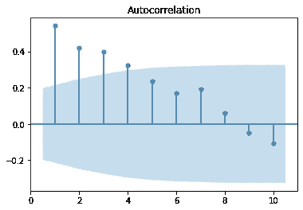**

**地震时间序列的 ACF。**

**上图中的条形显示了时间序列在每个滞后时间点的相关性。如果条形位于蓝色阴影区域内，这意味着它在统计上不显著。**

**另一方面， **PACF** 是一个时间序列和其自身的滞后版本在减去较小滞后的相关性影响后的相关性。所以它可以被认为是特定滞后的相关性。为了更好地理解 PACF，让我们为十个滞后的地震时间序列绘制它。**

**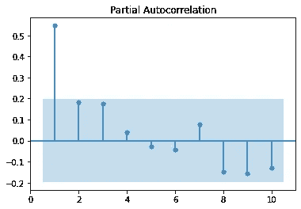**

**地震时间序列的 PACF。**

**上图中的条形显示了在减去较小滞后相关性的影响后，时间序列在每个滞后与其自身的相关性。如果条形位于蓝色阴影区域内，这意味着它在统计上不显著。**

> **在绘制这些图之前，时间序列必须是平稳的。如果 ACF 值很高并且非常非常慢地变小，那么这是数据不稳定的迹象，并且它需要不同。另一方面，如果滞后-1 处的自相关非常负，这是我们已经取了太多次差的信号。**

**通过比较时间序列的 ACF 和 PACF，我们可以指出模型的阶次。有三种主要可能性:**

*   **AR(p)模型:在滞后 p 之后，ACF 减弱，PACF 截止。下图显示了 AR(2)的 ACF 和 PACF 图。**

**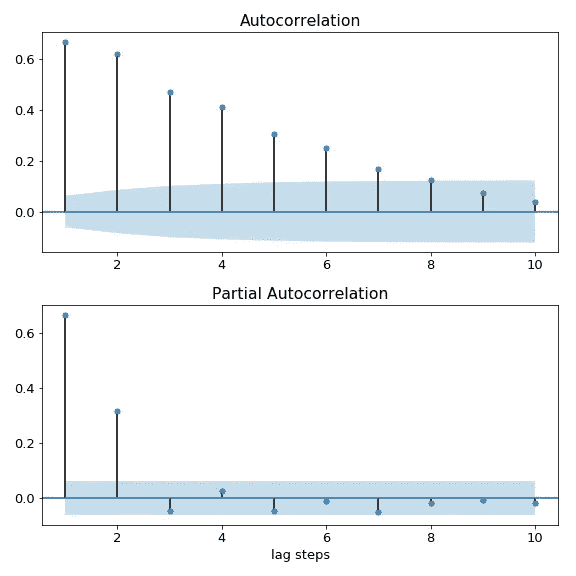**

**AR 的 ACF 和 PACF 图(2)**

*   **MA(q)模型:ACF 的振幅在滞后 q 之后截止，而 PACF 逐渐减弱。下图显示了 MA(2)的 ACF 和 PACF 图。**

**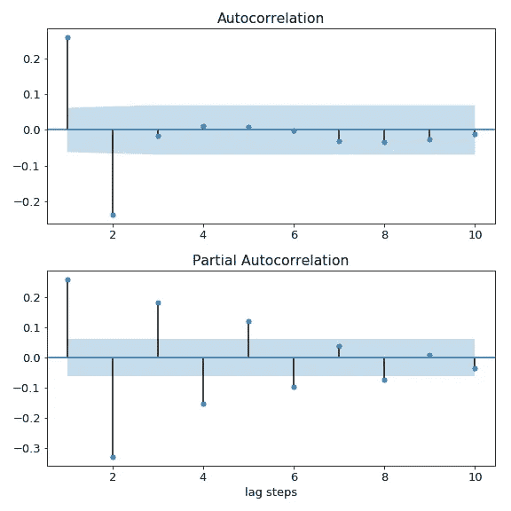**

**用于并购的 ACF 和 PACF 图(2)**

*   **ARIMA(p，q)模型:如果 ACF 和 PACF 的振幅都截止，那么这将是 ARIMA 模型，然而，我们将不能从图中推导出模型阶数(p，q)。**

**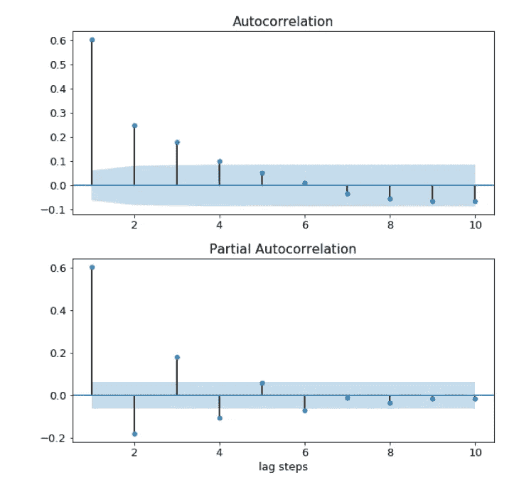**

**ARIMA(p，q)模型的 ACF 和 PACF 图。**

**让我们把这个应用到地震时间序列中，之前我们画出了 ACF 和 PACF。看起来像是 ACF 在 PACF 以 1 的滞后截止时逐渐减弱。因此，它遵循第一种情况，时间序列可以使用 AR(1)模型建模。**

## **1.2.利用 AIC 和 BIC 来缩小你的车型选择**

**我们在第三种情况中提到，当 ACF 和 PACF 的振幅都截止时，可以使用 ARIMA(p，q)模型对时间序列进行建模。然而，模型(p，q)的阶数可以从 ACF 和 PACF 图中得到。然而，赤池信息准则(AIC)和贝叶斯信息准则(BIC)可以用来找到他们的价值。**

**对 AIC 和 BIC 来说，较低的数值意味着更好的模型。AIC 和 BIC 都惩罚带有大量参数的复杂模型。然而，它们的不同之处在于这样做的方式以及对模型复杂性的影响程度。BIC 对额外模型订单的处罚比 AIC 更重，因此 BIC 有时会建议比 AIC 更简单的模型。他们通常会建议相同的模型，但如果不是，你将不得不根据你的优先级选择其中之一。如果你的目标是确定一个更好的预测模型，那么 AIC 将是一个更好的选择，如果你的目标是确定一个良好的解释模型，那么 BIC 将是一个很好的选择。**

**让我们将其应用于之前使用的地震数据集，并将结果与使用 ACF/PACF 得到的结果进行比较。我们预测拟合数据的最佳模型是 AR(1)。我们将计算 p 和 q 从 0 到 2 的不同变化的 AIC 和 BIC。**

**每个模型的排序 AIC 和 BIC 如下所示**

**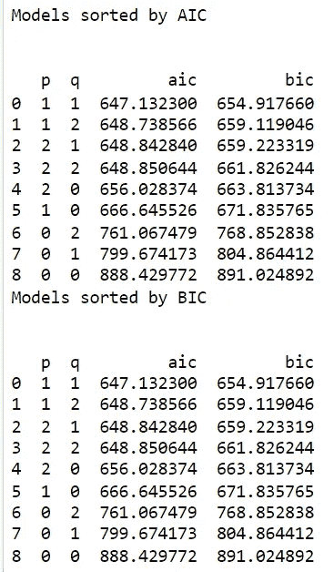**

**模型根据 AIC 和 BIC 进行排序。**

**结果表明，拟合数据的最佳模型是(1，1)，这不同于使用 PACF/ACF 发现的模型。**

## **3.3.模型诊断**

**下一步是诊断模型，以了解模型是否表现良好。为了诊断模型，我们将关注训练数据的残差。残差是模型的一步预测和时间序列的真实值之间的差值。**

**在 statsmodels 中，可以使用 results 对象的 dot-resid 属性来访问训练期间的残差。结果存储为熊猫系列。这显示在下面的代码中:**

**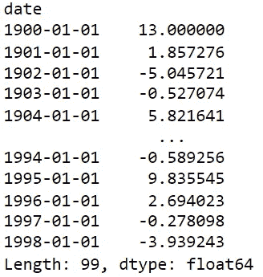**

**用参数(1，1)的 ARIMA 模型预测地震时间序列数据的残差。**

**为了知道预测值离真实值有多远，我们可以计算残差的平均绝对误差。这显示在下面的代码中:**

**理想模型的残差应该是以零为中心的不相关高斯白噪声。我们可以使用结果对象的**。plot_diagnostics** 方法来生成四个用于评估的公共图。这方面的代码如下所示:**

**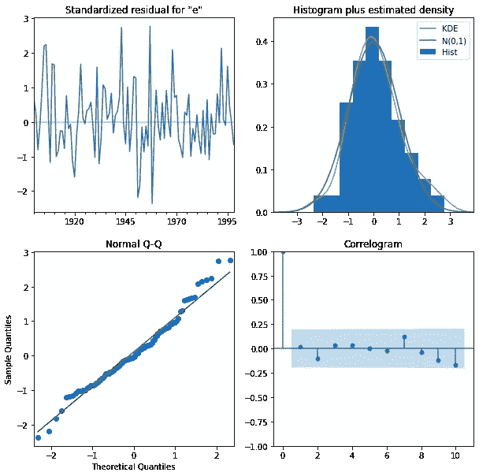**

**地震数据的残差诊断图。**

**残差诊断图中有四个图:**

*   ****标准化残差图:**左上图显示一步标准化残差。如果我们的模型工作正常，残差中应该没有明显的模式。在这个案例中显示了这一点。**
*   ****直方图加估计密度图**:该图显示了残差的分布。直方图向我们展示了测量的分布；橙色线显示直方图的平滑版本，绿色线显示正态分布。如果模型是好的，这两条线应该是相同的。这里它们之间有一些小的差异，这表明我们的模型做得很好。**
*   ****正态 Q-Q 图:**Q-Q 图将残差的分布与正态分布进行比较。如果残差的分布是正态的，那么除了末端的一些值之外，所有点都应该位于红线上。**
*   ****相关图:**相关图是残差的 ACF 图，而不是数据。大于零的滞后的 95%的相关性应该是不显著的(在蓝色阴影内)。如果残差中存在显著相关性，则意味着数据中存在模型未捕捉到的信息。**

**我们可以使用结果**获得模型残差的汇总统计数据。总结**方法。在下面显示的结果表中，Prob(Q)是与残差没有相关结构的零假设相关联的 p 值。Prob(JB)是与残差为高斯正态分布的零假设相关联的 p 值。如果任一 p 值小于 0.05，我们拒绝该假设。**

**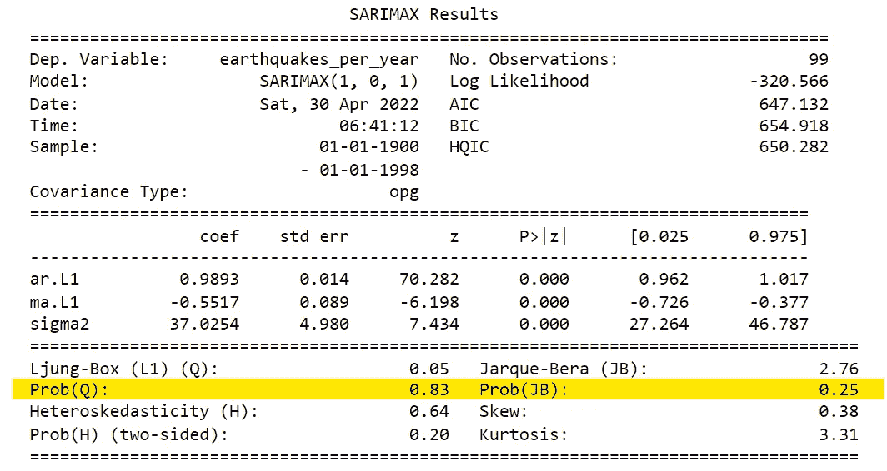**

**模型残差的汇总统计。**

**Prob(Q)和 Prob(JB)的值都大于 0.05，所以我们不能拒绝残差是高斯正态分布的零假设。**

## **3.4.博克斯-詹金斯方法**

**Box-Jenkins 方法是一个帮助您从原始数据到准备生产的模型的清单。在这种方法中，从原始数据到生产就绪模型的三个主要步骤是:识别、估计、模型诊断和基于模型诊断的决策制定。下图对此进行了总结。**

**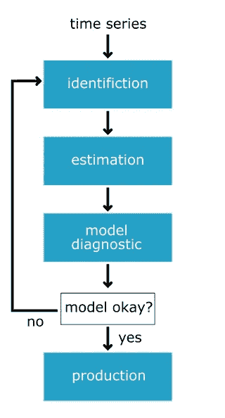**

**Box-Jenkins 方法允许您从原始时间序列数据转换到准备生产的模型。**

****识别****

**在识别步骤中，我们探索和表征数据以找到数据的适当形式，以便在估计步骤中使用。首先，我们将研究数据是否是平稳的。如果数据不是平稳的，我们将找到哪种转换会将数据转换为平稳的，最后，我们将确定最有希望的 p 和 q 的顺序。**

**在这一步骤中使用的工具是绘图、增强的 dicky-fuller 检验、差分和其他变换，例如对数变换，以及用于识别有希望的模型阶次的 ACF 和 PACF。**

****估计****

**在估计步骤中，模型被训练，数据的 AR 和 MA 系数。这是由**模型拟合**方法自动完成的。在这一步，我们可以拟合许多模型，并使用 BIC 和 AIC 将它们缩小到更有希望的模型。**

****模型诊断****

**使用在诊断步骤中从统计测试和绘图中收集的信息，我们需要做出决定。这个模型够好了吗？还是我们需要回去重做它？如果残差不是应有的，我们将返回并重新考虑我们在前两步中的选择。如果残差是好的，那么我们可以继续进行预测！**

**这应该是开发时序模型时的一般项目工作流程。为了建立一个合适的模型，你可能需要重复这个过程几次。**

**让我们将 Box-Jenkins 方法应用于新数据。将使用的数据是 1958 年至 2018 年间的二氧化碳排放量。我们将经历三个步骤。我们先从**鉴定**开始。首先，我们将使用下面的代码加载和绘制数据。**

**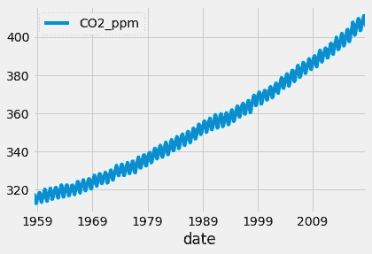**

**从 1959 年到 2018 年每年的二氧化碳排放量。**

**很明显数据有趋势。然后我们将应用扩展的迪基-富勒测试。**

**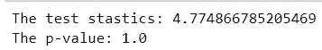**

**p 值为 1，这意味着我们不能拒绝时间序列是非平稳的零假设。要将其转换为信纸，让我们取第一个差异，绘制它并应用扩展的 Dicky-Fuller 测试。**

**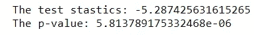**

**p 值小于 0.05，因此我们可以拒绝零假设，并且可以假设数据是平稳的。二氧化碳数据的第一个差异如下图所示。**

****

**识别的最后一步是为 co2 排放数据中的第一个差异绘制 ACF 和 PACF 图。**

**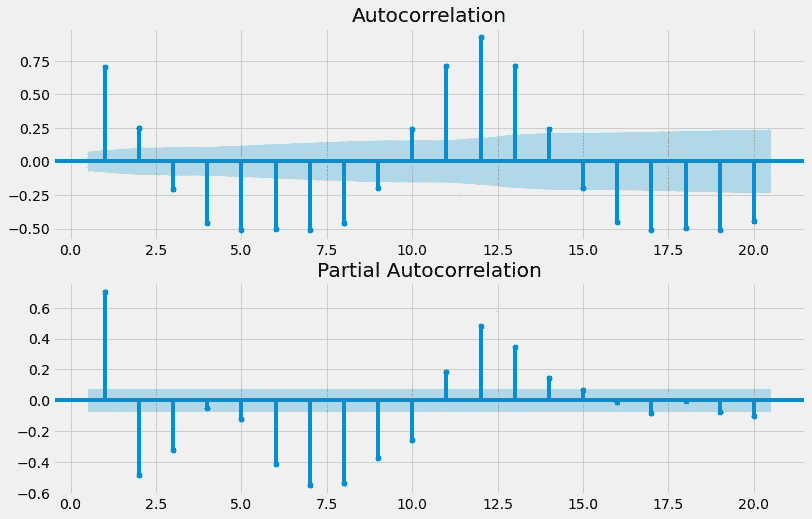**

**ACF 和 PACF 的 co2 排放数据的第一个差异。**

**ACF 和 PACF 的情节没有遵循一定的模式。因此很难识别模型顺序。因此，我们将使用 AIC 和 BIC 来缩小模型阶数的选择范围，然后将数据拟合到最佳模型。这是第二步，即**估算**步骤。**

**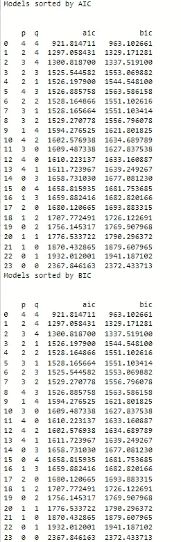**

**每个型号订单的 AIC 和 BIC。**

**最佳模型阶数是(4，4)。让我们用这个顺序来拟合数据，然后通过分析模型残差来诊断模型。**

**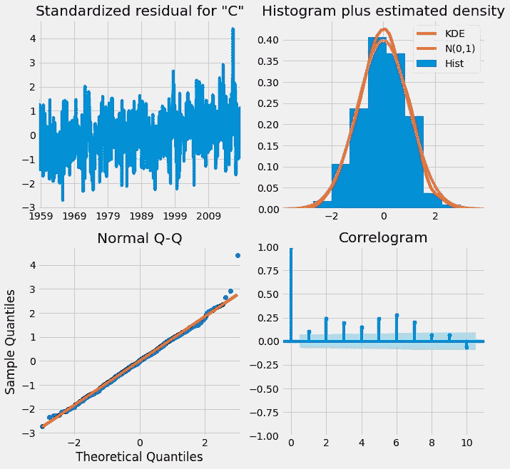**

**从图中，我们可以做出模型在数据上运行良好的决定，并且不需要进行另一次迭代。**

# **2.季节性 ARIMA 模型**

**在最后一节，我们将讨论如何使用季节性 ARIMA 模型来拟合更复杂的数据。您将了解如何将这些数据分解为季节性和非季节性部分，然后您将有机会在最后一次全球预测挑战中使用所有 ARIMA 工具。**

## **2.1.季节性时间序列简介**

**一个**季节性时间序列**有可预测的模式，定期重复。尽管我们称这种特征为季节性，但它可以在任何时间长度后重复出现。这些季节性周期可能每年重复一次，比如防晒霜的销量，每周重复一次，比如公园的游客数量，或者每天重复一次，比如某个时间某个网站的用户数量。**

**任何时间序列都可以被认为是由三个主要部分组成的:趋势、季节成分和残差。下图显示了之前使用的糖果生产时间序列的三个组成部分。**

**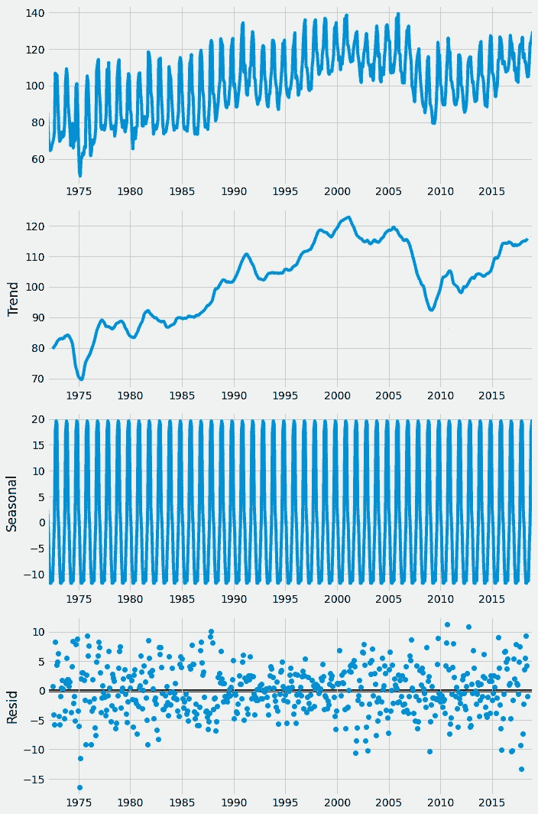**

**糖果生产时间序列及其三个组成部分。**

**从上图可以明显看出，数据中存在季节性。这里的周期是 12 个月。但是，这是作为函数的参数给出的。如果我们想找到周期或季节性周期，一种方法是使用 ACF 并观察相关模式重复后的滞后。但是，确保数据是静态的非常重要。由于糖果生产数据包含趋势，因此它不是平稳的，我们可以通过求第一个差值将其转换为平稳的。但是，这次我们只是试图找到时间序列的周期，如果我们只减去滚动平均值，ACF 图会更清晰。我们使用数据框的**计算滚动平均值。滚动**方法，我们传递窗口大小，也使用**。意思是**方法。任何大的窗口大小 N 都适用于此。我们从原始时间序列中减去这个值，去掉 NA 值。时间序列现在是稳定的，这将更容易解释 ACF 图。**

**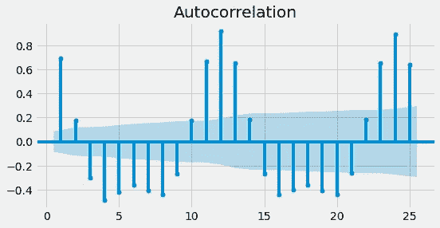**

**在绘制去趋势数据的 ACF 后，我们可以清楚地看到存在 12 步的季节周期。由于数据是季节性的，如果我们试图用 ARIMA 模型来拟合它，我们总是会有相关残差。这意味着我们没有利用数据中的所有信息，因此我们不可能做出最好的预测。这将通过使用季节性 Arima 来解决，如下一小节所示。**

## **2.2.季节性 ARIMA 模型**

**在上一小节中，我们讨论了如何在数据中寻找季节性，在本小节中，我们将了解如何使用季节性进行更准确的预测。季节性 ARIMA (SARIMA)用于此。拟合萨里玛模型就像同时拟合两个不同的 ARIMA 模型，一个用于季节性部分，另一个用于非季节性部分。因为我们有这两种型号，我们将有两套订单。我们有自回归(p)、差异(d)和移动平均(q)部分的非季节性订单。我们还将这组非季节性部分的订单添加到一个新订单 S 中，这是季节性周期的长度。**

**让我们进一步比较萨里玛和 ARIMA 模型。下面是带有参数(2，0，1)的 ARIMA 模型的方程。在这个方程中，我们对滞后-1 和滞后-2 的时间序列和滞后-1 的冲击进行回归。**

**ARIMA(2，0，1)模型:**

**y(t)= a(1)y(t-1)+a(2)y(t-2)+m(1)ϵ(t-1)+ϵ(t)**

**下面是一个季节长度为 7 天的简单 SARIMA 模型的等式。这款 SARIMA 只有当季款；我们已经将非季节性订单设置为零。我们对滞后一季和两季的时间序列进行回归，对滞后一季的冲击进行回归。**

**萨里玛(0，0，0)(2，0，1)7 模型:**

**y = a(7)y(t-7)+a(14)y(t-14)+m(7)ϵ(t-7)+ϵ(t)**

**这种特殊的 SARIMA 模型将能够捕捉季节性的、每周的模式，但不能捕捉本地的、日常的模式。如果我们构建一个 SARIMA 模型，并包括非季节性订单，那么我们可以捕捉到这两种模式。**

**拟合萨里玛模型几乎与拟合 ARIMA 模型一样。我们像以前一样导入模型对象并对其进行拟合。唯一的区别是，在实例化模型时，我们必须指定季节性订单和常规订单。**

**这意味着我们需要找到大量的模型订单。在上一小节中，我们学习了如何使用 ACF 找到季节周期 S。下一个任务是找出季节差异的顺序。**

**为了使时间序列平稳，我们可能需要应用**季节差异**。在季节差异中，我们不是减去最近的时间序列值，而是减去一个周期之前的时间序列值。我们可以通过使用 **df.diff** 方法来计算季节差异。这次我们传入一个整数 S，它是季节周期的长度。**

**如果时间序列显示一个趋势，那么我们采取正常的差异。一旦我们找到了差分的两个阶，并使时间序列平稳，我们就需要找到其他的模型阶。为了找到非季节性订单(p，q ),我们绘制了差异时间序列的 ACF 和 PACF。为了找到季节性订单(P，Q ),我们绘制了不同时间序列在多个季节性步骤的 ACF 和 PACF。然后，我们可以使用相同的 ACF 表和 PACF 规则来计算季节性订单。我们使用 **plot_acf** 和 **plot_pacf** 函数制作这些季节性 ACF 和 PACF 图，但这次我们将滞后参数设置为滞后列表，而不是最大值。该图仅绘制了这些特定滞后时的 ACF 和 PACF。**

**让我们将此应用于上一小节中使用的糖果生产时间序列。我们知道数据的季节周期是 12 步。所以我们先用季节差来去除季节效应，然后用一步差来去除趋势效应。**

**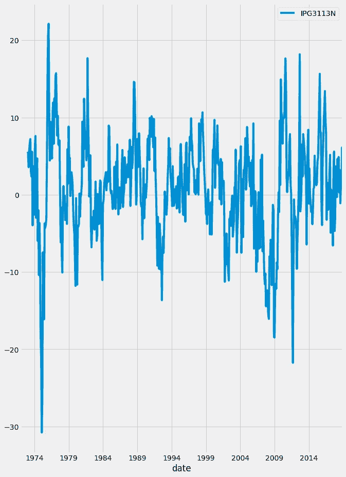**

**剔除季节效应后的糖果生产时间序列。**

**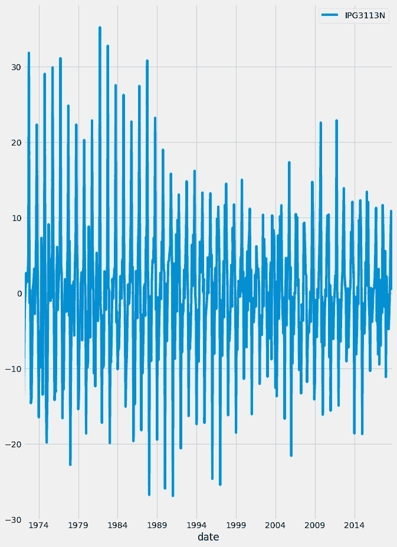**

**剔除季节和趋势影响后的糖果生产时间序列。**

**应用扩展的 Adfuller-Dickey 检验，以确保时间序列现在是平稳的。**

**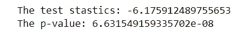**

**p 值小于 0.05，因此我们可以拒绝零假设，并假设时间序列现在是平稳的。之后，我们将绘制 ACF 和 PACF，以找到非季节性模型参数。**

**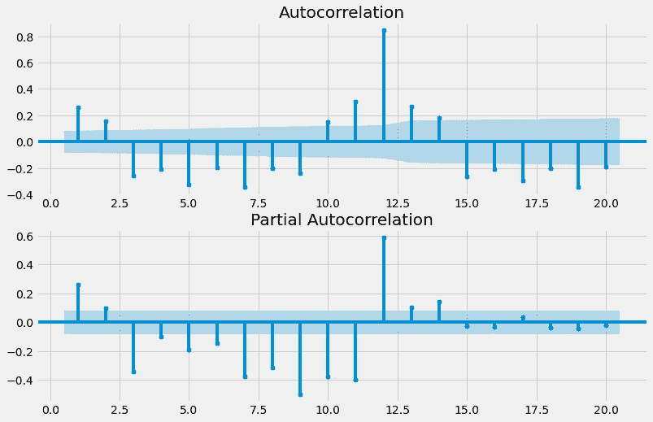**

**应用季节和一步差后糖果生产时间序列的 ACF 和 PACF。**

**在 ACF 和 PACF 图中没有明确的模式，所以我们将使用 AIC 和 BIC 来缩小我们的选择范围。**

**最佳模型参数为(0，3)。之后，我们将绘制季节性 ACF 和 PACF，以找到季节性参数。**

**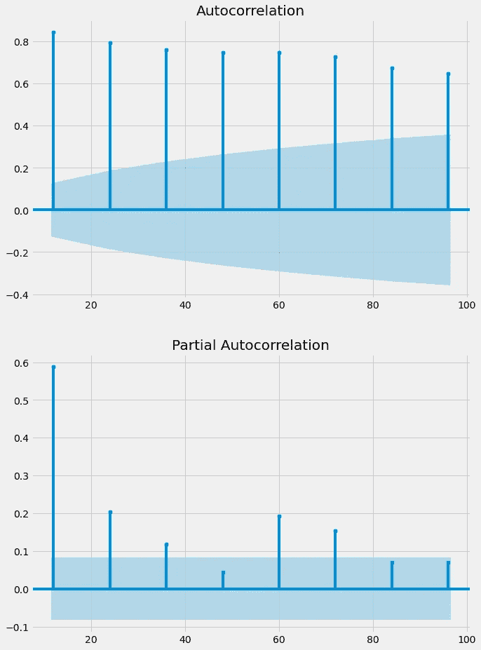**

**糖果生产时间序列的季节性 ACF 和 PACF。**

**ACF 正在减弱，PACF 在三秒钟后被切断。所以模型参数是(0，3)。最后一步是用所有这些参数来拟合模型。**

## **2.3.流程自动化和模型保存**

**之前，我们使用 for 循环搜索了 ARIMA 模型订单。现在我们也有季节性订单，这就非常复杂了。幸运的是，有一个包可以为我们完成大部分工作。这是 **pmdarima** 包，这个包中的 **auto_arima** 函数循环遍历模型订单，以找到最佳的一个。该函数返回的对象是通过搜索找到的最佳模型的结果对象。该对象几乎完全类似于 statsmodels SARIMAX 结果对象，并具有摘要和绘图诊断方法。**

****

**模型诊断。**

**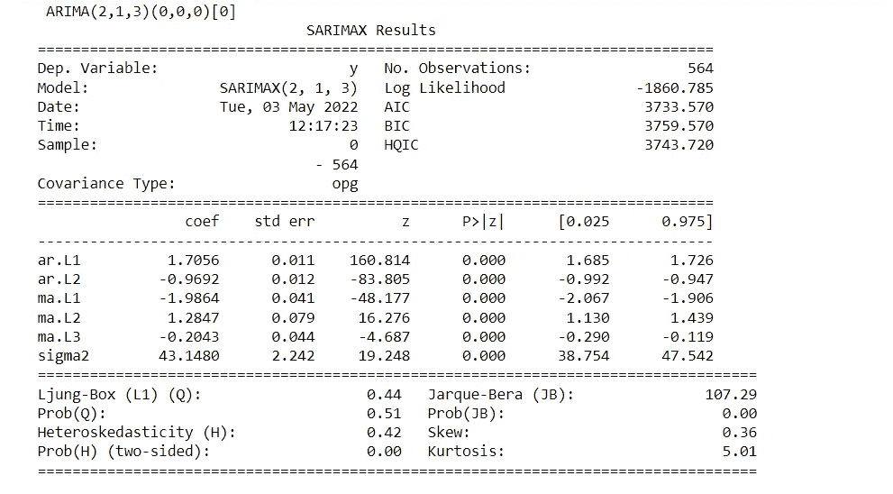**

**模型摘要。**

**通过搜索找到的最佳模型的顺序是(2，3)。然而，它没有考虑到季节性因素。为此，我们必须将季节参数设置为 true。我们还需要指定季节周期的长度；和季节差异的顺序。最后，我们将使用几个无序参数。使用 **information_criterion** 您可以选择是基于 aic 还是 bic 选择最佳模型，如果**information _ criterion**= ' AIC '它将基于 AIC 选择，如果是**information _ criterion =**' BIC '它将基于 BIC 选择。此外，我们将把**跟踪参数**设置为真，然后这个函数为它适合的每个模型打印 AIC 和 BIC。为了忽略坏的模型，我们将设置**error _ action**=‘ignore’。我们将**逐步**设置为真，然后该函数使用智能搜索方法从初始模型顺序猜测向外搜索，而不是搜索所有模型顺序。这可能会节省运行时间和计算能力。**

**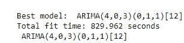**

**最佳模型的参数。**

**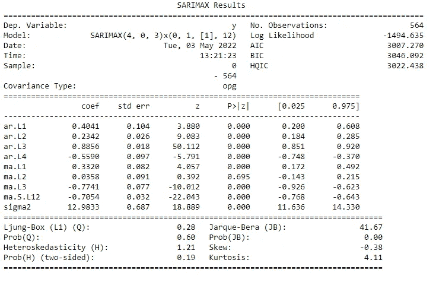**

**最佳 SARIMA 模型的汇总统计量和参数。**

**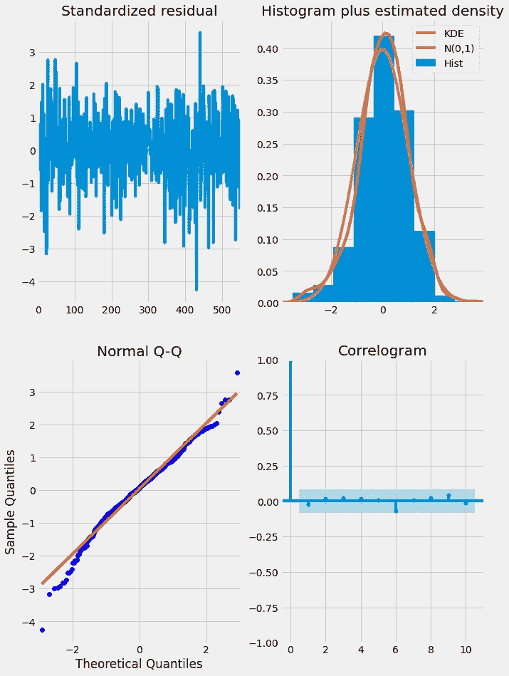**

**最佳模型的残差诊断。**

**一旦您以这种方式拟合了模型，您可能想要保存它并在以后加载它。您可以使用 **joblib** 包来完成此操作。为了保存模型，我们使用了 **joblib** 包中的转储函数。我们将模型结果对象和 file_path 传递给这个函数。稍后，当我们想要进行新的预测时，我们可以再次加载这个模型。为此，我们使用 joblib 中的 load 函数。**

**如果您有新的数据并且想要更新已训练的模型，您可以使用 **model.update(new_data)。**这与再次选择模型顺序不同，因此，如果您使用大量新数据进行更新，最好回到 Box-Jenkins 方法的起点。**

## **2.4.季节性时间序列的 SARIMA 和 Box-Jenkins**

**我们以前讨论过 ARIMA 模型的 Box-Jenkins 方法。我们通过模型订单的识别；估计或拟合模型；诊断模型残差，最后生产。对于 SARIMA 模型，该方法中唯一会改变的步骤是识别步骤。在识别步骤中，我们添加了确定时间序列是否是季节性的任务，如果是，那么找到它的季节周期。我们还需要考虑使季节性时间序列平稳的变换，例如季节性和非季节性差分以及其他变换。有时我们会选择是否应用季节差异、非季节差异或两者来使时间序列平稳。一些好的经验法则是，你不应该使用一个以上的季节差异，也不应该使用两个以上的季节差异。有时，您可以通过使用一个季节性差异或一个非季节性差异来使时间序列平稳。**

**季节性有两种:弱季节性和强季节性。在季节性较弱的情况下，时间序列中的季节性振荡不会总是看起来一样，也更难识别。而在强季节性中，时间序列中的季节性模式将是强的。当你有一个很强的季节模式时，你应该总是使用一个季节差异的顺序。这将确保季节性振荡在你未来的动态预测中不会消失。而在弱季节性模式中，仅在必要时使用它。**

**就像在 ARIMA 建模中，有时我们需要在拟合之前对我们的时间序列使用其他转换。如果季节性是**加性季节性**在**中**季节性模式只是从趋势中增加或减少一点。每当季节性是**加性的**时，除了差分，我们不需要应用任何变换。如果季节性是**乘**的，季节性波动的振幅会随着数据的上升而变大，或者随着数据的下降而变小。如果季节性是**乘性的**，如果没有额外的转换，SARIMA 模型就无法适应这种情况。为了解决这个问题，我们在建模之前对数据进行对数转换。**

# **3.参考**

**[1].[https://app . data camp . com/learn/courses/ARIMA-models-in-python](https://app.datacamp.com/learn/courses/arima-models-in-python)**

**[2].https://www . stats models . org/devel/generated/stats models . TSA . ARIMA . model . ARIMA . html**

** [## 加入我的介绍链接媒体-优素福胡斯尼

### 阅读 Youssef Hosni(以及媒体上成千上万的其他作家)的每一个故事。您的会员费直接支持…

youssefraafat57.medium.com](https://youssefraafat57.medium.com/membership) 

*感谢阅读！如果你喜欢这篇文章，一定要鼓掌(高达 50！)并在* [*LinkedIn*](https://www.linkedin.com/in/youssef-hosni-b2960b135/) *上与我联系，并在*[*Medium*](https://youssefraafat57.medium.com/)*上关注我的新文章。***